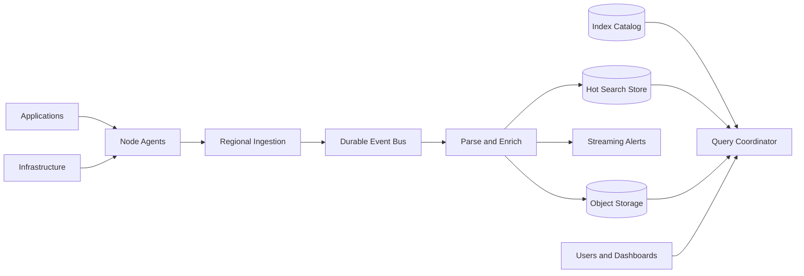
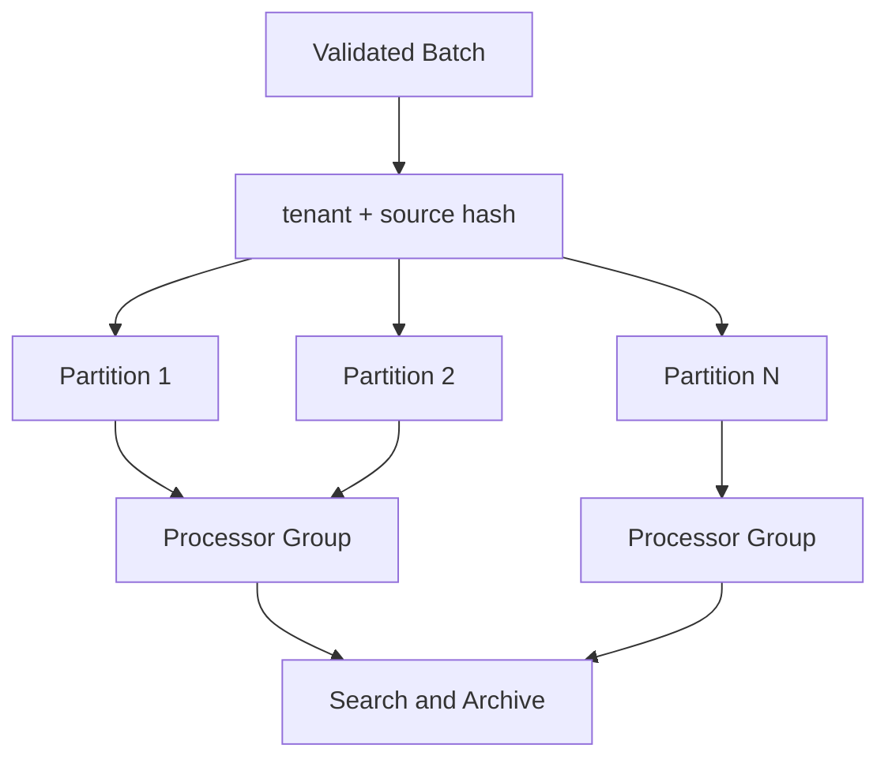
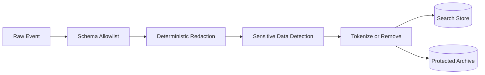
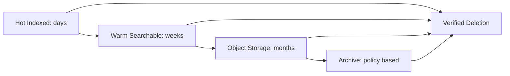
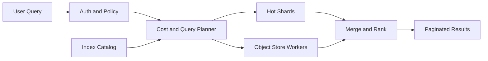

## Problem and requirements

A centralized log system collects events from applications, infrastructure, and security tools so engineers can search failures, investigate incidents, build dashboards, and satisfy audit requirements.

The system must accept enormous write volume while supporting selective, low-latency reads. These goals conflict: indexing every field makes search flexible but dramatically increases storage and compute cost. A practical design separates durable ingestion from asynchronous parsing, indexing, and tiered retention.

### Functional requirements

- Ingest structured and unstructured logs from many sources
- Search recent logs by time, service, severity, trace ID, and indexed fields
- Retrieve historical logs from lower-cost storage
- Stream matching events to live-tail clients
- Build saved searches, dashboards, and alerts
- Apply tenant-specific retention and access policies
- Redact or tokenize sensitive fields
- Export selected logs for compliance or external analysis

### Non-functional requirements

- Sustain 100 million events per second globally
- Acknowledge accepted events without losing them
- Make recent logs searchable within ten seconds
- Return common recent queries within a few seconds
- Isolate noisy tenants and expensive queries
- Preserve ordering where useful without requiring global order
- Degrade gracefully during traffic spikes and downstream failures
- Produce verifiable retention and deletion behavior

Logs are diagnostic data, not a transactional database. The platform favors durable, at-least-once ingestion and explicitly handles duplicates rather than coordinating every producer in a global transaction.

## Capacity estimates

Assume an average compressed event size of one kilobyte and 100 million events per second at peak.

| Resource | Estimate |
| --- | ---: |
| Peak incoming events | 100M/second |
| Peak uncompressed bandwidth | 100 GB/second |
| Daily raw volume | Up to 10 PB/day |
| Hot indexed retention | 3–14 days |
| Warm object-store retention | 30–90 days |
| Archive retention | Tenant and policy dependent |

Compression may reduce storage by five to ten times, depending on structure and repetition. Replication, indexes, metadata, and temporary compaction add overhead.

At this scale, collecting every debug message indefinitely is not viable. The design needs quotas, sampling, aggregation, and tiered retention from the start.

## Ingestion API

Agents batch events to reduce connection and per-request overhead.

```http
POST /v1/logs:ingest
Authorization: Bearer <source-token>
Content-Encoding: gzip
Content-Type: application/x-ndjson

{"timestamp":"2026-10-02T14:21:08.142Z","service":"checkout","level":"error","message":"payment timeout","traceId":"tr_82","attributes":{"region":"us-central"}}
{"timestamp":"2026-10-02T14:21:08.147Z","service":"checkout","level":"info","message":"retry scheduled","traceId":"tr_82"}
```

The response confirms that the accepted batch is durably buffered, not that it is already searchable.

```json
{
  "batchId": "batch_01K6F2P4",
  "accepted": 2,
  "rejected": 0
}
```

Each event receives a tenant, source, ingestion time, and event ID. Producer timestamps remain part of the document, but server ingestion time protects queries from broken clocks.

Reject individual malformed records without necessarily rejecting the whole batch. Return bounded error details so a single bad event cannot create a huge response.

## High-level architecture

The write path accepts and buffers logs quickly. Independent consumers normalize, redact, index, archive, alert, and calculate usage.



The durable event bus decouples producers from downstream systems. A search outage does not immediately become an application outage; events accumulate until indexing recovers.

Raw or minimally transformed logs reach object storage independently of the search index, providing a durable replay source.

## Collection agents

Run a lightweight agent on each node, sidecar, or host. It reads files, container output, journaling systems, or local sockets and attaches trusted metadata such as cluster, namespace, workload, and tenant.

The agent:

- Batches and compresses events
- Persists a small disk buffer during network failures
- Applies source-level filters and sampling
- Tracks file offsets and rotations
- Retries batches with stable IDs
- Enforces per-source rate and size limits

Applications should prefer structured JSON logs. The agent can wrap plain text, but parsing arbitrary formats centrally is fragile and expensive.

When the local buffer fills, the policy must be explicit: block the producer, drop lower-priority logs, or rotate the oldest data. Most application logging should not block request processing, while security audit logs may require a stricter path.

## Partitioning and durable buffering

Partition the event bus by tenant and a stable source hash. This spreads large tenants across partitions while preserving order for an individual source.



Global ordering is unnecessary and would limit throughput. Within a source, sequence numbers help detect gaps and reorder short network-induced inversions.

Ingestion acknowledges only after the batch reaches the configured durability level. Cross-zone replication protects against a broker or zone failure. Cross-region replication may be asynchronous when residency rules permit it.

Backlog age, not merely message count, is the key health measure. A ten-minute backlog during an incident means the newest failure evidence will not be searchable when operators need it most.

## Delivery semantics and deduplication

Agents retry when an acknowledgement is lost, and processors may replay after failure. Therefore, ingestion and processing are at least once.

Assign a stable event ID from source identity, boot session, and local sequence number. Search storage can deduplicate during indexing or compaction. Object storage may retain duplicates if query processing removes them later.

Exactly-once delivery across agents, brokers, processors, search indexes, and object storage is not worth the coordination cost. Idempotent writes and deterministic event IDs provide effectively-once query results where required.

Deduplication has a bounded time window. Producers that reuse IDs after the window are faulty; monitor and quarantine them.

## Parsing and normalization

The processing layer converts incoming records into a common envelope:

- Event and ingestion timestamps
- Tenant, project, and environment
- Service, host, region, and deployment version
- Severity and message
- Trace, span, and request identifiers
- Typed attributes
- Source schema version

Use tenant-configured parsers for legacy text formats. Route parsing failures to a searchable dead-letter dataset with the raw payload and failure reason rather than discarding them.

Schema-on-write improves query performance for known fields. Schema-on-read preserves flexibility for rarely used data. A hybrid approach promotes selected attributes into indexed typed columns while retaining the original structured payload.

## Schema and mapping control

Allowing every arbitrary attribute to become an indexed field causes mapping explosion. A service can accidentally generate millions of field names, exhausting cluster metadata and memory.

Maintain a controlled field registry:

- Standard platform fields are always typed and indexed
- Tenant-approved fields receive explicit mappings
- Unknown attributes remain in a non-indexed payload map
- Field count, nesting depth, and value length are capped
- Conflicting types are rejected or stored as strings in a quarantine field

Cardinality matters as much as field count. Fields such as request ID are useful for exact lookup but poor aggregation keys. Mark field capabilities explicitly.

## Sensitive-data handling

Logs frequently contain access tokens, email addresses, payment data, or user-supplied text. Prevention begins before ingestion.

Application libraries provide structured allowlists and mark sensitive values. Agents run fast deterministic redaction rules. Central processors apply deeper detection and tokenization before searchable storage.



Do not rely solely on regular expressions; secrets appear in unexpected forms. Combine field-name rules, data classification, entropy checks, and format detectors.

Quarantine suspected high-risk records in a restricted store rather than exposing them to normal search. Redaction rules are versioned, tested, and recorded with each event.

Encryption, access controls, retention, and audit logging remain necessary even after redaction.

## Hot search storage

Recent logs live in a distributed search store optimized for time-bounded filters and text search.

Partition indexes by tenant group and time window. Very large tenants receive dedicated shards; many small tenants share shards with logical isolation. Time partitioning lets the system expire old data by dropping entire segments rather than deleting individual rows.

Immutable segments work well for logs:

1. Buffer a small batch in memory
2. Write a sorted, compressed segment
3. Build inverted indexes and columnar metadata
4. Publish the segment atomically
5. Merge small segments in the background

Replicate shards across failure domains. Route queries only to shards whose time range and tenant set overlap the request.

## Index selection

Index fields that commonly narrow searches: timestamp, tenant, service, environment, severity, region, trace ID, and selected attributes.

The message field may use full-text tokenization, while identifiers use exact-match indexes. Numeric fields use range-friendly structures. Columnar representations accelerate aggregations such as error counts by service.

Indexes amplify storage and write cost. Offer tiers:

- **Fully indexed:** recent high-value operational logs
- **Partially indexed:** standard metadata plus raw payload
- **Archive only:** compressed data queried through batch scans

Per-tenant index budgets prevent one dynamic workload from degrading the shared cluster.

## Object storage and tiered retention

Write normalized logs into compressed columnar files in object storage, partitioned by tenant, date, hour, and coarse source dimensions. Keep files large enough for efficient scans but small enough for parallelism and timely visibility.

A metadata catalog records file paths, time ranges, schema, statistics, and retention class. Query planning uses min/max values and bloom filters to skip unrelated files.

Retention moves data through tiers:



Tenant policy and data classification determine duration. Legal holds override normal expiry through an explicit, audited policy.

Deletion jobs create evidence of which partitions and replicas were removed. Encryption-key destruction can accelerate deletion of isolated tenant data, but only when key design and backup handling support it.

## Query path

A query specifies tenant scope, time range, filters, text terms, aggregation, sort, and limit.

```http
POST /v1/logs:search
Content-Type: application/json

{
  "from": "2026-10-02T14:00:00Z",
  "to": "2026-10-02T14:15:00Z",
  "filter": "service = 'checkout' AND level = 'error'",
  "search": "payment timeout",
  "limit": 200
}
```

The query coordinator authenticates the user, injects tenant and field-level policy, estimates cost, selects hot or cold storage, and fans out to relevant shards.



Results use a cursor containing the stable sort key, time boundary, and query snapshot rather than a large offset. Search defaults to a recent time range to avoid accidental full-retention scans.

## Query isolation and cost control

One broad regular-expression query can consume more resources than thousands of targeted lookups.

Before execution, estimate bytes scanned, shards touched, index selectivity, and aggregation cardinality. Reject or require confirmation for queries above tenant limits.

Use separate worker pools for interactive searches, dashboards, alerts, and exports. Apply per-tenant concurrency, CPU, memory, and scanned-byte budgets. Cancel work promptly when the client disconnects or reaches its deadline.

Cache frequent dashboard queries using tenant, query, time bucket, and index version as the key. Never share cached results across authorization scopes.

## Live tail

Live tail streams newly processed events matching a filter. It is useful during deployments but must not bypass normal access controls.

Processors publish recent normalized events to an ephemeral regional stream. Subscription gateways apply compiled filters and maintain bounded client buffers.

If a client falls behind, drop older live events and report the gap instead of consuming unbounded memory. The user can run a normal search to recover the missing interval.

Live tail is best effort. Durable search and archive paths remain the source of record.

## Alerts

Saved alert queries run continuously or on a schedule. Streaming evaluators handle simple filters, counts, and rates with low latency. Complex historical comparisons run against the query engine.

An alert state machine tracks normal, pending, firing, and resolved states. Require a condition to persist for a configured duration to reduce noise.

Deduplicate notifications by alert and evaluation window. Route alert delivery through a separate notification system so a slow integration does not block log processing.

Alerts should detect missing logs as well as matching logs. A silent service or broken collection agent can be as important as an error spike.

## Multi-tenancy and authorization

Tenant identity comes from authenticated ingestion credentials, never from an untrusted event field. The gateway overwrites any supplied tenant identifier.

Authorization can restrict:

- Projects, environments, and services
- Time ranges and retention tiers
- Sensitive fields
- Search, export, and live-tail capabilities
- Query cost and concurrency

Enforce policy in the coordinator and again in storage access where practical. Audit searches and exports of sensitive datasets.

Dedicated storage is appropriate for tenants with extreme scale, residency requirements, or stronger isolation. Shared infrastructure remains more efficient for the long tail.

## Failure handling

### Ingestion region unavailable

Agents fail over to an approved region or buffer locally. Residency policy decides whether cross-region failover is allowed.

### Event bus lag

Scale processors, pause nonessential consumers, and apply source quotas. Preserve high-priority security and error logs before debug traffic.

### Search cluster unavailable

Continue durable ingestion and object-store writes. Queries may use a slower cold path until indexing catches up.

### Poison event

Bound parser resources, isolate the event after repeated failure, and advance the consumer offset. One malformed record must not stall a partition.

### Bad parser or redaction rule

Canary new rules, version every transformation, and retain a restricted replay source when policy permits. Roll back and reprocess affected partitions.

### Hot-shard overload

Split the large tenant or source across more shards using a secondary hash. Rate-limit expensive queries and temporarily reduce indexing of low-priority fields.

### Object-store delay

Buffer completed files and metadata updates independently. Publish catalog entries only after objects are durable and verified.

## Observability for the observability system

The log platform cannot depend exclusively on itself for diagnosis. Export a minimal set of health metrics and emergency logs to an independent path.

Track:

- Accepted, rejected, throttled, and dropped events
- End-to-end searchable latency
- Event-bus backlog age by partition
- Parser and redaction failures
- Indexing throughput, segment count, and merge pressure
- Query latency, scanned bytes, and cancellation rate
- Hot, warm, and cold storage growth
- Agent buffer usage and sequence gaps
- Retention and deletion job completion

Synthetic producers continuously emit uniquely identifiable events in every region. Probes verify that those events appear in hot search, cold storage, and alert results within their service-level objectives.

## Key tradeoffs

### Index everything vs control cost

Universal indexing offers flexible search but creates unpredictable storage and memory growth. Index standard and explicitly approved fields; retain the rest for slower schema-on-read analysis.

### At-least-once vs exactly-once

At-least-once ingestion is simpler and more available. Stable event IDs and idempotent consumers make duplicates manageable without distributed transactions.

### Freshness vs durability

Acknowledging only after search indexing reduces perceived delay but couples producers to the least reliable stage. A durable broker acknowledgement keeps ingestion safe while indexing proceeds asynchronously.

### Shared vs dedicated tenants

Shared shards improve utilization for small tenants. Dedicated partitions protect both the platform and very large tenants from noisy-neighbor effects. A hybrid placement policy provides both.

### Retention vs usefulness

Long retention helps rare investigations but carries cost and privacy risk. Tiered storage, explicit classifications, and verified deletion align retention with actual value.

The central principle is to make ingestion durable and inexpensive, then spend indexing and query resources selectively according to operational value.
