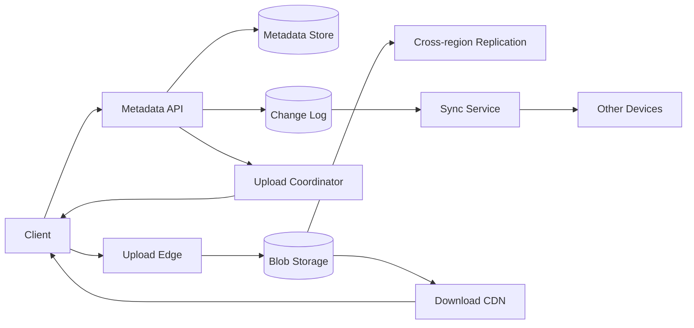
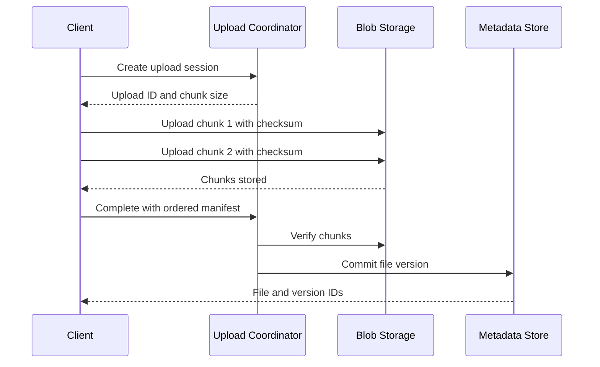
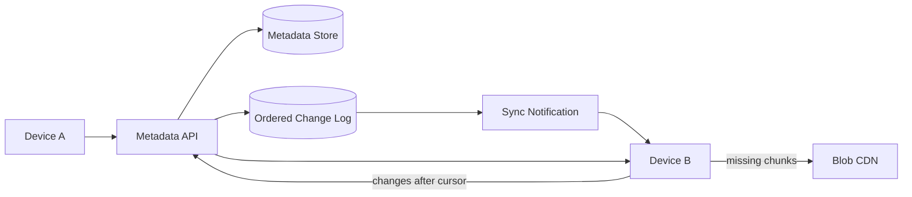

## Problem and requirements

A cloud file storage product lets users upload files, organize them into folders, synchronize changes across devices, recover older versions, and share content with other people. The system must treat metadata and file bytes differently: metadata needs transactions and low-latency queries, while large immutable blobs need cheap, durable storage.

### Functional requirements

- Upload and download files of many sizes
- Resume interrupted transfers
- Organize files into folders and rename or move them
- Synchronize changes across a user’s devices
- Keep version history and restore prior versions
- Share files or folders with explicit permissions
- Delete files and recover them during a retention window

### Non-functional requirements

- Never lose an acknowledged file
- Support files from a few bytes to multiple terabytes
- Make metadata changes visible within seconds
- Sustain high concurrent upload and download throughput
- Continue serving through machine and availability-zone failures
- Protect private content from unauthorized access

Collaborative document editing, full-text search, and office-file rendering are separate systems built on top of this storage foundation.

## Capacity estimates

Assume 100 million users, 10 million daily active users, and 10 PB of new file data per day before deduplication. A 10:1 download-to-upload ratio produces substantial CDN and object-store egress.

| Resource | Average | Peak assumption |
| --- | ---: | ---: |
| Upload bandwidth | 116 GB/second | 1 TB/second |
| Download bandwidth | 1.16 TB/second | 10 TB/second |
| Metadata operations | 100K/second | 1M/second |
| New raw storage | 10 PB/day | Before replication |

Media files dominate bytes while small files dominate object counts and metadata operations. Capacity planning must track both. Storing each tiny file as a separate physical object can be inefficient, so the storage layer may pack small chunks into larger immutable containers.

## APIs and identifiers

Clients first create an upload session. The API returns chunking parameters and short-lived upload destinations.

```http
POST /v1/files/uploads
Content-Type: application/json

{
  "parentId": "folder_82",
  "name": "architecture.mov",
  "size": 4831838208,
  "contentType": "video/quicktime"
}
```

```json
{
  "uploadId": "upload_01K5FH8M",
  "chunkSize": 8388608,
  "expiresAt": "2026-09-15T02:00:00Z"
}
```

Each chunk request includes its index, byte range, checksum, and upload ID. Completing the session atomically creates a new file version only after every required chunk is durable.

File IDs remain stable across renames and moves. A path is mutable presentation state and should never be the primary identifier for file content or sharing permissions.

## High-level architecture

The control plane handles identity, metadata, permissions, upload sessions, and change history. The data plane transfers bytes directly between clients, edge locations, and blob storage.



Application servers do not proxy large file bodies. They authorize an operation and issue narrowly scoped, short-lived credentials so clients can transfer bytes through the data plane.

## Chunking and resumable uploads

Split large files into chunks so retries resend only failed ranges. Fixed-size chunks are easy to create in parallel and map naturally to byte ranges. Content-defined chunking chooses boundaries from the file content, preserving more deduplication when bytes are inserted near the beginning.

The upload process is:

1. Create an upload session and reserve the target name.
2. Split the file into chunks and calculate a checksum for each.
3. Upload missing chunks in parallel with bounded concurrency.
4. Retry failed chunks using the same upload session.
5. Submit the ordered chunk manifest.
6. Verify every chunk and atomically commit the file version.



An upload session is idempotent. Repeating a chunk upload with the same checksum succeeds; repeating it with different bytes is rejected. Incomplete sessions expire, and an asynchronous collector removes unreferenced chunks after a grace period.

## Content-addressed blob storage

Address each chunk by a cryptographic digest of its bytes. The file version stores an ordered manifest of chunk hashes rather than one mutable object.

```text
FileVersion {
  file_id: "file_42",
  version: 17,
  chunks: [
    { hash: "sha256:a81...", size: 8388608 },
    { hash: "sha256:b19...", size: 2912041 }
  ]
}
```

Content addressing provides integrity checking and makes chunks immutable. It also enables deduplication: identical chunks can share one stored blob.

Maintain reference accounting separately from the blob write path. A chunk is eligible for deletion only after no committed manifest references it and a safety window has elapsed. Immediate deletion risks losing data during retries, replication lag, or a delayed metadata transaction.

Encrypt chunks at rest. Global deduplication conflicts with per-user encryption keys because identical plaintext produces different ciphertext. Convergent encryption enables deduplication but leaks whether specific content exists and requires careful threat analysis. Per-tenant deduplication is a safer compromise.

## Metadata model

Metadata needs transactional updates for folder membership, names, permissions, and versions.

| Entity | Important fields |
| --- | --- |
| File | ID, parent folder, name, owner, current version, state |
| File version | Version ID, manifest reference, size, checksum, creator |
| Folder | ID, parent folder, name, owner |
| Permission | Resource ID, principal, role, inheritance |
| Change event | User or workspace, sequence, operation, resource ID |

Enforce a uniqueness constraint on `(parent_folder_id, normalized_name)` when duplicate sibling names are not allowed. Rename and move operations update metadata only; immutable file chunks do not move.

Folders form a tree, but recursively updating every descendant when a folder moves is expensive. Store direct parent relationships and maintain materialized ancestry or path indexes asynchronously for fast navigation and permission checks.

## Partitioning metadata

Partition primarily by user or workspace so common folder listings and synchronization reads stay local. Shared folders complicate ownership because collaborators span many users.

Assign every shared workspace a stable partition key and store its metadata together. A user’s home view references resources from their personal partition and shared-workspace partitions.

Very large enterprise workspaces may outgrow one partition. Split them by top-level folder or a stable resource hash, while keeping the change stream separately partitioned with explicit ordering semantics.

Cross-partition moves cannot rely on one local transaction. Model them as a resumable operation: create the destination reference, update ownership, publish a change, and clean the old reference. The API exposes an intermediate moving state when necessary.

## Device synchronization

Each user or workspace has an ordered change log. Metadata transactions append an event in the same commit as the state change.



A device persists its last applied change cursor. A push notification tells it that changes exist, but the durable log is the source of truth. After reconnecting, the device requests changes after its cursor.

If the cursor is older than retained history, the client performs a full metadata snapshot and starts from a new cursor. Applying changes is idempotent because events contain stable resource and version IDs.

The local client watches the filesystem, batches rapid changes, and suppresses events caused by its own downloads. It uploads bytes before committing metadata so other devices never observe a version whose chunks are unavailable.

## Conflict resolution

Two offline devices may edit the same version. The server uses optimistic concurrency: an update includes the base version ID. If the current version has changed, the server does not silently overwrite it.

Binary files generally cannot be merged safely. Preserve both versions and create a conflict copy with a clear device or author suffix. Text-aware products may invoke a separate merge service.

Renames and moves use resource IDs, so a file edited on one device and moved on another can preserve both changes. Delete versus edit is a product decision; retaining the edited version in trash is safer than permanent loss.

Deterministic conflict rules make every device converge after replaying the same events. Wall-clock last-write-wins is dangerous because device clocks are unreliable and it discards work without warning.

## Sharing and authorization

Permissions attach to stable file or folder IDs. Typical roles are owner, editor, commenter, and viewer. Folder permissions may be inherited by descendants.

Authorization checks need current metadata; a long-lived download URL must not continue working after access is revoked. Issue short-lived signed URLs only after checking permission. For highly sensitive files, route downloads through an authorization-aware edge rather than relying on reusable URLs.

Public share links contain an unguessable token stored as a hash. They can have passwords, expiration times, download restrictions, and revocation state. Never derive them from sequential file IDs.

Cache permission decisions briefly and invalidate them from the metadata change stream. Deny access when critical authorization dependencies are unavailable rather than serving potentially private content.

## Downloads and CDN behavior

The metadata API authorizes the request and returns a version manifest or signed download URL. Edge servers serve immutable chunks and support byte ranges for media seeking and interrupted downloads.

Immutable, content-addressed chunks cache extremely well because they never need invalidation. Metadata determines which chunk sequence represents the current version.

For whole-file downloads, an edge assembly service can stream chunks in manifest order. It should not build the entire file in memory or create a temporary full-size copy.

Popular public files can create extreme hot traffic. CDN caching, per-link quotas, and origin shielding protect blob storage. Private responses must use cache keys and headers that prevent content from leaking between users.

## Versioning and deletion

Every successful update creates an immutable version record. Retention policy controls how many versions or how much history a user may keep.

Deleting a file first creates a tombstone and moves it to trash. Synchronization propagates the tombstone so offline devices do not recreate the file. After the recovery window, metadata enters a purging state and reference counts are decremented.

Blob garbage collection runs later. A mark-and-sweep audit can periodically compare manifests with stored chunks to repair reference-count mistakes before deleting bytes.

Legal holds and workspace retention rules override user deletion. The product must distinguish removal from the user interface, logical deletion, and physical erasure.

## Durability and integrity

Replicate chunks across availability zones before acknowledging upload completion. Cross-region replication may continue asynchronously, depending on the promised recovery-point objective.

Checksums are verified during upload, replication, storage scrubbing, and download. Background scrubbers read old chunks and repair corrupt replicas from healthy copies.

Metadata uses synchronous multi-zone replication and point-in-time backups. Blob replicas alone cannot reconstruct file names, folder structure, sharing, or version manifests, so metadata recovery receives the same rigor as byte durability.

Regularly restore sampled accounts into an isolated environment. Backups are not proven until restoration works.

## Failure handling

**Interrupted upload:** the client lists completed chunks and resumes only missing ranges before the session expires.

**Upload-edge failure:** chunks are addressed by checksum, so retrying through another edge is safe.

**Metadata commit failure:** uploaded chunks remain unreferenced and are collected after the grace period. No incomplete version becomes visible.

**Blob replica failure:** route reads to another replica and repair in the background.

**Change-log delay:** devices temporarily show stale metadata but recover from their durable cursor. File bytes remain safe.

**Region failure:** direct clients to another region with replicated metadata and blobs. If blob replication is asynchronous, recent files may be temporarily unavailable even when their metadata exists; the UI should distinguish unavailable from deleted.

**Accidental mass deletion:** rate limits, anomaly detection, tombstones, version history, and delayed garbage collection preserve a recovery path.

## Security and abuse

Scan uploads for malware and prohibited content according to product policy. Quarantine suspicious versions before enabling public sharing, while respecting encryption boundaries.

Validate file names and MIME types, but do not trust extensions or client-provided content types. Downloads should use safe `Content-Disposition` behavior and prevent active content from executing under the application’s origin.

Apply quotas to stored bytes, file count, versions, upload bandwidth, and public-link traffic. Detect decompression bombs and files that claim misleading sizes.

Audit permission changes, public-link creation, downloads of sensitive files, and administrative access without logging private file contents.

## Observability and operations

Track user-visible workflows rather than only individual services:

- Upload completion and resume success rates
- Time from upload start to visible synchronized version
- Download latency and CDN hit rate
- Change-log lag and device cursor age
- Conflict-copy rate
- Blob replication and integrity-scrub failures
- Orphaned chunk growth and garbage-collection lag
- Permission denials and public-link abuse

Canary clients should continuously upload, modify, synchronize, share, download, and restore files across regions. A green object store does not prove that metadata and synchronization agree.

## Trade-offs

**Whole files vs. chunks:** whole objects simplify storage but make retries, deduplication, and small edits expensive. Chunking adds manifests and garbage collection but is necessary for large resumable files.

**Fixed vs. content-defined chunks:** fixed chunks support simple parallel range uploads. Content-defined boundaries improve deduplication after insertions but require more client CPU and coordination.

**Global vs. per-tenant deduplication:** global deduplication saves more space but creates privacy and encryption concerns. Tenant-scoped deduplication offers safer isolation.

**Strong vs. eventual metadata consistency:** strong consistency makes names, versions, and permissions easier to reason about. Eventual synchronization is acceptable between devices, but authorization changes require tighter bounds.

**Availability vs. regional durability:** acknowledging before cross-region replication lowers latency but risks temporary or permanent loss in a regional disaster. The product must make that recovery objective explicit.

The central design separates mutable metadata from immutable content. Transactions decide which version a user sees; content-addressed storage ensures the bytes behind that version remain durable, verifiable, and efficiently transferable.
