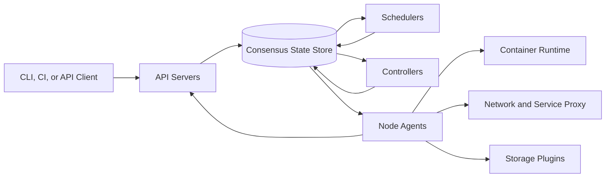
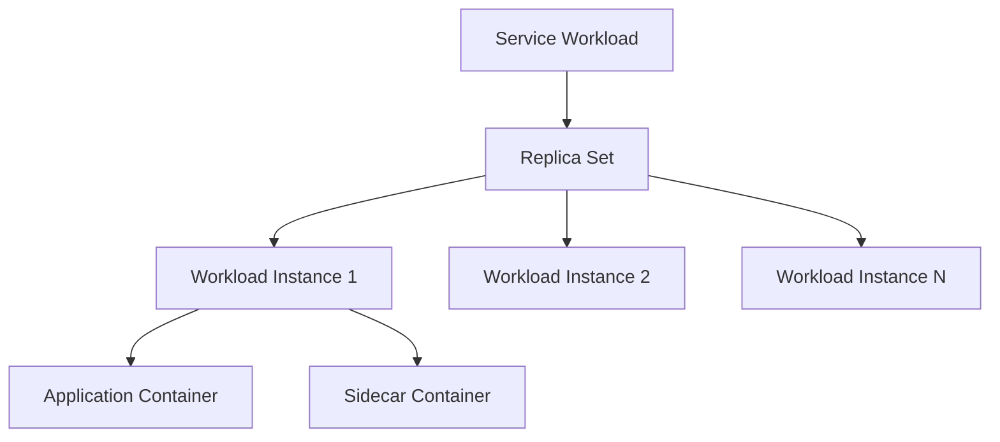
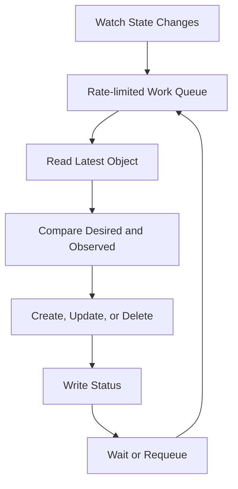
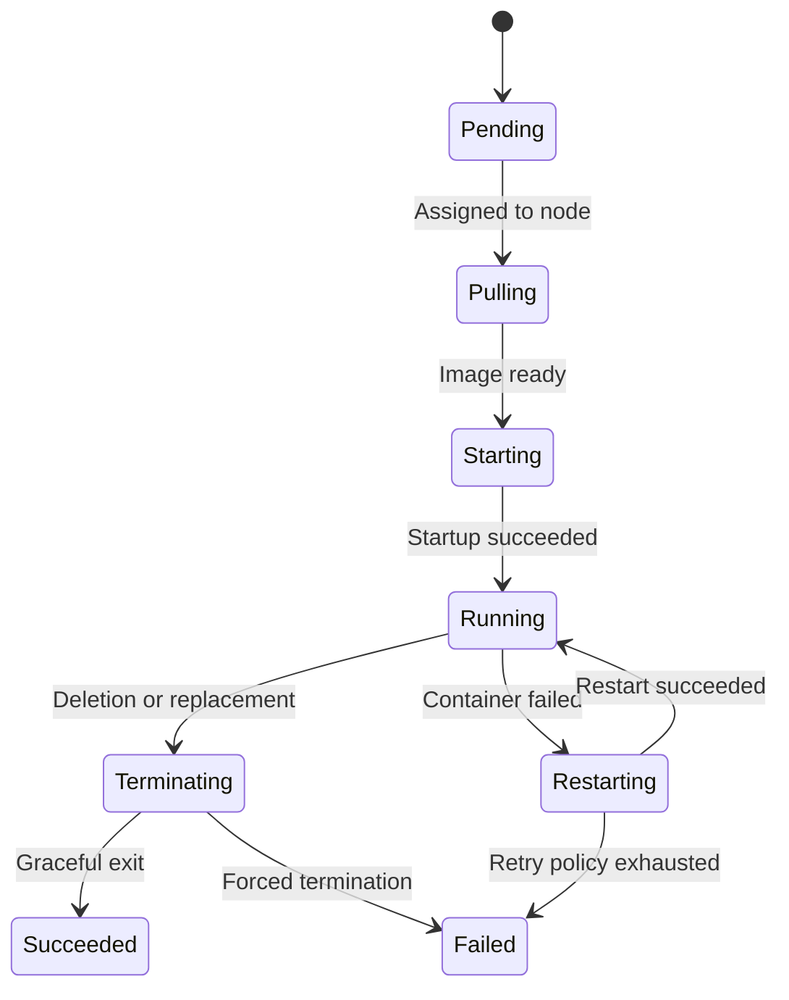
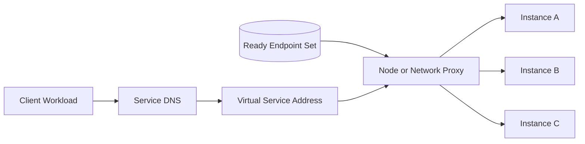
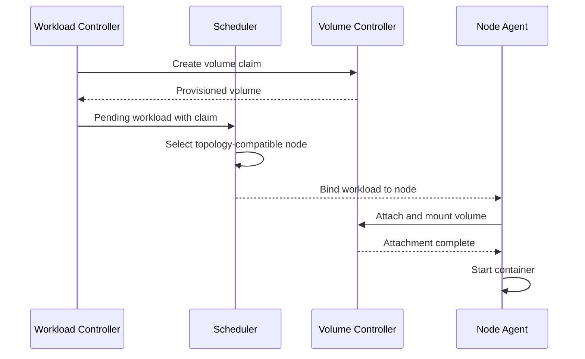
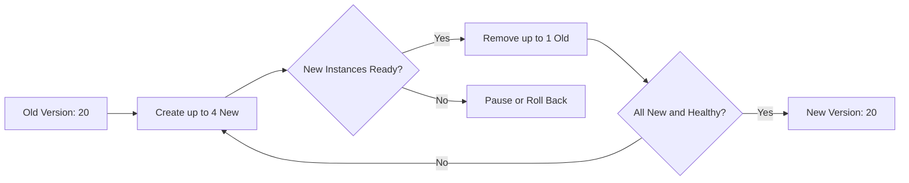
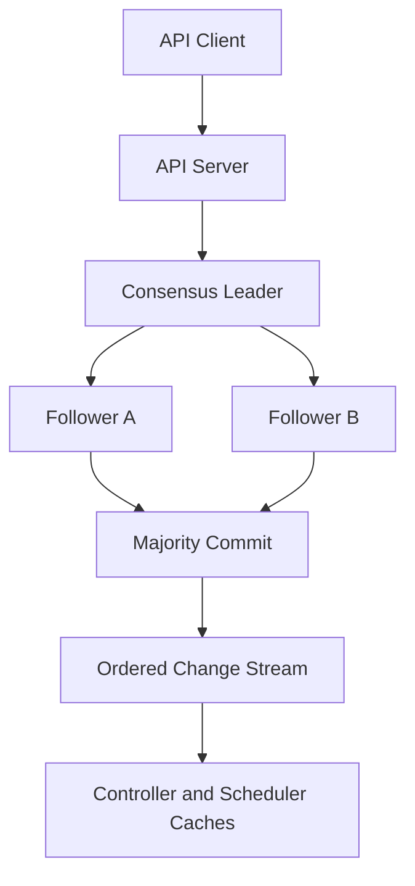

## Problem and requirements

A container orchestration system places and runs containerized workloads across a fleet of machines. Users declare a desired state—such as 20 replicas of an API—and the platform continuously works to make observed state match it despite deployments, crashes, maintenance, and changing demand.

The central challenge is not starting a container. It is coordinating millions of independently changing objects while preventing conflicting decisions, isolating tenants, and keeping application traffic healthy during failure and rollout.

### Functional requirements

- Create and manage long-running services, batch jobs, and scheduled jobs
- Place workloads according to resources, policy, topology, and affinity
- Restart failed containers and replace unavailable nodes
- Roll out and roll back application versions safely
- Provide service discovery and load balancing
- Attach persistent storage and distribute configuration references
- Scale workloads and cluster capacity
- Support maintenance, draining, priorities, and preemption
- Expose status, events, logs, and operational diagnostics

### Non-functional requirements

- Manage 100,000 nodes and ten million running containers
- Keep the control plane available across node and zone failures
- Schedule ordinary workloads within seconds
- Avoid duplicate ownership and conflicting controllers
- Isolate tenants in compute, network, storage, and API usage
- Continue running existing workloads during control-plane outages
- Converge safely under retries, duplication, and stale observations
- Preserve an auditable record of administrative changes

The orchestration system manages infrastructure state. It does not make a poorly designed application stateless, highly available, or safe to terminate.

## Capacity estimates

Assume 100,000 nodes, 100 containers per node on average, and continuous status updates from every node.

| Resource | Average | Peak assumption |
| --- | ---: | ---: |
| Running containers | 10M | 15M during overlap and bursts |
| Node heartbeats | 100K every 10 seconds | 10K/second |
| Container status updates | Hundreds of thousands/second | Millions/second during failure |
| Scheduling decisions | Thousands/second | 100K/second after disruption |
| API objects | Hundreds of millions | Includes history and events |

A zone outage can make hundreds of thousands of workloads pending at once. Recovery storms, not steady-state traffic, determine control-plane capacity.

## Declarative API

Users submit desired state rather than an imperative sequence of machine commands.

```yaml
apiVersion: platform.example/v1
kind: ServiceWorkload
metadata:
  name: checkout-api
  namespace: commerce
spec:
  replicas: 20
  image: registry.example/checkout:2026.10.7
  resources:
    requests: { cpu: "2", memory: "4Gi" }
    limits: { cpu: "4", memory: "8Gi" }
  placement:
    spreadAcross: [zone]
  rollout:
    maxUnavailable: 1
    maxSurge: 4
```

Every object has metadata, desired specification, observed status, generation, and resource version. The API server validates schema and policy, then commits the object before returning success.

Clients use idempotent create-or-update operations and optimistic concurrency. A resource version prevents two actors from silently overwriting each other.

## High-level architecture

The control plane stores desired state and runs independent reconciliation loops. Node agents execute assigned work. Application traffic does not pass through the control plane.



API servers are stateless and horizontally scaled. The state store uses a strongly consistent replicated log. Schedulers and controllers are replicated but use leader election or partition ownership to avoid conflicting work.

Node agents keep containers running from their last assignment during a temporary control-plane outage.

## Resource model and ownership

Controllers create lower-level resources from higher-level intent. A service workload may own a replica set, which owns individual workload instances.



Owner references support cascading cleanup and prevent orphaned resources. Finalizers delay deletion until an external action, such as detaching storage or releasing a load-balancer address, completes.

Deletion is a state transition, not an immediate database removal. Objects receive a deletion timestamp, controllers clean dependencies, and the API removes the record only after finalizers clear.

## Reconciliation loops

Each controller observes desired and actual state, computes a small idempotent action, and repeats.



Controllers must tolerate duplicate events, missed notifications, retries, and stale caches. Watches are performance hints; periodic relisting guarantees eventual recovery.

Every side effect uses stable object identity and expected versions. A controller that crashes after creating a resource can discover it on retry instead of creating another.

Keep controllers narrow. Deployment rollout, node health, storage attachment, and endpoint publication should not be one giant state machine.

## Scheduling pipeline

The scheduler assigns each pending workload instance to one node. It first filters infeasible nodes, then scores feasible candidates.


Hard filters include:

- Available requested CPU, memory, storage, and accelerators
- Node selectors and required affinity
- Taints, tolerations, and tenant policy
- Volume and network compatibility
- Required zone or hardware properties
- Port conflicts and workload limits

Scoring can prefer balanced utilization, data locality, lower cost, low fragmentation, topology spread, or soft affinity. Normalize and weight scores so one plugin cannot dominate accidentally.

Scheduling uses requested resources, not current instantaneous usage. Otherwise temporary low usage would permit unsafe overcommitment.

## Scheduler scalability

Reading the database for every filter operation is too slow. Schedulers maintain an in-memory cluster snapshot from state watches.

Use optimistic concurrency when binding. If the selected node changed or another scheduler claimed the workload, retry with fresh state.

Parallel schedulers can partition by workload class, tenant, or stable object hash. A scheduling profile chooses plugins and priorities for general services, latency-sensitive workloads, batch jobs, or accelerators.

Cache feasibility facts and precompute node indexes by zone, hardware, and labels. Stop scoring after a sufficient candidate sample for ordinary workloads, while specialized scarce resources may need full consideration.

Queue pending workloads by priority and age. Backoff unschedulable items until a relevant cluster event occurs instead of evaluating them continuously.

## Resource management

Requests drive placement and guaranteed capacity. Limits cap consumption at runtime.

CPU is compressible: workloads can be throttled. Memory is not; excess use eventually requires termination. Local ephemeral storage also needs requests, limits, and eviction policy.

Classify workloads by quality of service:

- Guaranteed workloads request and limit the same resources
- Burstable workloads have partial guarantees and higher limits
- Best-effort workloads have no guarantee and are evicted first

The node agent reserves capacity for the operating system and platform daemons. Scheduler-visible allocatable capacity excludes those reservations.

Track extended resources such as GPUs as discrete devices with topology constraints. Device plugins advertise inventory and perform secure assignment.

## Bin packing and fragmentation

Packing workloads tightly reduces cost but can leave unusable resource fragments—for example, CPU on one node and memory on another.

Score multiple resource dimensions and dominant-resource fit. Maintain headroom for system processes, rolling deployments, and local failure recovery.

Anti-affinity and topology spread improve availability but reduce packing efficiency. Apply them to failure domains that matter, such as zones and power groups, rather than unique hosts by default.

Large workloads are vulnerable to fragmentation. Cluster autoscaling and defragmentation through safe rescheduling can create suitable nodes, but unnecessary movement disrupts applications.

## Node agent and container lifecycle

The node agent watches assignments for its node and reconciles local runtime state.



The agent prepares storage and networking before starting containers. It reports conditions and container status through bounded, coalesced updates.

Health signals have distinct meanings:

- **Startup probe:** application finished initialization
- **Readiness probe:** safe to receive traffic
- **Liveness probe:** process should be restarted

Bad liveness probes can amplify a dependency outage into a restart storm. Use conservative thresholds and never make liveness depend on every downstream service.

## Node health and failure recovery

Nodes renew lightweight leases frequently and publish detailed status less often. A node-health controller marks a node unknown after missed leases and unavailable after a longer threshold.

Do not reschedule immediately on one missed heartbeat. The original node may still be running but partitioned from the control plane, creating duplicate instances. Workload semantics determine the tolerance.

For stateless replicated services, replacement can begin after a bounded timeout. For singleton or storage-attached workloads, fencing must prove the old node cannot continue writing before a replacement attaches the resource.

During mass failure, recovery is rate-limited by zone and workload priority. Critical control-plane and platform services recover before low-priority batch jobs.

## Service discovery and traffic

A service provides a stable virtual identity for a changing set of ready workload instances.



Endpoint controllers publish only ready instances. Proxies receive versioned endpoint updates and load-balance connections. Existing connections may continue during graceful termination while new connections stop.

For large endpoint sets, shard updates and distribute deltas rather than rewriting one giant object. DNS caches require sensible TTLs, but the virtual service address remains stable.

Network policy controls allowed traffic by workload identity or labels. Enforcement occurs at nodes or the network layer, not only in service discovery.

## Workload networking

Each workload receives a routable network identity or participates through a node-level proxy. The network plugin allocates addresses, configures routes, and enforces policy.

Address allocation is idempotent and tied to workload identity. Cleanup handles node crashes and leaked allocations through reconciliation.

Use separate paths for control-plane traffic, workload traffic, and storage where operational risk justifies it. Encrypt cross-node or cross-tenant traffic according to the threat model.

Network policy defaults should be explicit. A default-deny namespace with narrowly allowed flows provides stronger isolation than unrestricted east-west communication.

## Persistent storage

Applications request persistent volumes through claims rather than selecting disks directly. A storage controller provisions a compatible volume and binds it to the claim.



Storage topology participates in scheduling. A zone-bound volume cannot attach to a node elsewhere.

Attachment operations use stable IDs and state machines because cloud APIs time out ambiguously. Before reattaching a single-writer volume, fence the previous node to prevent data corruption.

Snapshots, expansion, and deletion follow separate policies. A workload deletion must not silently destroy persistent data unless reclaim policy explicitly says so.

## Configuration and secrets

Configuration objects are versioned and mounted as files or exposed through APIs. Applications should detect updates or restart through an explicit rollout mechanism.

Secret values require stronger handling: encrypted storage, strict authorization, protected node delivery, redacted events, and integration with a dedicated secrets manager.

Do not place secret plaintext in workload specifications, labels, command arguments, or environment diagnostics. Prefer memory-backed mounts or secretless proxies.

Changes to a configuration reference can contribute to a workload-template hash, producing a controlled rollout rather than mutating every running process unpredictably.

## Rolling deployments

A deployment controller creates a new replica set and gradually shifts desired replicas while maintaining availability constraints.



Readiness gates prevent traffic from reaching an unready version. Minimum-ready duration avoids counting a briefly healthy process as stable.

Progress deadlines detect stalled rollouts. Automated rollback should use application health, error rates, and explicit policy—not container readiness alone.

Keep rollout state durable and idempotent. Controller restarts must continue from actual replica counts rather than restarting the deployment.

## Autoscaling workloads

A horizontal autoscaler adjusts replicas from observed demand and target utilization.

```text
desired replicas = current replicas × observed metric / target metric
```

Use a tolerance band, stabilization windows, and separate scale-up and scale-down rates to prevent oscillation. Ignore or conservatively handle missing metrics.

CPU utilization works when CPU drives demand. Queue depth, request concurrency, or latency may be better application signals. Scale on metrics that precede saturation rather than symptoms that appear after failure.

New replicas need time to become ready, so the controller accounts for startup delay. Scale down gradually and respect disruption budgets.

Vertical recommendations can change requests, but applying them often requires restart. Coordinate vertical and horizontal scaling so they do not fight each other.

## Cluster autoscaling

When workloads remain pending because no node fits, the cluster autoscaler estimates which node group could schedule them and adds capacity.

It simulates scheduling against node templates, groups compatible pending workloads, and chooses a cost- and policy-aware expansion.

For scale-down, a node is removable only when its workloads can run elsewhere, local storage policy permits movement, disruption budgets remain valid, and platform daemons are handled.

Cloud provisioning takes minutes, so maintain buffer capacity for sudden demand. Capacity reservations or prewarmed nodes help scarce accelerators and latency-sensitive services.

## Priorities, preemption, and disruption

Priority lets critical workloads schedule during resource pressure. If necessary, the scheduler preempts lower-priority workloads whose removal makes a node feasible.

Preemption is a last resort, not normal placement. Include termination grace periods and avoid repeated victim selection.

Disruption budgets limit how many replicas may be voluntarily unavailable during maintenance, rollout, or scale-down. They do not prevent involuntary hardware failure.

Node draining marks a node unschedulable, evicts workloads in policy order, waits for graceful termination, and reports blockers. Operators need clear reasons when a budget or storage constraint prevents maintenance.

## Multi-tenancy and isolation

Namespaces or projects scope names, quotas, policy, and administrative delegation.

Isolation layers include:

- API authorization and admission policy
- CPU, memory, storage, and object-count quotas
- Runtime sandboxing and operating-system isolation
- Network policy and tenant-aware service identity
- Storage encryption and access boundaries
- Dedicated node pools for stronger isolation
- Per-tenant scheduler and API rate limits

Never trust workload labels supplied by one tenant as authorization evidence for another. Infrastructure applies trusted identity metadata separately.

Admission control can reject privileged containers, unsafe host mounts, untrusted images, missing limits, or prohibited registries before objects reach scheduling.

## Control-plane consistency

The authoritative state store provides linearizable writes and consistent reads for coordination-sensitive operations. Most controllers use cached watch data and optimistic updates.



Keep large logs, metrics, and image data out of the state store. It contains compact desired and observed state only.

Compaction bounds retained history. Watch clients that fall behind relist current state and resume from a new version.

Backup snapshots and the write-ahead log. Regularly test restore into an isolated control plane; an untested backup is not a recovery plan.

## Failure handling

### API server failure

Load balancers route to healthy replicas. Nodes and controllers reconnect without losing durable state.

### State-store leader failure

A majority elects a new leader. Writes pause briefly; existing workloads and local service traffic continue.

### Scheduler outage

Running workloads continue. Pending workloads wait until another scheduler assumes leadership or partition ownership.

### Controller crash

Another replica acquires its lease and resumes reconciliation from current state. Idempotent actions prevent duplicate resources.

### Node partition

Stop routing new traffic to its endpoints, wait the configured tolerance, then replace workloads according to duplication and fencing safety.

### Zone failure

Rate-limit recovery, honor topology and disruption policy, add capacity in surviving zones, and prioritize critical services.

### Bad deployment

Pause progression, preserve healthy old replicas, and roll back to the previous immutable workload template.

### Image registry failure

Use node image caches and regional mirrors. Do not evict healthy running workloads merely because their image cannot currently be pulled elsewhere.

## Observability and operations

Track:

- API latency, errors, request rate, and admission rejections
- State-store commit latency, leader changes, and database size
- Watch lag and controller queue depth
- Pending workload age and unschedulable reasons
- Scheduling throughput and binding conflicts
- Node readiness, resource pressure, and agent version
- Container start latency and image-pull failures
- Rollout progress and health-gate failures
- Endpoint propagation latency
- Autoscaler decisions and capacity shortfall
- Disruption budget blocks and preemption rate

Events explain state transitions but require aggregation and retention limits. Repeating errors should be deduplicated with occurrence counts.

Synthetic workloads continuously test scheduling, networking, storage, service discovery, rollout, and cleanup in every zone.

Operational changes such as node drains, policy overrides, and control-plane failovers require identity, reason, and audit evidence.

## Key tradeoffs

### Declarative convergence vs imperative speed

Imperative commands may feel immediate but fail awkwardly halfway through. Declarative state plus reconciliation is retryable and self-healing, though convergence is asynchronous.

### Strong state consistency vs scalable observation

Coordination writes need a strongly consistent source of truth. Schedulers and controllers need cached views for scale. Optimistic concurrency bridges stale observation and safe commitment.

### Packing efficiency vs resilience

Dense packing lowers cost but reduces headroom and concentrates failures. Topology spread, surge capacity, and reserved resources spend efficiency to improve recovery.

### Fast rescheduling vs duplicate execution

Replacing a silent node quickly reduces downtime but may run two copies during a partition. Stateless services tolerate this; singleton and storage workloads require fencing.

### Shared clusters vs dedicated isolation

Shared clusters improve utilization and operational consistency. Dedicated node pools or clusters offer stronger failure and security boundaries for high-risk workloads.

The central principle is that every component observes state, performs a small idempotent action, and lets durable desired state drive the cluster back toward correctness after any interruption.
