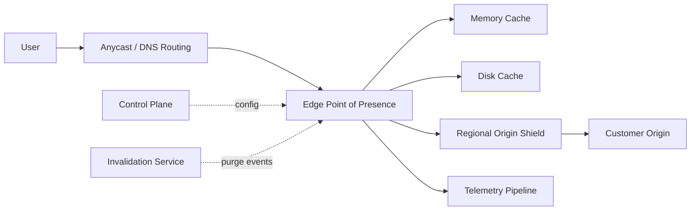
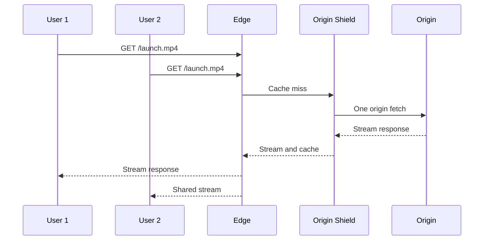
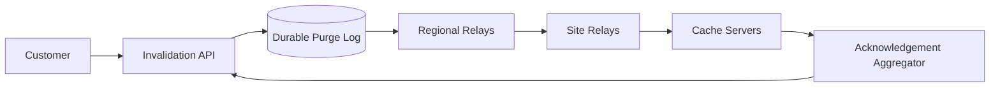

## Problem and requirements

A content delivery network places copies of content near users. It reduces latency, absorbs traffic spikes, lowers origin bandwidth, and provides a controlled security boundary in front of applications and storage systems.

### Functional requirements

- Route users to a healthy nearby edge location
- Cache HTTP responses according to explicit policy
- Fetch and shield origins on cache misses
- Purge or invalidate cached objects quickly
- Support private and signed content
- Expose traffic, cache, and error analytics
- Protect customers from abusive traffic and volumetric attacks

### Non-functional requirements

- Sustain tens of millions of requests per second and 100 Tbps peaks
- Add minimal latency on cache hits
- Keep serving cached content during origin failures
- Prevent one customer or object from exhausting shared capacity
- Propagate urgent invalidations globally within seconds
- Preserve tenant isolation in routing, caching, logs, and control APIs

Dynamic application execution, full web application firewalls, and global authoritative DNS are adjacent systems. This design includes only the parts required to route and cache content safely.

## Capacity estimates

Assume **10 million requests per second** at peak, **100 Tbps** of egress, and a 95% byte cache-hit ratio.

| Resource | Estimate |
| --- | ---: |
| Peak requests | 10M/second |
| Peak edge egress | 100 Tbps |
| Origin egress at 95% byte hit ratio | 5 Tbps |
| Requests at 50 KB average response | ~4 Tbps before large media skew |

Request hit ratio and byte hit ratio are different. Millions of tiny API misses may dominate requests while a few large cached videos dominate bytes. Both metrics matter for capacity and cost.

If 200 points of presence share traffic evenly, each averages 50,000 requests per second and 500 Gbps at global peak. Real demand is not even, so major metros need far more capacity and smaller sites need overflow routes.

## Customer configuration

Customers define an origin and attach domains, TLS certificates, cache rules, routing policies, and security controls.

```text
Distribution {
  domain: "static.example.com"
  origins: ["origin-primary", "origin-failover"]
  cache_key: host + normalized_path + selected_query
  default_ttl: 3600
  stale_if_error: 86400
  signed_urls: required_for("/private/*")
}
```

Configuration changes receive a monotonically increasing version. Edge locations activate only complete validated versions and retain the previous version for rollback.

The control plane never sits in the request path. Edges continue serving from their last known configuration during control-plane outages.

## High-level architecture

The control plane manages customers, certificates, configuration, invalidations, and fleet state. The data plane routes and serves user requests.



A point of presence contains load balancers, TLS terminators, cache servers, and security filters. Frequently accessed metadata and small objects may live in memory; larger objects live on local SSDs.

Regional shields provide a second cache tier and collapse misses before they reach customer infrastructure.

## Request routing

The routing system selects an edge using network proximity, measured latency, available capacity, health, and policy.

Two common mechanisms are:

- **Anycast:** many sites announce the same IP prefix, and internet routing directs traffic to a nearby reachable site
- **DNS steering:** authoritative DNS returns site-specific addresses based on resolver geography and current health

Anycast offers fast network-level failover and simple client configuration, but routing follows BGP policy rather than exact application latency. DNS provides explicit control but is limited by resolver caching and does not move established connections.

A hybrid can use DNS to select a region and anycast within that region. Real-user measurements inform routing weights because geographic distance alone does not reveal congestion or poor network peering.

Do not move all traffic immediately after one failed probe. Health decisions need multiple signals, hysteresis, and capacity-aware ramping to avoid oscillation and overloading the next site.

## Edge request processing

On each request, the edge:

1. Terminates TLS and selects the tenant by hostname
2. Applies request-size, protocol, and security limits
3. Loads the active configuration version
4. Normalizes the request and computes a cache key
5. Checks memory and disk cache tiers
6. Validates freshness and authorization
7. Serves the object or performs a shielded origin fetch
8. Emits sampled logs and aggregate metrics

Expensive features have strict budgets. A slow customer-provided rule must not hold an edge connection indefinitely. Configuration languages should be bounded and sandboxed.

HTTP/2 and HTTP/3 reduce connection overhead and head-of-line blocking. Edges reuse upstream connections to shields and origins rather than opening one connection per request.

## Cache-key design

A cache key identifies which requests may safely share one stored response. It commonly includes scheme policy, hostname, normalized path, selected query parameters, and selected request headers.

Too little key variation leaks incorrect or private content. Too much variation destroys hit rate.

Examples:

- Ignore marketing parameters such as `utm_source`
- Include a language header only when the origin varies content by language
- Normalize query order when parameter order has no semantic meaning
- Never include per-request authorization tokens unless each response must be private
- Separate compressed variants using content negotiation metadata

Honor the origin’s `Vary` response header within configured limits. An unrestricted `Vary` can produce unbounded variants, so cap header count and value size.

Cache configuration should fail closed for authenticated responses. Do not cache responses containing private cookies or authorization unless an explicit rule defines safe behavior.

## Freshness and revalidation

An object is fresh until its TTL expires. The edge derives TTL from response cache headers and customer policy, with minimum and maximum bounds.

After expiry, conditional requests use `If-None-Match` or `If-Modified-Since`. A `304 Not Modified` refreshes metadata without transferring the full object.

Useful stale policies include:

- **Stale-while-revalidate:** serve the old response briefly while one background request refreshes it
- **Stale-if-error:** serve expired content when the origin returns an error or times out

Stale serving needs explicit limits and does not apply to sensitive or rapidly changing content by default. Responses should expose cache age so operators and clients can understand freshness.

## Cache misses and origin shielding

Without coordination, one expired popular object can trigger thousands of origin requests. Request coalescing designates one fetch as the leader and makes concurrent requests wait for or stream its result.



The edge streams bytes to waiting clients while filling the cache, avoiding full-object latency and memory use. If the leader fetch fails, release waiters with a bounded retry strategy rather than letting each retry independently.

Regional shields coalesce misses from many edge sites. A consistent mapping from object key to shield improves locality, while health-aware fallback prevents one unavailable shield from blocking the region.

## Large objects and range requests

Large media files should not require a full download before caching. Store them in fixed-size cache fragments aligned to byte ranges.

When a client requests a missing range, fetch only the required origin range plus an optional read-ahead window. Validate that the origin’s entity tag and total size remain consistent across fragments; otherwise pieces from different object versions can be combined incorrectly.

Popular adjacent ranges can be merged into fewer upstream requests. Limit concurrent range fills per object so random-seek traffic cannot overwhelm an origin.

Eviction considers object size and cost. One enormous one-time object should not evict thousands of small popular assets. Size-aware admission and segmented cache pools improve efficiency.

## Eviction and admission

Edge storage is finite. A practical policy combines recency, frequency, object size, fetch cost, and TTL.

Admission matters as much as eviction. Caching every response lets scans or cache-busting attacks replace valuable objects with one-time content. TinyLFU-style frequency sketches can reject low-value admissions before they displace established objects.

Reserve separate capacity classes for small objects, large media fragments, customer tiers, and operational data. Per-tenant limits prevent one distribution from occupying the entire site.

Eviction is local and does not require global coordination. Losing a cache entry affects performance, not correctness; it can be refetched from the next tier.

## Invalidation

Immutable versioned URLs are the simplest invalidation strategy. Publishing `/app.9f2c1.js` instead of overwriting `/app.js` lets old objects expire naturally.

Mutable content still needs purge APIs:

```http
POST /v1/distributions/dist_42/invalidations
Idempotency-Key: release-928

{
  "paths": ["/index.html", "/api/catalog/*"]
}
```

The invalidation service assigns a sequence, persists the request, and distributes it through a hierarchical event tree.



Edges maintain the highest applied purge sequence per distribution. A reconnecting edge replays missed events before serving affected content.

Exact-key purges are cheap. Wildcard purges may require a secondary tag index or a generation number. **Surrogate keys** let origins tag related objects—such as every page containing product 42—and invalidate that group efficiently.

Emergency revocation for private or unsafe content uses a small globally replicated denylist checked before cache lookup. This provides a correctness boundary while normal deletion propagates.

## Origin protection

The CDN should reduce, not amplify, origin load.

Protections include:

- Connection and request-rate limits per origin
- Request coalescing and shield caches
- Circuit breakers on rising errors or latency
- Bounded retries with jitter
- Stale-if-error responses
- Origin authentication so attackers cannot bypass the CDN
- Egress allowlists preventing arbitrary internal destinations

Origin retries need a strict budget. Retrying every failed request three times during an outage can quadruple load and prevent recovery.

Health checks distinguish one origin host from the entire origin pool. Load balancing uses current in-flight requests and latency, not round-robin alone.

## Private and signed content

For private files, authenticate before serving from cache while preserving shared cached bytes where policy allows.

A signed token may include resource scope, expiration, tenant, viewer restrictions, and key ID. The edge verifies it locally using distributed public keys. Do not include the unique token in the media cache key; otherwise every viewer causes a miss.

Authorization metadata and cached bytes have separate lifetimes. A valid token grants access to an object version; it does not make that response public.

Key rotation distributes new verification keys before issuing tokens with them and retains old keys until existing tokens expire.

## TLS and certificate management

The control plane validates domain ownership and provisions certificates. Private keys are encrypted and delivered only to authorized edge termination systems.

Certificate updates must reach edges before activation and well before expiry. Keep a previous valid certificate during rollout. Automated canaries test handshakes by hostname, protocol, and region.

At very large scale, loading every customer certificate into every process wastes memory. Route the TLS ClientHello by server name to a certificate shard or use on-demand secure lookup with aggressive local caching.

## Security and abuse resistance

Edges absorb volumetric attacks before they reach origins. Network and application controls include connection limits, SYN protection, protocol validation, request-size limits, rate limits, bot signals, and customer-defined rules.

Enforce isolation in cache keys, configuration lookup, logs, quotas, and purge events. A hostname must map to exactly one authorized tenant configuration.

Protect against cache poisoning:

- Normalize requests consistently before lookup and origin forwarding
- Exclude untrusted headers from cache keys and upstream routing
- Cache only eligible status codes and responses
- Validate `Content-Length`, ranges, and transfer encoding
- Keep authorization and host headers under strict policy

Prevent server-side request forgery by restricting origins to validated destinations and blocking private address ranges unless explicitly configured through a secure private-origin product.

## Logging and analytics

Edges produce enormous event volume. Aggregate counters locally and sample request logs before sending them through regional collectors to a durable stream.

Metrics include:

- Requests and bytes by tenant, region, status, and protocol
- Request and byte cache-hit ratios
- Edge, shield, and origin latency
- Origin fetches, retries, and coalescing effectiveness
- Evictions, admissions, and storage utilization
- Invalidations received and applied
- TLS, security-rule, and authorization failures

Billing paths require stronger completeness than debugging logs. Use sequence checkpoints and reconciliation between edge counters and regional ingestion.

Strip or hash sensitive headers and query values at the edge. Central logging of raw authorization tokens creates a severe security risk.

## Failure handling

**Cache-process failure:** another local process serves requests; lost entries refill from shield or origin.

**Edge-site failure:** anycast withdraws the route or DNS steers new traffic elsewhere. Capacity-aware routing prevents the neighboring site from becoming overloaded.

**Shield failure:** edges use another healthy shield or fetch origin directly under stricter limits.

**Origin failure:** serve eligible stale content, trip the circuit breaker, and periodically probe for recovery.

**Control-plane outage:** edges continue using their last valid configuration and certificates. Mutations pause, but delivery continues.

**Invalidation-channel failure:** edges reconnect and replay from the durable sequence. Emergency denylist updates use an independent path.

**Object-storage region failure:** shields fetch from a replicated origin region while cached edge content continues serving.

## Multi-CDN and customer failover

Some customers distribute traffic across multiple CDN providers for capacity and resilience. DNS or client-side routing chooses a provider based on measured performance and health.

Configuration, signing, log fields, purge semantics, and cache behavior differ across providers. A multi-CDN control layer normalizes these differences but must expose where guarantees are not equivalent.

Shift traffic gradually. Moving a large audience to a cold provider causes cache misses and can overload the origin. Pre-warm critical objects or ramp while watching origin and provider capacity.

The CDN itself may use third-party overflow capacity, but origin shielding should remain coordinated to prevent independent providers from producing simultaneous miss storms.

## Observability and operations

Monitor user experience and internal health together:

- Time to first byte by network and edge site
- Routing quality compared with alternate sites
- Cache efficiency and origin offload
- Site capacity, connection pressure, CPU, memory, and disk
- Configuration and certificate propagation age
- Purge completion percentile and missed sequence gaps
- Error spikes by customer, origin, and software version
- Packet loss and transport handshake failures

Synthetic probes test DNS, TLS, cache miss, cache hit, range requests, signed access, purge, stale serving, and failover from many networks.

Roll out edge software in small rings. Edge bugs have enormous blast radius, so automatic rollback uses customer error rates and protocol failures, not only process crashes.

## Trade-offs

**Anycast vs. DNS routing:** anycast provides rapid network failover and simple addresses. DNS offers more deliberate traffic control but reacts through cached records.

**Freshness vs. availability:** strict expiration prevents stale content but makes origin outages visible. Bounded stale serving improves resilience for content where age is acceptable.

**Cache variation vs. hit ratio:** including every request attribute preserves correctness but fragments the cache. Include only dimensions that truly change the response.

**Edge capacity vs. footprint:** large sites achieve excellent hit rates and absorb attacks but cost more and cover fewer locations. Small sites reduce network distance but may need frequent shield access.

**Fast purge vs. system cost:** globally indexing every object enables precise invalidation but adds memory and write overhead. Versioned URLs and surrogate tags reduce the need.

**One CDN vs. multiple providers:** one CDN simplifies behavior and warms caches efficiently. Multiple CDNs improve resilience and reach but increase inconsistency and origin risk.

The central design treats cached content as disposable but policy as authoritative. Edges can lose objects and refill them, yet tenant configuration, authorization, cache-key isolation, and emergency revocation must remain correct everywhere.
