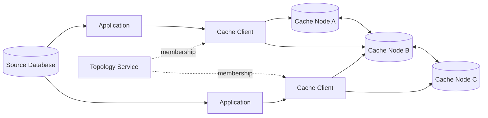
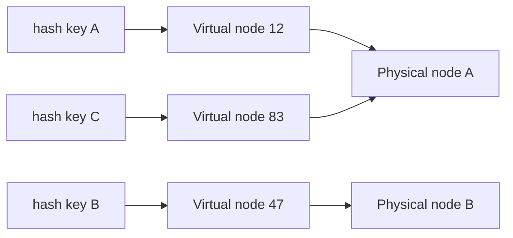
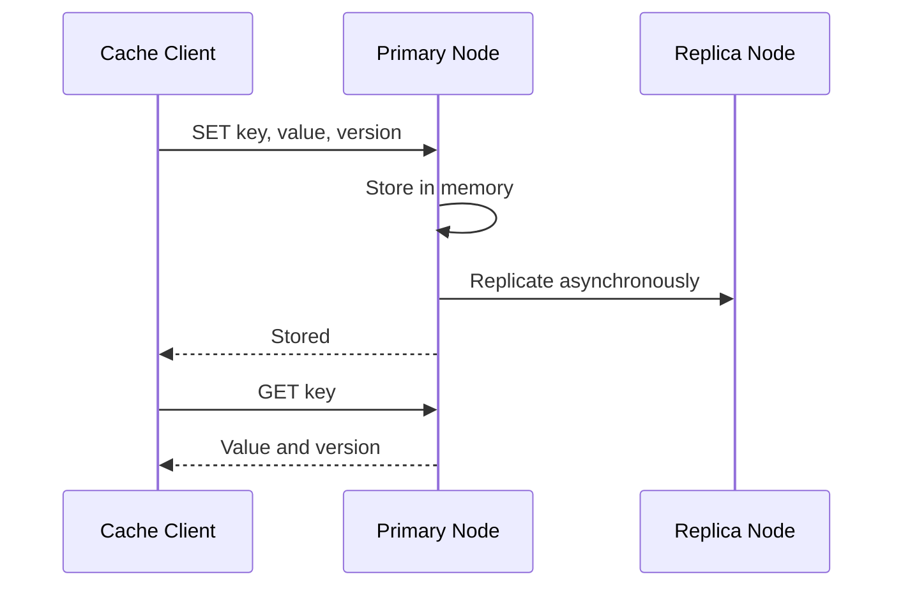
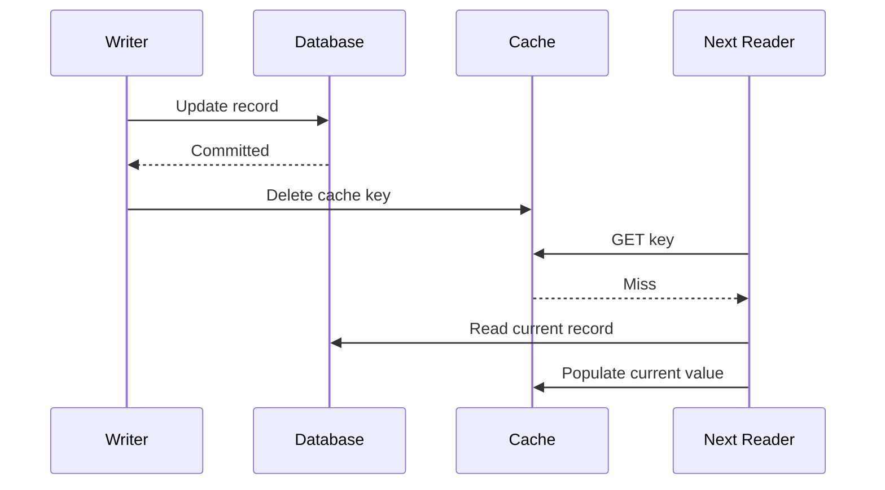

## Problem and requirements

A distributed cache keeps frequently accessed data in memory across many machines. It reduces database load and gives applications predictable low-latency reads even when traffic grows beyond one server.

### Functional requirements

- Read a value by key
- Write a value with an optional time-to-live
- Delete or invalidate a key
- Increment counters atomically
- Scale capacity by adding nodes
- Expose hit rate, memory use, and eviction metrics

### Non-functional requirements

- Complete normal reads and writes in under 5 milliseconds at the 99th percentile
- Sustain millions of operations per second
- Continue serving during individual node failures
- Distribute data and traffic evenly
- Bound memory use with predictable eviction

The cache is not the durable source of truth. Losing cached data may reduce performance, but must not corrupt the underlying application state.

## Capacity estimates

Assume a peak of **5 million operations per second**, a 10:1 read-to-write ratio, and a **20 TB** working set. Average values are 1 KB.

| Resource | Estimate |
| --- | ---: |
| Peak reads | 4.55M/second |
| Peak writes | 450K/second |
| Application throughput | ~5 GB/second |
| Raw memory | 20 TB |
| Memory with two replicas and 30% overhead | ~52 TB |

If one cache node safely provides 100,000 operations per second and 128 GB of usable memory, throughput needs roughly 50 nodes while capacity needs roughly 407 nodes. Capacity dominates, so a production cluster might begin near 450 nodes to preserve failure headroom.

## API design

The client library exposes a small key-value interface and hides routing, retries, serialization, and topology updates.

```text
GET(key) -> value | miss
SET(key, value, ttl, writeToken?) -> stored
DELETE(key) -> deleted
ADD(key, delta, ttl?) -> newValue
MGET(keys[]) -> values[]
```

Keys should include a namespace and stable identifier, such as `profile:v3:user_1842`. A schema version in the key makes incompatible cache migrations safer because old entries naturally expire.

Large values increase network cost, block event loops, and create uneven memory use. Enforce a maximum item size and store large objects in durable blob storage instead.

## High-level architecture

Applications use a cache client that knows the current node topology. The client hashes each key and sends the operation directly to the appropriate cache node, avoiding a central routing bottleneck.



The topology service tracks healthy nodes and shard ownership. It is not involved in normal reads or writes. Clients cache its routing table and refresh when membership changes or a node reports that it no longer owns a key.

## Sharding with consistent hashing

Simple modulo sharding uses `hash(key) % nodeCount`. It distributes keys well until the number of nodes changes; adding one node remaps almost every key and causes a large cache miss storm.

Consistent hashing places nodes and keys on a logical ring. A key belongs to the first node encountered clockwise. Adding or removing a node moves only the neighboring ranges.



Each physical node owns many **virtual nodes** spread around the ring. Virtual nodes smooth out uneven hash ranges and let the control plane assign more ranges to machines with more memory.

Rendezvous hashing is another strong option: compute a score for every candidate node and choose the highest. It is simple and minimizes movement, but scoring every node becomes expensive in very large clusters unless clients first narrow the candidate set.

## Replication and consistency

For each key, the hash ring selects one primary node and one or more replica nodes. Replication improves availability but doubles or triples memory cost.



Asynchronous replication keeps writes fast but creates a window where a primary failure can lose a recent cache update. That is acceptable when the source database can repopulate the value. Synchronous replication narrows the window but increases latency and lets a slow replica delay every write.

Replicas may serve reads to spread load, but clients can observe stale values. Version numbers or source-record timestamps prevent an older replica value from overwriting a newer one during recovery.

## Cache population patterns

### Cache-aside

The application reads the cache first. On a miss, it loads from the database, writes the cache, and returns the result. Cache-aside is simple and stores only requested data, but the application owns miss handling and consistency.

### Read-through

The cache itself loads missing values through a registered data loader. Application code is cleaner, but the cache layer becomes coupled to data sources and credentials.

### Write-through

Every update writes the cache and database synchronously. Reads stay current, but write latency and cache complexity increase.

### Write-behind

Updates land in the cache first and reach the database asynchronously. This produces fast writes and efficient batching, but the cache now holds uncommitted durable state. It requires a write-ahead log and careful recovery, making it unsuitable for a disposable cache unless data loss is acceptable.

Cache-aside is the safest default for most application data.

## Expiration and eviction

Expiration and eviction solve different problems. A **TTL** limits how long a value may be considered fresh. An **eviction policy** chooses what to remove when memory is full.

Passive expiration removes a key when it is accessed after its TTL. Active expiration samples keys in the background so expired but unread entries do not occupy memory forever. A timing wheel can organize expirations efficiently when the system manages millions of timers.

Common eviction policies include:

- **LRU:** removes the least recently used item; effective for temporal locality but expensive to track exactly
- **LFU:** preserves frequently used items; better for stable popularity but slower to adapt
- **Random:** extremely cheap and sometimes surprisingly competitive
- **Sampled LRU/LFU:** approximates a policy from a small candidate set and is practical at scale

Reserve memory for connections, metadata, replication buffers, and allocator fragmentation. Waiting until memory is completely full creates latency spikes and failed writes.

## Invalidation and freshness

Cache invalidation is difficult because the cache and source database are separate systems. With cache-aside, an update should write the database first and then delete the cache entry.

Deleting is safer than overwriting: a concurrent request may have read the old database value before the update and could write it into the cache after a direct cache update.



A transactional outbox can publish invalidation events reliably after database commits. Subscribers in every region delete their local copies. TTL remains a final safety net if an event is delayed or lost.

## Cache stampedes

A popular key expiring can send thousands of simultaneous requests to the database. Several defenses work together:

- **Request coalescing:** one request refreshes the key while others wait for its result
- **TTL jitter:** randomize expiration times so related keys do not expire together
- **Stale-while-revalidate:** briefly serve an old value while one worker refreshes it
- **Probabilistic early refresh:** increasingly likely refreshes as expiration approaches
- **Source limits:** cap concurrent database loads per key and per service

Negative caching stores “not found” results for a short time. This protects the database from repeated misses for nonexistent IDs, but the TTL should remain short so newly created records appear quickly.

## Hot keys and large keys

A viral item can overload one shard even when total cluster traffic is safe. Detect hot keys from per-key sampling and node-level skew.

For read-only values, replicate a hot key to several nodes and add a secondary hash—such as the caller ID—to distribute reads among copies. Near-cache entries inside application processes can absorb even more traffic, with a short TTL to bound staleness.

Hot writable counters are harder because replicas require coordination. Shard one logical counter into multiple partial counters and aggregate them when exact, immediate totals are unnecessary.

One unexpectedly large value can also distort a shard. Track value-size percentiles, reject oversized entries, and use admission policies so a large one-time object does not evict many useful small objects.

## Failure handling

**Cache node failure:** clients temporarily route to a replica or treat requests as misses. The control plane assigns the failed virtual ranges to healthy nodes.

**Cold replacement node:** moving ownership immediately can flood the database. Warm the replacement from a replica, shift traffic gradually, and rate-limit source reads.

**Topology service failure:** clients continue using their last known routing table. Cache operations remain available, though membership changes pause.

**Network partition:** both sides must not accept conflicting ownership. A quorum-based control plane grants each shard epoch to one primary. Nodes reject writes with an old epoch.

**Entire cache outage:** applications fall back to the source with strict concurrency limits, circuit breakers, and degraded responses. A cache should improve the system without becoming required for correctness.

## Observability and operations

The global hit rate can hide serious problems. Monitor hit rate by service, namespace, and shard alongside:

- Operation latency by command and percentile
- Memory used, fragmentation, and eviction rate
- Expirations and invalidations
- Requests and bytes per node
- Replication lag and failed replicas
- Source-database loads triggered by misses
- Connection count and rejected connections

A falling hit rate may be healthy after a deployment changes key versions. A stable hit rate can still hide one overloaded shard. Dashboards need both product-level and node-level views.

## Trade-offs

**Client-side vs. proxy routing:** clients remove a network hop and central bottleneck but require topology logic in every supported language. A proxy simplifies clients at the cost of another service tier.

**Replication vs. capacity:** replicas improve availability and read throughput but multiply an already expensive memory footprint.

**Freshness vs. availability:** short TTLs and synchronous invalidation reduce stale reads but increase misses and dependencies. Many products can tolerate bounded staleness in exchange for resilience.

**Hit rate vs. efficiency:** admitting every object may raise short-term hit rate while evicting more valuable entries. TinyLFU-style admission keeps one-time scans from polluting the cache.

The most important boundary is conceptual: the cache accelerates reads, but the durable data store remains responsible for correctness. Designs become fragile when applications quietly depend on cached state that cannot be reconstructed.
