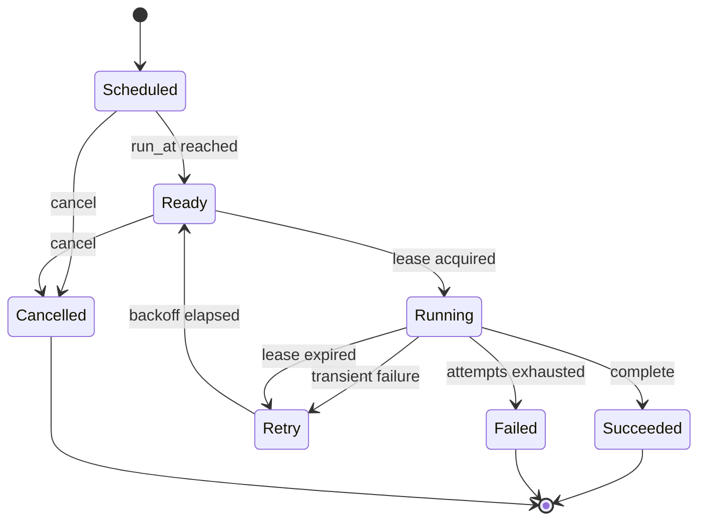
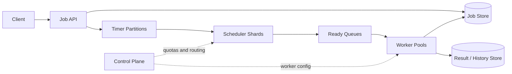
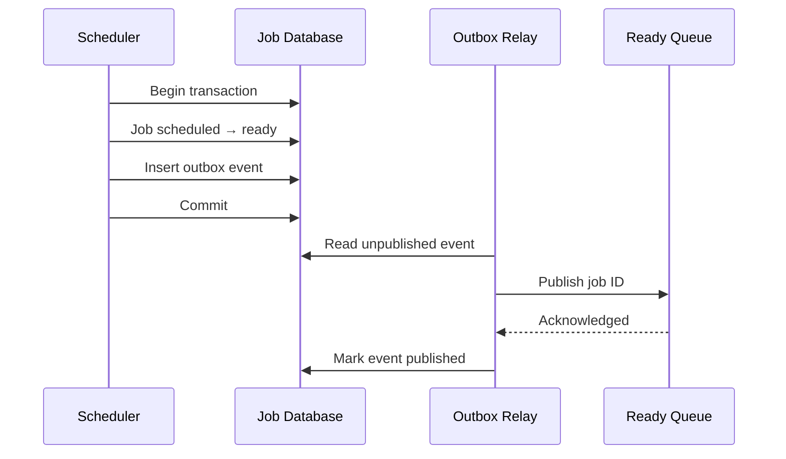

## Problem and requirements

A distributed job scheduler accepts work that should run now or in the future, assigns it to workers, and tracks the result. Examples include generating reports, sending scheduled emails, resizing uploads, billing subscriptions, and running nightly data pipelines.

### Functional requirements

- Submit a job for immediate or future execution
- Define recurring schedules
- Cancel a job that has not started
- Retry transient failures with configurable backoff
- Limit concurrency by queue, tenant, or job type
- Inspect status, attempts, timing, and failure details

### Non-functional requirements

- Sustain 500 million job executions per day
- Start 99% of due jobs within five seconds of their scheduled time
- Survive scheduler, worker, database, and availability-zone failures
- Never permanently lose an accepted job
- Provide at-least-once execution with explicit idempotency support
- Isolate noisy tenants and expensive job classes

Arbitrary workflow dependencies, interactive compute, and hard real-time deadlines are outside the first version. A workflow engine can build on top of the scheduler later.

## Capacity estimates

Five hundred million executions per day average roughly **5,800 jobs per second**. Provisioning for ten times the average gives a peak of about **60,000 starts per second**.

| Resource | Estimate |
| --- | ---: |
| Peak job starts | 60,000/second |
| Concurrent jobs | 300,000 at 5-second average runtime |
| Active future timers | 10 million |
| Execution records | 500 million/day |
| Metadata at 1 KB per execution | ~500 GB/day before replication |

Payloads should be small. Large inputs belong in object storage, with the job carrying a reference and checksum. This keeps queue operations predictable and prevents one task from consuming excessive broker memory.

## API and job model

Submitting a job returns a stable ID. An idempotency key prevents a client retry from creating the same logical job twice.

```http
POST /v1/jobs
Idempotency-Key: invoice-customer-4821-2026-09
Content-Type: application/json

{
  "type": "generate_invoice",
  "payload": { "customerId": "customer-4821" },
  "runAt": "2026-09-12T02:00:00Z",
  "queue": "billing",
  "maxAttempts": 5,
  "timeoutSeconds": 120
}
```

```json
{
  "jobId": "job_01K4YF8P2Q",
  "status": "scheduled",
  "runAt": "2026-09-12T02:00:00Z"
}
```

The job state machine is deliberately small:



Persist state transitions with timestamps, attempt numbers, and worker identifiers. This execution history is essential when operators investigate late, duplicated, or failed work.

## High-level architecture

The durable job store is the source of truth. Scheduler shards scan due time ranges and publish job IDs to ready queues. Workers lease jobs, execute handlers, and commit outcomes.



Separating scheduled timers from ready queues solves two different access patterns. The timer layer answers “what becomes due next?” The ready layer buffers executable work and supports high-throughput worker consumption.

## Storing and finding timers

A database index on `run_at` works at modest scale, but many scheduler instances polling the same earliest rows create lock contention. Partition timers by a coarse time bucket and a hash shard.

```text
partition_key = yyyy-mm-dd-hour + hash(job_id) % 128
sort_key      = run_at + job_id
```

Each scheduler owns a set of timer shards and reads only a short look-ahead window. A lease in the control plane ensures one active owner per shard. Ownership includes an epoch, and stale owners cannot publish after a reassignment.

Near-term timers can be loaded into an in-memory min-heap or hierarchical timing wheel. Far-future jobs remain in durable storage until they enter the look-ahead window. This bounds scheduler memory while avoiding a database query for every second.

A timing wheel groups timers into slots at increasing resolutions—seconds, minutes, hours, and days. As time advances, jobs cascade into finer-grained slots until they become ready.

## Dispatch and atomicity

The scheduler must mark a job dispatched and publish it to the ready queue. A crash between those actions can either lose the job or publish it twice.

Use a transactional outbox: in one database transaction, transition the job to `ready` and insert an outbox record. A relay repeatedly publishes undispatched outbox records to the queue and marks them delivered.



The relay may publish twice if it crashes after the queue acknowledges but before the outbox update. Workers therefore still need idempotent execution and lease validation.

## Worker leases

A worker does not permanently remove a message when it starts. It acquires a time-limited lease recorded with a unique lease token.

The lease duration should exceed normal execution time but remain short enough to recover from dead workers. Long jobs periodically renew their lease with a heartbeat. Every renewal and completion compares the token, so a worker whose old lease expired cannot overwrite the result of a newer attempt.

```text
UPDATE jobs
SET status = 'running', lease_token = ?, lease_until = ?
WHERE job_id = ?
  AND status = 'ready'
```

If no row is updated, another worker owns or already completed the job. This compare-and-set operation is the core protection against concurrent execution.

Leases cannot guarantee exactly-once side effects. A worker may charge a card successfully and crash before marking the job complete. The retry will run again. Job handlers need an idempotency key accepted by the downstream system or a durable record checked in the same transaction as the side effect.

## Retries and backoff

Classify errors as retryable or permanent. Invalid input should fail immediately. Timeouts, rate limits, and temporary dependency failures should retry.

Exponential backoff with jitter spreads retries over time:

```text
delay = min(maxDelay, baseDelay × 2^attempt) × random(0.5, 1.5)
```

Retried jobs return to the timer store with a new `run_at`; they should not sleep inside a worker or block a ready-queue partition. Respect downstream `Retry-After` guidance when available.

After the attempt limit, move the job to a dead-letter state containing the sanitized error, attempt history, handler version, and payload reference. Operators can replay it after fixing the cause. Replay creates a new attempt lineage rather than erasing the original failure record.

## Recurring schedules

A recurring schedule is a template, not one infinitely running job. A materializer creates individual execution records for upcoming occurrences.

Store:

- The schedule expression and time zone
- Start and optional end time
- Last materialized occurrence
- Overlap policy
- Catch-up policy
- Current schedule version

Time zones make recurring schedules subtle. “Every day at 2:30 AM America/Chicago” may encounter a missing or repeated local time during daylight-saving transitions. Define whether to skip, shift, or run twice. Store the time-zone database version used for calculation.

Materialization uses a uniqueness constraint on `(schedule_id, scheduled_for)` so multiple scheduler attempts cannot create duplicate occurrences.

When the service recovers after downtime, the catch-up policy decides whether to run every missed occurrence, only the latest one, or none. Running thousands of missed reports at once is rarely desirable.

## Concurrency and overlap controls

Queue-level concurrency prevents one workload from consuming the entire worker fleet. Tenant-level limits provide fairness. Job-type limits protect fragile downstream services.

A worker obtains both a job lease and any required concurrency permits. Permits have expirations and are renewed with the job lease so worker crashes do not leak capacity forever.

Recurring jobs also need an overlap policy:

- **Allow:** start each occurrence even if the previous one is still running
- **Skip:** discard a new occurrence while one is active
- **Queue:** wait until the prior occurrence completes
- **Replace:** cancel or supersede the older occurrence

The correct choice belongs to product semantics. Backups often queue; periodic cache refreshes may skip; monitoring checks usually allow overlap within a limit.

## Priority and fairness

One global priority queue allows a steady stream of urgent work to starve everything else. Use separate queues or weighted fair scheduling across priority classes and tenants.

For example, select eight jobs from high priority, four from normal, and one from bulk in each cycle. Aging gradually increases the effective priority of old jobs so they eventually run.

Reserve worker capacity for critical queues rather than relying only on priority. During a large backfill, billing or security jobs should still have guaranteed execution slots.

Backpressure begins at submission. Enforce tenant quotas on queued jobs, payload bytes, submissions per second, and concurrent execution. Reject or defer work before the scheduler’s durable stores become saturated.

## Clock correctness

Scheduling depends on time, but machine clocks drift and can jump. Synchronize hosts with a reliable time service and alert on excessive skew.

Use wall-clock UTC timestamps for user-visible schedules and durable `run_at` values. Use monotonic clocks for measuring durations, lease-renewal intervals, and timeouts within one process.

Scheduler queries should include a small skew allowance, but only the shard owner may dispatch a timer. Database or control-plane time can act as the authority for leases when host skew is a concern.

The requirement is usually “not before this time, and soon afterward,” not exact execution at one instant. Document the lateness service-level objective rather than promising impossible precision.

## Cancellation and updates

Cancellation is straightforward while a job is scheduled or ready: atomically set its state to `cancelled`, and workers ignore stale queue messages.

Once running, cancellation is cooperative. Mark `cancel_requested_at`, notify the worker when possible, and let the handler stop at safe checkpoints. Forcefully terminating arbitrary work may leave partial side effects.

Updating a scheduled job creates a new version. Ready messages carry the expected version, and workers reject stale versions. This avoids trying to find and mutate messages already copied into queues or worker buffers.

## Failure handling

**Scheduler failure:** shard leases expire and another scheduler resumes from the durable timer store. Outbox publishing remains safe to repeat.

**Worker failure:** its job lease expires and the job becomes eligible for retry. The replacement may repeat side effects, so handlers remain idempotent.

**Ready-queue outage:** due jobs and outbox records accumulate durably. Relays publish them when the queue returns, subject to catch-up rate limits.

**Job-database outage:** reject new submissions if they cannot be recorded durably. Workers may finish current work but buffer completion carefully; they must not acknowledge queue messages before persisting outcomes.

**Availability-zone failure:** replicas in another zone serve the job store and queue. Rebalance scheduler shards and worker capacity gradually.

**Regional failure:** asynchronous replication can lose the latest accepted jobs during failover. Strong cross-region replication avoids loss but adds write latency. The product must choose and publish its recovery-point objective.

## Observability and operations

Measure the scheduler by job outcomes, not only server health:

- Schedule delay: actual start time minus requested `run_at`
- Queue delay and execution duration by job type
- Success, retry, timeout, cancellation, and dead-letter rates
- Lease expiration and stale-completion attempts
- Queue depth and oldest-job age by tenant and priority
- Scheduler shard ownership and timer scan lag
- Worker saturation and concurrency-permit utilization

Every execution should carry a trace ID from submission through scheduling, queueing, attempts, and downstream calls. Retain enough history to answer “why did this run twice?” without storing secrets from job payloads.

Deploy handler changes gradually. Jobs already queued may have an older payload schema, so workers need versioned handlers or a compatibility window. A deployment should never make durable queued work unreadable.

## Trade-offs

**Database polling vs. timer service:** indexed polling is simple and sufficient at smaller scale. Dedicated timer partitions and wheels reduce database pressure but introduce ownership and recovery complexity.

**At-least-once vs. exactly-once:** at-least-once scheduling is achievable with durable state and leases. Exactly-once external effects require cooperation from every destination and are rarely a truthful platform-wide guarantee.

**Push vs. pull workers:** push can start jobs quickly but struggles with worker capacity and backpressure. Pull lets workers control demand and batch efficiently.

**Fine vs. coarse partitions:** many timer shards improve balancing and failover granularity but increase lease and metadata overhead.

**Availability vs. strict timing:** during dependency failures, holding jobs preserves correctness but increases lateness. Dispatching without durable coordination may meet a deadline while creating duplicates or lost state.

The central design principle is that scheduling and execution are separate commitments. The scheduler durably decides when work becomes eligible; a leased, idempotent worker decides how that work safely affects the outside world.
