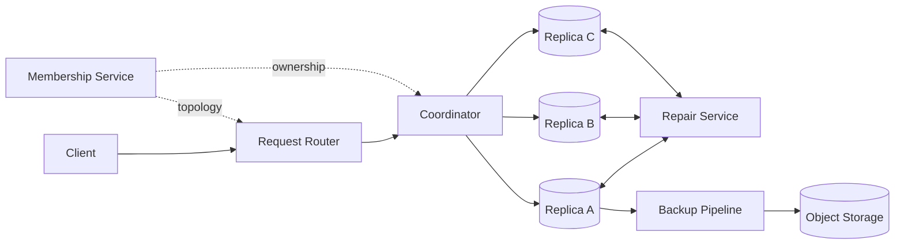
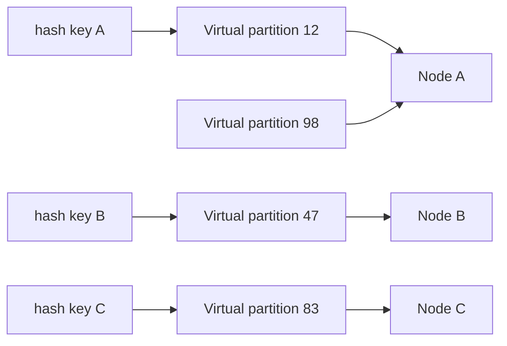
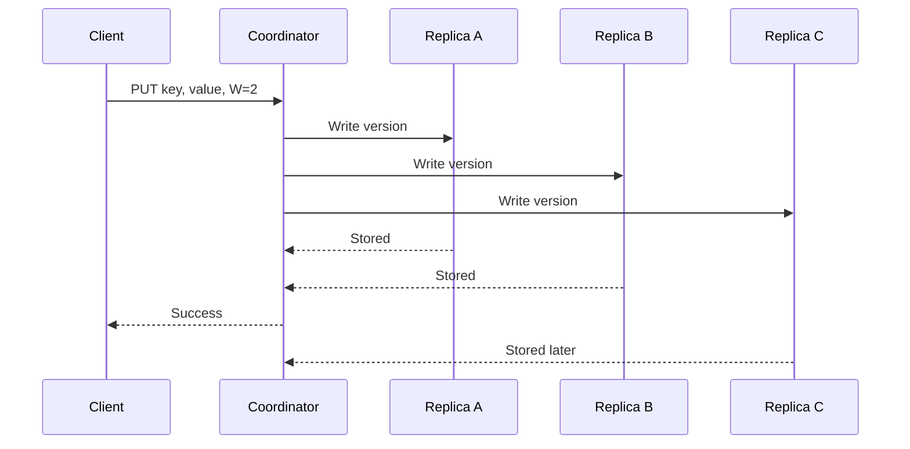
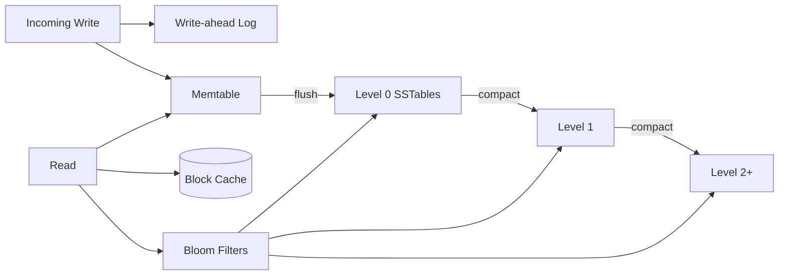
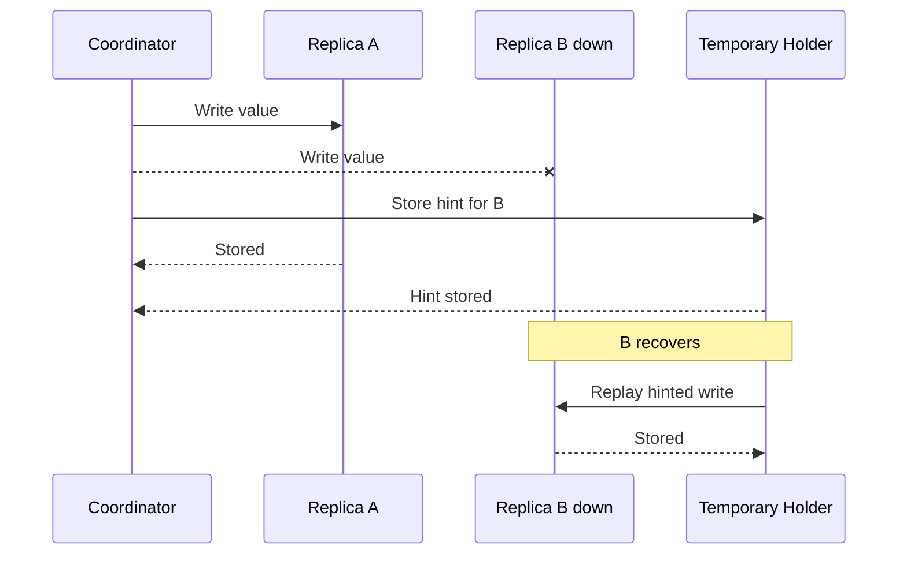

## Problem and requirements

A distributed key-value store maps opaque keys to values across a cluster of machines. It should scale capacity and throughput horizontally, remain available through failures, and make its consistency guarantees explicit.

### Functional requirements

- Put a value by key
- Get one value or a version set by key
- Delete a key
- Support conditional updates
- Apply per-item expiration
- Scan a bounded key range when the partitioning mode permits it

### Non-functional requirements

- Sustain 10 million operations per second
- Store 10 PB with horizontal growth
- Keep normal reads and writes under 20 milliseconds at the 99th percentile
- Survive node and availability-zone failures without data loss
- Support tunable consistency by workload
- Repair divergent replicas automatically
- Isolate tenants and bound noisy workloads

Joins, arbitrary secondary indexes, multi-key serializable transactions, and analytical queries are outside the core design. They can be layered on with additional coordination and cost.

## Capacity estimates

Assume a 2:1 read-to-write ratio, an average key of 40 bytes, and an average value of 1 KB.

| Resource | Average or peak |
| --- | ---: |
| Reads | 6.7M/second |
| Writes | 3.3M/second |
| Logical write bandwidth | ~3.4 GB/second |
| Stored logical data | 10 PB |
| Physical data with 3 replicas and 30% overhead | ~39 PB |

At 100 TB of usable capacity per storage node, capacity alone requires roughly 390 nodes. Throughput, compaction headroom, repairs, and failure tolerance push the fleet higher.

Workload skew matters more than averages. A single popular key can saturate one shard even when global capacity is mostly idle.

## API and semantics

The API carries consistency and conditional-write requirements explicitly.

```http
PUT /v1/items/customer-4821
If-Version: 184
Content-Type: application/octet-stream
X-Consistency: quorum
X-TTL-Seconds: 86400

<value bytes>
```

```json
{
  "key": "customer-4821",
  "version": 185,
  "storedAt": "2026-09-21T18:30:00Z"
}
```

A conditional update succeeds only when the current version matches. This supports optimistic concurrency without promising a transaction across unrelated keys.

Deletes write a tombstone rather than immediately removing data. Replicas that missed the delete must not resurrect an older value during repair.

The service enforces maximum key and value sizes. Large objects belong in blob storage, with the key-value store holding references and metadata.

## High-level architecture

Clients send operations to a stateless coordinator. The coordinator resolves partition ownership, contacts replicas, enforces the requested consistency level, and returns the result.



Any healthy node or a separate stateless tier can coordinate an operation. Coordinators cache topology but include ownership epochs so stale routing cannot silently write to retired replicas.

Storage nodes own many virtual partitions. Each partition has replicas on different failure domains.

## Partitioning

Hash partitioning distributes arbitrary keys evenly. Place the key hash on a logical ring and assign ranges to virtual partitions.



Virtual partitions make movement and balancing granular. A new node receives selected partitions from many existing nodes instead of splitting one neighbor’s entire range.

Hash partitioning destroys natural key order, so range scans become scatter-gather operations. If ordered range access is required, use range partitioning with split and merge logic, accepting the risk of hot sequential ranges.

The partition map is versioned and distributed through a strongly consistent metadata service. Clients or routers refresh when a node returns a newer topology epoch.

## Replication placement

With replication factor `N = 3`, assign each partition to three nodes in separate racks or availability zones. Placement must understand failure domains; three replicas on one power circuit are not resilient.

One model uses a leader per partition. All writes pass through the leader, simplifying ordering and conditional updates. Another uses leaderless coordination, letting any replica accept a version and reconciling conflicts later.

This design uses leaderless replication for ordinary puts and gets, plus a consensus-backed conditional path when strict compare-and-set semantics are requested. The two modes have different latency and availability and should be visible in the API contract.

Cross-region replicas may be asynchronous to avoid wide-area latency. Region loss can then lose the latest acknowledged local writes unless the client requested global quorum.

## Quorum reads and writes

For `N` replicas, wait for `W` write acknowledgements and query `R` replicas for reads. If `R + W > N`, the read and write quorums overlap in a failure-free model.

With `N = 3`, common options are:

| Consistency | Write acknowledgements | Read replicas | Behavior |
| --- | ---: | ---: | --- |
| Fast | 1 | 1 | Lowest latency, may read stale data |
| Read quorum | 1 | 2 | Fast writes, reconciled reads |
| Write quorum | 2 | 1 | Durable writes, potentially stale reads |
| Quorum | 2 | 2 | Stronger overlap, higher latency |



Quorum arithmetic alone does not guarantee linearizability under sloppy quorums, concurrent writes, clock errors, or changing membership. The product should describe guarantees precisely rather than reducing them to `R + W > N`.

## Versioning and conflict detection

Concurrent writes can reach different replicas during a partition. Last-write-wins based on wall-clock timestamps is simple but may silently discard a valid update when clocks skew.

Version vectors capture causal history. Each version records counters associated with replica or client identities. One vector dominates another when it includes all of its history. Neither dominates when writes are concurrent.

```text
Version A: { nodeA: 4, nodeB: 2 }
Version B: { nodeA: 3, nodeB: 3 }

Neither dominates: return both as siblings.
```

The application can merge siblings—for example, unioning a shopping cart—and write a new version that descends from both. For opaque values without merge semantics, expose the conflict or apply a documented deterministic policy.

Version-vector metadata can grow, so prune retired actors and use dotted version vectors or session-scoped identities.

Conditional writes that require one current value route through a partition leader or consensus group. They trade partition availability for unambiguous serialization.

## Write path on a storage node

A storage node appends every accepted mutation to a write-ahead log, updates an in-memory sorted table, and acknowledges according to durability policy.

When the memory table reaches a threshold, flush it as an immutable sorted-string table on disk. Background compaction merges tables, discards obsolete versions when safe, and reorganizes data for reads.



This log-structured merge design turns random writes into sequential appends. The trade-off is compaction work and read amplification across multiple tables.

Bloom filters avoid reading tables that definitely do not contain a key. Sparse indexes locate data blocks, and a block cache keeps hot values and indexes in memory.

## Compaction

Leveled compaction keeps later levels sorted and mostly non-overlapping, providing predictable reads at the cost of rewriting data several times. Size-tiered compaction writes less but leaves more overlapping tables for reads.

Throttle compaction so it does not consume all disk bandwidth. Falling behind increases read latency and disk usage, while over-aggressive compaction harms foreground writes.

Track write amplification, read amplification, and space amplification together. Optimizing one often worsens another.

Tombstones can be removed only after every relevant replica has had enough time to observe them. A garbage-collection grace period protects against resurrection but delays reclaimed space.

## Read path and read repair

The coordinator reads from `R` replicas, compares versions, and returns the newest causally dominant value or a sibling set.

If one replica is stale, the coordinator asynchronously sends it the selected version. This **read repair** fixes popular keys naturally.

Use hedged reads carefully: after a short delay, ask another replica and accept the first valid quorum. Hedges improve tail latency but increase load during incidents. Limit them with budgets and disable them when the cluster is already saturated.

Negative reads also need consistency. A missing response from one replica does not prove the key is absent if another replica may hold it or a tombstone.

## Hinted handoff

When a target replica is temporarily unavailable, another node may store the write as a **hint** on its behalf. The coordinator can still meet an availability-oriented write policy.



Hints are bounded by age and disk quota. They accelerate recovery but do not replace replica repair; a long outage or failed hint holder can still leave replicas divergent.

Sloppy quorums increase write availability by accepting substitutes outside the normal replica set, but they weaken the overlap assumptions behind quorum consistency.

## Anti-entropy repair

Background repair compares replicas even for keys no client reads. Building and transferring a full key list is expensive, so summarize partition ranges with Merkle trees.

Replicas compare root hashes. A mismatch leads them down only differing branches until they identify small key ranges to exchange.

Repairs are bandwidth-intensive. Schedule them continuously at controlled rates, prioritize partitions near tombstone garbage-collection deadlines, and pause when foreground latency rises.

Merkle trees need a stable view of data. Build them over immutable table sets or snapshot sequence numbers so ongoing writes do not make every comparison appear inconsistent.

## Membership and failure detection

The metadata service owns node identity, partition placement, and topology epochs. Data nodes gossip health hints for fast local awareness, while authoritative ownership changes require consensus.

Failure detectors use heartbeat history and suspicion thresholds. A slow node and a partitioned node look alike from one observer. Marking nodes dead too aggressively causes needless movement; waiting too long increases latency and unavailable replicas.

Temporary failure should trigger request rerouting and hints, not immediate data rebalancing. Move partitions only after a longer replacement threshold or explicit operator action.

A returning node cannot immediately serve stale data. It rejoins through repair, catches up required ranges, and receives the current ownership epoch before becoming eligible.

## Rebalancing

Adding or removing nodes moves virtual partitions. Copy data to the new owner while the old owner still serves requests, then switch ownership with a new epoch.

During migration:

1. Stream an initial snapshot to the destination.
2. Replicate writes that occur during the copy.
3. Verify checksums and catch up the tail.
4. Publish the new ownership epoch.
5. Keep the old copy briefly for rollback.
6. Delete it after the safety window.

Throttle movement by source, destination, rack, and cluster. Uncontrolled rebalancing after a failure can saturate the remaining nodes and turn one failure into a cluster-wide outage.

## Hot keys and hot partitions

Hashing balances many keys but cannot split one extremely popular key. Mitigations include:

- Client, coordinator, and replica caches for read-heavy keys
- Additional read replicas for selected partitions
- Request coalescing
- Sharded logical counters
- Application-level key salting for workloads that can merge results

Hot writes remain limited by the required serialization semantics. If one key must receive millions of strictly ordered updates per second, the data model—not the cluster size—is the bottleneck.

Monitor request and byte skew by key sample and virtual partition. Capacity-balanced partitions can still be throughput-imbalanced.

## Expiration and deletion

TTL metadata travels with every version. Expired data is treated as deleted during reads, while background compaction reclaims bytes later.

A delete writes a versioned tombstone and replicates it like any other mutation. Tombstones remain through a repair grace period and are removed only when older values can no longer reappear from missed replicas or backups restored into the live cluster.

Restoring an old backup without its later tombstones can resurrect data. Restore into isolation, replay newer mutation logs, and rejoin only after reconciliation.

## Multi-tenancy and quotas

Prefix internal keys with tenant identity even when external keys are opaque. Authorization checks tenant ownership at routing and storage layers.

Enforce quotas for operations per second, stored bytes, item count, key size, value size, partitions, scans, and concurrent requests. Admission control happens before coordinators fan out work to replicas.

Fair queues and per-tenant token buckets keep one workload from exhausting connection pools or compaction bandwidth. Large tenants may receive dedicated partitions or clusters while using the same API.

## Backup and disaster recovery

Replication protects availability, not accidental deletion or application corruption. Create incremental snapshots of immutable tables in object storage and retain mutation logs for point-in-time recovery.

Backups include topology-independent key ranges, schema and encryption metadata, checksums, and tombstones. Regularly restore sampled ranges and full test clusters.

For multi-region disaster recovery, stream mutations asynchronously to a secondary region. Define the recovery-point objective explicitly. Synchronous cross-region quorum prevents acknowledged loss but adds wide-area latency to every write.

Active-active regions accept lower latency but can create concurrent versions. The application must tolerate and resolve them, or individual key ranges need a single home region.

## Failure handling

**Replica failure:** coordinators use remaining replicas and optionally hinted handoff. Background repair catches up the replacement.

**Coordinator failure:** clients retry another stateless coordinator with the same operation token. Conditional operations use the original request ID for deduplication.

**Disk failure:** remove the replica from service, rebuild its partitions from peers, and rebalance gradually.

**Network partition:** consistency settings determine behavior. Availability-oriented writes create siblings; consensus-backed conditional writes may reject requests without quorum.

**Metadata-service outage:** data nodes continue serving the last known topology. Ownership changes and rebalancing pause.

**Availability-zone failure:** replicas in other zones continue serving. Restore replication factor before another failure.

**Region failure:** route to a replicated region under the chosen active-passive or active-active consistency model.

## Observability and operations

Track:

- Read and write latency by consistency level
- Timeout, unavailable, conflict, and conditional-failure rates
- Requests, bytes, and storage by virtual partition
- Replica lag, hinted-handoff backlog, and repair age
- Memtable size, flush latency, table count, and Bloom effectiveness
- Compaction backlog and read/write/space amplification
- Tombstone density and expiration lag
- Disk latency, free space, and checksum errors
- Topology version and migration progress

Run continuous consistency audits that compare sampled keys across replicas. Inject node, disk, rack, and network failures in controlled environments and verify client-visible guarantees.

Rolling upgrades preserve on-disk and wire compatibility. A mixed-version cluster may run for hours, so new features must remain disabled until every required node understands them.

## Security

Encrypt client and internode traffic. Encrypt storage with keys scoped by tenant or cluster policy, and rotate keys without rewriting the entire dataset at once.

Authenticate nodes before allowing them into gossip, replication, or repair protocols. A malicious node that joins the ring could receive arbitrary tenant ranges.

Audit administrative reads, topology changes, restores, and bulk scans. Avoid logging raw keys or values because identifiers may contain sensitive information.

Conditional writes and TTL do not replace authorization. Every operation verifies tenant, resource scope, and quota before fan-out.

## Trade-offs

**Leader-based vs. leaderless replication:** leaders simplify ordering and conditional updates. Leaderless replication improves write availability but exposes conflict resolution.

**Strong consistency vs. availability:** quorum consensus provides one current value but may reject operations during partitions. Versioned leaderless writes remain available and may return siblings.

**Hash vs. range partitioning:** hashing balances arbitrary keys and scales point lookups. Range partitioning supports ordered scans but is vulnerable to sequential hotspots.

**Leveled vs. size-tiered compaction:** leveled organization improves reads and space use but rewrites more bytes. Size-tiered organization favors writes at the cost of read amplification.

**Synchronous vs. asynchronous cross-region replication:** synchronous replication minimizes data loss but adds WAN latency. Asynchronous replication preserves local performance with a nonzero recovery-point window.

**Tunable consistency vs. simplicity:** per-request options fit diverse workloads but make application behavior harder to reason about. Opinionated defaults and clear metrics are essential.

The central design partitions keys into replicated ownership ranges and makes failure behavior explicit. Replicas will diverge; correctness comes from versioning, quorum policy, fencing, repair, and a contract that tells applications when they may observe more than one truth.
