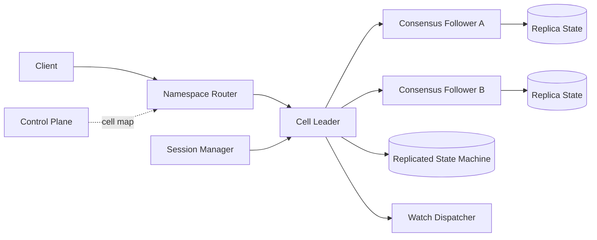
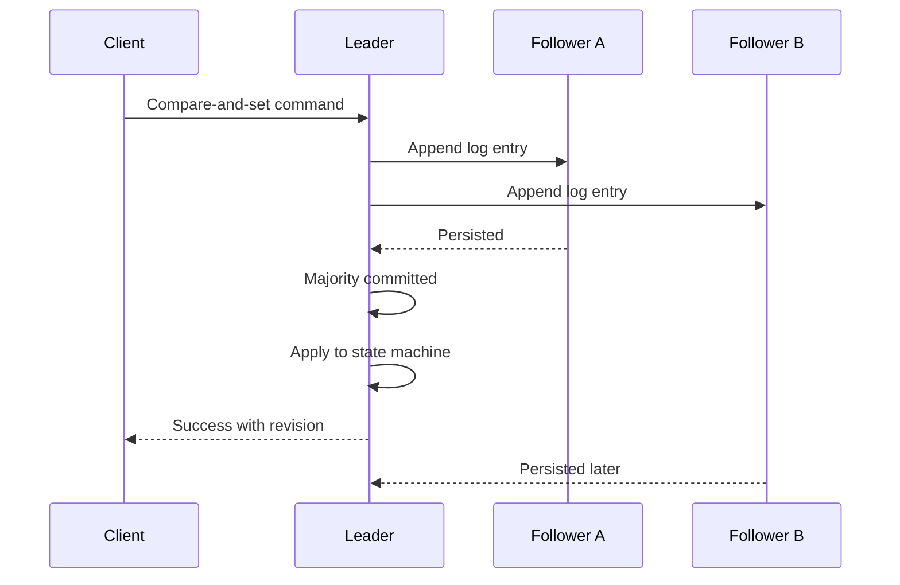
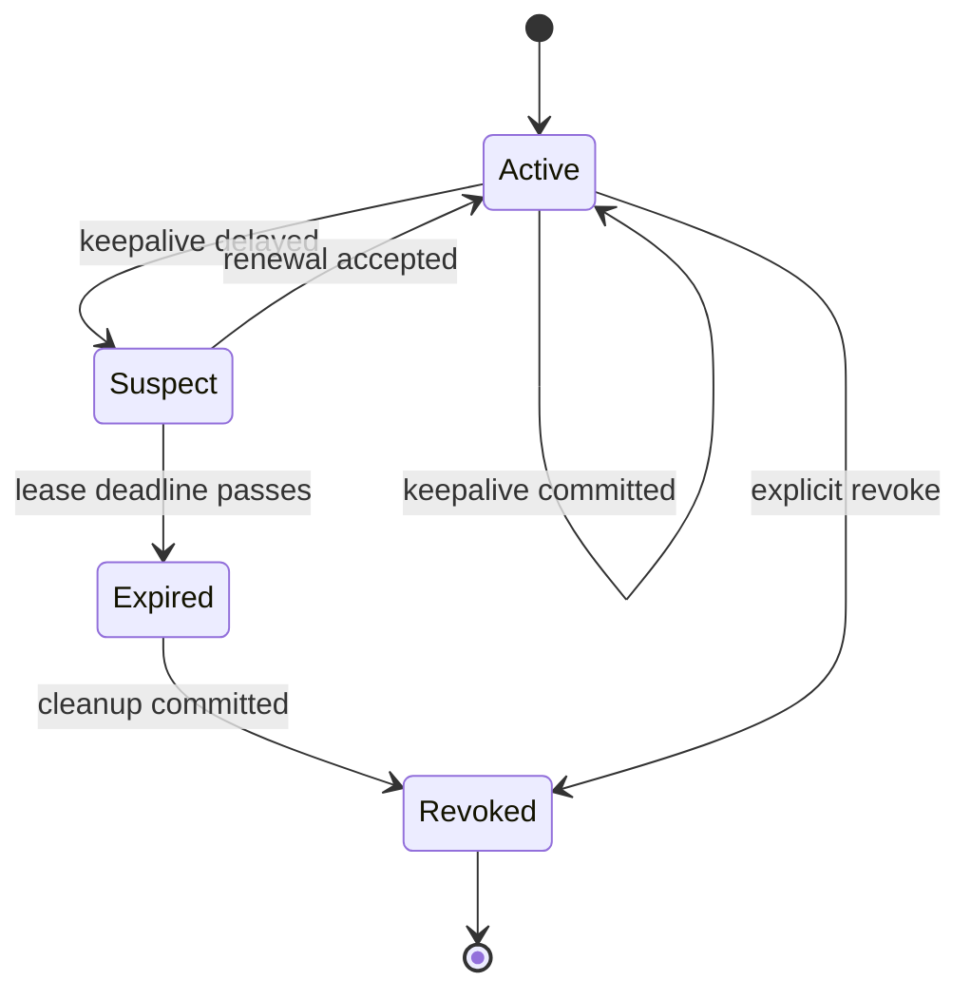
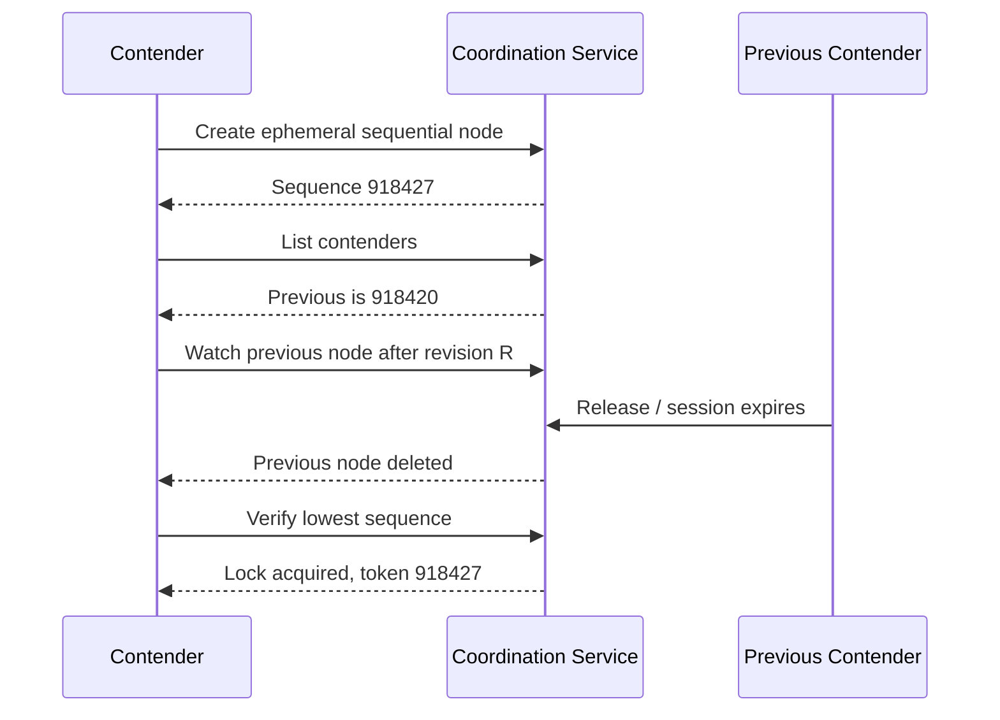
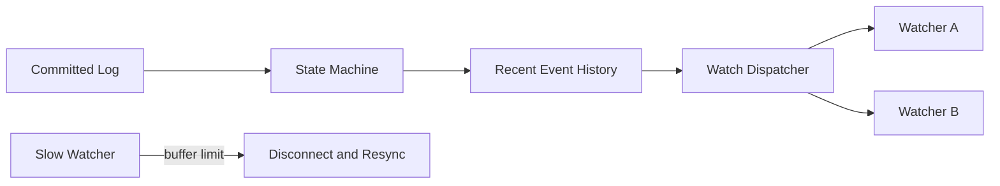

## Problem and requirements

Distributed systems often need one process to own a responsibility at a time: lead a shard, run a scheduled task, modify a resource, or publish one configuration. A coordination service provides a small strongly consistent namespace for locks, leases, membership, leader election, and change notification.

The hard problem is not returning “lock acquired.” It is ensuring a process that pauses, loses its lease, or becomes partitioned cannot continue acting as the owner indefinitely.

### Functional requirements

- Create, read, update, and delete small coordination records
- Acquire and release named locks
- Attach ephemeral records to renewable sessions
- Return monotonically increasing fencing tokens
- Watch keys or prefixes for changes
- Support leader election and service membership
- Perform atomic compare-and-set and small transactions

### Non-functional requirements

- Provide linearizable writes and reads when requested
- Never grant two valid owners the same lock epoch
- Survive minority node and availability-zone failures
- Notify clients of session loss promptly
- Keep watch streams ordered and recoverable
- Bound load from sessions, watches, and hot keys

The service is not a general database, queue, cache, or blob store. Values remain small and workloads remain coordination-focused.

## Capacity estimates

Assume one million active sessions, 100,000 operations per second at peak, 10 million keys, and values capped at 1 MB with a much smaller normal size.

| Resource | Estimate |
| --- | ---: |
| Active sessions | 1M |
| Peak reads and writes | 100K/second |
| Heartbeats at 10-second interval | 100K/second |
| Active watches | 2M |
| Normal value size | Under 10 KB |

Heartbeat and watch traffic can dominate business operations. Clients should multiplex many locks and watches over one session and connection rather than opening one for each resource.

Consensus throughput is limited by leader CPU, durable log latency, and replication bandwidth. Horizontal scale comes from independent coordination cells or shards, not from adding unlimited followers to one consensus group.

## API and semantics

The underlying API exposes versioned keys and transactions.

```http
PUT /v1/kv/locks/report-42
If-Version: 0
Lease-ID: lease_81

worker-17
```

```json
{
  "created": true,
  "version": 1,
  "revision": 918420,
  "fencingToken": 918420
}
```

`If-Version: 0` means create only when the key does not exist. A successful mutation receives a cluster revision that is strictly increasing within its coordination cell.

A transaction evaluates comparisons and applies a short list of mutations atomically:

```text
IF version(/locks/report-42) == 0
THEN put(/locks/report-42, worker-17, lease_81)
ELSE get(/locks/report-42)
```

Transactions are intentionally bounded by operation count, value size, and execution time. Arbitrary user code cannot run inside consensus.

## High-level architecture

Each coordination cell is a small consensus group, typically three or five nodes across failure zones. Clients reach a router that resolves the namespace to a cell and forwards writes to its leader.



The replicated log is the source of truth. Every committed command applies deterministically to each node’s state machine. Watch events derive from committed revisions, never from speculative writes.

The control plane assigns namespaces to cells and manages placement. It is not involved in ordinary operations after routers cache the cell map.

## Consensus and linearizability

A Raft-like consensus protocol elects one leader per cell. The leader appends commands to its log, replicates them to followers, and commits after a majority acknowledges.



Only committed entries affect client-visible state. A former leader in a network minority cannot commit new operations because it lacks a quorum.

Linearizable reads may go through the leader after it confirms current leadership with a quorum or uses a valid lease under strict clock assumptions. Serializable follower reads are faster and more scalable but may be stale; the API labels them explicitly.

The system exposes a revision so clients can require reads at or after a known committed state.

## Sessions and leases

A session represents one client process and has a renewable lease. Ephemeral keys attached to that lease are automatically deleted after expiration.

Clients send keepalives over a long-lived stream. The service returns remaining TTL and latest revision. One stream can renew many leases, but most applications need one process-level session.



Lease expiration is a replicated state-machine decision, not one node’s local timer deleting data independently. The leader proposes expired leases, and the quorum commits their revocation.

TTL is approximate. Network delay, leader changes, and scheduling can make expiration occur later than the nominal deadline. Clients must stop acting when they cannot confirm renewal; they cannot assume the server has already deleted their keys.

## Lock acquisition

A basic exclusive lock creates one ephemeral key only if absent. The value records owner identity and diagnostic metadata, while the lease controls cleanup.

For fair ordering, contenders create ephemeral sequential entries under a lock prefix:

```text
/locks/database-migration/000000918420  worker-17
/locks/database-migration/000000918427  worker-32
/locks/database-migration/000000918431  worker-08
```

The contender with the lowest sequence owns the lock. Each waiter watches only its immediate predecessor rather than watching the lock root, preventing a herd wake-up when ownership changes.



The “watch after revision” operation must atomically establish the watch relative to a prior read. Otherwise deletion can occur between listing and watching, leaving the waiter asleep forever.

## Why leases are not enough

Suppose worker A acquires a lock, pauses for a long garbage-collection cycle, and loses its lease. Worker B acquires the lock and begins work. When A resumes, it may still believe it owns the lock and write to an external database.

No lease service can force a paused process to forget. The protected resource must reject stale owners using a **fencing token**.

Every successful acquisition returns a monotonically increasing token. The resource stores the highest token it has accepted and rejects lower ones.

```text
Worker A acquires token 41 → resource accepts token 41
Worker A pauses and lease expires
Worker B acquires token 42 → resource accepts token 42
Worker A resumes with token 41 → resource rejects stale write
```

If the downstream system cannot validate fencing tokens or an equivalent version, the distributed lock cannot guarantee exclusive effects. This limitation must be explicit in client libraries and documentation.

## Leader election

Leader election is a lock where contenders campaign with an identity and lease. The winner publishes its term and endpoint. Followers watch the election prefix and observe ordered leadership changes.

Leadership callbacks include the fencing term. Applications pass that term to the resource they coordinate or include it in durable state transitions.

A leader voluntarily resigns by deleting its campaign key. On disconnection, it stops serving leader-only work immediately, even before the server confirms lease expiration.

Applications should expect leadership to change and make initialization idempotent. Election does not mean the same process stays leader until shutdown.

## Service discovery and membership

Services register ephemeral endpoints under a prefix:

```text
/services/payments/instances/instance-17
```

Consumers list the prefix at revision `R`, then watch changes after `R`. They maintain a local endpoint set and keep serving the last known set during brief watch interruptions.

Membership values contain small routing metadata, not health histories or large configuration blobs. Health should reflect the process’s ability to serve, while load and latency belong in a separate telemetry path.

A disconnected process removes itself from client-side load balancing by stopping lease renewal. Graceful shutdown explicitly revokes registration before closing listeners.

## Watches

A watch streams ordered changes after a requested revision. Events include create, update, delete, revision, and optional previous value.

The service keeps a bounded recent event history. A client that falls behind beyond compaction receives a compacted error, takes a fresh snapshot, and resumes from the new revision.



Each watcher has a bounded outbound buffer. A slow consumer is disconnected rather than allowed to exhaust server memory or delay other watchers.

Filters by prefix and event type reduce bandwidth, but broad watches still need quotas. One client watching the entire namespace can receive every mutation.

## Storage engine

The consensus log provides ordered durability. The state machine stores current keys in an embedded ordered key-value engine and writes revisioned history for watch recovery and historical reads.

Periodic snapshots capture the state machine at a committed log index. New or recovering followers load the snapshot and replay later log entries instead of processing the full history.

Compaction removes historical revisions older than the retention window after ensuring snapshots cover them. Current values remain.

Large values increase log replication, snapshot time, memory pressure, and failover recovery. Enforce strict size limits and store large configuration or artifacts elsewhere with a coordination record containing a versioned reference.

## Read and transaction semantics

The service supports:

- **Linearizable read:** reflects every write completed before the read began
- **Serializable read:** comes from any replica and may be stale
- **Revision read:** returns state at a retained committed revision
- **Compare-and-set:** applies one mutation if version, value, lease, or revision predicates match
- **Bounded transaction:** atomically evaluates comparisons and applies small mutations

Multi-key transactions work only within one coordination cell. Cross-cell atomicity is deliberately absent because distributed transactions would tie unrelated failure domains together.

Clients should use one transaction to check ownership and update coordination metadata rather than performing a read followed by a write.

## Sharding and cells

One consensus group cannot scale indefinitely because every write passes through one leader and every replica stores the full state.

Partition namespaces into independent cells by tenant, service, or a stable namespace prefix. Each cell has its own quorum, log, revision domain, and failure boundary.

Routing metadata maps a namespace to one cell. Moving a namespace requires snapshot transfer, change catch-up, a write pause or dual-write protocol, and an atomic routing epoch change.

Locks and transactions cannot span cells. Place resources that must coordinate together in the same cell, and keep cells small enough for predictable snapshots and failover.

A large tenant may receive a dedicated cell. Small tenants share cells with quotas and fair scheduling.

## Client behavior

Correct client libraries are part of the system.

They should:

- Discover and cache cell endpoints
- Follow leader redirects
- Retry idempotent requests with stable request IDs
- Track session state and lease acknowledgements
- Stop owner-only work on uncertain connectivity
- Reestablish watches from the last revision
- Surface fencing tokens to protected-resource calls
- Apply bounded exponential backoff with jitter

A timeout is ambiguous: the operation may have committed before the response was lost. Mutation requests carry unique IDs, and the service caches or records recent results so retries return the original outcome.

Client callbacks should not run on the network event loop. A slow application callback must not block keepalives or watch acknowledgements.

## Failure handling

**Follower failure:** the quorum continues. Replace and catch up the follower from snapshot and log.

**Leader failure:** followers elect a new leader after the election timeout. Writes pause briefly; committed state remains intact.

**Minority network partition:** minority nodes cannot commit writes. They redirect or reject linearizable operations.

**Client partition:** the client stops acting as owner when it cannot renew. The server eventually expires the lease and elects another owner.

**Slow disk:** quorum latency rises. Remove persistently slow members carefully; repeated membership changes can destabilize the group.

**Watch dispatcher failure:** clients reconnect from their last received revision. The committed log preserves missed events within retention.

**Cell outage:** resources coordinated by that cell may become unavailable. Do not fail over to an independent writable cell without transferring consensus ownership and fencing epoch.

**Control-plane outage:** existing routing and cells continue. Namespace creation and movement pause.

## Membership changes

Consensus-group membership changes use joint consensus or an equivalent safe transition so old and new quorums overlap. Never replace several members independently with ad hoc configuration edits.

Add a new node as a learner, transfer a snapshot, catch it up, then promote it. Remove an old voter only after the new member is healthy.

Automated replacement is conservative. A temporary network problem should not trigger rapid quorum reconfiguration, which can reduce safety and overload healthy nodes with snapshots.

Spread voters across failure zones and independent infrastructure. Five replicas tolerate two failures but cost more write latency and storage than three; most cells use three unless the failure model requires more.

## Backpressure and overload

The coordination service protects itself before latency makes leases expire unnecessarily.

Apply quotas to:

- Operations per second by tenant and namespace
- Concurrent requests and streams
- Active sessions and leases
- Watches and buffered watch bytes
- Keys, value bytes, and transaction size
- Historical revisions and event rate

Prioritize lease renewals, quorum health, and small reads over expensive list operations. Reject oversized work early.

Session storms after a network recovery can overwhelm the leader. Clients reconnect with jitter, and the service may issue staggered retry guidance.

Do not allow users to create extremely short lease TTLs that turn minor latency into mass election churn.

## Observability and operations

Track:

- Consensus term, leader changes, commit index, and apply lag
- Proposal and linearizable-read latency
- Quorum member health and durable-log latency
- Session count, renewal latency, and expiration rate
- Lock wait time and contention
- Watch count, event lag, disconnects, and compaction resets
- Database size, log growth, and snapshot duration
- Request rejections and quota use by tenant
- Stale fencing-token rejections in integrated resources

Synthetic clients continuously acquire locks, validate fencing, campaign for leadership, lose connectivity, resume watches, and verify that stale owners are rejected.

Back up state-machine snapshots and encryption metadata, but restoration creates a new cluster identity and fencing epoch. Never restore an old snapshot directly into a live quorum as if time moved backward.

## Security

Mutual TLS authenticates clients and nodes. Authorization policies constrain key prefixes and operations. A service may read its configuration prefix without gaining access to another tenant’s locks.

Encrypt logs, snapshots, and backups. Values may contain endpoints and credentials even though the service discourages secrets; integrate with a dedicated secrets manager rather than treating coordination storage as one.

Audit lock administration, forced lease revocation, membership changes, snapshot restoration, and policy updates.

Validate node identity before allowing replication. An unauthorized node joining a quorum would receive the full coordination state.

## Trade-offs

**Consensus vs. availability:** linearizable coordination requires a quorum and becomes unavailable in a minority partition. Returning success from both sides would break exclusive ownership.

**Lease duration:** short leases recover quickly but are sensitive to pauses and latency. Long leases reduce churn but delay failover.

**Fair sequential locks vs. simple compare-and-set:** queued locks reduce starvation but create more keys, watches, and cleanup work.

**One global cluster vs. cells:** one cluster supports cross-namespace transactions but has a large blast radius and leader bottleneck. Cells scale and isolate failures while forbidding cross-cell coordination.

**Watch history vs. storage:** longer retention lets disconnected clients resume without snapshots but increases disk and compaction cost.

**Follower reads vs. freshness:** follower reads scale and reduce latency but cannot safely drive ownership decisions unless the application accepts staleness.

**Locks vs. idempotent design:** locks serialize access but do not prevent a paused stale process from acting. Fencing and idempotent downstream operations are the actual safety boundary.

The central design is a small replicated state machine with explicit sessions and monotonically increasing ownership epochs. Consensus decides who owns a lock; fencing makes that decision enforceable after processes pause, partitions heal, and leadership changes.
