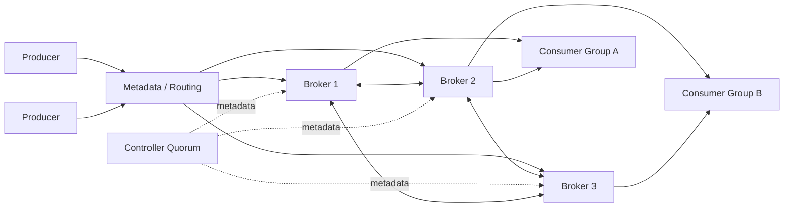
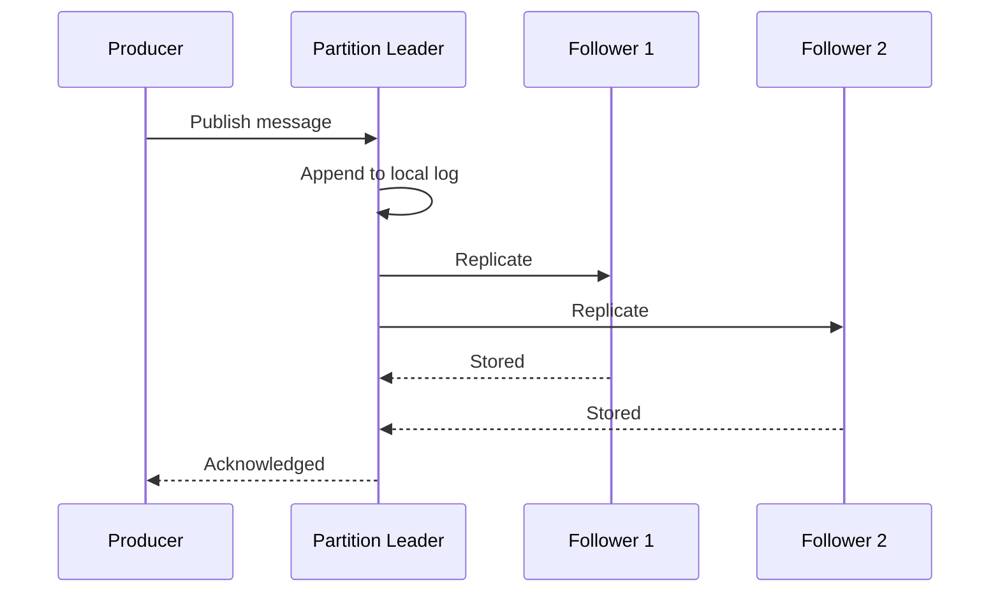
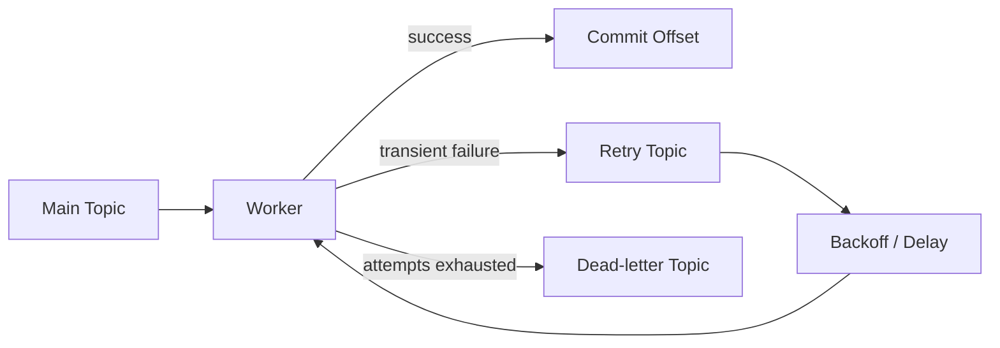

## Problem and requirements

A message queue lets producers publish work without waiting for consumers to process it. It absorbs traffic spikes, isolates failures, and allows independent services to evolve at different speeds.

### Functional requirements

- Producers can publish messages to a named topic
- Consumers can read messages independently through consumer groups
- Messages remain durable for a configurable retention period
- Ordering is preserved within a partition
- Consumers can retry failed work without blocking healthy messages forever
- Producers and consumers can inspect delivery progress

### Non-functional requirements

- Acknowledged messages must survive machine and availability-zone failures
- Publishing and consumption should normally complete within 100 milliseconds
- Throughput must scale horizontally by adding partitions and brokers
- The system should provide at-least-once delivery by default
- Backlogs must not affect producers or unrelated consumer groups

Global ordering and exactly-once side effects are deliberately excluded. Both are possible only with significant coordination and constraints.

## Capacity estimates

Assume **1 billion messages per day**, an average payload of **1 KB**, and seven days of retention. Traffic may peak at five times the daily average.

| Resource | Average | Peak or retained |
| --- | ---: | ---: |
| Published messages | 11,600/second | 58,000/second |
| Ingress bandwidth | 11.6 MB/second | 58 MB/second |
| Raw retained data | 7 TB | Before replication and indexes |
| Storage with 3 replicas | 21 TB | Excludes protocol overhead |

Sequential disk writes can sustain high throughput, but replication and consumer egress multiply network demand. Capacity planning should use peak ingress plus the maximum expected replay traffic.

## API and core concepts

A **topic** is a logical stream. Each topic contains ordered **partitions**. A producer chooses a partition, and the broker appends the message at the next offset.

```http
POST /v1/topics/orders/messages
Idempotency-Key: 8d91d3c4
Content-Type: application/json

{
  "key": "customer-4821",
  "payload": { "orderId": "ord_92", "status": "created" }
}
```

```json
{
  "topic": "orders",
  "partition": 7,
  "offset": 18420391
}
```

Consumers fetch from an assigned partition starting at an offset. They commit a newer offset only after processing succeeds. A consumer group behaves like one logical subscriber: each partition is assigned to at most one active member of that group.

## High-level architecture

The control plane manages topics, partition assignments, membership, and broker health. The data plane handles message writes and reads. Keeping them separate prevents metadata operations from sitting on the high-volume message path.



Clients cache topic metadata and send requests directly to the broker leading the target partition. This avoids routing every message through a central proxy.

## Partitioning and ordering

Partitions are the unit of ordering and parallelism. A topic with 24 partitions can be processed by at most 24 consumers in one consumer group at the same time.

If a message has a key, the producer hashes that key to select a partition. Events for the same customer or order therefore maintain relative order. Messages without a key can use round-robin or load-aware partition selection.

Adding partitions increases future write capacity but does not automatically redistribute old data. It may also change the result of `hash(key) % partitionCount`, breaking key affinity. Consistent hashing or a stable key-to-partition mapping avoids sudden reshuffling.

Global ordering would require every message to pass through one partition, which creates a throughput ceiling and a single leader bottleneck. Most systems should define the narrowest ordering boundary the product actually needs.

## Storage model

Each partition is an append-only log split into immutable segment files. A broker writes new messages sequentially to the active segment and periodically rolls to a new one.

```text
partition-07/
  00000000000000000000.log
  00000000000000000000.index
  00000000000100000000.log
  00000000000100000000.index
```

The sparse offset index maps selected logical offsets to byte positions. To read an unindexed offset, the broker seeks to the nearest earlier index entry and scans forward. Sequential access and the operating system page cache make this efficient without maintaining one index entry per message.

Retention removes complete segments after their time or size limit. Compacted topics instead retain the latest value for each key, which is useful for rebuilding current state.

## Replication and acknowledgements

Every partition has one leader and multiple followers on different brokers and availability zones. Producers write to the leader. Followers continuously copy its log.



An acknowledgement policy determines durability and latency:

- **Leader only:** lowest latency, but a leader failure can lose acknowledged messages
- **Quorum:** acknowledge after a majority stores the message; a strong general default
- **All in-sync replicas:** strongest durability, but one slow replica can increase latency

The controller elects a new leader from in-sync replicas when the current leader fails. Electing an out-of-date replica restores availability faster but risks data loss, so unclean elections should be disabled for important topics.

## Delivery semantics

**At-most-once** delivery commits the offset before processing. A crash can lose work, but messages are never retried.

**At-least-once** delivery commits after processing. A crash between the side effect and the commit causes a duplicate. This is the practical default because consumers can make processing idempotent.

**Exactly-once** processing requires the message read, side effect, and offset update to commit atomically. The queue can offer transactions for writes back into the same system, but it cannot guarantee exactly-once effects in an unrelated database or external API without cooperation from that system.

Consumers should use an event ID as an idempotency key and record completed work with a unique constraint. “Effectively once” is often a more honest goal than exactly once.

## Consumer groups and rebalancing

The group coordinator tracks membership and committed offsets. When a consumer joins, leaves, or stops sending heartbeats, the coordinator reassigns partitions.

A stop-the-world rebalance pauses every member and is simple but disruptive. Incremental cooperative rebalancing moves only affected partitions and allows the rest of the group to continue processing.

Consumers need enough time to finish long-running tasks before they are considered dead. Heartbeat timeouts and processing timeouts should be configured separately so one slow message does not unnecessarily trigger a rebalance.

## Retries and dead letters

Immediate retries can block a partition behind one failing message. Instead, the consumer publishes failed work to a retry topic with an attempt count and a future eligibility time.



Exponential backoff with jitter prevents retry storms. A dead-letter topic retains the original payload, error, attempt history, and source offset so operators can investigate and replay safely.

Retries relax ordering because later messages may complete before the failed one. If strict per-key ordering matters, route each key through a serial worker or pause only that key rather than the entire partition.

## Backpressure and slow consumers

The queue protects producers from short consumer outages by retaining a backlog. It does not provide infinite buffering. Monitor **consumer lag**—the distance between the newest partition offset and the group’s committed offset.

When lag grows:

- Add consumers up to the number of partitions
- Increase batch size if processing is efficient in groups
- Reduce per-message work or move expensive calls off the hot path
- Add partitions when the current partition count limits parallelism
- Apply producer quotas before storage capacity is exhausted

Each tenant and producer should have byte-rate and request-rate quotas. Without isolation, one noisy producer can fill disks or saturate broker network links for every topic.

## Failure handling

**Broker failure:** the controller elects new leaders for affected partitions. Clients refresh metadata and reconnect.

**Network partition:** only the controller quorum side may make metadata changes. Partition leaders without enough in-sync replicas reject writes when durability requirements cannot be met.

**Disk failure:** replicas on other brokers continue serving. Replace the broker and copy partitions back gradually to avoid saturating the cluster.

**Consumer failure:** heartbeat expiration triggers partition reassignment. The replacement resumes from the last committed offset and may repeat uncommitted work.

**Region failure:** replicate selected topics asynchronously to another region. Automatic failover improves availability but can lose the replication tail. Synchronous cross-region writes reduce loss at the cost of WAN latency.

## Observability and operations

The most useful signals are publish latency, fetch latency, rejected requests, under-replicated partitions, unavailable leaders, disk utilization, replication lag, and consumer lag by group.

Operational safeguards include:

- Rejecting new partitions before brokers run critically low on disk
- Rebalancing leaders evenly after failures
- Throttling replica recovery so client traffic remains healthy
- Alerting on lag growth rate, not only absolute lag
- Regularly testing broker, zone, and controller failures

## Trade-offs

**Push vs. pull:** pull gives consumers control over batching and backpressure. Push can reduce latency but makes slow-consumer handling harder.

**More partitions vs. less coordination:** partitions increase throughput and consumer parallelism, but also increase metadata, open files, leader elections, and rebalance cost.

**Retention vs. deletion on acknowledgement:** retention allows replay and multiple independent consumer groups. Queue-style deletion saves storage but couples the data lifecycle to one consumer.

**Availability vs. durability:** accepting writes with too few replicas keeps the system available but risks acknowledged data. Critical topics should reject writes rather than silently weaken their guarantee.

The core design is an append-only partitioned log with replicated leaders. Everything else—consumer groups, retries, replay, and delivery guarantees—builds on the decision to make offsets explicit and consumers responsible for their own progress.
