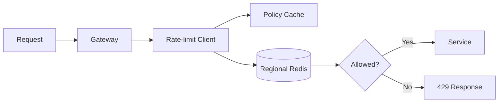

## Requirements

The limiter evaluates a policy for each request and returns a decision in a few milliseconds. Limits may apply per user, API key, route, or tenant.

- Low-latency decisions
- Consistent limits across instances
- Configurable windows and quotas
- Safe behavior during dependency failures

## Algorithm

A token bucket supports bursts while enforcing a stable average rate. Each key stores its current tokens and last refill timestamp. An atomic script updates both values in one operation.

## Architecture

Application servers call a local rate-limit client. The client evaluates cached policies and executes an atomic operation in a regional Redis cluster. Configuration changes arrive through a pub/sub channel.

## Failure strategy

Choose fail-open for low-risk endpoints and fail-closed for expensive or security-sensitive operations. A small local emergency bucket prevents unlimited traffic when the shared store is unavailable.
