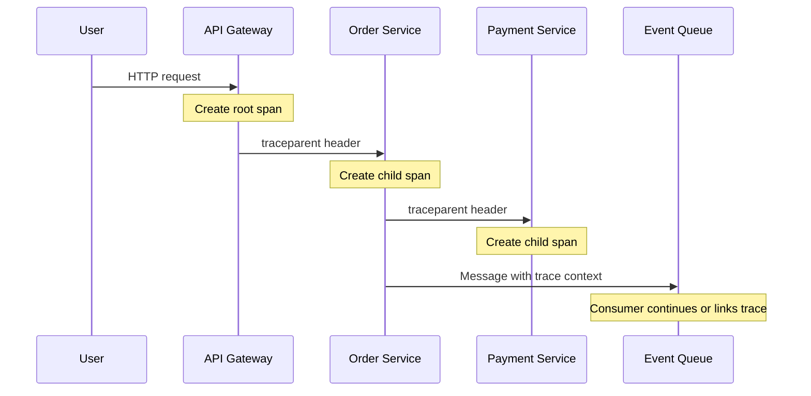
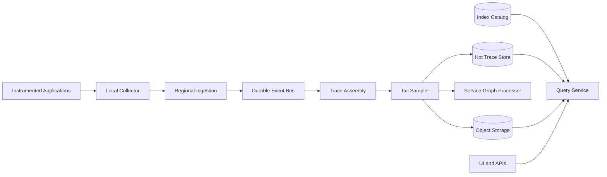
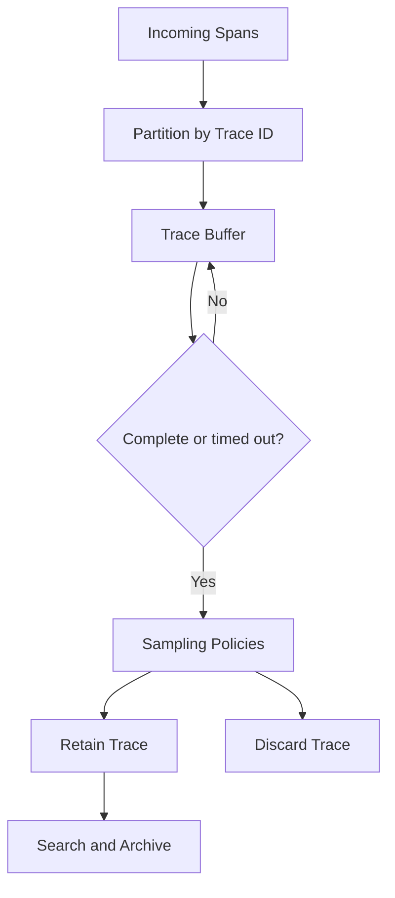
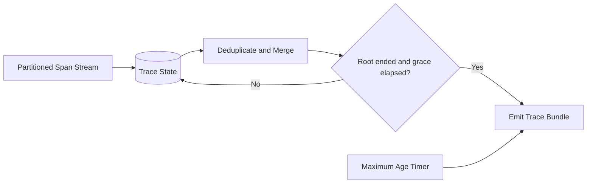
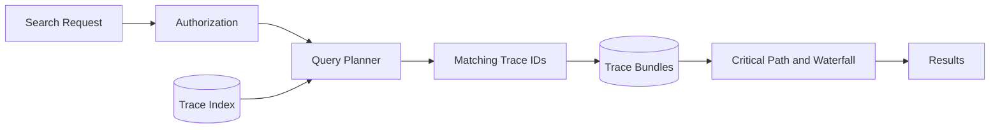
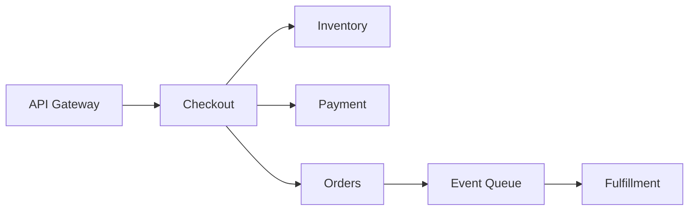

## Problem and requirements

A distributed trace follows one request as it crosses services, queues, databases, and external APIs. Each unit of work emits a span containing timing, relationships, status, and selected attributes. Together, those spans explain where time was spent and where a request failed.

The system must handle enormous write volume without adding meaningful latency to production requests. It must also preserve the rare slow or failed traces engineers care about, even though keeping every span is prohibitively expensive.

### Functional requirements

- Create and propagate trace context across services and asynchronous work
- Accept spans from many languages and runtimes
- Reconstruct complete or partial traces
- Search by service, operation, duration, status, and selected attributes
- Visualize critical paths and service dependencies
- Retain important traces longer than routine traffic
- Support exemplars linking metrics to traces and traces to logs
- Enforce tenant, retention, and sensitive-data policies

### Non-functional requirements

- Ingest up to 50 million spans per second
- Add negligible overhead to application requests
- Make recent sampled traces searchable within seconds
- Continue application operation when tracing is unavailable
- Bound CPU, memory, bandwidth, and storage consumption
- Tolerate duplicate, late, missing, and out-of-order spans
- Isolate tenants and expensive queries
- Provide deterministic sampling decisions across services

Tracing is an observability aid, never part of business correctness. Application behavior must not depend on successfully exporting a span.

## Capacity estimates

Assume 10 billion requests per day, an average of 20 spans per trace, and a peak of 50 million spans per second before sampling.

| Resource | Estimate |
| --- | ---: |
| Raw spans | 200B/day |
| Average encoded span | 500–1,500 bytes |
| Unsampled raw volume | 100+ TB/day |
| Normal retained traces | 1–10% head sample |
| High-value traces | Errors, slow requests, rare routes |
| Hot search retention | 3–14 days |

Even compact spans create large storage and network bills. Sampling is a primary architectural concern rather than a later optimization.

## Trace and span model

A trace is a directed acyclic graph of spans. A span contains:

- Trace ID and span ID
- Parent span ID or links to related spans
- Service and operation name
- Start time and duration
- Status and error information
- Typed attributes
- Timestamped events
- Resource metadata such as region and deployment
- Sampling state

```json
{
  "traceId": "7b3f...91a2",
  "spanId": "2e18...60bf",
  "parentSpanId": "9c42...741d",
  "service": "checkout",
  "operation": "POST /orders",
  "startTime": "2026-10-04T15:21:08.142Z",
  "durationMs": 184,
  "status": "error",
  "attributes": {
    "http.route": "/orders",
    "deployment.version": "2026.10.4"
  }
}
```

Trace and span IDs are globally unique random values. They contain no user, host, or tenant information.

Span schemas follow semantic conventions so different libraries use the same names and types for common concepts. Stable names make cross-service queries and dashboards reliable.

## Context propagation

The caller injects trace context into an outbound request. The receiver extracts it, creates a child span, and propagates the context further.



Use a documented vendor-neutral propagation format. Context includes trace ID, parent span ID, sampling decision, and bounded vendor state.

Treat incoming context as untrusted. Validate lengths and formats, limit baggage, and replace invalid identifiers. Never allow arbitrary baggage to become indexed attributes automatically.

For asynchronous fan-out, span links may represent causality better than a single parent. A batch consumer can link to several producing traces instead of inventing one misleading tree.

## Instrumentation SDK

SDKs provide automatic instrumentation for common frameworks and manual APIs for business-specific spans.

The SDK:

- Creates spans using a monotonic clock for duration
- Maintains context across threads and asynchronous tasks
- Applies an early sampling decision
- Buffers completed spans in memory
- Batches and compresses exports
- Drops data under bounded-memory pressure
- Exposes counters for dropped spans and exporter failures

Instrumentation runs inside production processes, so failure isolation is essential. Export uses non-blocking queues and short timeouts. When buffers fill, spans are dropped according to policy; application threads are not blocked.

Library versions and instrumentation scope travel with spans. This helps identify a faulty agent or semantic change.

## High-level architecture

Local collectors receive spans from application SDKs. Regional gateways validate and durably buffer them before multiple processing paths assemble, sample, store, and analyze traces.



Collectors keep vendor credentials and routing logic out of applications. They can enrich spans with trusted infrastructure metadata, batch exports from many processes, and apply local policy.

## Head sampling

Head sampling decides whether to record a trace near its start. The decision is propagated so every service makes the same choice.

A deterministic probability sampler hashes the trace ID into a fixed range. A 1% policy retains the same trace across all services without coordination.

Rule-based head sampling can retain more traffic for important entry routes, customer tiers, or synthetic checks. Rules use only information available at trace start, so they cannot know whether the request will later fail or become slow.

Head sampling saves application CPU, export bandwidth, and collector work. Its weakness is missing unexpected rare failures. Tail sampling complements it when the infrastructure budget permits.

## Tail sampling

Tail sampling waits until enough spans have arrived to evaluate the completed trace. It can retain:

- All errors
- Requests above a latency threshold
- Rare service or operation combinations
- Traces matching an incident rule
- A probabilistic sample of normal traffic



Route every span for a trace to the same assembler partition. Hold trace state until the root span ends plus a grace period, or until a maximum age and size is reached.

Tail sampling is expensive because collectors must receive and buffer spans that may later be discarded. Use head sampling before tail sampling for extremely high-volume sources, or run tail policies at regional collectors to reduce backbone traffic.

Sampling metadata records the policy and effective probability. Statistical dashboards need this information to estimate unbiased rates.

## Adaptive sampling

Static probabilities over-sample high-volume endpoints and under-sample rare ones. Adaptive sampling assigns budgets by service, operation, status, or other bounded dimensions.

Each policy targets a trace rate rather than a fixed percentage. A common route might keep 0.1%, while a rare route keeps 100%. Controllers update probabilities gradually to avoid oscillation.

Always place global and tenant budgets around adaptive rules. An error storm must not retain every trace and overload the system precisely during an incident.

Priority order may be: security diagnostics, errors, high latency, rare operations, exemplars, then baseline samples. When capacity is constrained, lower priorities shed first.

## Ingestion and validation

Gateways authenticate collectors, derive tenant identity, validate payload size and schema, and append accepted batches to a durable regional stream.

The gateway enforces:

- Per-tenant event and byte quotas
- Maximum spans per batch and trace
- Attribute count, length, and nesting limits
- Timestamp bounds
- Allowed resource metadata
- Compression-ratio limits

Malformed spans go to bounded diagnostics rather than blocking a batch partition. Tenant identity from credentials overwrites any untrusted payload value.

Ingestion acknowledges after the configured durability threshold. SDK exports remain at least once, so downstream processing tolerates duplicate spans.

## Trace assembly

Spans arrive independently and out of order. The assembler groups them by trace ID in a partition-local state store.



Deduplicate by trace ID plus span ID. Identical repeats are ignored; conflicting versions retain diagnostic evidence and select a deterministic winner.

A trace may never become complete because a service crashed, an exporter dropped spans, or clocks are wrong. Emit partial traces after a deadline and label their completeness. Late spans can create a small amendment or be available through raw lookup, but should not silently rewrite finalized sampling decisions.

Cap spans and total bytes per trace. One pathological fan-out must not exhaust a worker.

## Clock skew and duration

Each process uses its monotonic clock to calculate its own span duration. Wall-clock timestamps position spans relative to one another but can be skewed across hosts.

The visualization can estimate and correct modest skew using parent-child constraints, but the stored raw timestamps remain unchanged. Clearly mark corrected display times.

Critical-path analysis should rely on intervals with cautious skew handling. Simply summing span durations double-counts parallel work and child time.

## Storage model

Use separate structures for trace retrieval and search.

The trace store maps tenant and trace ID to a compressed trace bundle. Time-partitioned object storage provides economical long retention.

The search index contains selected trace-level fields:

- Start time and total duration
- Root service and operation
- Error status
- Participating services
- Selected promoted attributes
- Sampling policy and completeness
- Pointer to the trace bundle

Do not index every span attribute. Unbounded dynamic fields create mapping explosion and high-cardinality indexes. Tenants explicitly promote a limited set of typed attributes.

Recent bundles and indexes live on fast storage. Older data moves to object storage with a metadata catalog for selective scans.

## Search path

Users commonly search for a trace ID, slow requests on a route, errors after a deployment, or traces involving two services.

```http
POST /v1/traces:search
Content-Type: application/json

{
  "from": "2026-10-04T14:00:00Z",
  "to": "2026-10-04T15:00:00Z",
  "filter": "service = 'checkout' AND status = 'error'",
  "minDurationMs": 500,
  "limit": 100
}
```



Require a bounded time range for exploratory queries. Apply per-tenant limits on concurrency, scanned bytes, and result count. Trace-ID lookup can bypass the broad search index and go directly to the bundle store.

Cursors use stable start time and trace ID rather than large offsets.

## Critical-path analysis

The critical path is the chain of dependent work that determines end-to-end latency. It is not necessarily the deepest parent-child path because spans may overlap or wait asynchronously.

Build a graph from parent relationships and links, normalize for clock skew, then identify intervals during which the request had no alternative completed path. Attribute self-time separately from child time.

Mark missing parents, overlapping invalid intervals, and incomplete subtrees. A confident partial analysis is more useful than a precise-looking but incorrect number.

Aggregate critical-path contributions by service and operation to find which dependency most often controls latency.

## Service dependency graph

Processing sampled spans can derive edges such as `checkout → payment` with request rate, error rate, and latency distributions.



Correct aggregates for known sampling probabilities where statistically valid. Tail sampling biased toward failures cannot directly estimate overall traffic without separate unbiased samples.

Expire old edges so decommissioned dependencies disappear. Distinguish synchronous calls, messaging, database access, and external APIs.

## Metrics, logs, and trace correlation

Metrics may store exemplar trace IDs for representative points, such as a request near the 99th percentile. An engineer can jump from a latency spike to a concrete trace.

Logs include trace and span IDs as structured fields. The trace UI queries the log system with those IDs and the span time range. Avoid copying complete logs into trace storage.

Resource identifiers and deployment versions must use consistent conventions across all three systems. Correlation fails when tracing calls a service `checkout-api` while logs call it `checkout-production-v2`.

## Sensitive data and security

Span attributes can accidentally capture URLs, database statements, headers, or user identifiers. Instrumentation should collect from allowlists rather than record everything and attempt cleanup later.

Protection layers include:

- SDK-level attribute filtering
- Collector redaction and tokenization
- Gateway schema and size controls
- Restricted quarantine for suspected secrets
- Field-level authorization in search
- Encryption in transit and at rest
- Auditing for queries and exports
- Tenant-specific retention and regional storage

Do not record request or response bodies by default. Normalize routes such as `/users/{id}` instead of storing raw paths that contain identifiers.

Incoming trace headers are untrusted. They must not grant tenant access, force unlimited sampling, or inject arbitrary baggage into logs.

## Multi-tenancy and cost controls

Every span is scoped to a tenant using authenticated collector credentials. Large tenants receive dedicated ingestion partitions or assembler pools; smaller tenants share capacity with quotas.

Control cost through:

- Head and tail sampling budgets
- Span, attribute, and trace-size limits
- Per-tenant ingestion quotas
- Indexed-field budgets
- Tiered retention
- Query CPU and scanned-byte limits
- Separate capacity for interactive and batch analysis

Return transparent drop and sampling metrics so teams know whether missing traces reflect healthy sampling or platform loss.

## Failure handling

### Collector unavailable

SDKs buffer a small bounded batch, then drop spans without blocking the application. Recovery metrics report the loss.

### Regional gateway failure

Collectors fail over to an allowed region or retain bounded local data. Cross-region routing respects residency policy.

### Event-bus backlog

Scale assemblers and shed low-priority sampled traffic at ingestion. Preserve errors and explicitly reserved diagnostic traffic within hard global limits.

### Assembler crash

Restore state from checkpoints and replay the durable partition. Span IDs make replay idempotent.

### Hot trace

Cap its span count and bytes, emit a truncated trace, and record the affected service. Continue processing other traces on the partition.

### Search index outage

Continue ingesting trace bundles and building a replayable indexing queue. Direct trace-ID retrieval and slower object-store scans may remain available.

### Bad sampling policy

Validate and simulate changes against recent traffic, canary by region, and keep a fast rollback. Hard platform budgets override tenant policy.

## Observability for the tracing system

The tracing platform exports its own minimal health data through an independent path.

Track:

- Spans created, exported, accepted, rejected, and dropped
- Ingestion and assembly backlog age
- Trace completion and truncation rates
- Head and tail sampling rates by policy
- Sampling budget exhaustion
- Time from span end to searchable trace
- Search latency, scanned bytes, and cancellation
- Storage growth and retention deletion
- Attribute redaction and schema violations
- SDK and collector versions

Synthetic requests traverse known service graphs in every region. Probes verify propagation, span relationships, sampling behavior, searchability, and log correlation.

## Key tradeoffs

### Head vs tail sampling

Head sampling reduces overhead early but cannot know the outcome. Tail sampling retains valuable failures and latency outliers but requires transporting and buffering far more data. High-scale systems often combine them.

### Complete traces vs application safety

Blocking requests to export every span improves completeness at unacceptable reliability cost. Bounded, non-blocking telemetry protects the product and makes incompleteness explicit.

### Flexible attributes vs predictable cost

Arbitrary attributes help debugging but create privacy and cardinality risk. Allow flexible payload storage while promoting a controlled set into searchable indexes.

### Fresh search vs durable ingestion

Synchronous indexing makes traces visible faster but couples collection to search health. Durable buffering preserves data while asynchronous indexing keeps the write path resilient.

### Statistical coverage vs interesting traces

Error-biased tail samples are excellent for debugging but misleading for traffic estimates. Preserve a small unbiased probability sample alongside diagnostic policies.

The central principle is to make trace collection safe for applications, then spend limited retention and indexing capacity on the requests most likely to explain system behavior.
