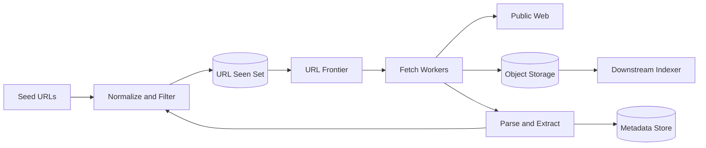
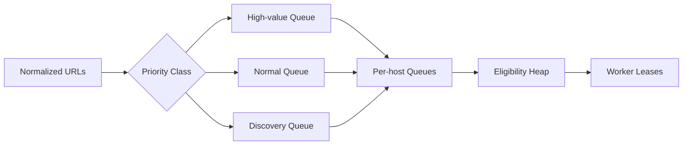
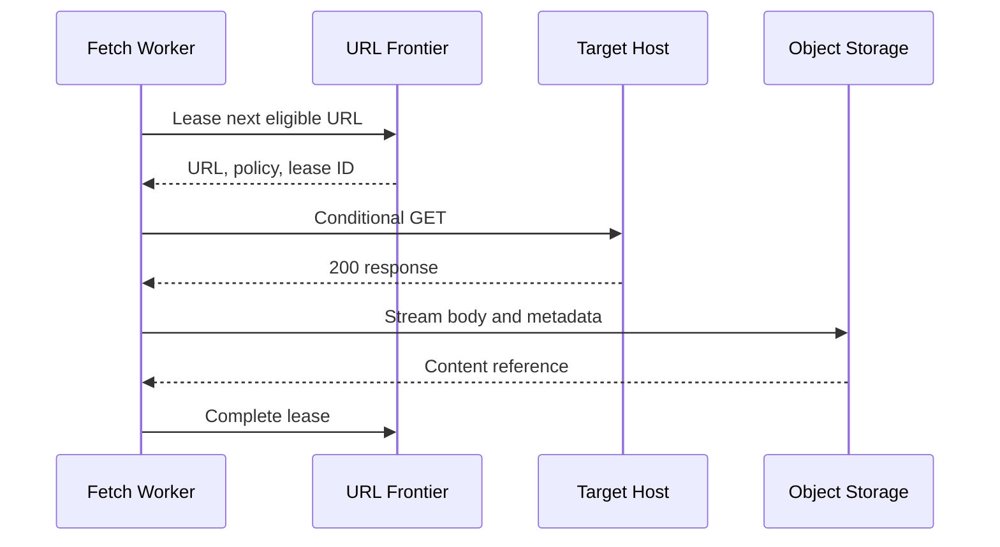

## Problem and requirements

A web crawler starts from known URLs, downloads their pages, extracts new links, and repeats. At small scale this is a loop. At internet scale it is a distributed scheduling system constrained by remote servers we do not control.

### Functional requirements

- Accept seed URLs and discover new URLs from fetched pages
- Fetch HTML and selected document types
- Respect `robots.txt`, crawl delays, and per-site limits
- Avoid repeatedly fetching the same URL or content
- Refresh important pages at an appropriate frequency
- Store fetched content and metadata for downstream indexing

### Non-functional requirements

- Crawl roughly one billion pages per month
- Never overwhelm a target host
- Continue through worker, network, and regional failures
- Prioritize useful, fresh pages over an exhaustive crawl
- Make every fetch traceable for debugging and compliance

Rendering JavaScript, indexing content, and ranking search results are separate systems. The crawler produces clean documents and link metadata for those consumers.

## Capacity estimates

One billion pages per month is about **386 pages per second** on average. Crawling is bursty, so provision for ten times that rate. If the average compressed response is 2 MB, the raw monthly transfer and storage footprint approaches 2 PB.

| Resource | Average | Peak assumption |
| --- | ---: | ---: |
| Page fetches | 386/second | 4,000/second |
| Network ingress | 772 MB/second | 8 GB/second |
| Raw content | 2 PB/month | Before replication |
| Extracted URLs | 20B/month | Assuming 20 links/page |

The discovered-URL rate is much higher than the fetch rate. URL normalization and deduplication therefore require more throughput than downloading pages.

At 4,000 peak fetches per second and a five-second average network wait, workers need around 20,000 concurrent requests. This is naturally I/O-bound; asynchronous workers can handle many connections without dedicating one thread to each request.

## High-level architecture

The **URL frontier** decides what should be fetched next. Fetch workers lease URLs, apply host policy, download content, and send results to a processing pipeline. Parsers extract links and feed normalized, unseen URLs back into the frontier.



The frontier, seen set, content store, and metadata store are durable. Workers are stateless and replaceable. A queue connects each stage so slow parsing or storage does not stop network fetching immediately.

## URL normalization

Different strings can identify the same resource. Normalize before deduplication to reduce redundant work:

- Lowercase the scheme and hostname
- Remove default ports such as `:80` and `:443`
- Resolve relative paths and `.` or `..` segments
- Remove URL fragments because they are not sent to the server
- Sort query parameters only when their order is known to be irrelevant
- Remove tracking parameters using a reviewed allowlist or denylist

Normalization is policy, not a universal algorithm. `/products?id=1` and `/products?id=2` are probably different; query order or duplicate parameters may also change behavior. Aggressive normalization can silently discard real pages.

A canonical URL declared in page metadata is useful, but it should inform indexing rather than prevent the crawler from fetching the page that declared it.

## The URL frontier

A simple global FIFO queue fails because adjacent URLs may target the same host. Thousands of workers could then hit one website simultaneously. The frontier must combine **priority** with **politeness**.



The first stage assigns a score using page importance, freshness, link depth, content type, and prior crawl history. Weighted selection prevents low-priority URLs from starving forever.

The second stage groups URLs by host. Each host queue has a `next_eligible_at` timestamp based on its crawl delay and recent responses. A min-heap ordered by that timestamp exposes only hosts that are safe to contact.

Workers lease tasks for a bounded time. If a worker dies, the lease expires and the URL becomes available again. The resulting delivery is at least once, so downstream writes must be idempotent.

## Partitioning the frontier

Hash the normalized hostname to assign all URLs for one host to the same frontier shard. This keeps politeness decisions local and avoids distributed coordination for every fetch.

Each shard owns:

- Per-host URL queues
- Host crawl policy and recent response state
- The eligibility timer heap
- Active leases

Large hosts can dominate one shard. Virtual shards make rebalancing easier, while explicit overrides can split a very large domain by a finer key when its robots policy permits parallelism.

Shard ownership uses epochs. When a shard moves, the old owner rejects new leases after observing a newer epoch, preventing two schedulers from independently issuing work for the same hosts.

## Politeness and robots rules

Before fetching a host, retrieve `/robots.txt` and cache the parsed rules by user agent. If the file is temporarily unavailable, use the last known policy for a bounded period or pause that host. Treating an outage as blanket permission is risky.

The effective request rate is the strictest of:

- The configured global maximum
- The host's declared crawl delay
- A conservative default per-host rate
- Adaptive backoff based on errors and latency

Responses such as `429 Too Many Requests` and `503 Service Unavailable` should reduce concurrency and honor `Retry-After`. Rising latency can trigger backoff before errors begin.

Politeness state must follow frontier shard ownership. If every worker independently rate-limits a host, the combined traffic can still exceed the intended limit.

## Fetch workers

A worker receives a URL lease and host policy, resolves DNS, opens a connection, follows a bounded number of redirects, and streams the response to object storage while computing a content hash.



Important safeguards include:

- DNS and connection timeouts
- Response-size and decompression limits
- A redirect limit with loop detection
- MIME-type allowlists
- Protection against private and link-local IP ranges
- TLS validation
- Per-request byte and duration budgets

Blocking private address ranges prevents server-side request forgery when untrusted URLs enter the frontier.

Use conditional requests with `If-None-Match` and `If-Modified-Since`. A `304 Not Modified` refreshes metadata without downloading the full page.

## URL deduplication

The crawler may discover the same URL millions of times. An exact distributed set keyed by the normalized URL hash provides authoritative deduplication, but checking it for every extracted link can be expensive.

A Bloom filter in each parser rejects URLs that are probably already known. Bloom filters never produce false negatives, but they can produce false positives. For a broad discovery crawl, occasionally skipping a new URL may be acceptable. For complete coverage, treat the Bloom filter as a first-level cache and confirm positives against the exact seen set.

The operation must atomically mean “insert if absent.” A separate read followed by write allows concurrent parsers to enqueue duplicates.

Store discovery metadata—source page, first-seen time, and link depth—alongside the hash when it is useful for prioritization and audit trails.

## Content deduplication

Different URLs often return identical content: mirrors, tracking parameters, print views, and session variants. Compute a cryptographic hash while streaming each response. Exact hash matches can share one stored blob.

Near-duplicate pages differ only in navigation, timestamps, or advertising. After extracting meaningful text, calculate a locality-sensitive fingerprint such as SimHash. Similar fingerprints can be clustered during indexing.

URL deduplication saves fetches. Content deduplication saves storage and improves the downstream index. They solve different problems and both are needed.

## Storage model

Store large response bodies in object storage, not a relational database. The metadata database holds compact, queryable records.

| Field | Purpose |
| --- | --- |
| `url_hash` | Primary identity for the normalized URL |
| `normalized_url` | Canonical fetch target |
| `status_code` | Latest HTTP result |
| `content_ref` | Object-storage location |
| `content_hash` | Exact content deduplication |
| `etag` / `last_modified` | Conditional requests |
| `last_crawled_at` | Freshness calculation |
| `next_crawl_at` | Recrawl scheduling |
| `failure_count` | Backoff and diagnosis |

Raw objects should include request and response metadata, fetch timestamp, crawler version, and integrity checksum. Lifecycle policies move older snapshots to cheaper storage or delete them according to retention rules.

## Recrawl scheduling

Not every page changes at the same rate. News homepages may change every few minutes; archived documents may remain stable for years.

Estimate change frequency from prior snapshots. Shorten the interval when meaningful content changes and lengthen it after repeated `304` responses or identical hashes. Page importance sets bounds so high-value pages are not neglected.

```text
next interval = clamp(
  previous interval × stability factor,
  minimum interval,
  maximum interval
)
```

Keep discovery priority separate from recrawl priority. Otherwise, a large backlog of known pages can prevent newly discovered sections of the web from being explored.

## Failure handling

**Worker failure:** its leases expire and other workers fetch the URLs again. Content writes use deterministic IDs so repeated completion is safe.

**Frontier shard failure:** a replica or replacement loads the durable host queues and resumes with a newer ownership epoch.

**Parser backlog:** object storage buffers fetched pages. Fetching can continue until storage or queue thresholds trigger backpressure.

**Seen-set outage:** pause new discovery rather than enqueue unchecked links and create an enormous duplicate backlog. Existing frontier work can continue.

**Object-storage outage:** stop issuing new leases. Fetching content that cannot be stored wastes remote bandwidth and may violate crawl policy when retried.

**Regional outage:** move unowned frontier shards to another region. Host-level scheduling must retain its last-fetch timestamps so failover does not create a sudden request burst.

## Backpressure and overload

Every pipeline boundary needs a limit. If parsers cannot keep up, the fetched-content queue grows. If object storage is slow, worker concurrency must fall. If frontier storage fills, URL discovery should sample or shed low-value URLs.

Apply admission control before expensive work:

- Reject unsupported schemes and file types
- Cap links extracted from one page
- Limit crawl depth for low-value domains
- Suppress calendar traps and infinite faceted-navigation spaces
- Set per-domain URL budgets

Crawl traps can generate unlimited distinct URLs with little unique content. Detect rapidly expanding path or query patterns and quarantine them for review.

## Observability and operations

Global pages-per-second is not enough. Monitor:

- Frontier size and oldest eligible URL by priority
- Fetch success, redirect, timeout, and error rates
- Response latency and bytes by host
- Robots-policy denials and cache age
- URL and content duplicate rates
- Lease expiration and retry rates
- Parser and storage queue depth
- Freshness lag for important page classes

Maintain a per-URL trace containing normalization decisions, discoveries, frontier transitions, fetch attempts, and storage references. Without it, operators cannot explain why a page was skipped or repeatedly crawled.

## Trade-offs

**Centralized vs. partitioned frontier:** one scheduler makes global priority easy but limits throughput and availability. Host-hashed shards scale well while making perfect global ordering impossible.

**Exact set vs. Bloom filter:** an exact set preserves coverage but costs storage and network calls. Bloom filters are fast and compact but may skip unseen URLs.

**Freshness vs. coverage:** recrawling known, valuable pages keeps them current but consumes capacity that could discover new pages. The frontier must reserve capacity for both.

**At-least-once vs. exactly-once fetching:** exactly-once leases require expensive coordination and still cannot prevent a remote server from receiving a request before a worker crashes. Idempotent storage and duplicate-tolerant processing are simpler.

**Breadth vs. rendering:** fetching raw HTML maximizes coverage. Rendering JavaScript discovers richer content but requires far more CPU, memory, and time, so it should be a separate prioritized tier.

The defining constraint is politeness. A crawler succeeds not by fetching as fast as its own infrastructure allows, but by making steady progress within the limits of every external host it visits.
