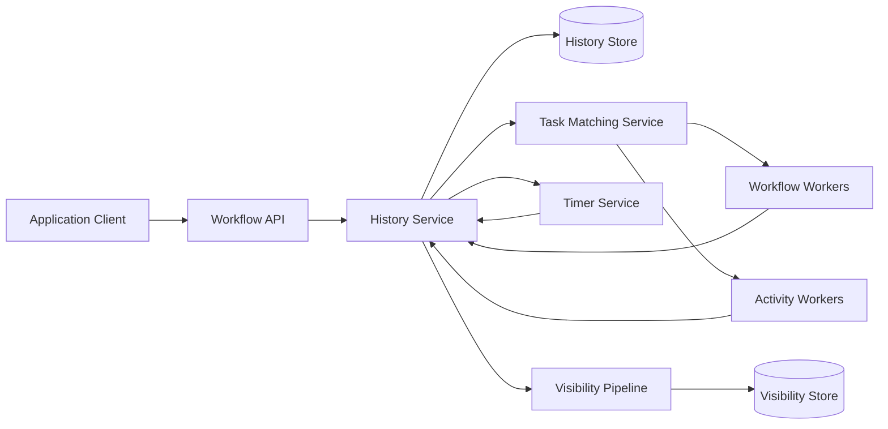
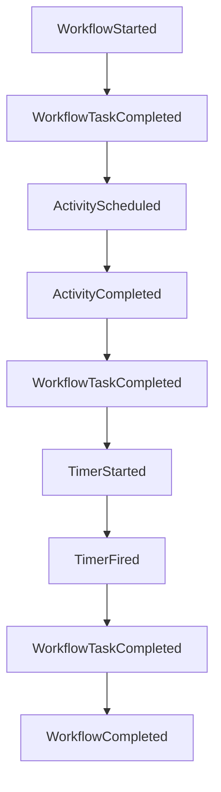
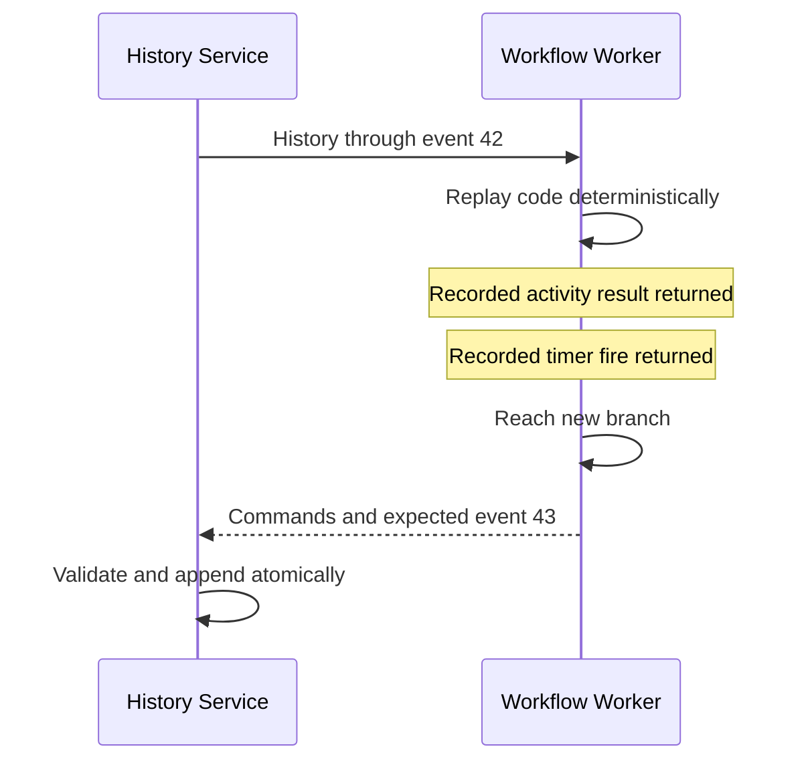
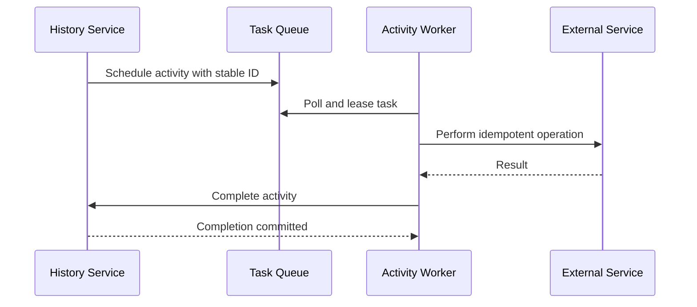
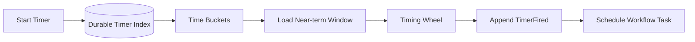
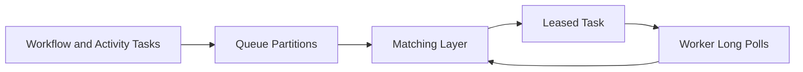
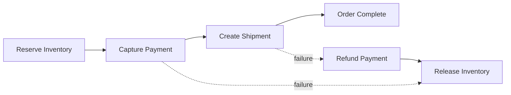
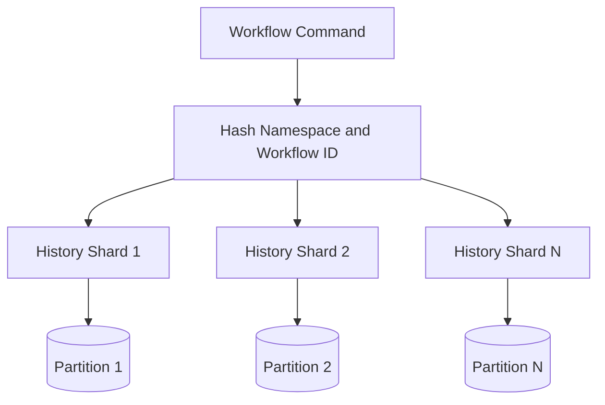
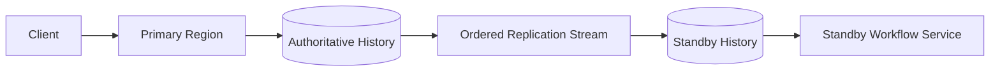

## Problem and requirements

A durable workflow system coordinates business processes that span services and may run for milliseconds, months, or years. Examples include order fulfillment, payment recovery, account onboarding, media processing, infrastructure provisioning, and human approval.

Ordinary application code loses its call stack when a process crashes. A workflow platform preserves logical execution state, resumes after failures, and makes retries and timers explicit. The hard part is ensuring that replay never repeats external side effects while workflow code and infrastructure evolve.

### Functional requirements

- Start, query, signal, cancel, and terminate workflows
- Execute ordered business logic with branches, loops, and parallel work
- Dispatch activities to external workers
- Persist timers that survive restarts and long delays
- Retry transient failures with configurable policies
- Wait for external events and human actions
- Run child workflows and compensation steps
- Expose complete execution history and current status
- Support safe workflow-code upgrades
- Enforce tenant quotas, retention, and access policies

### Non-functional requirements

- Support 100 million active workflows
- Process one million state transitions per second
- Never lose an acknowledged workflow event
- Avoid duplicate workflow decisions and bound duplicate activities
- Resume after process, node, zone, and regional failures
- Keep long-idle workflows inexpensive
- Isolate tenants and noisy workflow definitions
- Preserve an auditable, replayable history

The platform provides durable orchestration, not exactly-once effects in external systems. Activities must use idempotency or reconciliation when they change outside state.

## Capacity estimates

Assume 100 million open workflows, 20 events per typical workflow, and a long tail with thousands of events.

| Resource | Average | Peak assumption |
| --- | ---: | ---: |
| Workflow starts | 50,000/second | 250,000/second |
| State transitions | 250,000/second | 1M/second |
| Activity tasks | 100,000/second | 750,000/second |
| Open timers | Billions | Mostly dormant |
| History storage | Petabyte scale | Retention dependent |

Write throughput, timer indexing, and hot workflow histories dominate. Idle workflows consume storage but should use almost no compute.

## Programming model

A workflow definition looks like ordinary code but executes under deterministic constraints.

```ts
async function fulfillOrder(order: Order) {
  const reservation = await activities.reserveInventory(order);

  try {
    const payment = await activities.capturePayment(order);
    await activities.createShipment(order, reservation, payment);
    await sleep("24h");
    await activities.requestDeliveryStatus(order.id);
  } catch (error) {
    await activities.releaseInventory(reservation);
    throw error;
  }
}
```

Workflow code coordinates; activity code performs external I/O. Calls such as activity invocation and `sleep` do not block a thread. They append commands to durable history and suspend execution until matching events arrive.

Workflows receive a stable workflow ID and one or more execution IDs. Starting the same workflow ID under a reject-duplicates policy is idempotent.

## API design

```http
POST /v1/namespaces/commerce/workflows
Authorization: Bearer <service-token>
Idempotency-Key: order_981_fulfillment
Content-Type: application/json

{
  "workflowType": "FulfillOrder",
  "workflowId": "order_981",
  "taskQueue": "commerce-production",
  "input": { "orderId": "order_981" },
  "timeouts": { "execution": "30d", "run": "7d" }
}
```

The response confirms that the start event is durably committed. It does not wait for workflow code or an activity to run.

```json
{
  "workflowId": "order_981",
  "executionId": "run_01K6P92A",
  "status": "running"
}
```

Mutation APIs accept request IDs and return the original result on retry. Query APIs distinguish eventually consistent visibility from strongly consistent workflow state.

## High-level architecture

The service persists workflow histories and schedules tasks. Customer workers execute workflow decisions and activities by polling task queues.



The history service is authoritative. Task queues and visibility indexes can be rebuilt from durable workflow state or event streams.

Workers initiate outbound polls, so they can run behind private networks without exposing inbound endpoints.

## Event-sourced workflow state

Each workflow execution has an append-only ordered history.

Typical events include:

- Workflow started
- Workflow task scheduled, started, and completed
- Activity scheduled, started, completed, or failed
- Timer started and fired
- Signal received
- Cancellation requested
- Child workflow started or completed
- Workflow completed, failed, canceled, or continued



Current state is a projection of this history. A cached mutable state machine speeds processing, but the event log remains the recovery source.

Every append includes an expected next event number. Concurrent commands cannot both claim the same history position.

## Deterministic replay

A workflow worker receives history and re-executes workflow code from the beginning. The SDK returns recorded results for previous commands until it reaches new work.



Workflow code cannot directly read the current clock, generate uncontrolled randomness, access a database, or depend on thread scheduling. SDK replacements provide deterministic time, seeded randomness, and durable side-effect markers.

If replay produces a command different from recorded history, the platform reports a non-determinism error rather than corrupting execution.

## Workflow tasks

A workflow task asks a worker to advance one workflow state machine. The worker replays history, runs until it blocks, and returns commands such as schedule activity, start timer, or complete workflow.

Only one workflow task may commit for an execution at a time. Duplicate deliveries are harmless because completion uses the task's history version as a compare-and-swap condition.

Workflow tasks have short timeouts and must not perform network I/O. Long computation belongs in an activity.

After a worker crash, the task lease expires and another worker replays the same history. No in-memory checkpoint is required for correctness.

## Activity execution

Activities perform external work such as charging a card or calling an inventory service.



A worker can crash after the external call succeeds but before completion is recorded. The activity will run again. Use the activity ID as an idempotency key at the external service or query the external result before repeating.

Activity timeouts are distinct:

- Schedule-to-start bounds queue delay
- Start-to-close bounds one attempt
- Schedule-to-close bounds the entire retry lifecycle
- Heartbeat timeout detects abandoned long-running work

Heartbeats report progress and can store a small resume checkpoint. They are not a substitute for durable application data.

## Retry policy

Retries define initial delay, exponential coefficient, maximum interval, maximum attempts, and non-retryable failure types.

Do not retry permanent validation errors or rejected business operations. Retry transport timeouts and known transient dependencies with jitter.

The workflow history records each attempt outcome. Retry timers are durable, so no worker must remain alive during backoff.

Place a total schedule-to-close timeout around retries. Infinite automatic retries can hide a permanently broken integration and keep business processes stuck forever.

## Durable timers

Timers may fire seconds or years later. Storing one operating-system timer per workflow is impossible.

Partition timers by fire time and workflow shard. Near-term timers live in memory-backed timing wheels or priority queues; long-term timers remain in durable time buckets.



Timer firing is idempotent. A stable timer ID and expected workflow state prevent duplicate history events.

Workers scan overlapping windows after failover to avoid loss. Duplicate scans are acceptable; missing a timer is not.

Scheduled time and actual fire time are both recorded. Platform delay must not pretend that a late timer fired on time.

## Signals, queries, and updates

A signal is an asynchronous durable event sent to a running workflow. It may represent payment arrival, human approval, shipment update, or cancellation from another system.

Signals append to history before acknowledgement. Stable request IDs prevent client retries from creating duplicates.

A query reads workflow state without changing history. It may run against a worker's replayed state or a persisted projection, with documented consistency.

An update combines a durable mutation with a response. The workflow validates and accepts or rejects it, then records the result so retries return consistently.

Signal and update handlers must obey the same deterministic rules as the main workflow.

## Task matching and worker routing

Workers long-poll named task queues. The matching service pairs available tasks with compatible pollers.



Use synchronous matching when a poller is already waiting, avoiding a queue write on the critical path. Persist unmatched tasks so they survive matching-service failure.

Task queues are scoped by namespace and environment. Build IDs or capability sets route workflow tasks only to workers with compatible code.

Rate limits apply per queue, workflow type, and tenant. A hot queue is split across partitions while preserving single-execution ordering in the history service.

## Workflow code versioning

Long-running workflows outlive many deployments. Changing control flow can make new code produce decisions that conflict with old history.

Use explicit version markers:

```ts
const version = workflow.version("shipping-flow", 1, 2);

if (version === 1) {
  await activities.shipLegacy(order);
} else {
  await activities.reserveCarrier(order);
  await activities.ship(order);
}
```

The first execution records the chosen version in history. Replay returns the recorded value even after the default changes.

Worker versioning can instead route existing executions to compatible worker builds and new executions to a new build. Both techniques need deployment visibility and eventual cleanup.

Never remove old workflow code until no retained execution can replay through it, or histories have been safely continued into a new run.

## Continue-as-new and history limits

Very long histories increase replay time, storage, and transfer cost. Continue-as-new closes the current execution and atomically starts a new execution with compact carried state.

The workflow ID remains stable while the execution ID changes. Queries and signals route to the current execution.

Use continue-as-new after a configured event count, history size, or business cycle. Do not carry large payloads; store them in object storage and pass references.

Hard history limits protect the cluster from infinite loops or chatty workflows. Warn well before rejection so code can compact intentionally.

## Child workflows and fan-out

Child workflows isolate history and operational ownership for meaningful sub-processes. A parent can wait for completion, cancel children, or continue independently.

Large fan-out should be bounded. Starting one million activities in a single workflow creates a huge history and task burst. Use batches, child workflows, or a distributed data-processing system.

Parent-close policy defines whether children terminate, request cancellation, or detach when the parent closes.

Cross-namespace child workflows require explicit authorization and make failure ownership harder; prefer signals or service APIs across administrative boundaries.

## Compensation and sagas

Distributed transactions across independent services are often unavailable. A workflow can implement a saga: perform steps and record compensating actions for completed work.



Compensation is a business operation, not database rollback. Refunding a payment or releasing inventory may fail and need its own retry, alert, or manual intervention.

Register compensation intent before or atomically with the action it covers. Execute compensations in a deliberate order and make them idempotent.

## Persistence and sharding

Hash workflow ID to a logical history shard. Each shard has one active owner that serializes state transitions for its workflows.



Persist history events and outgoing task intents atomically. A task publisher reads the durable intent and delivers at least once, avoiding a dual-write gap.

Shard leases move ownership after failure or rebalancing. New owners rebuild mutable state from durable history and checkpoints.

Large tenants may receive dedicated shard pools. Hash spreading prevents a tenant from concentrating all workflows on one partition, while per-tenant quotas provide fairness.

## Visibility and search

The history store is optimized for one workflow's ordered events, not broad search. A change stream builds a separate visibility index with workflow type, status, start time, close time, task queue, and approved search attributes.

```http
POST /v1/namespaces/commerce/workflows:search
Content-Type: application/json

{
  "filter": "workflowType = 'FulfillOrder' AND status = 'running'",
  "startedAfter": "2026-10-08T00:00:00Z",
  "limit": 100
}
```

Visibility is eventually consistent. Direct lookup by workflow ID reads authoritative history state.

Limit indexed attributes and cardinality. Arbitrary payload fields remain encrypted workflow data, not automatically searchable metadata.

## Payloads and data protection

Workflow inputs, results, signals, and activity payloads may contain sensitive business data. Encrypt them in transit and at rest with tenant-scoped keys.

Support payload codecs so clients can encrypt sensitive fields before they reach the platform. The service can schedule and persist opaque ciphertext without decryption access.

Keep large documents out of history. Store them in an authorized object store and pass immutable references and checksums.

Audit reads of workflow histories. Search indexes contain only allowlisted metadata and never credentials, payment details, or raw personal data.

Retention and deletion policies apply to closed histories, visibility records, backups, and exported archives. Active workflows cannot be deleted casually without defining what happens to external work.

## Multi-region design

Assign each namespace a primary region for ordered history writes. Replicate histories asynchronously to standby regions.



Workers poll the active region. During failover, fence the former primary, promote a standby at a known replication point, and route clients and workers to it.

Asynchronous replication may lose the newest acknowledged events unless the product pays for cross-region synchronous commit. The recovery objective must be explicit.

Stable request and activity IDs make client retries and external reconciliation safe after failover. Never allow two regions to append to the same execution independently.

## Failure handling

### Workflow worker crashes

Its task lease expires. Another worker replays history and continues. Uncommitted commands disappear.

### Activity worker crashes

The activity retries after timeout. External effects require idempotency or outcome lookup.

### History node fails

Shard ownership moves to another node, which reloads state from durable storage. Clients retry commands with the same request ID.

### Task matching service fails

Durable unmatched tasks remain available. Workers reconnect to another matcher and poll again.

### Timer processor falls behind

Scale timer workers and prioritize overdue buckets. Fired times remain the scheduled logical time where workflow semantics require it, while actual delay is observable.

### Bad workflow deployment

Stop routing new tasks to the build, restore compatible workers, and use replay testing to identify affected workflow types. Do not edit histories.

### Poison workflow

Rate-limit repeated failing workflow tasks, surface the non-determinism or code error, and isolate the execution without blocking its shard.

## Observability and operations

Track:

- Workflow starts, completions, failures, cancellations, and age
- State-transition latency and history append conflicts
- Workflow and activity task queue latency
- Worker poller count, version, and saturation
- Activity attempts, timeouts, heartbeats, and retry exhaustion
- Timer firing delay and overdue timer count
- History event count, size, and replay duration
- Visibility indexing lag
- Shard ownership changes and persistence latency
- Replication lag and recovery-point exposure

Provide a workflow timeline that explains every scheduled command, event, retry, and version marker. Operators need safe actions such as signal, cancel, reset to a prior event, or terminate—with authorization, reason, and audit trail.

Replay tests run production histories against candidate workflow builds without executing activities. Any command mismatch blocks deployment.

## Key tradeoffs

### Code-like workflows vs explicit state machines

Durable code is expressive and familiar but requires deterministic replay discipline. Explicit state machines are easier to inspect statically but become verbose for complex branching and parallelism.

### Event history vs mutable checkpoints

Event histories provide auditability and recovery but grow over time. Cached projections and continue-as-new retain the benefits while bounding replay cost.

### At-least-once activities vs global transactions

At-least-once delivery is resilient and scalable but can repeat external calls. Stable activity IDs and idempotent downstream APIs are more practical than distributed transactions.

### Single-region writers vs active-active execution

One owner per workflow preserves simple ordered history. Active-active writers would require conflict resolution for imperative code, where merging two valid branches is usually undefined.

### Rich visibility vs privacy and cost

Indexing every payload makes search flexible but leaks sensitive data and creates unbounded cardinality. A small allowlisted search schema keeps the control plane predictable.

The central principle is to persist every decision boundary, replay pure orchestration logic, and isolate external side effects behind idempotent activities.
