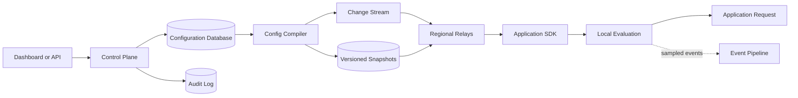
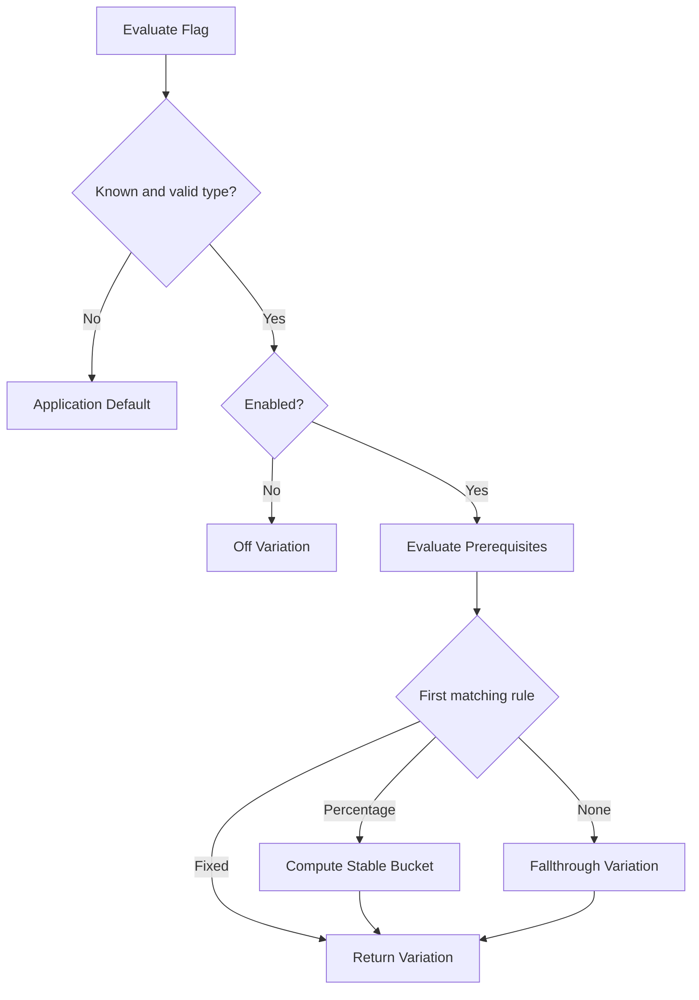
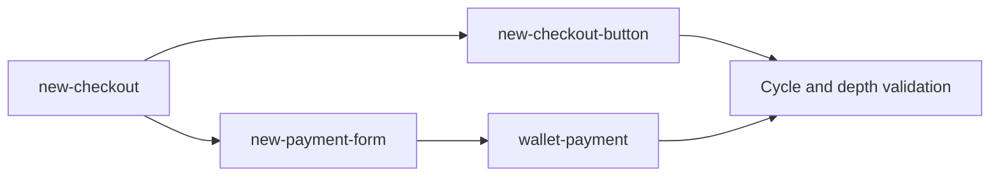
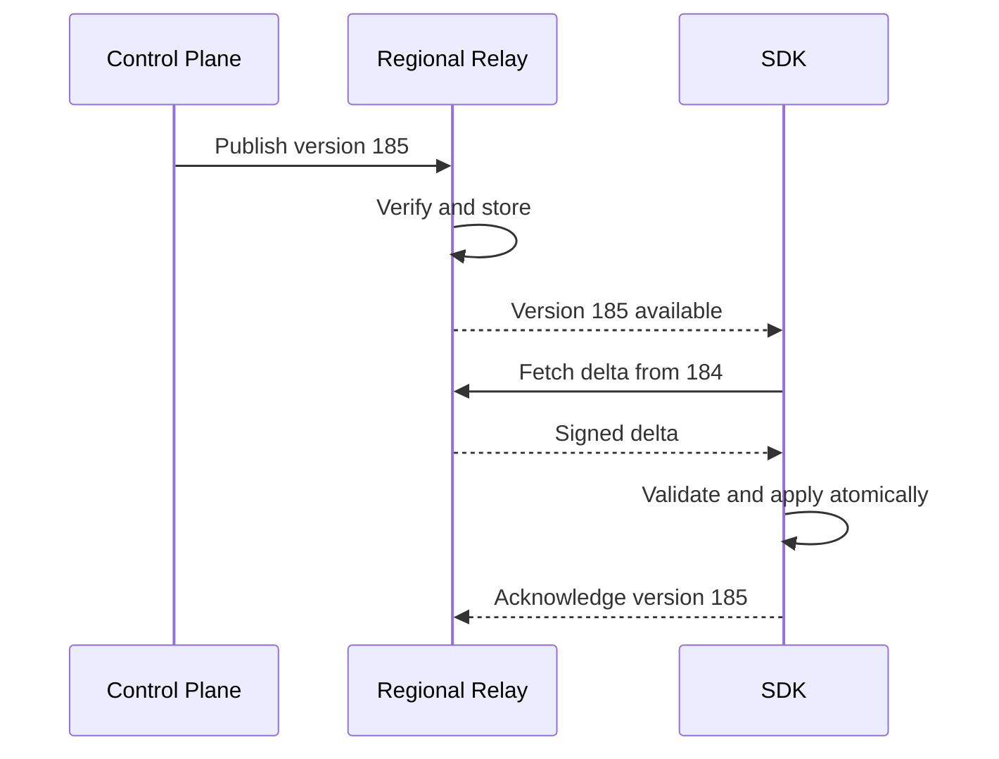

## Problem and requirements

A feature flag service separates code deployment from feature release. Applications ask whether a feature is enabled for a particular context, allowing teams to test changes, gradually increase exposure, run experiments, and disable faulty behavior without deploying again.

The obvious implementation is a remote API that returns `true` or `false`. That design makes every application request depend on a central service. At production scale, evaluation must usually happen inside the application process from a locally cached, versioned configuration.

### Functional requirements

- Create Boolean, string, number, and structured flags
- Target users, organizations, regions, devices, or custom attributes
- Roll out a variation to a deterministic percentage of an audience
- Schedule changes and require approval for sensitive flags
- Update SDKs within seconds
- Record who changed a flag and why
- Support experiments without changing assignment mid-session
- Provide a fast emergency kill switch
- Retire stale flags safely

### Non-functional requirements

- Support more than ten million evaluations per second
- Add less than one millisecond to application latency for local evaluation
- Propagate normal changes globally within five seconds
- Continue evaluating during control-plane or network outages
- Produce deterministic results across SDK languages
- Prevent one tenant from seeing another tenant's configuration
- Preserve a complete, tamper-evident change history

Flag availability must not become application availability. The serving path remains functional with the last known good configuration.

## Capacity estimates

Assume 20,000 projects, one million flags in total, 100,000 configuration changes per day, and thousands of SDK connections per project.

| Resource | Average | Peak assumption |
| --- | ---: | ---: |
| Flag evaluations | Millions/second | 10M+/second |
| Configuration writes | 1.2/second | 500/second during incidents |
| Connected SDK streams | Hundreds of thousands | Millions |
| Evaluation events | Billions/day | Sampled or aggregated |
| Audit retention | Years | Every configuration change |

Evaluation volume is orders of magnitude higher than configuration-write volume. This asymmetry drives a design with a strongly controlled write path and decentralized reads.

## API and SDK contract

The management API controls flags:

```http
PATCH /v1/projects/checkout/environments/production/flags/new-payment-flow
Authorization: Bearer <management-token>
If-Match: "version-184"
Content-Type: application/json

{
  "enabled": true,
  "rules": [
    {
      "conditions": [{ "attribute": "country", "op": "in", "values": ["US", "CA"] }],
      "rollout": { "on": 10, "off": 90 }
    }
  ],
  "reason": "Ramp after successful canary"
}
```

Application code uses an SDK rather than calling this API:

```ts
const enabled = flags.booleanVariation(
  "new-payment-flow",
  { key: user.id, country: user.country },
  false
);
```

The final argument is the application-owned default. The SDK returns it if the flag is missing, malformed, or unavailable and emits a diagnostic reason.

Evaluation returns both the value and metadata internally: matched rule, flag version, variation ID, and reason. The simple SDK method exposes only the value; a detailed method supports debugging and experimentation.

## High-level architecture

Separate the control plane, distribution plane, and evaluation plane.



The control plane validates human intent and stores source configuration. The compiler turns it into compact, immutable artifacts. Regional relays distribute snapshots and deltas. SDKs evaluate locally without a network round trip.

## Data model

The main hierarchy is organization, project, environment, and flag.

A flag includes:

- Stable key and human-readable name
- Value type and available variations
- Environment-specific enabled state
- Ordered targeting rules
- Default fallthrough rule
- Off variation
- Version, owner, and lifecycle status
- Prerequisite flags

Environments such as development, staging, and production have independent configurations. Promoting a flag copies an reviewed configuration into another environment; it does not make environments share mutable state.

Each published change creates a new immutable environment version. The current-version pointer advances with compare-and-swap, preventing concurrent editors from silently overwriting each other.

## Evaluation semantics

Every SDK must implement the same ordered algorithm:

1. Validate the flag and requested value type
2. Check whether the flag is enabled
3. Evaluate prerequisites
4. Evaluate targeting rules in order
5. Apply the first matching fixed variation or percentage rollout
6. Use the default fallthrough variation
7. Return the application default if evaluation cannot be completed safely



Rules use explicit behavior for missing attributes and type mismatches. Avoid coercions such as treating the string `"10"` as the number `10`; different languages otherwise produce inconsistent decisions.

## Deterministic percentage rollouts

A percentage rollout must assign the same subject to the same variation on every request and in every SDK language.

Compute a stable hash from:

```text
project salt + flag key + rollout seed + context key
```

Map the unsigned hash into a fixed range, such as 0 through 99,999, then select the corresponding weighted interval. A 10% rollout might occupy buckets 0 through 9,999.

Do not use language-native hash functions; their algorithms and seeds differ. Specify the exact byte encoding, hash algorithm, unsigned conversion, and modulo behavior in a cross-language conformance suite.

The rollout seed remains stable when percentages change. Increasing exposure from 10% to 20% keeps the original cohort and adds a new one. Changing the seed intentionally reshuffles assignments.

## Targeting rules

Conditions compare context attributes using operators such as equality, set membership, numeric range, semantic version, date, and regular expression.

Rules are evaluated in documented order. The control plane rejects invalid combinations and precompiles expensive expressions. SDKs impose limits on rule count, nesting, and regular-expression complexity.

Segments provide reusable audience definitions. Embed small segments in the snapshot. For very large explicit membership lists, distribute a compact local structure or use privacy-preserving hashed membership data.

A remote segment lookup reintroduces latency and availability coupling. Use it only when freshness or size makes local distribution impossible, and define a conservative fallback.

## Prerequisites and dependency safety

A flag can require another flag to return a particular variation. For example, `new-checkout-button` may depend on `new-checkout` being enabled.

The control plane constructs a dependency graph and rejects cycles before publication.



SDK evaluation carries a visited set and maximum depth as defensive protection against malformed snapshots. A failed prerequisite returns the dependent flag's off variation with a diagnostic reason.

Keep dependency chains short. Deep graphs make emergency changes difficult to understand and can produce surprising product behavior.

## Configuration compilation

The source model is convenient for editors but may be verbose and unsafe for direct serving. A compiler validates and transforms it into an SDK artifact.

Compilation performs:

- Schema and value-type validation
- Dependency-cycle detection
- Targeting operator validation
- Segment reference resolution
- Rule normalization and precompilation
- Size and complexity limits
- Sensitive-field removal
- Canonical serialization and signing

The artifact has a project, environment, monotonically increasing version, creation time, checksum, and signature. Relays and SDKs reject corrupted, unsigned, or decreasing versions.

Compilation failure never replaces the active configuration. The control plane reports the error and keeps the previous version serving.

## Distribution and real-time updates

SDKs bootstrap from a regional endpoint, then open a streaming connection for changes. The server may send complete snapshots for simplicity or deltas for large configurations.



The SDK builds a new in-memory state and swaps a single pointer only after complete validation. Evaluation threads never observe a partially applied update.

On reconnect, the SDK sends its current version. The relay returns the missing delta sequence or a full snapshot when the history gap is too large.

Add jitter to polling and reconnect schedules so a regional recovery does not create a thundering herd.

## Emergency kill switches

Kill switches need a path that is fast, highly available, and difficult to misuse.

Mark critical flags in advance and define their safe value. Authorized operators can publish an emergency override through a restricted API with strong authentication, an explicit reason, and short expiration.

Relays prioritize emergency messages ahead of normal configuration traffic. SDKs still verify signatures and versions. The control plane later folds the override into the regular configuration or lets it expire.

Do not build a second undocumented semantics engine for emergencies. An override should select a variation, while normal evaluation, auditing, and event metadata remain intact.

## Offline and mobile clients

Server SDKs can maintain long-lived streams. Browser and mobile SDKs often use a client-specific snapshot fetched from a CDN or edge endpoint.

Client artifacts contain only flags safe to expose publicly. Private targeting logic, internal segment names, and server-only flags never leave trusted infrastructure.

Mobile clients may remain offline for days. Cache the last valid snapshot with its version and age. Each flag can define how long stale configuration is acceptable; security-sensitive behavior should fail to the application default after expiration.

Client evaluation must not be used as the sole enforcement mechanism for authorization, billing, or data access. The server validates those decisions independently.

## Experimentation events

An exposure event should be recorded only when application behavior actually depends on the evaluated variation, not every time configuration is prefetched.

The event includes experiment ID, variation ID, subject key or privacy-safe pseudonym, assignment version, timestamp, and relevant context. Stable event IDs support deduplication.

Buffer and batch events asynchronously. Evaluation must not wait for analytics delivery. Apply sampling to operational flag events, but retain the exposure fidelity required by statistical analysis.

Avoid changing targeting rules mid-experiment unless the analysis accounts for it. Pin experiment definitions and rollout seeds so cohorts remain stable.

## Consistency model

Configuration writes are strongly consistent within an environment. Distribution is eventually consistent across SDKs.

This means two application instances may briefly evaluate different versions. The version travels in evaluation metadata and exposure events, making the difference observable.

For a workflow that must use one version across multiple steps, capture a flag decision or configuration version at the start and propagate it with the request. Do not assume every service updates simultaneously.

Global simultaneous activation is unrealistic. Scheduled releases publish configuration early with an activation timestamp based on synchronized clocks, but clock skew and offline clients still require tolerance.

## Resilience and failure handling

### Control plane unavailable

Applications continue evaluating from local configuration. Management writes pause until durable storage recovers.

### Distribution stream disconnected

The SDK reconnects with exponential backoff and jitter while using the last known good snapshot. It reports configuration age as a health metric.

### Invalid snapshot

Reject it atomically, retain the previous version, and report validation telemetry. Never partially apply a damaged configuration.

### Regional relay failure

SDKs fail over to another relay or a CDN snapshot endpoint. Stagger reconnections to protect the healthy region.

### Missing context attribute

The condition does not match unless its operator explicitly handles absence. Return a reason code for debugging without logging the sensitive attribute value.

### SDK defect

Run a shared corpus of evaluation fixtures against every supported SDK release. Roll out SDK changes gradually and compare shadow decisions before broad adoption.

## Security and tenancy

Management credentials and SDK credentials have different permissions. A client-side key may download only public configuration for one environment; it can never modify flags or read server-side rules.

Security controls include:

- Tenant-scoped authorization on every control-plane request
- Short-lived service credentials and key rotation
- Encryption in transit and at rest
- Signed configuration artifacts
- Redaction of context values from diagnostics
- Approval policies for production and sensitive flags
- Append-only audit events exported to durable storage
- Regional controls for configuration and evaluation data

The audit record captures actor, time, reason, before and after versions, approval chain, and request identity. Reverting a change creates a new version rather than deleting history.

## Flag lifecycle and technical debt

Temporary flags become permanent complexity if the system only helps create them.

Every flag has an owner, purpose, creation date, expected removal date, and lifecycle type:

- Release flag
- Experiment flag
- Operational kill switch
- Permission or entitlement flag

SDKs can report which flags are still evaluated. Static analysis finds code references where supported. The dashboard identifies flags that are fully rolled out, expired, unused, or owned by inactive teams.

Retirement happens in two stages: remove code references first, then archive the flag after evaluation traffic reaches zero. Archived keys cannot be silently reused for unrelated behavior.

## Observability

Track both platform health and configuration health:

- Management API latency and write conflicts
- Compilation success and duration
- Propagation latency by region and SDK type
- Connected stream count and reconnect rate
- Snapshot version and age distribution
- Evaluation reason counts and default-value fallbacks
- Artifact size and rule complexity
- Emergency override use
- Stale and ownerless flags

Provide an evaluation debugger where an authorized operator supplies a flag version and redacted context, then sees each rule and the resulting decision. Debugging must use the same evaluation engine or conformance fixtures as production.

Canary synthetic SDKs in every region continuously publish a test change, measure receipt, evaluate known contexts, and verify rollback.

## Key tradeoffs

### Local vs remote evaluation

Local evaluation is fast and resilient but distributes targeting data and accepts brief version skew. Remote evaluation centralizes secrets and updates instantly but adds a network dependency to every request. Use local evaluation for server applications and specialized remote evaluation only where data sensitivity requires it.

### Full snapshots vs deltas

Snapshots are simple and self-contained. Deltas reduce bandwidth for large projects but need ordering, gap recovery, and atomic application. Periodic snapshots bound recovery complexity.

### Freshness vs stability

Aggressive streaming reduces propagation time but can amplify faulty changes. Validation, approvals, canaries, and versioned rollback protect the system without making normal releases slow.

### Rich rules vs predictable behavior

An expressive rule language helps product teams but expands the security, performance, and cross-language consistency surface. A small typed operator set is usually safer than arbitrary scripts.

The central principle is that flag evaluation should be local, deterministic, and independent of service availability, while configuration changes remain controlled, observable, and reversible.
