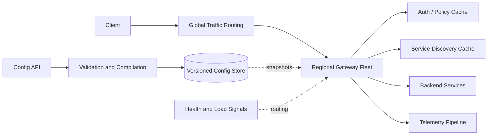
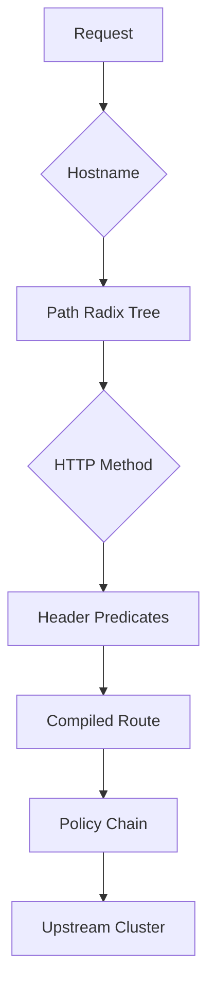
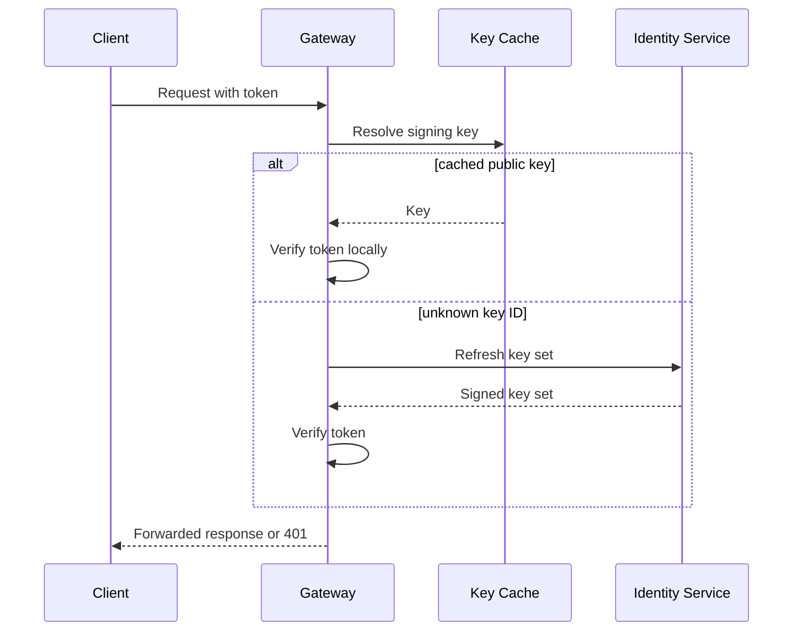
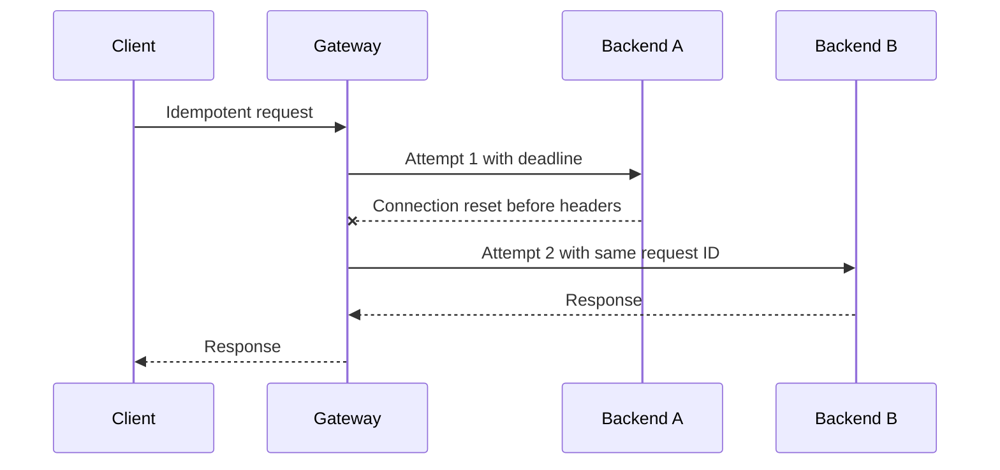
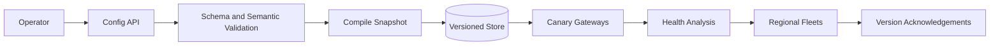

## Problem and requirements

An API gateway is the controlled entry point between clients and backend services. It terminates public protocols, authenticates callers, selects a route, applies traffic policy, and forwards requests while hiding internal topology.

The gateway is in the critical path of every request. It must provide useful control without becoming a monolith where application logic, tenant configuration, and network failures combine into one large blast radius.

### Functional requirements

- Route requests by hostname, method, path, headers, and API version
- Terminate TLS and authenticate clients
- Enforce authorization and rate limits
- Balance traffic across healthy backend instances and regions
- Apply bounded timeouts, retries, and circuit breakers
- Transform protocol metadata where necessary
- Emit metrics, traces, and access logs
- Support canaries, traffic splitting, and rapid rollback

### Non-functional requirements

- Sustain five million requests per second globally
- Add less than five milliseconds of processing latency at the 99th percentile, excluding backend time
- Continue routing with the last valid configuration during control-plane failures
- Isolate tenants, routes, and upstream services
- Fail safely when authentication or policy decisions are uncertain
- Roll out configuration without serving partial or contradictory state

Business workflows and arbitrary application code do not belong in the gateway. They remain in backend services where ownership, testing, and scaling are clearer.

## Capacity estimates

Assume a peak of **five million requests per second**, 100,000 configured routes, and an average request plus response size of 20 KB.

| Resource | Estimate |
| --- | ---: |
| Peak requests | 5M/second |
| Proxied application traffic | ~100 GB/second |
| Access logs at 500 bytes/request | 2.5 GB/second |
| Concurrent requests at 200 ms average | 1M |
| Active client connections | Tens of millions |

Logging every request synchronously would overwhelm storage and add latency. Aggregate metrics locally, buffer logs asynchronously, and apply sampling or customer-specific retention before central ingestion.

Capacity is uneven across regions and routes. One viral endpoint or large streaming response can exhaust connection pools while average request count looks safe.

## Configuration model

Gateway behavior is declarative and versioned.

```yaml
route:
  host: api.example.com
  path: /v1/orders/{id}
  methods: [GET]
  upstream: orders-read
  auth: customer-jwt
  timeout: 800ms
  retry:
    attempts: 1
    conditions: [connect-failure, reset-before-headers]
  limits:
    tenant: 1000/second
    user: 20/second
```

The control plane validates references, conflicting routes, timeout budgets, certificates, and policy syntax before publishing one immutable configuration snapshot.

Every snapshot has an ID, checksum, creation time, and previous version. Data-plane nodes activate a snapshot atomically only after all required resources are present. A broken update rolls back by switching one pointer.

## High-level architecture

The control plane manages configuration and fleet intent. The data plane handles traffic and continues independently when control services are unavailable.



Gateway instances are stateless with respect to application data. They keep local caches for configuration, keys, discovery, and policy, but every cache can be rebuilt.

Regional fleets reduce client latency and contain failures. The global routing layer sends clients to a nearby healthy region with enough capacity.

## Request lifecycle

A request moves through an ordered pipeline:

1. Accept connection and negotiate TLS and protocol
2. Validate request syntax, size, and deadlines
3. Resolve tenant and route from immutable configuration
4. Authenticate credentials
5. Authorize action and resource scope
6. Apply rate, concurrency, and payload limits
7. Select a healthy upstream endpoint
8. Forward with a bounded timeout and optional retry
9. Stream the response with backpressure
10. Emit telemetry asynchronously

Ordering matters. Authenticate before expensive processing, but reject malformed oversized requests before invoking external identity systems. Route selection may be needed to know which authentication policy applies.

Each stage has a latency and resource budget. A user-defined policy cannot run indefinitely or allocate unbounded memory.

## Routing

Compile route rules into efficient match structures rather than scanning 100,000 entries per request.

Use a hostname map, then a path radix tree or segment trie, followed by method and header predicates. Exact routes take precedence over parameter routes, which take precedence over wildcards. Validation rejects ambiguous rules unless priority is explicit.



The gateway forwards an internal request ID and trace context, removes hop-by-hop headers, and rewrites client-supplied forwarding headers so callers cannot spoof source identity.

Route configuration may support weighted destinations for canaries. Selection uses a stable hash of a safe identity when sticky assignment is required, preventing one user from switching variants on every request.

## TLS and protocol handling

Terminate TLS close to users and maintain reusable encrypted connections to backends. Support HTTP/1.1, HTTP/2, HTTP/3, WebSocket upgrades, and gRPC according to route policy.

Certificate management validates domain ownership, encrypts private keys, distributes them only to authorized termination systems, and renews them before expiration. Gateway processes retrieve certificates through bounded local caches rather than loading every tenant key into every worker.

Protocol translation should preserve deadlines, cancellation, streaming, and status semantics. Buffering an entire streaming response to convert protocols defeats backpressure and can exhaust memory.

Enforce maximum header count, header bytes, URL length, body size, and decompression ratio before forwarding.

## Authentication

Authentication policies may validate signed tokens, API keys, mutual TLS certificates, or session credentials.

For JWTs, gateways verify signature, issuer, audience, expiry, and required claims locally using cached public keys. Key sets have versioned IDs and controlled refresh; unknown key IDs trigger one bounded refresh rather than a request storm.

Opaque tokens require introspection against an identity service. Cache positive responses briefly and negative responses more cautiously. Token revocation needs a bounded staleness policy or a push-updated denylist.



Authentication failure is not retryable. When required identity state is unavailable and cannot be validated locally, protected routes fail closed.

## Authorization

Authentication answers who the caller is; authorization answers whether that caller may perform this action.

Simple scope and role checks run locally from signed claims and route policy. Fine-grained resource authorization may require a policy service using caller, action, resource, tenant, and context.

Cache policy decisions only when the key includes every input that affects the result and the policy defines acceptable staleness. Permission revocations may require push invalidation or short TTLs.

The gateway should enforce coarse perimeter policy. Backend services still authorize business resources because only they understand current ownership and domain state. Gateway authorization is defense in depth, not a reason to trust all internal traffic.

## Rate and concurrency limiting

Rate limits protect tenants, users, routes, and upstreams. A hierarchical policy might enforce:

- Global platform capacity
- Tenant quota
- API-key or user quota
- Route-specific limit
- Upstream concurrency limit

Local token buckets provide fast decisions and allow short bursts. A distributed quota service allocates token leases to gateway instances, avoiding a remote call on every request while keeping global usage bounded.

Concurrency limits are often more protective than request rates for slow endpoints. Release the permit when the upstream response completes or the request is cancelled.

Return `429 Too Many Requests` with useful retry guidance when safe. Rate-limit keys must not include unbounded attacker-controlled values that create memory exhaustion.

## Service discovery and load balancing

The gateway receives endpoint sets and health metadata from service discovery. It maintains connections and per-endpoint statistics locally.

Load-balancing choices include:

- **Round robin:** simple but ignores uneven request duration
- **Least requests:** adapts to active load
- **Power of two choices:** samples two endpoints and selects the less loaded, achieving good balance cheaply
- **Consistent hashing:** preserves affinity for stateful caches or sessions

Use passive health from real request outcomes and active probes. Remove a failing endpoint gradually with hysteresis so brief errors do not make the fleet oscillate.

Locality-aware routing prefers the same zone, then region, while preserving failover capacity. Cross-zone traffic may be necessary when one zone is saturated or degraded.

## Timeouts and deadlines

Every request has an end-to-end deadline. The gateway reserves time for response transmission and forwards the remaining budget to the backend.

An 800-millisecond gateway timeout cannot safely give the backend 800 milliseconds, retry for another 800, and still meet the client contract. Budget each attempt explicitly.

Reject deadlines that are already expired. Propagate cancellation when clients disconnect so backends stop wasted work.

Separate connection, request-header, response-header, idle-stream, and total deadlines. One generic timeout behaves poorly for both short API calls and long streaming responses.

## Retries and hedging

Retries are safe only when the failure indicates the backend probably did not perform the operation or when the request is idempotent.

Default retry candidates include connection failure before sending the body, reset before response headers, and selected read-only upstream errors. Writes need an idempotency key and backend support.



Apply a retry budget, such as at most 10% extra attempts over original traffic. During an outage, unrestricted retries multiply load precisely when capacity is lowest.

Hedging sends a duplicate request after a latency threshold and uses the first valid response. It can reduce tail latency for idempotent reads but needs stricter budgets than retries.

## Circuit breakers and load shedding

A circuit breaker stops sending traffic to an upstream that is consistently failing or timing out. In the open state, fail quickly or use a configured fallback. Periodic probes test recovery before gradually restoring traffic.

Circuit state should be scoped by endpoint or small cluster slice. One unhealthy instance should not open the circuit for every region.

The gateway also sheds load before exhausting itself. Reject lower-priority work when connection pools, CPU, memory, or downstream concurrency approach safe limits.

Overload responses are preferable to accepting requests that will time out after consuming resources. Reserve capacity for health checks, control operations, and critical routes.

## Configuration distribution

The configuration pipeline compiles high-level policy into a compact data-plane snapshot.



Rollouts proceed through canary rings and regions. Automated analysis compares routing errors, authentication failures, upstream status, and gateway resource use against the prior version.

Nodes write snapshots to durable local storage and verify checksums before activation. On restart during a control-plane outage, a node loads its last valid snapshot instead of starting empty.

Urgent revocations—compromised keys or disabled routes—use a high-priority channel and a small denylist checked independently of ordinary rollout.

## Request and response transformation

Safe transformations include adding trusted identity headers, renaming version headers, removing sensitive response metadata, and mapping protocol status.

Transformations must be deterministic, bounded, and streaming-friendly. Avoid arbitrary scripts. If extensibility is required, run sandboxed WebAssembly-like modules with CPU, memory, host-call, and output limits.

Never let a plugin access another tenant’s configuration or secrets. A plugin failure applies the route’s explicit fail-open or fail-closed policy and emits a clear metric.

Business transformations that understand order, billing, or inventory semantics belong in application services, not the shared gateway.

## Caching

The gateway may cache safe idempotent responses, but it is not automatically a CDN. Cache eligibility requires explicit route policy and correct keys.

Keys include tenant, route, normalized URL, selected headers, and authorization scope when needed. Authenticated responses are private unless policy proves they can be shared.

Request coalescing prevents many identical misses from reaching one backend. Stale-if-error may preserve read availability for explicitly eligible data.

Cache size, TTL, and object limits are bounded per tenant. One route cannot fill shared memory with unique query variants.

## Observability

The gateway is an ideal observation point but can produce overwhelming telemetry.

Emit:

- Request count, latency, and response codes by tenant and route
- Authentication and authorization outcomes
- Rate-limit and load-shed decisions
- Upstream attempts, retries, circuit state, and endpoint health
- Request and response bytes
- Configuration version and policy evaluation time
- Connection, protocol, and TLS metrics

Propagate trace context and create a gateway span with route, upstream, and retry data. Never place raw tokens, cookies, or sensitive bodies in logs.

Metrics aggregate locally. Access logs enter bounded asynchronous buffers. When logging falls behind, sample or drop according to policy rather than blocking request processing.

Billing and audit records may require a separate durable path with stricter completeness than debugging logs.

## Multi-tenancy and isolation

Tenant identity is established from the validated hostname and configuration before processing tenant-controlled data. Every cache key, metric, log, policy lookup, rate limit, and secret reference includes that identity.

Enforce quotas for routes, configuration size, certificates, requests, bandwidth, concurrent connections, logs, and plugin execution.

Large tenants or regulated workloads may use dedicated gateway pools while sharing the same control plane. Cell-based architecture limits the blast radius of bad configuration, traffic spikes, and software defects.

Control-plane authorization separates who may edit routing, identity policy, certificates, and emergency blocks. All changes are audited and support review workflows.

## Security

The gateway validates protocol syntax and normalizes requests exactly once. Ambiguous parsing between gateway and backend can enable request smuggling, cache poisoning, or authorization bypass.

Important controls include:

- Reject conflicting message-length headers
- Normalize paths before route and authorization checks
- Rebuild forwarding and client-IP headers
- Bound decompression and body buffering
- Validate upstream destinations to prevent SSRF
- Encrypt edge-to-backend traffic and authenticate internal services
- Rotate certificates, token keys, and API-key hashes safely

Security rules need shadow mode and sampled evidence before enforcement. A faulty rule deployed globally can become a self-inflicted outage.

## Failure handling

**Gateway process failure:** load balancers route to another stateless instance. Clients retry according to API semantics.

**Regional fleet failure:** global routing shifts traffic gradually to regions with confirmed spare capacity.

**Control-plane failure:** gateways serve the last valid configuration. Mutations pause, but routing continues.

**Identity-service failure:** locally verifiable tokens continue within policy. Opaque-token routes fail closed or use explicitly bounded cached decisions.

**Service-discovery failure:** gateways use the last endpoint set while health checks remove failing instances. New deployments may be temporarily invisible.

**Backend outage:** circuit breakers fail quickly, optional stale caches serve eligible reads, and retry budgets prevent amplification.

**Telemetry outage:** bounded buffers protect memory; request handling continues while logs degrade according to priority.

**Bad configuration:** canary analysis stops rollout and nodes atomically return to the previous snapshot.

## Global and regional routing

Global DNS or anycast sends clients to a nearby healthy region. Regional gateway fleets prefer local backend instances but may fail over selected routes across regions.

Do not fail over stateful writes blindly. The gateway follows the backend service’s ownership and consistency policy rather than inventing one. A globally healthy endpoint may still reject a write that belongs to another regional leader.

Traffic shifts account for warm connection pools, downstream capacity, and rate-limit state. Moving millions of clients instantly can overwhelm the destination even when its health checks pass.

Regional isolation cells keep one tenant or route incident from exhausting the full fleet. The routing layer can evacuate one cell without moving unrelated traffic.

## Observability and operations

Operate the gateway using service-level and saturation signals:

- Added gateway latency, excluding backend time
- Route resolution, policy evaluation, and authentication latency
- Active connections and requests
- CPU, memory, event-loop delay, and connection-pool pressure
- Retry amplification and circuit-breaker state
- Configuration age and rollout convergence
- Region and cell capacity headroom
- Rejected requests by reason

Synthetic clients continuously test TLS, routing, authentication, rate limiting, retries, streaming, WebSockets, and regional failover.

Deploy gateway binaries in small rings with automated rollback. Because every service depends on the gateway, compatibility and blast-radius control matter more than rollout speed.

## Trade-offs

**Centralized gateway vs. sidecars:** centralized fleets simplify edge policy and operations. Sidecars provide service-local control but multiply resource use and configuration distribution.

**Local vs. remote policy decisions:** local checks minimize latency and dependencies. Remote decisions use fresher, richer state but can make every request depend on another service.

**Retries vs. overload:** retries hide transient network errors but amplify sustained outages. Small retry budgets and end-to-end deadlines are essential.

**Rich extensibility vs. predictability:** plugins enable custom behavior but increase latency, security risk, and operational complexity. A constrained declarative policy covers most shared needs safely.

**Fail open vs. fail closed:** cached routing and telemetry may fail open. Authentication, authorization, and sensitive policy generally fail closed.

**Global routing vs. backend ownership:** the nearest gateway improves client latency, but the nearest backend may not own the data. The gateway respects service-level consistency boundaries.

The central design keeps the data plane small, local, and independently survivable. The gateway may enforce shared transport and security policy, but it should forward business decisions to the services that own the underlying state.
