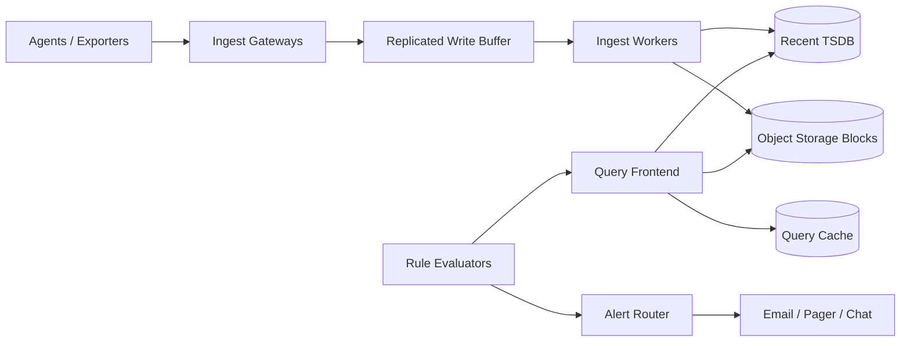
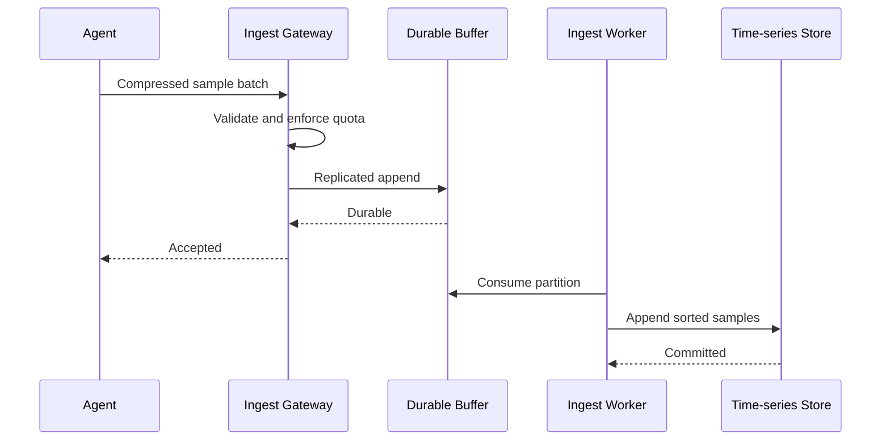
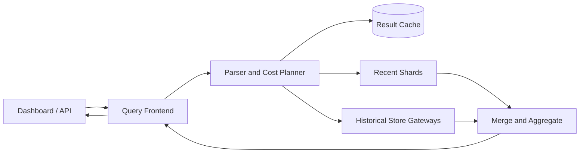
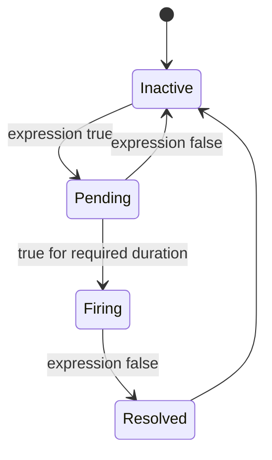

## Problem and requirements

A metrics platform collects numeric measurements from applications and infrastructure, stores them as time series, supports dashboards and ad hoc queries, and evaluates alert rules continuously. The hard parts are sustained write volume, label cardinality, efficient time-range scans, and trustworthy alerting during the same incidents that stress the monitoring system.

### Functional requirements

- Ingest counter, gauge, histogram, and summary samples
- Query series by metric name and labels over a time range
- Aggregate across hosts, services, regions, and tenants
- Render dashboards with recent and historical data
- Evaluate threshold and query-based alert rules
- Route, group, silence, and deduplicate notifications
- Apply retention and downsampling policies

### Non-functional requirements

- Sustain 10 million samples per second
- Make recent samples queryable within seconds
- Return common dashboard queries within one second
- Keep tenant data isolated and enforce ingestion limits
- Continue alert evaluation through node and zone failures
- Bound cost when users create high-cardinality labels

Distributed tracing, full-text log search, and incident management are separate systems, though metrics may link to them.

## Data model and terminology

A time series is identified by a metric name and a complete label set.

```text
http_requests_total{
  service="checkout",
  region="us-central",
  method="POST",
  status="200"
}
```

Each series contains timestamp-value samples. Changing one label value creates a different series. This makes labels powerful and dangerous: adding `user_id` to a metric can create millions of series from one line of instrumentation.

Counters only increase except at reset. Gauges move in either direction. Histograms count observations into buckets, allowing the query layer to estimate latency or size percentiles across instances.

## Capacity estimates

At **10 million samples per second**, a compact 16-byte timestamp/value pair alone produces about 13.8 TB per day. Labels, indexes, replication, and write-ahead logs add substantial overhead, while compression and downsampling reduce long-term storage.

| Resource | Estimate |
| --- | ---: |
| Samples ingested | 10M/second |
| Active time series | 100M |
| Raw sample pairs | 13.8 TB/day |
| Compressed storage at 2 bytes/sample | 1.7 TB/day |
| Retained raw data for 14 days | ~24 TB before replication |

If agents batch 1,000 samples per request, the ingest tier receives roughly 10,000 requests per second rather than 10 million. Batching is essential for protocol and compression efficiency.

## Ingestion API

Agents buffer samples, encode them in a compact binary format, compress the batch, and send it to a regional endpoint.

```http
POST /v1/metrics/write
Content-Encoding: zstd
Authorization: Bearer <tenant-token>

<compressed batch of series and samples>
```

The gateway authenticates the tenant, checks batch size and timestamps, enforces quotas, and rejects malformed labels. It returns success only after the batch enters a replicated durable buffer or the regional time-series store, depending on the durability contract.

Agents retry with exponential backoff and jitter. Every batch has an ID or deterministic sample identity so server-side retries can avoid uncontrolled duplication. Small duplicate windows are often acceptable because aggregations are more sensitive to missing data than repeated last-write-wins samples.

## High-level architecture

The write and read paths scale independently. A durable stream absorbs bursts and decouples agents from storage. Query coordinators fan out to recent and historical stores and merge partial results.



Recent storage is optimized for continuous appends and low-latency access. Older immutable blocks live in object storage and are queried through stateless store gateways. This separates expensive durable capacity from fast local disks.

## Agent collection and buffering

Run an agent near each workload. It scrapes local endpoints or receives metrics through a standard telemetry protocol, adds infrastructure labels, and batches samples.

The agent protects applications from monitoring outages. It holds a bounded disk-backed buffer and sheds low-priority metrics before exhausting the host. Monitoring should never consume all memory or disk on the system it observes.

Collection intervals are policy. A five-second interval offers better incident resolution than one minute but creates twelve times the samples. High-frequency collection should be reserved for metrics that benefit from it.

Agents attach a stable source identity. The backend can detect resets, overlapping replicas, and duplicate scraping more accurately when it knows where a sample originated.

## Write path and partitioning

Normalize label order and hash the tenant plus series identity. The hash routes all samples for a series to the same ingest shard, preserving append locality.



Hash partitioning distributes writes, but one tenant or metric can still create a hot shard. Use many virtual partitions and periodically rebalance ownership. Extremely hot series may be split by source and combined at query time if strict single-series ordering is not required.

Reject timestamps too far in the future and route late samples through a bounded out-of-order path. Unlimited backfill can force expensive rewrites of immutable blocks.

## Recent time-series storage

Each ingest node writes incoming samples to a write-ahead log before updating in-memory chunks. Samples for one series are stored together and compressed in timestamp order.

Timestamp deltas often vary little, so delta-of-delta encoding is compact. Floating-point values can use XOR encoding because adjacent measurements frequently share many bits.

When an in-memory chunk fills, flush it to a local immutable block containing:

- Compressed sample chunks
- A series-to-chunk index
- Label indexes
- Time bounds and checksums

Replicate the write-ahead log or rely on the durable ingest buffer to replay after node loss. The latter simplifies storage nodes, but replay time must fit the availability objective.

## Historical blocks and compaction

Upload immutable time-partitioned blocks to object storage. Background compactors combine small blocks, remove duplicate samples, and build larger indexes.

Never let two compactors publish overlapping replacements without coordination. Use leases and block lineage metadata. Readers ignore superseded blocks only after replacement blocks are fully uploaded and visible.

Object storage provides cheap capacity and durability, but listing and reading many tiny objects is slow. Compaction and local caching in store gateways keep query fan-out manageable.

Retention deletes complete blocks after their policy window. Tenant-specific policies may retain high-resolution samples for days, five-minute aggregates for months, and hourly aggregates for years.

## Label index and cardinality

Queries commonly select series using label matchers such as:

```text
rate(http_requests_total{service="checkout", status=~"5.."}[5m])
```

Maintain an inverted index from each `(label_name, label_value)` pair to matching series IDs. The query engine intersects and subtracts postings lists before reading sample chunks.

High-cardinality labels create large indexes, fragmented writes, and expensive fan-out. Enforce limits on:

- Active series per tenant
- New series created per minute
- Labels per series
- Label-name and label-value length
- Distinct values for selected labels

Provide cardinality reports so teams can identify problematic metrics. Silently dropping arbitrary series makes alerts untrustworthy; reject over-limit writes with clear diagnostics or apply an explicitly configured aggregation policy.

## Query path

The query frontend authenticates the tenant, parses the expression, estimates cost, splits the time range, and sends subqueries to relevant shards.



Push label filtering, time bounds, and partial aggregation down to storage nodes. Returning one partial sum per shard is far cheaper than returning every raw sample to the coordinator.

Limit scanned series, samples, wall time, and intermediate memory. A single unbounded regular expression should not exhaust a shared query fleet. Large analytical jobs can run in a separate batch tier.

Cache results by tenant, normalized query, step, time range, and data version. Queries for completed historical ranges cache longer than queries touching the moving present.

## Downsampling

Dashboards displaying 90 days of data at 1,000 horizontal pixels do not need every 10-second sample. Downsampling reduces storage and query cost.

For each interval, retain useful aggregates such as count, sum, minimum, maximum, and last value. Histograms require merging bucket counts rather than averaging precomputed percentiles.

The query planner chooses the coarsest resolution that still supplies enough points for the requested step. Raw data remains available within its shorter retention window for detailed incident analysis.

Counters need special handling around resets. Downsampling raw counter values without reset information can corrupt rates, so retain reset-aware deltas or sufficient boundaries for correct calculation.

## Alert rule evaluation

Rule evaluators run queries on a schedule and turn results into alert instances. Partition rules by tenant and rule-group ID so all rules in a group evaluate in a stable order.



The pending duration prevents brief spikes from paging operators. Persist evaluator state so a restart does not reset every pending alert or fire duplicates.

Evaluation timestamps should be deterministic. After a delay, evaluate the intended time window rather than silently shifting to “now.” Mark results unknown when required data is missing; treating missing data as healthy can hide the monitoring outage itself.

Run critical rules in redundant evaluators, but use a lease or deterministic ownership to decide which result may emit notifications. Alternatively, allow duplicates and deduplicate downstream using a stable alert fingerprint.

## Alert routing and deduplication

The alert router groups firing instances by labels such as service and region, applies inhibition and silences, and chooses notification channels.

An alert fingerprint is derived from tenant, rule, and identifying labels. Repeated evaluations update one alert rather than creating a new incident every minute.

Important controls include:

- **Grouping:** combine related instances into one notification
- **Deduplication:** suppress repeats within a configured interval
- **Inhibition:** hide symptom alerts while a root-cause alert is firing
- **Silences:** suppress matching alerts during maintenance
- **Escalation:** notify another destination if nobody acknowledges

Notification delivery uses durable queues and idempotency keys. A provider timeout may mean the message was delivered, so retries must not create an uncontrolled page storm.

The router records every policy decision and delivery attempt. Operators need to answer why an alert did or did not notify them.

## Multi-tenancy and isolation

Every series, query, rule, cache entry, and storage path includes the tenant ID. Authorization is enforced at the gateway and again inside storage services so a routing bug cannot cross tenant boundaries.

Use quotas for samples per second, active series, storage bytes, query concurrency, scan volume, rules, and notification rate. Fair queues reserve query and rule-evaluation capacity so one large tenant cannot delay others.

Heavy tenants can receive dedicated ingest or query shards while sharing object storage. This preserves operational isolation without requiring an entirely separate platform.

## Handling missing and late data

Metrics pipelines fail. Agents restart, networks partition, and exporters pause. Queries and alerts need explicit missing-data semantics.

Staleness markers indicate that a previously active series is no longer being reported. Dashboards can distinguish zero from unknown, and alert rules can intentionally fire on absent data.

Accept a bounded late-arrival window into recent storage. Samples older than that use a backfill pipeline that rewrites or overlays historical blocks. Backfills should not unexpectedly trigger present-time alerts.

Clock skew is visible in time series. Agents should synchronize clocks, while gateways reject extreme future timestamps and expose source-skew metrics.

## Failure handling

**Ingest gateway failure:** agents retry another endpoint using the same batch identity.

**Durable-buffer outage:** agents hold bounded local buffers. When full, they shed configured low-priority metrics and report data loss rather than exhausting the host.

**Ingest worker failure:** another worker resumes the partition and replays from the last checkpoint. Duplicate samples collapse by series and timestamp.

**Recent-store failure:** replicas serve queries or the buffer rebuilds recent data. Historical object-store blocks remain available.

**Query shard timeout:** the frontend may return a clearly marked partial result for dashboards. Alert evaluation should become unknown rather than treating partial data as healthy.

**Rule-evaluator failure:** ownership moves to a replica with persisted pending and firing state.

**Notification-provider failure:** durable delivery queues retry with backoff and route critical alerts to fallback channels.

**Regional failure:** agents switch regions, queries use replicated object storage, and alert-rule ownership transfers with fencing epochs to prevent dual notification streams.

## Observability for the observability system

The platform needs an independent minimal monitoring path. If it depends entirely on itself, a total outage can suppress every warning.

Track:

- Accepted, rejected, delayed, and dropped samples
- Active-series creation and churn
- Buffer lag and storage flush latency
- Query duration, scan volume, cache hit rate, and partial responses
- Rule-evaluation delay and missing-data results
- Alert state transitions and notification delivery latency
- Block compaction, replication, and deletion failures
- Tenant quota utilization

Use synthetic canaries that emit a known metric, query it, trigger a test rule, and verify receipt through each notification channel. This validates the complete path rather than isolated service health.

## Security and privacy

Metrics can contain sensitive identifiers even when they are numeric. Reject secrets and personal data in label values through instrumentation guidance, automated detection, and policy controls.

Encrypt transport and storage, scope agent credentials to one tenant, and audit dashboard, query, rule, and silence changes. Treat notification templates as untrusted input and escape label values before rendering into email or chat markup.

Retention and deletion policies must cover object-store blocks, caches, backups, and derived downsampled data. Removing only raw samples does not satisfy deletion if aggregates retain sensitive dimensions.

## Trade-offs

**Push vs. pull collection:** pull centralizes target discovery and health checking. Push works better for short-lived jobs and restricted networks but requires stronger client buffering and identity controls.

**Local disk vs. object storage:** local disks provide fast recent reads and writes. Object storage offers durable, elastic capacity for immutable historical blocks. A tiered design uses both.

**Availability vs. strict deduplication:** rejecting duplicates everywhere requires coordination on the ingest path. Accepting bounded duplicates and collapsing them by timestamp is usually more resilient.

**Cardinality vs. analytical freedom:** arbitrary labels enable powerful queries but can make ingestion and indexes unbounded. Production systems need explicit budgets.

**Fresh alerts vs. complete data:** evaluating immediately reduces detection delay but may act on late or partial samples. A small evaluation delay improves completeness at the cost of response time.

**Partial queries vs. hard failure:** dashboards may benefit from marked partial data during a shard outage. Alerts should fail to unknown because partial data can produce dangerous false reassurance.

The central design separates continuous high-volume ingestion from query and alert workloads, while immutable historical blocks make long retention economical. Above all, the system must expose uncertainty honestly: missing data is not zero, and a broken monitoring path is itself an incident.
