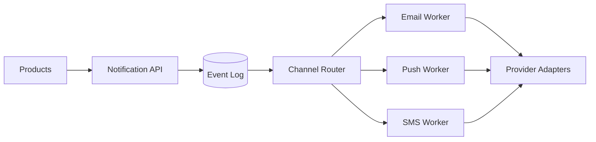

## Requirements

Product services submit notification requests without depending on a specific delivery provider. Users control channel preferences and quiet hours.

- Email, push, and SMS channels
- Templates and localization
- Retries with deduplication
- Delivery status and analytics

## Delivery pipeline

An ingestion API validates requests and writes them to a durable event log. Channel workers enrich messages with templates and preferences before sending through provider adapters.

## Reliability

Every request carries an idempotency key. Workers use exponential backoff for transient failures and move exhausted messages to a dead-letter queue for investigation or replay.

## Provider strategy

Adapters isolate provider-specific APIs. Health scores and cost rules support automatic failover without changing the upstream notification contract.
