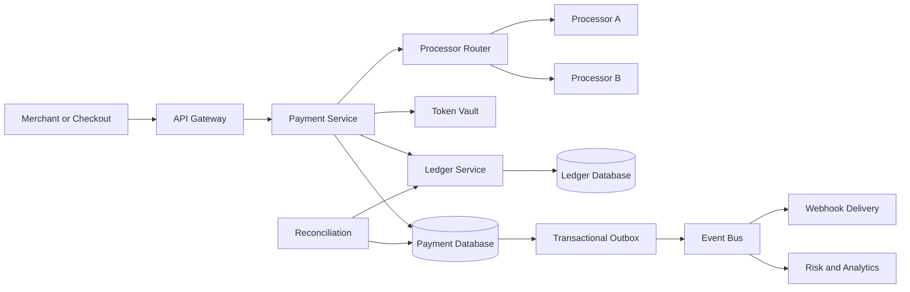
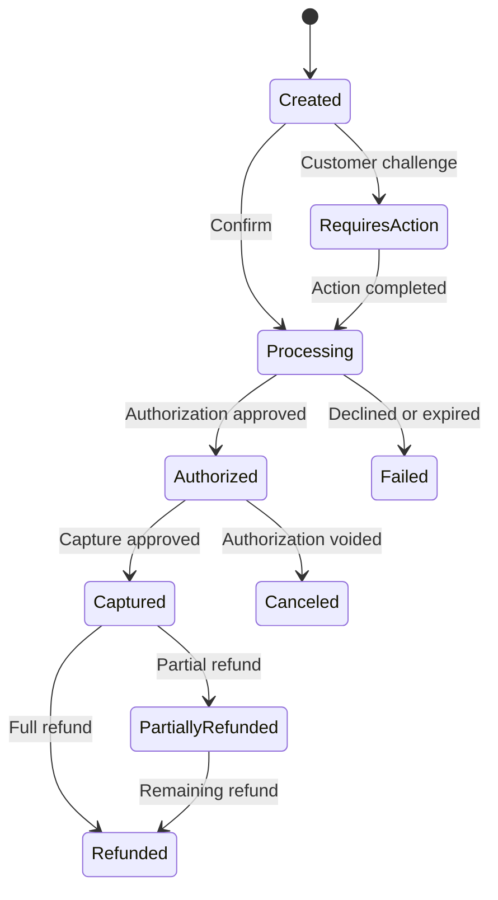
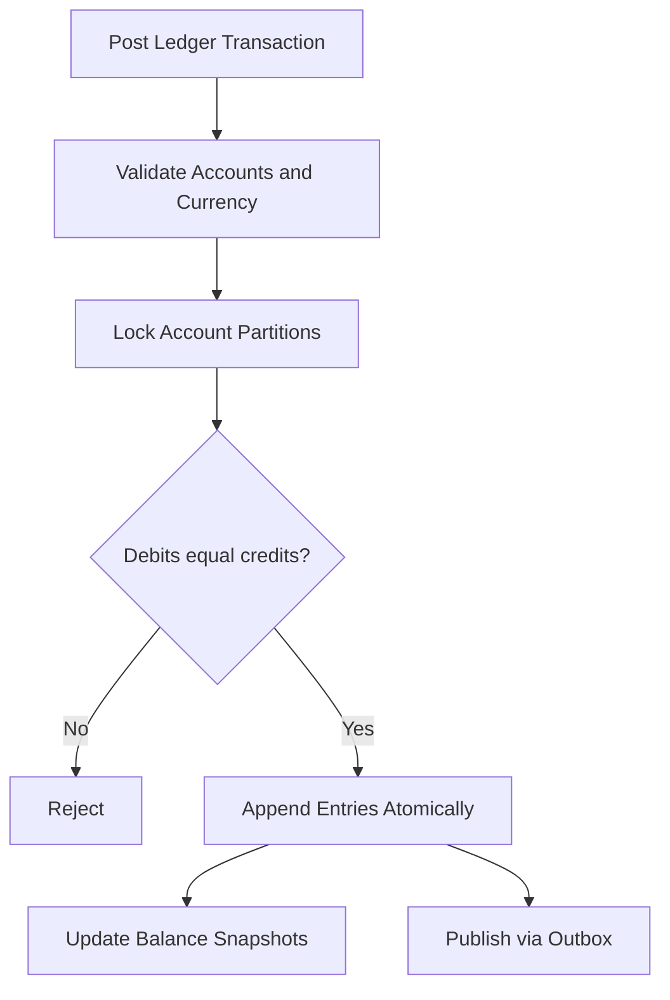
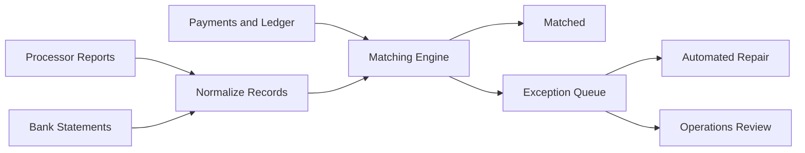

## Problem and requirements

A payment system accepts money from a customer and makes it available to a merchant. The difficult part is not sending an API request to a bank. It is preserving a correct financial history while several external systems respond slowly, retry requests, deliver events out of order, or disagree about the outcome.

This design covers card payments for an online platform. Bank transfers, wallets, and regional payment methods can use the same payment and ledger abstractions, but each needs a specialized connector and state machine.

### Functional requirements

- Create and confirm a payment
- Authorize funds and capture them immediately or later
- Support retries without charging the customer twice
- Refund all or part of a captured payment
- Notify merchants of state changes through webhooks
- Track platform fees and merchant balances
- Reconcile internal records with processors and banks
- Provide an auditable transaction history

### Non-functional requirements

- Never lose or silently duplicate a financial operation
- Keep the payment API available during processor degradation
- Return synchronous API responses within one second at the 99th percentile
- Preserve an immutable, traceable financial record
- Isolate card data and minimize PCI scope
- Encrypt sensitive data in transit and at rest
- Support safe replay, rollback, and disaster recovery

Exactly-once delivery is not available across the internet. The practical goal is **effectively-once financial effects** using idempotent commands, durable state transitions, immutable ledger entries, and reconciliation.

## Capacity estimates

Assume 100 million customers, 20 million payments per day, and a ten-times peak during major sales.

| Resource | Average | Peak assumption |
| --- | ---: | ---: |
| Payment attempts | 230/second | 10,000/second |
| Ledger entries | 1,000/second | 50,000/second |
| Processor events | 500/second | 20,000/second |
| Webhook deliveries | 500/second | 25,000/second |
| Financial records retained | Billions | Multi-year retention |

Payment traffic is modest compared with a social feed, but each write has a much higher correctness and audit burden. Storage volume is manageable; consistency, traceability, and operational safety dominate the design.

## API design

The client creates a payment intent before collecting confirmation. The intent is the durable business object for one purchase attempt.

```http
POST /v1/payment-intents
Authorization: Bearer <merchant-token>
Idempotency-Key: order_981_charge_1
Content-Type: application/json

{
  "amount": 4999,
  "currency": "USD",
  "merchantOrderId": "order_981",
  "paymentMethodToken": "pm_tok_82",
  "captureMethod": "automatic"
}
```

```json
{
  "id": "pi_01K6A2V8",
  "status": "processing",
  "amount": 4999,
  "currency": "USD",
  "clientAction": null
}
```

Amounts use integers in the currency's smallest unit. Never use binary floating point for money. The currency is immutable after creation, and every operation validates currency-specific precision and limits.

The API returns the current durable state, not a promise that settlement is complete. Some payment methods require a redirect or customer challenge, represented as a structured `clientAction`.

## High-level architecture

The payment service owns the workflow. Processor adapters translate the internal model into provider-specific requests and responses. The ledger records financial effects independently from workflow status.



The synchronous path performs only work required to obtain a processor decision and durably record it. Notifications, analytics, receipts, and most downstream updates run asynchronously.

## Payment state machine

A payment is a state machine, not a boolean success flag.



Transitions are explicit and validated. A conditional database update includes the expected current version, so two workers cannot both move the same payment from `authorized` to incompatible states.

Processor status and customer-facing status should remain separate. A timeout means the outcome is unknown, not failed. Mark it `processing`, poll or await a provider event, and resolve it through reconciliation.

## Idempotency and duplicate prevention

Clients retry when connections fail after sending a request. Without an idempotency key, the server may create a second charge even though the first request succeeded.

Store the key with:

- Merchant or tenant scope
- Operation name
- Canonical request hash
- Resource ID and response
- Execution status and expiration time

The first request reserves the key in the same transaction that creates the payment. A retry with an identical body receives the original response. Reusing the key with different input returns a conflict.

Internal operations also carry stable IDs. The processor request uses a deterministic attempt ID when the provider supports idempotency. Consumers deduplicate event IDs before applying state transitions.

Idempotency prevents repeated effects from the same command. It does not replace unique constraints, state-machine validation, or reconciliation.

## Authorization and capture

Authorization asks the issuer to reserve funds. Capture converts that authorization into a transfer obligation.

Automatic capture performs both as one customer-visible operation. Delayed capture is useful when a merchant must confirm inventory or complete a service first. Authorizations expire, so the system records the provider's expiration time and alerts merchants before the capture window closes.

Partial captures and incremental authorizations complicate the model. Track every provider operation as a separate attempt linked to the payment rather than overwriting a single provider response.

The API validates that total captures never exceed the authorized amount and total refunds never exceed captured funds. These checks occur transactionally with the corresponding ledger command.

## Processor routing and adapters

The router selects a processor using payment method, currency, region, merchant configuration, observed success rate, cost, and health.

Each adapter implements a common contract:

- Authorize, capture, void, and refund
- Parse synchronous responses
- Verify and normalize incoming webhooks
- Query an operation by stable reference
- Map provider errors into retryable, declined, or unknown categories

Do not automatically send an ambiguous authorization to another processor. The first processor may have approved it despite the timeout, causing a double charge. Resolve the original attempt before rerouting.

Circuit breakers stop new traffic to an unhealthy processor. Existing unknown operations continue through status queries and reconciliation. Routing rules are versioned so every decision can be explained later.

## Immutable double-entry ledger

Payment status answers what happened in the workflow. The ledger answers who owns how much money.

Every financial transaction contains balanced debit and credit entries. For a $50 payment with a $2 platform fee:

| Account | Debit | Credit |
| --- | ---: | ---: |
| Processor receivable | $50 | — |
| Merchant payable | — | $48 |
| Platform fee revenue | — | $2 |

Debits must equal credits for each ledger transaction. Entries are append-only; corrections create reversing entries rather than editing history.



Balances are derived from entries. Cached balance snapshots speed reads but can be rebuilt from the journal. Maintain separate pending and available accounts so unsettled funds cannot be paid out prematurely.

Partition the ledger by legal entity and currency. Cross-partition transactions require a carefully controlled clearing account or a ledger implementation that can commit all entries atomically.

## Transactional outbox and event delivery

Updating the payment row and publishing an event in separate operations creates a dual-write problem. A crash between them leaves the database and event bus inconsistent.

Write the state change and an outbox record in one database transaction. A relay publishes pending outbox rows and records progress. Publication is at least once, so consumers still deduplicate by event ID.

Events contain resource ID, event type, version, occurrence time, and schema version. Consumers ignore older resource versions that arrive after newer ones.

Keep event payloads small and avoid sensitive payment credentials. Consumers can fetch authorized details from the source service when needed.

## Webhooks

Merchants need asynchronous notification because payments may complete after the API response.

Webhook delivery is at least once. Sign each payload with a rotating secret and timestamp. Merchants verify the signature, reject stale timestamps, and deduplicate the event ID.

The delivery service:

1. Reads merchant events from a durable queue
2. Sends with a short timeout
3. Records the HTTP result and latency
4. Retries failures with exponential backoff and jitter
5. Moves persistently failing events to a dead-letter queue

Preserve ordering per payment when practical, but do not promise global ordering. Include the payment version and offer a retrieval API so merchants can obtain current state after receiving any event.

## Refunds, disputes, and chargebacks

A refund creates a new operation and reversing ledger entries; it never changes the original charge. Partial refunds accumulate under a transactional limit.

Refund requests may remain pending for days. Return the refund resource immediately and update it asynchronously from processor events and reconciliation.

A chargeback is initiated outside the platform when a customer disputes a charge. It has its own lifecycle, evidence deadlines, fees, and provisional ledger movements. Model disputes separately rather than treating them as refunds.

If the merchant balance is insufficient, debit a reserve or negative-balance account according to the platform's risk policy.

## Reconciliation

Reconciliation is the final correctness layer. It compares three views:

- Internal payment operations
- Internal ledger entries
- Processor and bank settlement reports



Match by provider reference, amount, currency, operation type, and settlement date. Classify mismatches such as missing internal records, missing provider records, amount differences, duplicates, or timing gaps.

Automate safe repairs through the same audited command path used by normal operations. Never patch balances directly. Daily reconciliation is common, while high-risk signals can run continuously.

## Data model

Core records include:

- **Payment intent:** business amount, currency, merchant, status, and version
- **Payment attempt:** each processor request and normalized result
- **Refund:** amount, reason, status, and linked capture
- **Ledger transaction:** balanced business event
- **Ledger entry:** account, currency, direction, and amount
- **Idempotency record:** scoped key, request hash, and stored result
- **Outbox event:** durable message awaiting publication
- **Webhook delivery:** endpoint, attempt count, and response metadata
- **Reconciliation exception:** mismatch evidence and resolution

Use globally unique, non-sequential public IDs. Database primary keys may differ from merchant order IDs, which are not always globally unique.

Financial rows include creation time, source operation, actor, request ID, and schema version. Audit logs record administrative actions without duplicating sensitive payloads.

## Security and compliance

The browser or mobile client sends card details directly to a hosted payment field or isolated tokenization service. The main application receives an opaque token, reducing the systems that handle primary account numbers.

Security controls include:

- TLS between every component
- Encryption with managed, regularly rotated keys
- Strict service identities and least-privilege access
- Network isolation for the card-data environment
- Redaction of credentials from logs, traces, and events
- Multi-party approval for high-risk operational actions
- Tamper-evident audit trails
- Retention and deletion policies for personal data

Payment tokens are scoped to the merchant and intended use. A leaked token should not reveal card data or work as a general-purpose credential.

Risk checks run before authorization using amount, account history, device, velocity, and merchant signals. The system may allow, block, or request stronger customer authentication. Risk decisions and model versions are recorded for review.

## Failure handling

### Processor timeout

Persist the attempt as unknown and query it using the same provider reference. Do not classify the payment as declined or blindly retry against another processor.

### Database failure after provider approval

The stable provider attempt ID lets recovery query the outcome. Reconciliation detects any approval not reflected internally and posts the missing transition through an audited repair command.

### Event bus outage

Payment writes continue while outbox rows accumulate. Apply backpressure or shed nonessential work if backlog approaches storage limits.

### Ledger unavailable

Do not report a captured payment as financially complete until its ledger transaction is durably posted. Queue bounded recovery work only when the invariant and customer contract permit it.

### Duplicate or out-of-order webhook

Verify the signature, deduplicate the provider event ID, and apply only a valid versioned state transition. Query the provider when an event conflicts with known state.

### Region failure

Route new traffic to a healthy region. Use a single writer home for each payment or a database with proven serializable multi-region semantics; conflicting active writers are dangerous for money movement.

## Observability and operations

Track technical and financial signals separately.

Technical metrics include API latency, availability, processor timeouts, queue lag, webhook success, and database contention. Business metrics include authorization rate, capture rate, duplicate prevention, refund rate, reconciliation breaks, and ledger imbalance attempts.

Every request receives a correlation ID that links API calls, attempts, ledger transactions, events, and webhook deliveries. Traces must exclude card data and other secrets.

Alert on symptoms that threaten correctness:

- Growing unknown payment states
- Outbox or reconciliation backlog
- Provider success-rate changes by issuer or region
- Non-zero ledger imbalance rejection
- Unusual idempotency conflicts
- Webhook dead-letter growth
- Balance snapshot divergence from journal entries

Operational tools should expose safe commands such as retry delivery, refresh provider status, or post an approved reversal. They should not permit arbitrary status or balance edits.

## Key tradeoffs

### Strong consistency vs availability

Ledger writes and per-payment state transitions favor consistency. Analytics, receipts, and merchant notifications favor availability through asynchronous delivery.

### Synchronous vs asynchronous completion

Synchronous authorization gives fast checkout feedback, but the API must represent `processing` when the outcome is uncertain. Pretending every operation completes within one request creates incorrect failure handling.

### One processor vs several

One processor is simpler and cheaper to operate. Multiple processors improve regional coverage and resilience but require normalization, careful routing, and much stronger reconciliation.

### Build vs buy the ledger

A custom ledger can match the product precisely but carries a permanent correctness burden. A proven ledger platform is preferable when it satisfies currency, partitioning, audit, and operational requirements.

The central principle is simple: external payment outcomes may be delayed or ambiguous, but the internal record must remain durable, balanced, explainable, and repairable.
