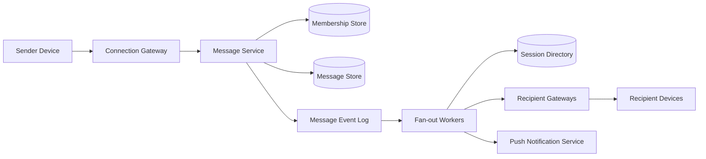
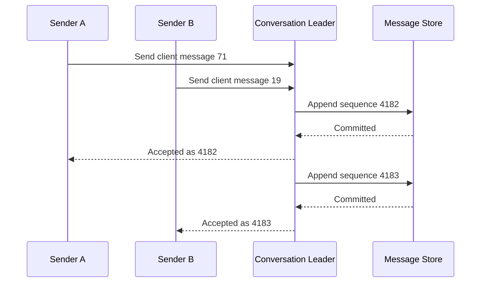
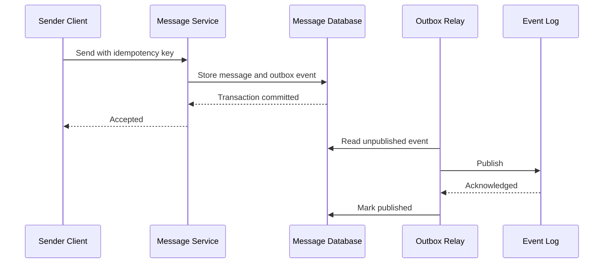
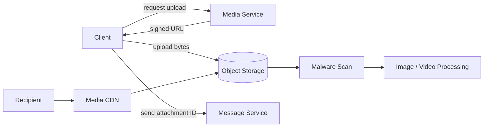

## Problem and requirements

A chat system lets people exchange messages with low perceived latency across direct conversations and groups. The difficult parts are not the text box—they are maintaining millions of long-lived connections, defining message order, synchronizing multiple devices, and recovering cleanly from partial failure.

### Functional requirements

- Send and receive one-to-one and group messages
- Preserve a stable order within each conversation
- Synchronize message history across a user’s devices
- Show sent, delivered, and read states
- Support online presence and typing indicators
- Deliver notifications when recipients are offline
- Attach images and files

### Non-functional requirements

- Deliver online messages in under 200 milliseconds at the 99th percentile
- Keep accepted messages durable
- Support 100 million daily users and millions of concurrent connections
- Continue operating through machine and availability-zone failures
- Protect conversation content and metadata from unauthorized access
- Degrade optional features before message delivery

Full-text search, voice calls, public channels, and end-to-end encryption key management are extensions rather than first-version requirements.

## Capacity estimates

Assume 100 million daily users, 50 messages per user per day, and 10% of users connected at the busiest moment.

| Resource | Average | Peak assumption |
| --- | ---: | ---: |
| Messages sent | 58,000/second | 500,000/second |
| Concurrent connections | — | 10 million |
| Text written at 1 KB/message | 5 TB/day | Before replication |
| Connection memory at 10 KB/session | — | ~100 GB across gateways |

Delivery events, indexes, reactions, and replication multiply the storage footprint. Media dominates bytes and belongs in object storage rather than the message database.

One sent group message can produce thousands of deliveries. Capacity planning must measure both **messages accepted** and **recipient deliveries**.

## Client protocols and APIs

Clients use HTTPS for history, conversation management, and media upload. A WebSocket carries live messages and ephemeral events after authentication.

```http
POST /v1/conversations/c_82/messages
Idempotency-Key: device17-0001842
Content-Type: application/json

{
  "clientMessageId": "device17-0001842",
  "type": "text",
  "text": "Are we still meeting at 3?"
}
```

```json
{
  "messageId": "msg_01K5A2D9",
  "conversationId": "c_82",
  "sequence": 4182,
  "createdAt": "2026-09-12T18:42:10.184Z"
}
```

The idempotency key makes a timeout safe to retry. The server-generated conversation sequence is the ordering authority; client clocks are display hints only.

WebSocket events carry a monotonically increasing per-user stream position. After reconnecting, a device requests events after its last committed position and repairs any gap through the sync API.

## High-level architecture

Connection gateways terminate WebSockets and maintain session state. The message service validates membership, assigns order, stores the message, and publishes a durable event. Fan-out workers route that event to online sessions or offline notification processing.



The durable message event log separates acceptance from delivery. Once the message and event are committed, fan-out may retry without asking the sender to resend.

## Managing connections

Gateways hold many long-lived WebSockets and perform little business logic. They authenticate the session, enforce frame limits, send heartbeats, apply connection-level backpressure, and forward commands to internal services.

The session directory maps a user ID to active gateway and connection IDs. Entries use leases refreshed by gateway heartbeats, so crashed gateways disappear automatically. A user can have several sessions for phones, browsers, and desktop clients.

```text
user_42 -> [
  { gateway: "gw-17", connection: "a9f", device: "phone" },
  { gateway: "gw-03", connection: "21c", device: "laptop" }
]
```

Gateways should be replaceable. A deployment drains existing connections, stops accepting new ones, and gives clients time to reconnect elsewhere. Clients use exponential backoff with jitter so a regional disruption does not create a synchronized reconnection storm.

Connection state is soft state. Message durability and synchronization never depend on one gateway remembering what it sent.

## Message ordering

There is no useful global order across every conversation. The product needs a stable order **within one conversation**.

Route all writes for a conversation to the same logical partition leader. The leader allocates increasing sequence numbers and appends messages in that order. Hashing `conversation_id` distributes conversations across partitions.



Sequence allocation and durable append must occur atomically. Otherwise a crash can leave permanent unexplained gaps or assign one sequence twice.

Clients display messages by sequence, buffer short gaps, and request missing ranges. Optimistic local messages appear immediately with a pending state and are reconciled when the server returns the authoritative ID and sequence.

Very large conversations can make one partition hot. A single conversation still needs one ordering authority, but delivery fan-out can be parallelized after the ordered append.

## Message storage

The primary query is “load messages in this conversation before or after this sequence.” Partition by conversation and cluster by sequence.

| Field | Purpose |
| --- | --- |
| `conversation_id` | Partition identity |
| `sequence` | Stable order and pagination cursor |
| `message_id` | Global identity and deduplication |
| `sender_id` | Authorization and display |
| `content` | Text or encrypted payload |
| `attachment_refs` | Object-storage references |
| `created_at` | Server acceptance time |
| `deleted_at` | Tombstone for deletion |

Large conversations should use bucketed partitions such as `(conversation_id, sequence_range)` so one physical partition does not grow forever. A conversation metadata record points to its current bucket.

Messages are immutable after acceptance. Edits and deletions become events referencing the original message. This preserves synchronization history and avoids replicas silently disagreeing about overwritten content.

## Durable acceptance

The system should acknowledge a send only after storing the message and a fan-out event durably. A transactional database can commit both records together. With separate storage and event systems, use a transactional outbox.



The relay can publish more than once, so downstream consumers deduplicate by message ID. This provides at-least-once event delivery without losing accepted messages.

## Fan-out strategies

For direct messages and small groups, **fan-out on write** creates a lightweight inbox event for every recipient. Reads are fast because each user consumes one ordered event stream.

For groups with millions of members, copying one event per recipient is too expensive. **Fan-out on read** stores one conversation event and lets clients fetch it based on membership. Large groups may also maintain regional broadcast channels for online members.

A hybrid policy works well:

- Direct and small-group messages: fan-out on write
- Medium groups: parallel batched fan-out
- Very large groups: shared log with fan-out on read

The conversation’s delivery mode belongs in metadata so workers choose the appropriate path. Changing modes must preserve each user’s synchronization cursor.

## Multi-device synchronization

Each user has a durable event stream containing new messages, edits, deletions, receipts, and conversation changes visible to that user. Events receive increasing stream positions.

Every device stores its last applied position. On reconnect, it asks for events after that cursor. If the cursor is too old for the event retention window, the client performs a full state reconciliation and establishes a new cursor.

Delivery means at least one recipient device received the event. Read state is usually maintained per user rather than per device: when one device marks sequence 4182 read, the service publishes that update to the user’s other devices and the sender.

Receipts are high-volume metadata. Store the highest delivered and read sequence per user per conversation rather than one row per message whenever the product semantics allow it.

## Presence and typing indicators

Presence is ephemeral and does not belong in the durable message path. Gateways refresh short-lived session records. A presence service aggregates device state into user-level states such as online or recently active.

Typing indicators are lossy events with a short expiry. Send them through an ephemeral pub/sub channel, rate-limit them, and never retry them after reconnect. A missing “stopped typing” event is handled by a client timeout.

For large groups, broadcasting every presence change is prohibitively expensive. Return presence only for visible participants or close contacts, and use approximate aggregate counts for large communities.

If presence fails, messaging continues. Optional real-time signals must not consume capacity reserved for durable messages.

## Offline delivery and notifications

Fan-out checks the session directory. If no active recipient session confirms delivery within a short window, publish a notification candidate.

The notification service applies preferences, quiet hours, device tokens, collapse rules, and privacy-safe preview policy before calling APNs, FCM, or another provider.

Notification processing is intentionally asynchronous. A provider outage should delay push notifications without delaying message acceptance. When a user reads the conversation on another device, cancel queued notifications where possible.

Push notifications are hints, not the source of truth. Opening the app always synchronizes from the durable event stream.

## Media attachments

Clients do not upload large media through a connection gateway. They request a short-lived upload URL, send the object directly to storage, and include the returned attachment ID in the message.



The media record moves through pending, safe, or rejected states. Recipients see a processing placeholder until scanning and transformations finish. Signed download URLs enforce conversation authorization and expire quickly.

## Backpressure and slow clients

Every connection has a bounded outbound buffer. If a client cannot read fast enough, drop ephemeral events first. If durable events continue accumulating, close the connection and require the client to recover through synchronization.

An unbounded gateway buffer lets one slow phone consume memory until the gateway fails and disconnects thousands of healthy users.

Internal fan-out queues use per-tenant and per-conversation quotas. A viral large group must not delay direct messages. Worker pools and queue partitions can reserve capacity for different conversation classes.

## Security and privacy

Every send, history read, receipt, and attachment request checks current conversation membership. Gateway authentication alone is not enough because membership can change during a session.

Rate-limit message sends, conversation creation, invitations, and typing events independently. Apply spam detection before expensive fan-out.

Encrypt traffic in transit and message data at rest. With end-to-end encryption, servers store ciphertext and clients manage conversation keys. That improves content privacy but complicates multi-device enrollment, search, moderation, backups, and notification previews.

Logs and analytics must not contain message bodies or attachment URLs. Retention and deletion behavior should be explicit, including how long tombstones and backups remain.

## Failure handling

**Gateway failure:** clients reconnect and resume from their last event cursor. No durable message is lost.

**Message partition leader failure:** a replicated follower becomes leader. Clients retry with the same idempotency key and receive the original result if the first attempt committed.

**Fan-out delay:** messages remain durable in the event log. Online delivery is late, but history and eventual synchronization remain correct.

**Session-directory outage:** accept messages and defer or attempt best-effort fan-out. Clients repair gaps through sync.

**Push-provider outage:** buffer notification candidates with bounded retention. Do not send stale notifications after the user has already read the conversation.

**Regional failure:** reconnect clients to a healthy region. Conversation leadership must move with a new epoch so two regions cannot assign overlapping sequences. Cross-region replication determines the recovery-point objective.

## Observability and operations

Track the full message journey:

- Send acceptance latency and error rate
- Replication and outbox lag
- Fan-out delay by conversation class
- Online delivery latency and success rate
- Active connections, reconnect rate, and gateway buffer size
- Sync gap frequency and events replayed
- Push-notification delay and provider errors
- Hot conversations and partition imbalance

Synthetic clients should continuously send, receive, reconnect, and synchronize across regions. Server health can look normal while an event-stream cursor bug silently leaves real devices stale.

Deploy protocol changes with explicit versions. Mobile clients may remain old for months, so gateways and event schemas need a compatibility window.

## Trade-offs

**WebSocket vs. polling:** WebSockets give low-latency bidirectional delivery with efficient steady-state traffic, but require connection management and careful backpressure. Long polling is operationally simpler but adds repeated request overhead and latency.

**Fan-out on write vs. read:** write fan-out makes recipient reads cheap but amplifies storage and work for large groups. Read fan-out avoids copies but makes every recipient resolve shared history.

**Per-conversation ordering vs. global ordering:** conversation ordering matches user expectations and scales horizontally. Global ordering adds coordination without meaningful product value.

**Availability vs. cross-region consistency:** accepting writes independently in multiple isolated regions keeps chat writable but can create conflicting conversation order. Single-region leadership per conversation provides a cleaner order at the cost of temporary unavailability during failover.

**Rich presence vs. cost:** detailed live state feels responsive but creates enormous fan-out and privacy concerns. Coarse, scoped, ephemeral presence is more sustainable.

The central design is a durable ordered conversation log plus a separate best-effort real-time delivery layer. Connections may disappear, notifications may be delayed, and presence may be wrong—but accepted messages and synchronization must remain correct.
