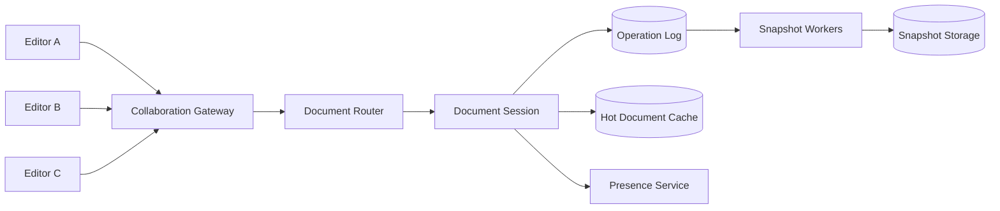
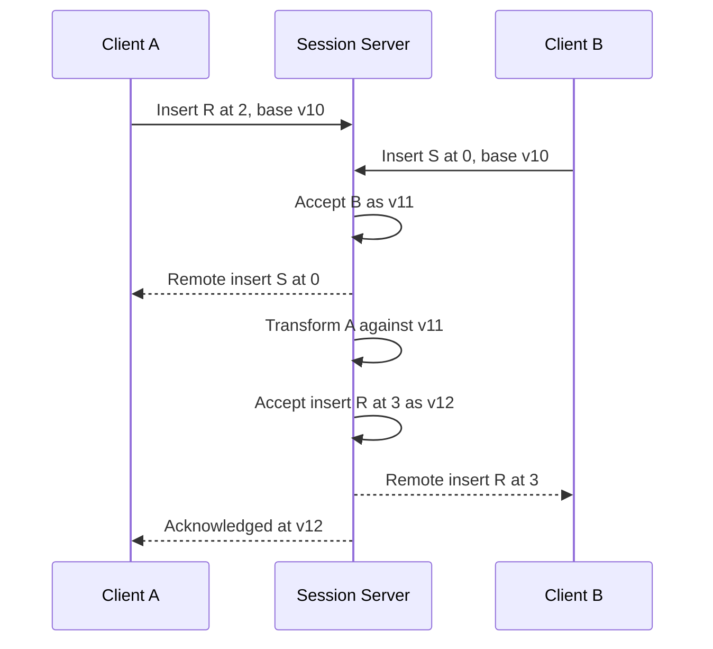
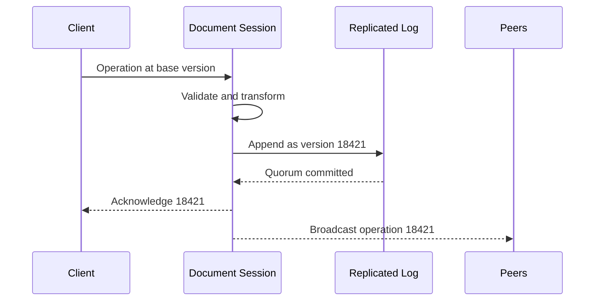
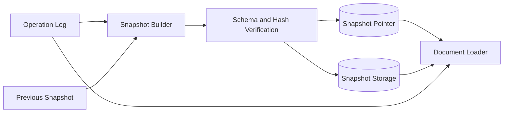

## Problem and requirements

A collaborative editor lets several users view and modify the same document at the same time. Every participant should see changes quickly, cursors should feel live, and concurrent edits should converge without silently losing work.

### Functional requirements

- Create, read, rename, and delete documents
- Edit text and basic rich-text structure concurrently
- Show active collaborators, selections, and cursors
- Support comments and suggestions
- Work briefly offline and synchronize after reconnecting
- Preserve version history and restore older versions
- Share documents with viewer, commenter, and editor roles

### Non-functional requirements

- Reflect online edits to collaborators within 200 milliseconds
- Ensure every client eventually converges to the same document
- Never lose an acknowledged edit
- Continue editing through connection and server interruptions
- Support large documents without replaying their complete history
- Enforce permission changes promptly

Spreadsheets, arbitrary embedded applications, and full document-layout rendering require specialized models and are outside the first version.

## Capacity estimates

Assume 100 million documents, one million concurrent editors, and an average active user producing two operations per second.

| Resource | Average or peak |
| --- | ---: |
| Active editing operations | 2M/second |
| Persistent connections | 1M |
| Presence updates at 1/second | 1M/second |
| Raw operation data at 200 bytes | 400 MB/second |
| Daily operation history | ~35 TB before compression |

Presence traffic can approach editing traffic but is ephemeral and must not consume durable-write capacity. Document snapshots and operation compaction keep storage and load times bounded.

## Document and operation APIs

HTTPS handles document metadata, snapshots, history, and sharing. A WebSocket carries editing operations, acknowledgements, and presence.

```http
GET /v1/documents/doc_42/snapshot
Authorization: Bearer <token>
```

```json
{
  "documentId": "doc_42",
  "version": 18420,
  "content": { "type": "doc", "children": [] },
  "syncToken": "snapshot-18420"
}
```

An edit message includes a client ID, monotonically increasing client sequence, base server version, and operation payload.

```json
{
  "type": "operation",
  "documentId": "doc_42",
  "clientId": "device_17",
  "clientSequence": 902,
  "baseVersion": 18420,
  "operation": { "insert": "hello", "at": 128 }
}
```

The client sequence makes retries idempotent. The server acknowledgement returns the authoritative document version and any transformed operation needed for reconciliation.

## High-level architecture

Clients connect to collaboration gateways. A document router directs all operations for one document to its active collaboration session. The session orders operations, persists them, and broadcasts accepted changes.



One logical session owns ordering for a document at a time. Sessions are distributed across many servers by document ID. Cold documents have no active session and load from the latest snapshot plus subsequent operations when opened.

## Document model

Plain strings are insufficient for headings, lists, links, comments, and formatting. Represent content as a tree of typed nodes with stable IDs.

```text
document
  paragraph node_10
    text node_11 "System design"
  list node_20
    list_item node_21
      text node_22 "Requirements"
```

Operations target node IDs and logical positions rather than fragile DOM paths. Schema validation rejects malformed structures and prevents incompatible clients from creating invalid trees.

The model version travels with snapshots and operations. Migrations either transform old snapshots on load or upgrade them offline. Clients advertise supported schema versions, allowing the server to block unsupported edits while still permitting read-only access.

## Concurrency control choices

Two common families solve concurrent editing: **Operational Transformation** and **Conflict-free Replicated Data Types**.

Operational Transformation transforms incoming operations against concurrent operations already accepted by the server. If one user inserts at position 5 while another inserts at position 3, the first operation’s position shifts so both intentions survive.

CRDTs assign stable identities and ordering metadata to content elements. Concurrent inserts and deletes commute, allowing replicas to merge without one central transformation order.

For a server-coordinated editor with brief offline support, OT offers compact document state and straightforward authoritative ordering. CRDTs provide stronger peer and offline behavior but add identifier, tombstone, and metadata overhead. This design uses OT while keeping the transport and storage model adaptable.

## Operational transformation

Suppose two clients start at version 10 with `CAT`:

- Client A inserts `R` at position 2, intending `CART`
- Client B inserts `S` at position 0, intending `SCAT`

The server accepts B first as version 11. A’s operation is transformed against B, moving its position from 2 to 3. Applying it produces `SCART`. B receives A’s transformed operation; A receives acknowledgement plus B’s operation and converges to the same text.



Transform functions must cover every operation pair: insert/insert, insert/delete, delete/delete, formatting changes, node moves, and structural edits. They require algebraic tests proving convergence and intention preservation across many interleavings.

Clients maintain three views: confirmed server state, one outstanding operation awaiting acknowledgement, and a buffer of newer local edits. Remote operations transform against both outstanding and buffered work before display.

## Server ordering and persistence

The document session assigns each accepted operation a strictly increasing version. Before broadcasting success, it appends the operation durably to a replicated log.



If the client disconnects before receiving the acknowledgement, it retries with the same client sequence. The session returns the stored result rather than applying the operation twice.

Operations from a client with an old base version are transformed through every intervening operation. If the gap exceeds the retained transform window, the server asks the client to rebase onto a newer snapshot.

Only the current session owner may assign versions. Ownership uses a lease and fencing epoch so an old server recovering from a network partition cannot continue accepting operations.

## Session routing and ownership

Hash the document ID to a routing shard that records its active session server and epoch. Gateways cache routing results and refresh when redirected.

When the first editor opens a cold document, a session server acquires ownership, loads the latest snapshot, replays later operations, and begins accepting connections. Subsequent editors route to that owner.

A hot document may have thousands of viewers but only one ordering authority. The owner can broadcast through regional relays to scale outbound traffic while retaining one operation sequence.

If a document becomes too hot for one server’s transformation rate, the model needs finer-grained ordering domains, such as independent document blocks. This complicates cross-block operations and is a deliberate later optimization.

## Snapshots and compaction

Replaying millions of operations whenever a document opens is too slow. Snapshot workers periodically materialize document state at a known version and store it as an immutable compressed blob.



Publishing the snapshot pointer occurs only after the blob is complete and verified. A loader fetches the latest snapshot and applies operations after its version.

Keep operations required by offline clients and version history even after creating snapshots. Older operation segments can move to cheaper storage or be compacted into historical snapshots according to retention policy.

Snapshot frequency depends on operation volume and load-time targets. Hot documents snapshot more frequently; cold documents may snapshot only after a threshold number of changes.

## Offline editing and reconnection

The client stores its last confirmed snapshot, server version, outstanding operation, and local buffer durably. It continues accepting edits while offline.

On reconnect:

1. Authenticate and fetch operations after the last confirmed version.
2. Apply remote operations to confirmed state.
3. Transform buffered local operations against the remote operations.
4. Send rebased local operations in client-sequence order.
5. Persist acknowledgements before discarding local records.

Long offline periods may cross schema migrations or operation-retention windows. The client then downloads a fresh snapshot and applies a semantic merge. If the changes cannot be represented safely, preserve them as a conflict copy rather than silently dropping work.

OT assumes a server-ordered history. A CRDT is often preferable when multi-day offline editing and decentralized merging are central requirements.

## Presence and cursors

Presence, cursor positions, and selections are ephemeral. Send them through a separate lossy channel and never append them to the durable operation log.

Cursor positions must transform as edits occur. A position includes an affinity—before or after an insertion—so two cursors at the same offset behave predictably when text arrives there.

Throttle presence updates and broadcast them only to active document participants. A short TTL removes disconnected users even if a final “leave” event is lost.

If the presence service fails, editing continues. Durable operations always have priority over cursor animation.

## Comments and suggestions

Comments anchor to node IDs and logical ranges, with surrounding text captured as context. As edits occur, anchors transform alongside selections. If their target is deleted, retain a detached comment with enough context for the user to understand what happened.

Suggestion mode records proposed operations in a separate review layer rather than immediately mutating canonical content. Accepting a suggestion rebases its operation against edits since creation and commits it as a normal document operation.

Conflicting or obsolete suggestions may require manual resolution. The system should never apply an old suggestion to the wrong text merely because a numeric offset still exists.

## Permissions and sharing

The metadata service stores document owner, workspace, role assignments, links, and inheritance. Gateways check permission when opening a session; session servers revalidate on writes and receive invalidation events when access changes.

Long-lived editing connections cannot rely only on the permission at connection time. If an editor loses access, increment the document’s permission version, notify the session, reject newer writes, and disconnect the client.

Public share links use high-entropy tokens stored as hashes and may have expiration, password, domain, or role restrictions. The document ID alone grants no access.

When authorization dependencies are unavailable, existing editors may continue read-only for a short bounded period, but new edits fail closed.

## Version history and restore

Version history groups low-level operations into user-meaningful revisions using author, time gap, and editing session. Users should not browse millions of keystrokes.

A historical view loads the nearest snapshot and replays operations to the selected version. Restoring does not erase later history; it creates a new operation that replaces current content with the chosen state.

Name snapshots, explicit checkpoints, and comments help users understand meaningful milestones. Audit logs preserve actor and permission context separately from editable document content.

## Rich-text complexity

Text insertion is the easy case. Rich text adds overlapping marks, nested lists, tables, embeds, and node moves.

Normalize the tree after every accepted operation so equivalent content has one canonical representation. Examples include merging adjacent text nodes with identical formatting and removing empty marks.

Structural operations reference stable node IDs and preconditions. Moving a node whose parent changed concurrently requires a deterministic rule or conflict. Avoid encoding editor behavior as arbitrary HTML mutations; define a constrained operation vocabulary that can be validated and transformed.

Paste is untrusted input. Sanitize markup, cap embedded content, and convert it into the internal schema before generating operations.

## Backpressure and hot documents

Every connection has a bounded outbound buffer. Drop presence first. If durable operations cannot be delivered quickly enough, disconnect the slow client and let it recover from the log.

Rate-limit operations per user and document. Batch adjacent keystrokes over a few milliseconds to reduce protocol overhead without making typing feel delayed.

Large read-only audiences connect through broadcast relays or receive periodic snapshots plus operation streams from regional edges. They should not all occupy direct connections to the ordering server.

Protect storage and snapshot workers from one pathological document with per-document quotas, operation-size limits, and fair queues.

## Failure handling

**Gateway failure:** clients reconnect, resolve the current document owner, and resume from their last confirmed version.

**Session-server failure:** its lease expires. A replacement loads the latest snapshot, replays the committed log, acquires a higher fencing epoch, and accepts clients.

**Operation-log delay:** stop acknowledging new edits before durability is uncertain. Clients keep local buffers and retry.

**Snapshot failure:** sessions continue from the operation log. Loading gets slower, but no edit is lost.

**Presence outage:** cursors and online indicators disappear while document editing continues.

**Permission-service outage:** preserve existing reads where policy allows, but reject uncertain writes and new shares.

**Regional failure:** reconnect users to a region with replicated snapshots and logs. One new owner receives the next fencing epoch. Latency may increase, but document versions remain linear.

## Security and privacy

Encrypt connections, operation logs, snapshots, and backups. Isolate tenants in routing, storage keys, caches, and query paths.

Operations may contain document text, so application logs must record IDs and timing without raw content. Restrict employee access and audit every privileged document read.

Scan uploads and embedded links separately. Sanitize rendered output to prevent stored script injection across collaborators.

Deletion must cover current snapshots, operation history, derived search indexes, exports, caches, and backups according to retention policy. Collaborative history makes physical erasure more complex than deleting one current row.

## Observability and correctness testing

Track:

- Operation acknowledgement and broadcast latency
- Active documents, editors, and connections per session server
- Transform count and time by operation type
- Duplicate, stale, invalid, and rejected operations
- Ownership moves and fencing rejections
- Snapshot age, build time, and replay length
- Client resync and conflict-copy rates
- Presence drops and outbound buffer pressure

Correctness needs property-based and model testing. Generate random concurrent operation sequences, deliver them in many valid orders, and assert that every replica converges to the same canonical document.

Run synthetic collaborators across regions that edit, disconnect, work offline, reconnect, lose permissions, and restore history. Latency dashboards alone cannot detect a rare convergence bug.

## Trade-offs

**OT vs. CRDT:** OT keeps state compact and fits centralized ordering but requires complex pairwise transformation. CRDTs merge decentralized work naturally but add identifiers, tombstones, and metadata.

**Single document owner vs. multi-leader editing:** one owner provides a simple linear operation order. Multi-leader operation improves partition availability but makes conflict semantics and metadata much harder.

**Operation granularity:** keystroke operations enable fine collaboration and history but create high volume. Larger batches are efficient but increase merge conflicts and perceived delay.

**Durability vs. typing latency:** acknowledging only after replicated persistence prevents lost edits but adds a network round trip. Clients hide this with optimistic local rendering.

**Long history vs. storage:** complete operation history enables detailed restoration and audit. Snapshots and retention tiers are needed to keep it affordable.

**Offline freedom vs. merge predictability:** extended offline editing improves availability but increases the chance that document structure and permissions change beyond automatic reconciliation.

The central design combines optimistic local editing with one durable, ordered operation stream per document. Presence may be lossy and clients may disconnect, but operation identity, transformation, and fencing ensure every acknowledged edit converges into one recoverable history.
