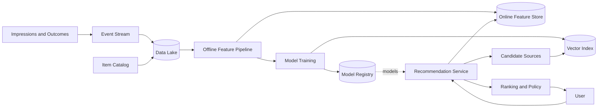
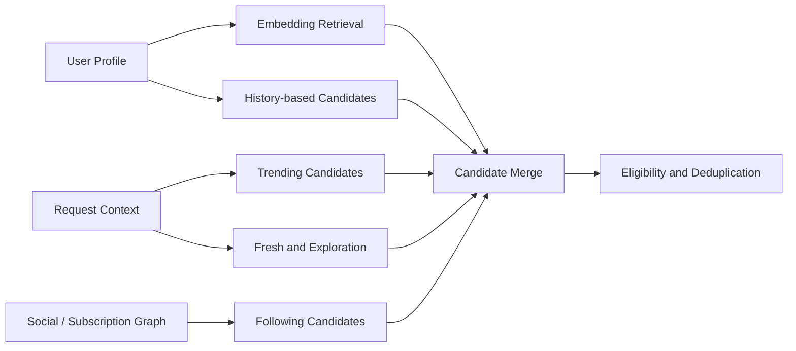
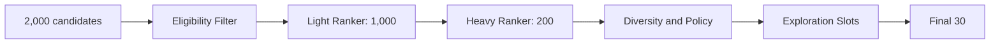
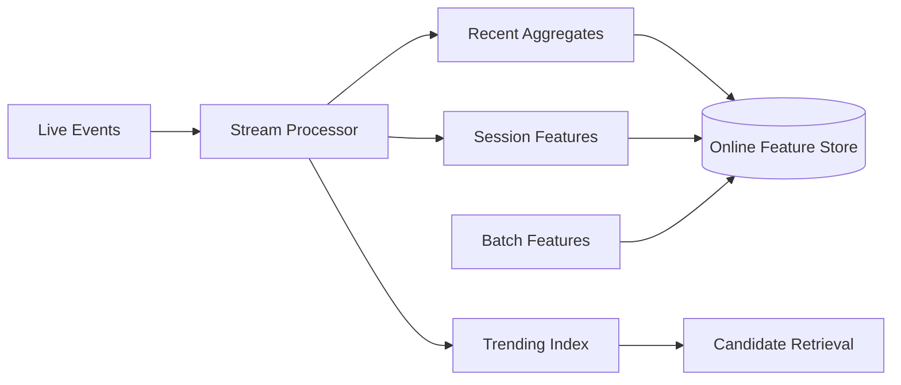

## Problem and requirements

A recommendation system chooses a small set of useful items for each user from a catalog containing millions or billions of candidates. Examples include videos, products, articles, music, and people to follow.

The serving problem is not “score every item.” It is to retrieve a manageable candidate set quickly, rank it with richer context, apply product and safety constraints, and learn from delayed, biased feedback.

### Functional requirements

- Generate personalized candidate items
- Rank candidates for the current user and context
- Incorporate new items and recent behavior quickly
- Support anonymous and new users
- Enforce eligibility, inventory, policy, and diversity rules
- Record impressions, engagement, and negative feedback
- Run controlled model experiments
- Explain or label recommendations where required

### Non-functional requirements

- Serve up to one million recommendation requests per second
- Respond within 200 milliseconds at the 99th percentile
- Continue serving when models or feature services fail
- Keep offline and online feature definitions consistent
- Prevent one tenant or model from exhausting shared capacity
- Protect sensitive behavioral data
- Detect and limit harmful feedback loops

The surrounding page layout, advertising auction, and content-hosting systems are separate. This design produces an ordered list of eligible item IDs plus scores and explanations.

## Capacity estimates

Assume 500 million daily users, 50 recommendation requests per user per day, and 100 candidates returned per request.

| Resource | Average | Peak assumption |
| --- | ---: | ---: |
| Recommendation requests | 289,000/second | 1M/second |
| Ranked items returned | 29M/second | 100M/second |
| Impression events | Billions/day | Tens of billions/day |
| User and item embeddings at 256 dimensions | Hundreds of GB to TB | Depends on catalog size |

Candidate generation may inspect thousands of items per request, while ranking evaluates hundreds. Model inference and feature retrieval, not response bandwidth, dominate serving cost.

Training datasets can reach petabytes because every impression needs context, model version, position, outcome, and sampling metadata.

## API and response contract

The caller sends placement, context, and an opaque session cursor.

```http
POST /v1/recommendations
Authorization: Bearer <token>
Content-Type: application/json

{
  "placement": "home",
  "limit": 30,
  "sessionId": "session_82",
  "context": { "device": "mobile", "locale": "en-US" }
}
```

```json
{
  "items": [
    {
      "itemId": "video_1842",
      "score": 0.873,
      "reason": "Because you watched distributed systems"
    }
  ],
  "requestId": "rec_01K5S8P2",
  "nextCursor": "eyJzZWVuRmlsdGVyIjoiLi4uIn0="
}
```

The request ID travels with impression and engagement events. It ties outcomes to the exact candidate set, ranker, feature versions, and experiment assignments.

Scores are internal and not comparable across model versions unless explicitly calibrated. Callers should preserve order rather than re-sorting raw scores.

## High-level architecture

The system has offline and online paths. Offline pipelines build datasets, embeddings, indexes, and models. The online path retrieves candidates, loads features, scores, reranks, and returns within a strict deadline.



Models and indexes are immutable versioned artifacts. Serving nodes load and validate new versions before switching atomically, making rollback fast.

## Event collection

Learning starts with trustworthy events:

- Recommendation request and candidate set
- Impression when an item is actually visible
- Click, play, purchase, save, follow, or other positive outcome
- Dismiss, hide, report, skip, refund, or other negative outcome
- Duration and completion where meaningful

Do not label every returned item as viewed. The client reports visibility using signed impression tokens. Otherwise items below the fold become false negative examples.

Events include position, placement, session, model version, feature snapshot references, and eligibility context. They must not include unnecessary raw personal data.

Deduplicate retries by event ID. Validate client events against server-issued request and item tokens to reduce fabricated training signals.

## Candidate generation

Candidate generation reduces millions of items to hundreds or thousands using multiple complementary sources:

- Items similar to recent user activity
- Collaborative-filtering neighbors
- Followed creators or subscribed topics
- Trending items by locale and segment
- New or exploration inventory
- Editorial or business-curated sets
- Session-based sequence models



Each source receives a candidate and latency budget. If one source times out, the request continues with others. Stable popularity candidates provide a reliable fallback.

Record candidate-source attribution. Without it, the team cannot measure which retrievers contribute useful items or whether the ranker ignores an expensive source.

## Embeddings and nearest-neighbor retrieval

Models map users and items into a shared vector space. Nearby vectors represent predicted affinity.

Exact comparison against every item is too expensive. Approximate nearest-neighbor indexes trade a small amount of recall for much faster retrieval. Graph-based or partitioned vector indexes return the closest candidates under a time and probe budget.

Item embeddings update when content or aggregate behavior changes. User embeddings update from recent events, either through a streaming pipeline or a lightweight online model.

Partition indexes by hard eligibility boundaries such as locale, catalog, age class, or tenant where practical. Post-filtering one global index can return too few usable items when most nearest neighbors are ineligible.

Keep a previous index version during rollout. Model and index versions must be compatible; a user embedding from one vector space is meaningless against items from another.

## Collaborative filtering

Collaborative methods learn from interaction patterns rather than content alone. Users who engaged with similar items receive overlapping recommendations.

Matrix factorization produces user and item vectors from sparse interactions. Item-to-item co-occurrence indexes are simpler and often effective: “users who consumed A also consumed B.”

Raw counts overemphasize popular items. Weight interactions by strength, recency, position bias, and confidence. Down-weight accidental clicks and repeated automated behavior.

Collaborative methods struggle with new users and new items. Content features, contextual trends, and exploration cover that cold start.

## Feature platform

Features describe the user, item, interaction, and request context.

Examples include:

- User topic affinities and recent activity
- Item quality, age, popularity, and creator features
- User-item similarity and prior exposure
- Device, locale, time, network, and placement
- Policy, inventory, and subscription eligibility

Define a feature once and generate it for both training and serving. Reimplementing the same feature separately creates training-serving skew.

The online feature store serves low-latency point and batch lookups with explicit freshness timestamps. Offline storage retains historical values as they existed when an outcome occurred; training on today’s value for yesterday’s event leaks future information.

Features have defaults and missing indicators. A slow optional feature does not block the entire request. Security and eligibility features fail closed rather than using permissive defaults.

## Multi-stage ranking

Ranking narrows candidates through progressively more expensive models.

1. **Pre-filter:** authorization, availability, policy, blocks, and duplicates
2. **Light ranker:** cheap linear or tree model scores thousands of candidates
3. **Heavy ranker:** richer model scores the strongest hundreds
4. **Reranker:** applies diversity, freshness, constraints, and exploration



The objective may combine predicted outcomes:

```text
utility = w1 × P(meaningful engagement)
        + w2 × P(long-term satisfaction)
        - w3 × P(hide or report)
        - w4 × repetition_penalty
```

Weights reflect product goals and require governance. Optimizing one proxy—clicks, watch time, or purchases—can create low-quality or harmful behavior.

## Reranking and constraints

The main model scores items independently, but the final list is a set. Reranking handles interactions between results:

- Limit repeated creators, brands, or topics
- Mix content types and freshness levels
- Respect inventory and frequency caps
- Reserve exploration positions
- Enforce contractual or editorial constraints
- Remove near-duplicate items

Maximum marginal relevance balances score against similarity to already selected items. Greedy constrained selection is often sufficient and easier to operate than one enormous end-to-end model.

Policy and privacy filters run again after ranking because eligibility can change between retrieval and response assembly.

## Cold start

New users have no history. Start with locale-aware trends, onboarding interests, referral context, and current-session behavior. Learn quickly from early actions without overreacting to one accidental click.

New items have no engagement. Use content embeddings, creator quality, catalog metadata, and controlled exploration to gather evidence.

Exploration must be budgeted. A multi-armed bandit or uncertainty-aware ranker can allocate exposure to promising unknown items while preserving user experience.

Measure opportunity, not only observed engagement. An item cannot earn clicks if the system never displays it.

## Freshness and streaming updates

Batch pipelines produce stable daily or hourly features and models. Streaming pipelines update recent counters, trends, session features, and inventory state within seconds.



Streaming values use event time, deduplication, and late-arrival windows. A replay should not double every popularity count.

Fresh overlays merge with stable features at serving time. Keep their influence bounded so a short traffic spike or coordinated attack cannot immediately dominate recommendations.

## Feedback loops and bias

The system trains on items selected by earlier versions, so observed data is biased. High-ranked items receive more impressions and therefore more engagement, reinforcing their position.

Mitigations include:

- Randomized exploration traffic
- Logging recommendation propensities
- Position-bias correction
- Counterfactual evaluation where assumptions hold
- Separate quality labels and human judgments
- Diversity and creator-exposure constraints

Do not treat absence of engagement as dislike when the item was barely visible. Impression quality and dwell context matter.

Monitor distribution shifts in users, catalog, features, labels, and outcomes. A model can retain offline accuracy while serving a narrowing, self-reinforcing catalog.

## Caching

Cache at boundaries that remain valid:

- Item metadata and stable embeddings by version
- Popular candidate sets by locale and segment
- User features for short periods
- Anonymous recommendations by context
- Model artifacts in process memory

Fully personalized ranked lists have limited reuse and become stale quickly. Cache candidate sources and features more aggressively than final results.

Cache keys include tenant, placement, locale, policy, experiment, and artifact versions. Personalized responses never enter shared public caches.

Use request coalescing for popular anonymous contexts and jittered expiry to avoid synchronized recomputation.

## Pagination and repeated exposure

A recommendation cursor records or references the session’s seen items, source cursors, model version, and last ranking boundary.

The server filters already exposed items before ranking subsequent pages. A compact Bloom filter reduces cursor size but may occasionally hide unseen items; a short-lived server-side session provides exact tracking at higher storage cost.

Feed refresh may intentionally start a new session to include fresh items. Infinite scroll preserves the current session for stability.

Longer-term exposure history prevents showing the same item every day. Store bounded recent impressions by user and placement with product-specific cooldowns.

## Experimentation

Assign experiments consistently by user or device using a stable hash. Keep assignments independent of request retries and regions.

Every response logs experiment IDs, model and feature versions, candidate sources, scores, and final constraints. Outcome events join through the request and impression IDs.

Evaluate primary metrics with guardrails for latency, errors, negative feedback, diversity, safety, retention, and ecosystem health. Short-term engagement gains can harm long-term satisfaction or creator distribution.

Use canaries before broad experiments. A model artifact that loads successfully may still produce collapsed scores, empty recommendations, or unsafe concentration.

## Safety and policy

Recommendation amplifies content, so eligibility rules are stricter than simple storage or search indexing.

Apply:

- Content and account policy state
- User blocks, mutes, and age restrictions
- Regional and legal restrictions
- Sensitive-topic controls
- Frequency limits after negative feedback
- Quality and integrity classifiers

Emergency removals use a low-latency denylist checked on every response. Do not wait for embeddings, candidate indexes, and caches to rebuild.

Adversaries may coordinate engagement to manipulate trends and ranking. Use trusted-user weighting, anomaly detection, graph signals, and delayed promotion for suspicious growth.

## Privacy and user control

Behavioral histories can reveal sensitive interests. Minimize collection, limit retention, separate identity where possible, encrypt data, and audit access.

Users need controls to clear history, disable personalization, hide topics, and understand common recommendation reasons. Deletion must propagate to online features, training datasets according to policy, embeddings, caches, and derived profiles.

Avoid encoding protected or highly sensitive traits unless the product has a clear lawful purpose and safeguards. Proxy features can recreate sensitive attributes even when explicit fields are absent.

Anonymous mode uses session-local behavior without attaching it to a durable profile.

## Failure handling

**Candidate source timeout:** continue with other sources and stable popularity fallback.

**Vector index failure:** use following, co-occurrence, trending, and editorial sources.

**Online feature-store failure:** apply cached/default noncritical features and use a simpler model. Eligibility failures remain fail closed.

**Heavy-ranker failure:** return light-ranker order plus policy and diversity rules.

**Model-loading failure:** keep the previous validated model active.

**Streaming pipeline delay:** stable batch features continue serving; freshness and trends degrade.

**Event-pipeline outage:** recommendation serving continues while bounded local buffers preserve critical outcome events. Training freshness degrades.

**Regional failure:** route to a region holding compatible model, index, and feature versions; fall back to anonymous regional recommendations if private profiles lag.

## Observability and model operations

Serving metrics include:

- End-to-end latency by retrieval, features, rankers, and reranking
- Candidate count, timeout, and contribution by source
- Feature freshness, missing rate, and online/offline skew
- Model inference latency, score distributions, and error rate
- Cache hit rate and vector-index recall probes
- Empty, duplicate, and policy-filtered response rates

Quality and ecosystem metrics include:

- Positive and negative outcomes
- Catalog coverage and creator concentration
- Novelty, diversity, and repeated exposure
- Cold-start item opportunity
- Safety incident and removal leakage
- Long-term retention and satisfaction

Model artifacts pass offline validation, shadow traffic, canary deployment, and gradual rollout. Automated rollback watches both infrastructure and score-distribution anomalies.

Maintain lineage from training data and feature definitions through code, model, index, and serving configuration. Reproducing a recommendation requires knowing every version involved.

## Trade-offs

**Batch vs. streaming features:** batch pipelines are stable and reproducible. Streaming features improve freshness but add ordering, replay, and skew complexity.

**Collaborative vs. content-based retrieval:** collaborative signals capture collective taste but struggle with cold start. Content models generalize to new items but may overemphasize superficial similarity.

**One large model vs. stages:** an end-to-end model may optimize jointly but is expensive and fragile. Staged retrieval and ranking bound cost and provide fallbacks.

**Accuracy vs. diversity:** selecting only the highest predicted score can create repetitive lists and feedback loops. Constrained reranking trades some immediate score for broader utility.

**Personalization vs. privacy and cacheability:** deep profiles may improve relevance while increasing sensitivity, deletion complexity, and serving cost.

**Freshness vs. manipulation risk:** rapid trend updates surface new interests quickly but give attackers less resistance and policy systems less review time.

**Exploration vs. short-term experience:** exploration gathers unbiased evidence and helps new items, but some recommendations will be less certain.

The central design moves from broad, diverse retrieval to progressively richer ranking under a strict deadline. A resilient recommendation system is not one model—it is a versioned pipeline with fallback sources, consistent features, policy boundaries, and feedback controls.
