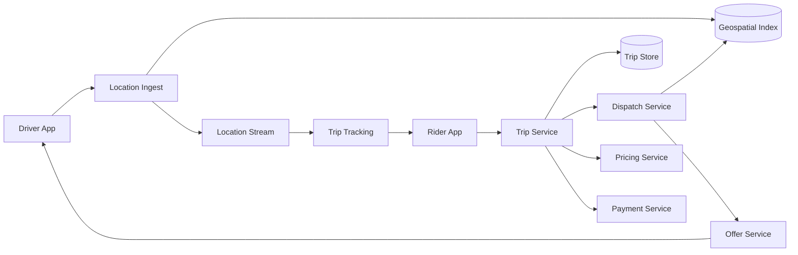
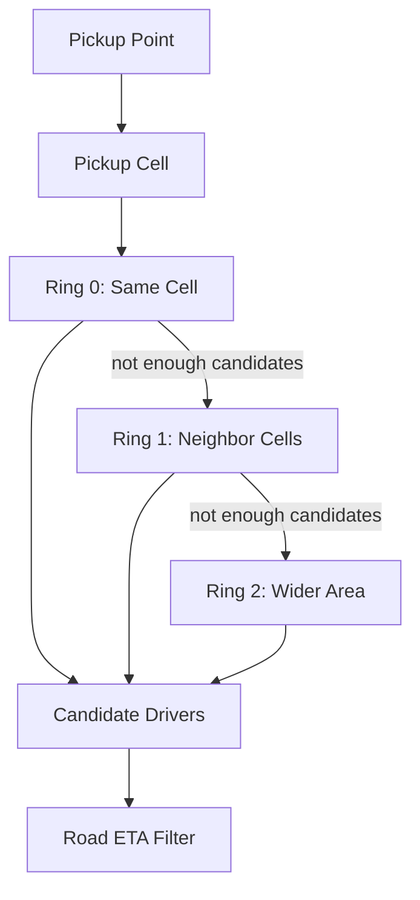
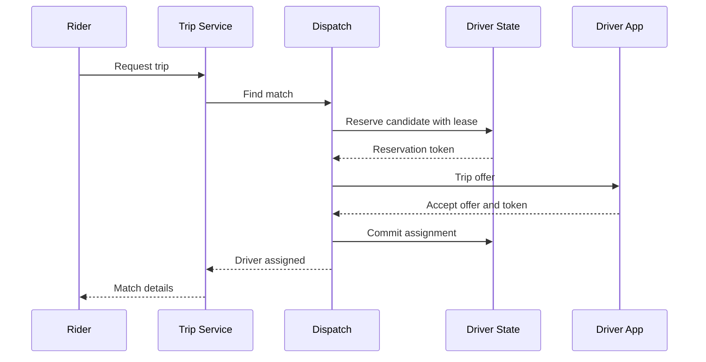
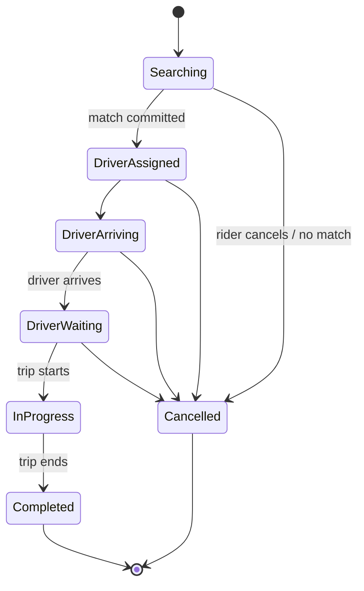
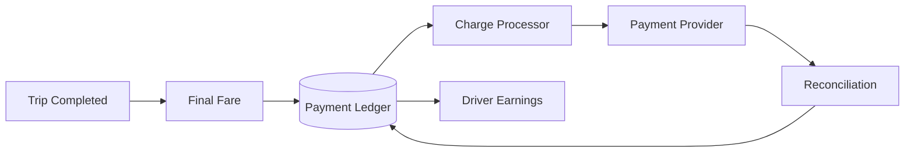

## Problem and requirements

A ride-hailing service connects a rider requesting transportation with an eligible nearby driver. It must combine a high-volume stream of approximate driver locations with a strongly controlled trip lifecycle involving dispatch, pricing, payment, and safety.

### Functional requirements

- Show nearby available drivers and an estimated pickup time
- Estimate fare and route before booking
- Match a rider with one eligible driver
- Let drivers accept, decline, arrive, start, and complete trips
- Track active trips in real time
- Charge the rider and pay the driver
- Support cancellation, ratings, receipts, and safety workflows

### Non-functional requirements

- Produce an initial match within a few seconds
- Prevent one driver or rider from holding multiple active trips
- Scale to millions of frequently updating driver locations
- Continue active trips through partial service failures
- Preserve an auditable record of trip and payment decisions
- Protect precise location and identity data

Scheduled rides, pooled trips, food delivery, and autonomous fleets introduce additional constraints and are outside the first version.

## Capacity estimates

Assume 50 million completed trips per day, five million drivers online at peak, and one location update every four seconds per active driver.

| Resource | Average | Peak assumption |
| --- | ---: | ---: |
| Trip requests | 580/second | 10,000/second |
| Driver location updates | — | 1.25M/second |
| Active trips at 20-minute average | 694,000 | 2M |
| Rider tracking reads | — | 500,000/second |

Location traffic dominates request count, but trip-state and payment writes require stronger correctness. These paths should not share one storage or consistency model.

At roughly 100 bytes per compressed location event, raw peak ingress is about 125 MB per second before replication. Long-term storage should sample or compress routes rather than retain every raw update forever.

## APIs and idempotency

The rider first requests an estimate, then creates a trip request using the selected product and an idempotency key.

```http
POST /v1/trips
Idempotency-Key: rider42-request-881
Content-Type: application/json

{
  "pickup": { "lat": 41.8818, "lng": -87.6231 },
  "destination": { "lat": 41.9484, "lng": -87.6553 },
  "product": "standard",
  "estimateId": "estimate_72"
}
```

```json
{
  "tripId": "trip_01K5M2X4",
  "status": "searching",
  "estimatedFare": { "amount": 1840, "currency": "USD" }
}
```

Driver actions include the expected trip version. A stale accept or completion command fails instead of overwriting newer state.

Location updates use a compact streaming or datagram-oriented endpoint with driver ID, coordinates, heading, speed, accuracy, device timestamp, and monotonically increasing sequence number.

## High-level architecture

The location plane ingests ephemeral, high-volume updates. The trip plane owns durable lifecycle transitions. Dispatch joins both worlds by reading nearby availability and reserving one driver.



Trip services publish durable events for analytics, receipts, support, and payment workflows. Those consumers do not participate in latency-sensitive matching.

## Driver location ingestion

Driver apps send updates more frequently while moving or on a trip and less frequently while idle. The server validates authentication, sequence, timestamp, coordinate range, plausible speed, and reported accuracy.

The latest accepted location goes into an in-memory geospatial index with a short TTL. A durable event stream carries updates to active-trip tracking, fraud detection, estimated-arrival models, and sampled historical storage.

Updates may arrive late or out of order because mobile networks reconnect. For each driver, retain the highest sequence number and reject older updates. Device time helps analysis but is not the ordering authority.

If a driver stops reporting, the index entry expires and the driver becomes ineligible for new trips. A stale location should never remain available indefinitely.

## Geospatial indexing

Map latitude and longitude into hierarchical cells such as geohashes, quadtrees, or hexagonal indexes. Each active driver belongs to one fine-grained cell.



Searching begins in the pickup cell and expands through neighboring rings until enough candidates are found or a maximum radius is reached. Grid distance only generates candidates; road-network ETA produces the useful pickup estimate.

Partition the index by geographic region and cell range. Dense downtown cells may be split further, while sparse rural cells use coarser resolution. Boundary queries include neighboring partitions so a rider near a regional edge can see drivers across it.

Do not route every update through a globally consistent database. Eventual index updates are acceptable because dispatch validates availability before assignment.

## Availability and driver state

Location and availability are separate. A driver may have a fresh location but be offline, paused, already offered a trip, or currently driving.

Use a durable driver-state record with a version:

```text
offline → available → reserved → en_route → on_trip → available
```

The geospatial index stores only drivers whose latest durable state permits matching. State events add or remove drivers from the index. Because propagation can lag, dispatch always performs an atomic reservation against the authoritative state store.

A driver reservation is a lease with an expiration. If the offer is declined or times out, the reservation releases and the driver can receive another offer. Fencing tokens prevent a delayed response from an older offer from winning later.

## Dispatch and matching

The dispatch service retrieves a broad candidate set from the geospatial index, filters eligibility, estimates road travel time, scores candidates, and sends offers.

A score may consider:

- Pickup ETA
- Driver idle time and fairness
- Product and vehicle compatibility
- Destination or regional constraints
- Acceptance and cancellation likelihood
- Marketplace balance after the assignment

Greedily selecting the closest driver is simple but can produce poor fleet-wide outcomes. During high demand, batching requests for a short interval allows a matching algorithm to optimize total pickup time and coverage. The batch window must remain small enough that riders still receive a fast response.



Sequential offers reduce duplicate acceptance but add latency when drivers decline. Small parallel offer groups improve response time but require atomic winner selection and immediate cancellation to losing drivers.

## Trip state machine

The trip service is the authority for the lifecycle:



Every command checks actor, current state, version, and policy. The database transaction stores the new state and an outbox event. State transitions are append-only in the audit history even though one current-state row supports efficient reads.

Only one active trip may reference a rider or driver. Enforce that invariant through conditional writes or unique active-assignment records, not application checks followed by separate updates.

## ETA and routing

Straight-line distance is fast for candidate retrieval but inaccurate across rivers, highways, and one-way streets. A routing service uses a road graph plus historical and live traffic to estimate travel time.

Calculating full routes for hundreds of candidates is expensive. Use stages:

1. Cell or straight-line filter
2. Lightweight learned ETA estimate
3. Full route for the strongest few candidates

Cache popular route segments and batch matrix requests. During a routing outage, dispatch can use conservative approximate ETAs and clearly degrade estimates rather than stop matching entirely.

The driver receives turn-by-turn navigation from a dedicated routing path. Trip correctness does not depend on the client following the suggested route exactly.

## Dynamic pricing

Pricing combines a base fare, expected time and distance, product rules, taxes, tolls, promotions, and a marketplace multiplier. The estimate service returns a short-lived signed quote.

Supply and demand are aggregated into geographic cells over sliding windows. Smooth multipliers across adjacent cells and time windows so crossing one street does not produce a dramatic price jump.

The quote records pricing inputs and model version for auditability. At completion, calculate the final fare from actual trip data under the accepted contract. Material changes such as destination updates create a new rider-visible estimate.

Pricing must fail safely. If dynamic signals are unavailable, use a configured base policy rather than an unbounded or nonsensical multiplier.

## Real-time trip tracking

During an active trip, location events route by trip ID to a tracking service. Rider and driver maintain persistent connections through real-time gateways.

The tracking service throttles and smooths updates before fan-out. Sending every GPS sample wastes battery and bandwidth without improving the map. Interpolation on the client provides smooth motion between authoritative updates.

The durable trip record stores sampled route points, not necessarily every raw location. Keep enough detail for fare calculation, safety, support, and dispute policy while limiting sensitive location retention.

If the live stream is delayed, the client shows the last update time rather than pretending the position is current. Tracking is best effort; trip state remains durable.

## Payments and driver earnings

Authorize the rider’s payment method before or during dispatch according to risk policy. Do not capture the final amount until trip completion.

Trip completion publishes an idempotent billing command containing the trip ID, fare version, amount, currency, and allocation. A payment ledger records rider charge, platform fee, taxes, adjustments, and driver earnings as balanced entries.



Provider timeouts are ambiguous: a retry may duplicate a charge. Use the trip ID as an idempotency key with the provider and reconcile webhooks and settlement reports against the internal ledger.

A payment failure does not undo a completed trip. It becomes a collections and account-risk workflow.

## Cancellations and reassignment

Cancellations race with assignment, arrival, and trip start. The trip-state compare-and-set determines which command wins. The response tells the client the authoritative state rather than assuming its request succeeded.

If an assigned driver stops reporting or cancels before pickup, the trip can return to searching with an incremented dispatch attempt. Prior reservation tokens become invalid.

Cancellation fees depend on timing and progress. Calculate them from durable server events—not client clocks—and record the policy version and inputs.

After a configured number of failed matches, widen the search, offer another product, update the estimate, or fail clearly. Infinite retry loops create poor experiences and uncontrolled dispatch load.

## Safety and privacy

Precise location is highly sensitive. Encrypt it in transit and at rest, restrict employee access, audit every privileged lookup, and apply short, explicit retention policies.

Riders and drivers see only the information needed for the current trip. Use relay numbers or in-app calling to avoid exposing personal phone numbers. Public receipts should not reveal exact home addresses unnecessarily.

Safety systems may support emergency assistance, route-deviation detection, trusted-contact sharing, identity verification, and incident evidence preservation. These workflows need independent availability and access controls.

Detect impossible movement, GPS spoofing, collusion, repeated cancellations, and account sharing. Fraud signals should inform dispatch and payment risk without becoming the sole source of trip truth.

## Multi-region design

Partition operational ownership by geographic market. Trips in one city usually need local drivers, maps, pricing, and regulations, so regional cells align naturally with the product.

Each active trip has one home region responsible for ordered state transitions. Replicate trip events to a secondary region for disaster recovery and global support views.

Drivers crossing region boundaries transfer ownership through a controlled handoff. During a network partition, only the region holding the latest epoch may assign that driver, preventing double booking.

Global account, payment, and fraud services may remain shared, but dispatch should degrade locally rather than depend on a round trip across the world.

## Failure handling

**Location-ingest failure:** driver apps reconnect to another endpoint and resend newer sequence numbers. Stale index entries expire automatically.

**Geospatial-index failure:** rebuild from the live location stream and durable driver state. Existing trips continue because the index is not their source of truth.

**Dispatch failure:** reservation leases expire, and another worker retries the trip request with its dispatch attempt ID.

**Driver disconnect after accept:** preserve the assignment briefly, attempt reconnection, and reassign only after policy thresholds. Immediate reassignment can create two drivers heading to one rider.

**Trip-service failure:** clients retry versioned commands. Replicated storage preserves current state and audit history.

**Routing failure:** use approximate ETA and straight-line progress while preserving trip lifecycle.

**Payment-provider failure:** complete the trip, persist the ledger obligation, and retry charging asynchronously.

**Regional failure:** transfer cell and trip ownership with fencing epochs. Clearly communicate delayed tracking or dispatch rather than creating conflicting trips.

## Observability and operations

Monitor the full marketplace rather than isolated service uptime:

- Request-to-match latency and no-match rate
- Offer acceptance, timeout, and cancellation rates
- Pickup ETA error and actual pickup time
- Location freshness and geospatial-index lag
- Driver utilization and rider wait time by cell
- Trip-state transition failures and stale-version commands
- Pricing quote error and final-fare deviation
- Payment authorization, charge, and reconciliation failures
- Regional supply-demand imbalance

Synthetic riders and drivers should continuously request, accept, start, complete, cancel, disconnect, and reconnect in test markets.

Operational tools that modify trip state must use the same validated transition API as clients, require reason codes, and create immutable audit records.

## Trade-offs

**Frequent vs. sparse location updates:** frequent updates improve ETA and tracking but increase battery, bandwidth, storage, and privacy exposure.

**Sequential vs. parallel dispatch offers:** sequential offers avoid competing acceptances but increase match time. Bounded parallel offers reduce latency and require atomic winner selection.

**Greedy vs. batched matching:** choosing the nearest driver is fast and simple. Small matching batches improve marketplace-wide efficiency but add delay and algorithmic complexity.

**Strong vs. eventual consistency:** location and supply aggregates tolerate eventual consistency. Driver reservation, trip state, and payments require conditional durable writes.

**Availability vs. single ownership:** allowing multiple regions to assign the same driver during a partition improves local availability but creates dangerous double booking. One fenced owner is safer.

**Location retention vs. support:** longer history helps safety and dispute investigation but increases privacy risk. Retain the minimum resolution and duration required by explicit policy.

The central design separates approximate, ephemeral marketplace signals from authoritative trip commitments. Locations may be stale and ETAs may change, but one rider, one driver, one trip state machine, and one payment ledger must remain unambiguous.
