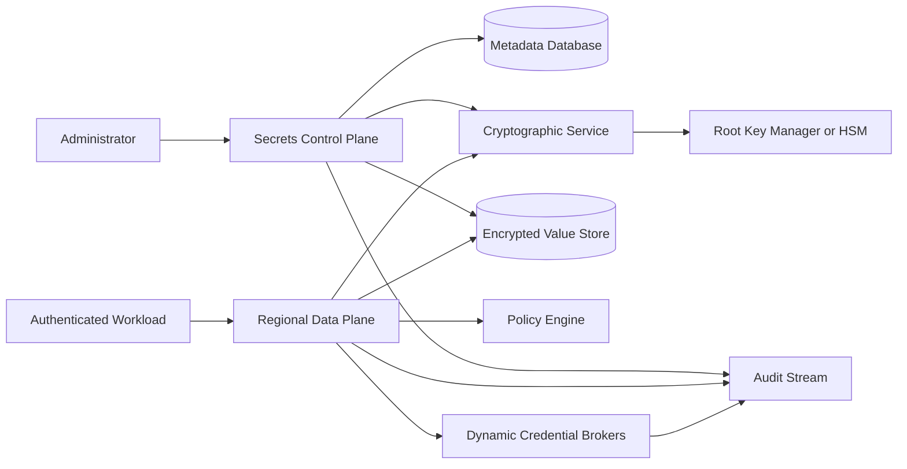
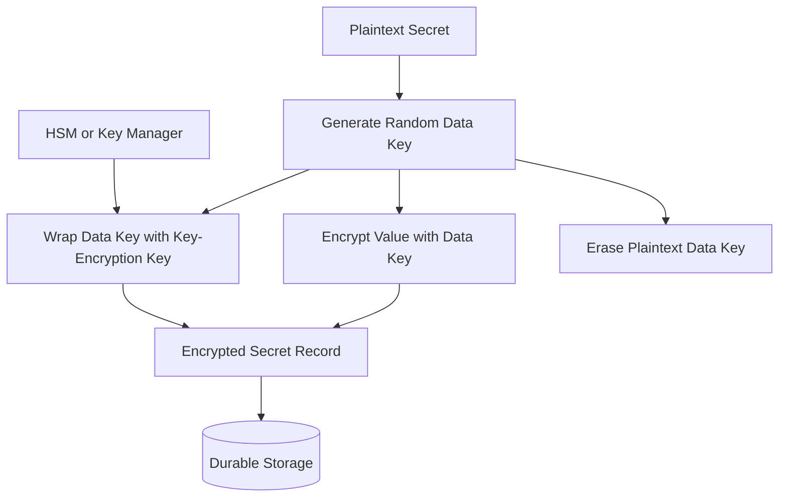
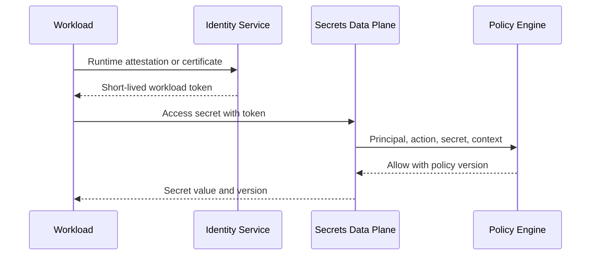
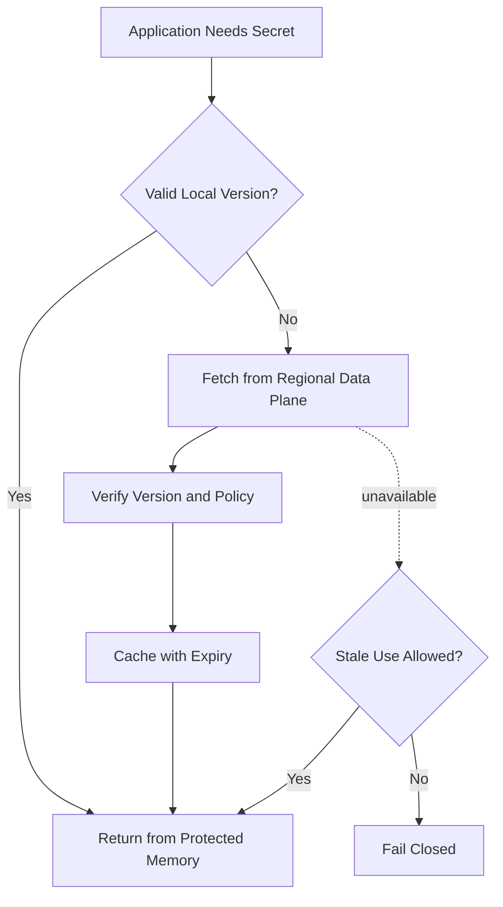
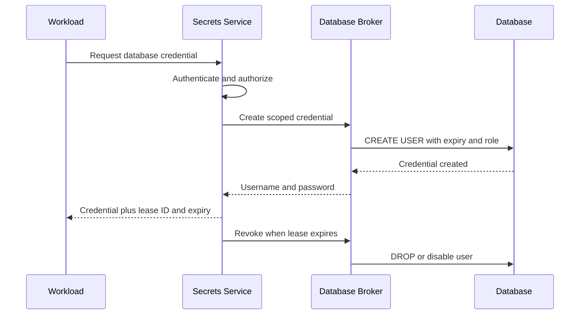
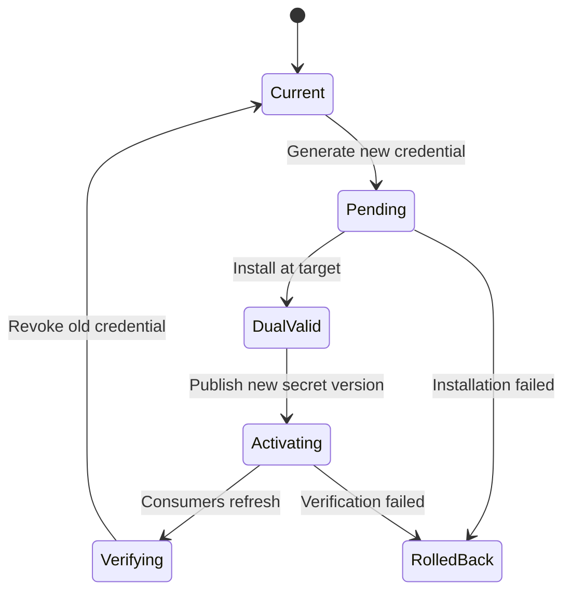
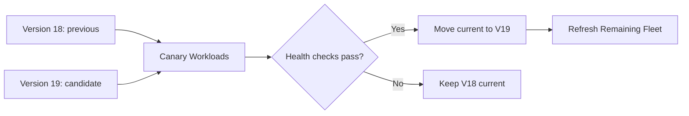
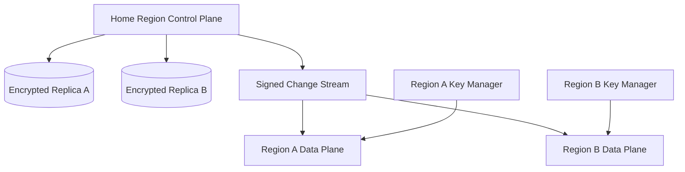

## Problem and requirements

A secrets management system protects credentials that applications need: database passwords, API keys, certificates, signing material, and encryption keys. It replaces secrets embedded in source code, images, configuration files, and long-lived environment variables with controlled retrieval and rotation.

The system is both a high-value target and a critical dependency. A confidentiality failure can compromise every connected service, while an availability failure can prevent deployments or stop applications from refreshing credentials. The design must minimize plaintext exposure without making the entire platform depend on one remote read for every request.

### Functional requirements

- Create, read, version, disable, and delete secrets
- Authorize access by workload, user, environment, and purpose
- Encrypt secret values before durable storage
- Issue dynamic, short-lived credentials where supported
- Lease and revoke credentials
- Rotate static and dynamic secrets automatically
- Notify or reload applications when versions change
- Record every administrative action and secret access
- Support backup, recovery, and regional failover
- Detect leaked, stale, or unusually accessed secrets

### Non-functional requirements

- Support ten million stored secrets and one million reads per second
- Keep regional reads below 20 milliseconds at the 99th percentile
- Never write plaintext secret values to logs, traces, metrics, or audit events
- Continue serving approved workloads during a bounded control-plane outage
- Revoke compromised access within seconds where possible
- Isolate tenants, environments, and cryptographic domains
- Make changes and access attempts tamper-evident
- Survive loss of a node, zone, or region without losing secret versions

The service protects secrets after onboarding. It cannot make a credential safe if the consuming application prints it, exposes it in an error, or gives it to an untrusted process.

## Capacity estimates

Assume ten million secrets, five versions retained per secret, 100,000 active workloads, and one million peak reads per second during deployments or restarts.

| Resource | Average | Peak assumption |
| --- | ---: | ---: |
| Secret reads | 100,000/second | 1M/second |
| Secret writes | Tens/second | Thousands/second during rotation |
| Dynamic credential issuance | Thousands/second | 50,000/second |
| Audit events | Hundreds of millions/day | Every access attempt |
| Encrypted value storage | Modest | Metadata and audit dominate |

Secret values are usually small. Cryptographic operations, policy checks, audit durability, and bursts from fleet restarts dominate capacity planning.

## Secret model

The hierarchy is organization, project, environment, secret, and version.

A secret contains:

- Stable name and identifier
- Tenant, project, environment, and namespace
- Type and owning team
- Access and rotation policies
- Current version pointer
- Lifecycle status and expiration
- Metadata labels safe for indexing

A secret version contains encrypted value bytes, creation time, creator, cryptographic metadata, checksum, and activation state. Values are immutable. Rotation creates a new version and atomically advances the active pointer.

Do not infer a value's format from its content. Treat secret values as opaque bytes with a declared content type and strict size limit.

## API design

Administrative writes require a reason and optimistic concurrency.

```http
POST /v1/projects/payments/environments/production/secrets/processor-key/versions
Authorization: Bearer <admin-token>
If-Match: "secret-version-18"
Content-Type: application/json

{
  "value": "<base64-encoded-secret>",
  "activate": true,
  "reason": "Scheduled processor credential rotation"
}
```

Workloads read a specific or active version through an authenticated channel:

```http
GET /v1/secrets/processor-key:access
Authorization: Bearer <short-lived-workload-token>
```

```json
{
  "version": "19",
  "value": "<base64-encoded-secret>",
  "expiresAt": null,
  "cacheTtlSeconds": 300
}
```

The response and request body are never logged. Error messages do not reveal whether an unauthorized secret exists.

## High-level architecture

Separate secret administration, cryptographic key operations, regional delivery, dynamic credential brokers, and audit processing.



The control plane handles definitions, policies, and rotation workflows. The regional data plane performs high-volume reads and lease operations. Root cryptographic keys remain in a managed key system or hardware security module and are never returned to application code.

## Envelope encryption

Encrypt each secret version with a unique data-encryption key. Encrypt that data key with a tenant- or region-scoped key-encryption key.



The stored record contains ciphertext, wrapped data key, nonce, authentication tag, algorithm, key identifier, and authenticated metadata. Authenticated encryption detects tampering.

To read a secret, the cryptographic service unwraps the data key, decrypts the value in protected memory, and clears plaintext buffers promptly.

Envelope encryption allows the root key to rotate without decrypting every secret value: rewrap the data keys under a new key-encryption key. A compromised data key affects only one secret version.

## Root key management

Root keys have a strict lifecycle: generation, activation, rotation, retirement, archival where required, and destruction.

Private key material remains inside a hardware-backed cryptographic boundary. Administrative operations require separate roles, strong authentication, and multi-party approval. No operator should both change secret policy and extract key backups.

The system caches unwrapped data keys only in bounded protected memory for a short time. Cache entries are scoped by tenant and key version and wiped on eviction.

Root-key unavailability should not lead to storing plaintext or bypassing encryption. Regional cryptographic services may continue using securely cached keys for a short defined window, then fail closed.

## Workload identity

Applications should not authenticate to the secrets service with another long-lived secret. They exchange platform identity evidence for a short-lived, audience-bound token.



Trusted evidence may come from a workload orchestrator, cloud instance identity, mutually authenticated certificate, or hardware attestation. The resulting identity names the workload, tenant, environment, and deployment attributes.

Tokens expire quickly and are bound to the secrets-service audience. Production policy must not accept a development workload identity even when names are similar.

## Authorization policy

An access decision evaluates:

```text
principal + action + secret + version + context → allow or deny
```

Policy can constrain project, environment, secret path, workload identity, region, network, deployment version, time, and assurance. Default deny.

Separate permissions for reading values, reading metadata, creating versions, activating versions, changing policy, rotating, revoking leases, and deleting.

Avoid broad wildcard grants. Policy analysis should identify rules such as “every production workload can read every production secret” before publication.

Compile policies into signed regional bundles for low-latency local evaluation. Emergency denies propagate through a prioritized channel and override cached allows.

## Secret delivery patterns

### Direct SDK retrieval

An SDK fetches the secret and caches it in process memory. This is simple but places network and secret-handling logic in every application.

### Sidecar or node agent

A local agent authenticates the workload, retrieves secrets, and exposes them through a protected local socket or memory-backed file. It centralizes caching, renewal, and audit behavior.

### Template rendering

An agent renders secrets into application-specific configuration and atomically replaces the file. File permissions and cleanup are critical.

### Secretless proxy

A proxy holds the credential and opens authenticated database or service connections for the application. The application never receives the underlying secret, providing the smallest exposure surface where compatible.

Environment variables are easy to use but often leak into process inspection, crash dumps, diagnostic endpoints, and child processes. Prefer memory or restricted file delivery.

## Caching and availability

Fetching a secret on every business request is slow and turns the secrets service into a universal dependency. Applications or agents fetch on startup, cache in protected memory, and refresh before the configured lifetime ends.



Each secret defines whether stale use is permitted and for how long. A database password may remain valid during a brief outage; an emergency-revoked signing key must not.

Cache invalidation messages trigger immediate refresh or eviction, but expiration remains the correctness backstop. Agents add jitter to refresh schedules to avoid a fleet-wide burst.

## Dynamic secrets

Dynamic secrets are generated on demand with narrow privileges and short lifetimes. Examples include database users, cloud credentials, and client certificates.



A broker holds a tightly controlled administrative credential for the target system. It maps policy to a predefined role template; callers cannot supply arbitrary privilege statements.

Dynamic credentials reduce blast radius and make revocation precise, but they increase dependency on target-system availability and can create high churn. Pool or reuse leases within a workload instance when safe.

## Leases and renewal

Every dynamic credential has a lease ID, owner, issue time, expiration, renewable limit, and revocation state.

The client renews before expiry. The broker extends the target credential first, then commits the new lease expiration. If either step is uncertain, it queries target state before responding.

Expiration is the safety backstop. A background reaper revokes expired credentials and retries failures with bounded backoff. Repeated failures enter an operational queue and raise security alerts.

On workload termination, the platform can revoke its active leases immediately. Lease ownership is indexed so an incident responder can revoke by workload, deployment, tenant, or secret role.

## Static secret rotation

Many external systems still require a long-lived shared credential. Rotation must avoid a window where producers and consumers disagree.



When the target supports two credentials, use overlapping validity:

1. Generate the new credential
2. Add it to the target system
3. Publish and activate the new secret version
4. Wait for consumers to confirm refresh
5. Revoke the old credential

For single-credential targets, use a coordinated maintenance workflow, a proxy, or very short retry windows. Never overwrite the stored value before confirming the target accepts it.

Rotation workflows are idempotent and persist each step. A crash resumes from observed target and secret state rather than blindly repeating side effects.

## Certificates and signing keys

Certificates are dynamic secrets with public metadata and private key material. Generate private keys at the destination or in protected hardware when possible so they never traverse the network.

Automated issuance validates workload identity, allowed names, key usage, and maximum lifetime. Renewal begins well before expiry with jitter. Revocation status and certificate transparency requirements depend on the trust domain.

Signing keys need versioned public identifiers so verifiers can overlap old and new public keys. Private signing operations may occur inside a signing service instead of exporting the key.

Separate encryption keys from signing keys and restrict each key to its declared cryptographic purpose.

## Versioning and rollout

Every secret change creates an immutable version. Aliases such as `current`, `previous`, or `candidate` point to versions and update atomically.

Applications can pin a version for reproducible deployments or follow `current` for automatic rotation. A staged rollout exposes `candidate` to canary workloads before promotion.



Keep the previous version only as long as rollback policy requires. Excess version retention increases exposure and complicates deletion.

## Audit and access logging

Audit every attempt, including denied reads, with:

- Principal and workload identity
- Secret identifier and version, never the value
- Action and result
- Policy and configuration version
- Region, request ID, and client metadata
- Lease or rotation workflow ID
- Administrative reason and approval chain

Write audit events to a separate append-only security stream before acknowledging high-risk administrative changes. Hash chains or signed checkpoints make modification detectable.

Avoid recording full authorization tokens, request bodies, database credentials, or cryptographic material. Restrict audit search because access patterns themselves reveal infrastructure details.

## Secret scanning and leak response

Prevent secrets from entering source control and logs with client-side checks, repository scanning, artifact scanning, and log-pipeline detectors.

Detection creates a security finding, not an automatic conclusion. Use secret fingerprints or validation APIs without spreading the plaintext.

A confirmed leak triggers:

1. Identify the secret, owners, consumers, and dependent systems
2. Restrict or revoke access
3. Rotate the target credential
4. Distribute the new version
5. Verify consumers and revoke the old value
6. Review audit history and affected actions

Deleting a value from source history is not sufficient; once exposed, the credential must be considered compromised.

## Multi-region design

Assign each tenant or secret namespace a home region for authoritative writes. Replicate encrypted versions and policy bundles to approved regions.

Regional data planes evaluate policy and decrypt locally using region-scoped key material, avoiding cross-region latency. A global alias directory routes reads to a permitted replica.



Replication sends ciphertext, wrapped keys, policy, and versions—not plaintext. Regional key-encryption keys limit the blast radius of one cryptographic domain.

During home-region failure, approved replicas continue reads and lease renewal within policy. Secret writes, destructive actions, and rotations may pause until one region is promoted through a controlled failover.

## Backup and disaster recovery

Backups contain encrypted values, wrapped data keys, metadata, policies, versions, and audit references. Backing up ciphertext without recoverable key material is useless; backing up keys beside data defeats separation.

Protect key backups through a separate controlled process with multi-party authorization. Regularly restore into an isolated environment and verify decryption of test secrets, policy integrity, and version pointers.

Recovery procedures define which region may become authoritative, how split-brain writes are prevented, and how audit continuity is maintained.

Emergency access, sometimes called break-glass access, uses short-lived approval, strong authentication, limited scope, prominent alerts, and mandatory after-action review. It must not be a permanent master credential.

## Deletion

Deletion is staged:

1. Disable new access
2. Revoke active leases and aliases
3. Observe a recovery window
4. Remove encrypted versions from replicas and backups according to policy
5. Destroy isolated wrapping keys when cryptographic erasure is supported
6. Retain non-secret audit evidence as legally required

Deletion jobs produce verifiable completion records. The system must distinguish deletion from revocation: deleting the stored copy does not revoke a credential still valid at an external service.

## Failure handling

### Regional data plane unavailable

Agents use valid cached secrets within their stale-use policy or fail over to another permitted region. They do not fetch from an unapproved residency domain.

### Key manager unavailable

Use a small protected cache of recently unwrapped keys for a bounded time. Never return ciphertext as if it were a secret or bypass decryption controls.

### Policy service unavailable

Regional data planes evaluate the last known good signed policy bundle. Emergency deny overlays remain locally available.

### Audit pipeline unavailable

Buffer access events durably. High-risk administrative writes fail closed if their required audit record cannot be committed; ordinary reads may continue briefly under a bounded buffer policy.

### Dynamic broker failure

Do not claim a credential exists until target creation is confirmed. Query target state using an idempotency reference before retrying uncertain operations.

### Rotation partially completes

Resume the persisted state machine, inspect both target and consumer status, and either finish promotion or roll back. Never guess which credential is active.

### Compromised operator account

Require separation of duties, approval thresholds, short-lived administrative sessions, and anomaly detection. Rapidly revoke the account and review every accessed secret identifier.

## Observability

Track health without exposing secret material:

- Read latency, availability, and cache hit rate
- Authentication and authorization denials
- Secret access by workload, region, and policy version
- KMS latency, errors, and key-cache age
- Rotation success, duration, and overdue secrets
- Dynamic lease issuance, renewal, expiry, and revocation backlog
- Replication lag and stale regional versions
- Audit-stream lag and integrity verification
- Unusual access volume or new principals
- Secret versions approaching expiration

Do not use secret names, user identifiers, or high-cardinality resource IDs as broadly visible metric labels. Detailed investigations use access-controlled audit data.

Synthetic workloads in every region retrieve test secrets, renew leases, exercise rotation, and verify that denied paths remain denied.

## Key tradeoffs

### Central retrieval vs local caching

Central reads maximize control and freshness but add latency and an availability dependency. Bounded local caches protect applications while expirations and invalidations limit stale exposure.

### Static vs dynamic secrets

Static credentials are widely compatible but difficult to rotate and revoke safely. Dynamic credentials reduce lifetime and privilege but require reliable brokers and target integration.

### Exported secret vs secretless operation

Returning plaintext works with almost any application but exposes it to process memory. Proxies and remote signing minimize exposure at the cost of compatibility and another runtime dependency.

### Availability vs fail-closed behavior

Continuing with cached credentials protects product uptime, but may extend access after revocation. Each secret needs an explicit stale-use policy based on impact, not one global default.

### Global convenience vs cryptographic isolation

One global root key simplifies operations but increases blast radius. Tenant- and region-scoped key hierarchies add management work while containing compromise and supporting residency.

The central principle is to minimize the number of places, people, and seconds in which plaintext exists while keeping credential delivery predictable enough that applications never need to bypass the system.
