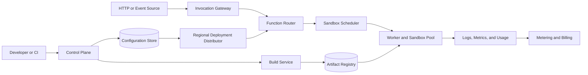
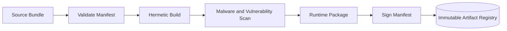
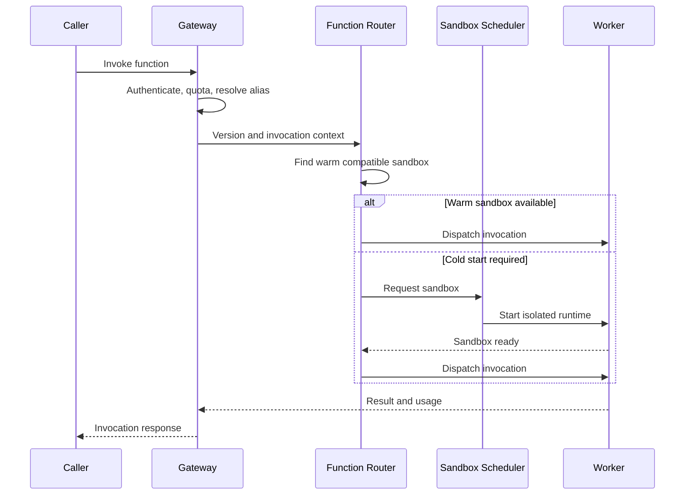
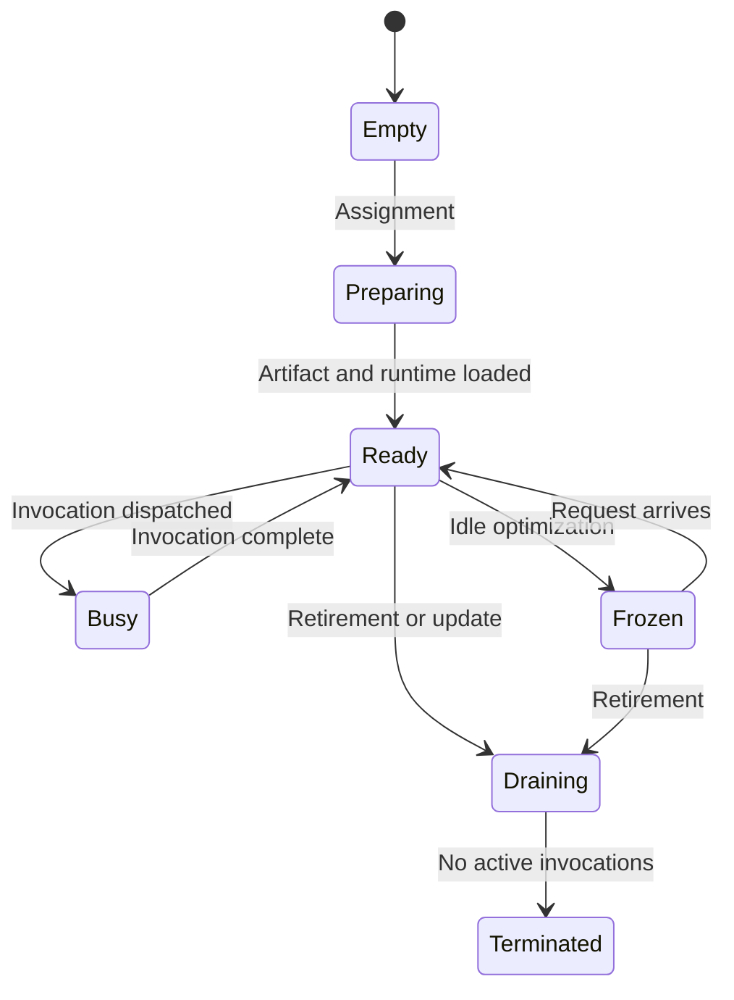
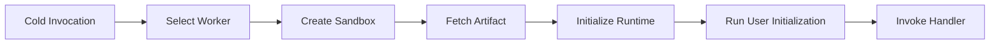
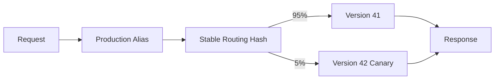
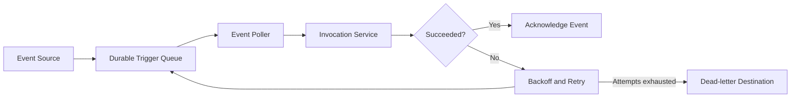
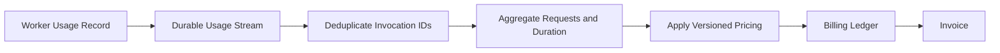
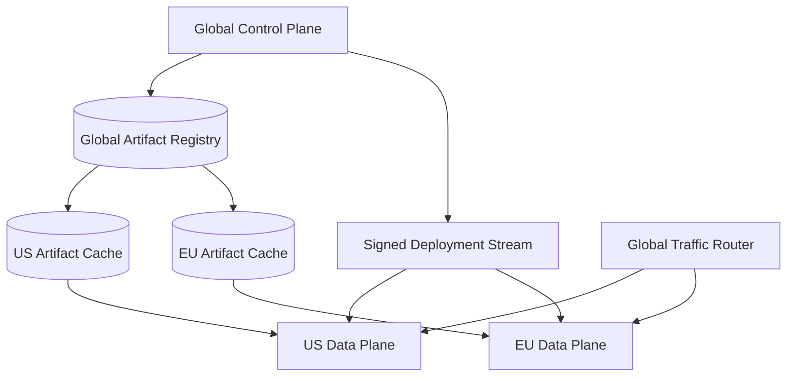

## Problem and requirements

A serverless functions platform runs user code in response to HTTP requests, messages, schedules, and storage events. Customers deploy code without managing servers; the platform allocates isolated compute, scales it with demand, and charges for execution.

The main challenge is combining a developer-friendly deployment model with secure multi-tenant execution and low startup latency. Traffic is bursty, most functions are idle, and untrusted code must never escape its sandbox or exhaust shared infrastructure.

### Functional requirements

- Create, version, deploy, invoke, and roll back functions
- Build source code into immutable runnable artifacts
- Support synchronous HTTP and asynchronous event triggers
- Scale instances from zero and back down when idle
- Configure memory, timeout, concurrency, environment, and identity
- Route traffic between versions for canaries
- Deliver logs, metrics, traces, and execution status
- Retry asynchronous failures and support dead-letter destinations
- Meter requests, duration, memory, and outbound resources

### Non-functional requirements

- Support ten million functions and 20 million invocations per second
- Start warm invocations within tens of milliseconds
- Bound cold-start latency and capacity exhaustion
- Isolate tenants in compute, network, storage, and identity
- Keep the invocation path available during control-plane outages
- Prevent one function or tenant from overwhelming a region
- Avoid duplicate execution for synchronous retries where possible
- Produce auditable deployments and billing records

The platform provides at-least-once execution for asynchronous events. Exactly-once business effects require idempotency in the function or downstream service.

## Capacity estimates

Assume ten million deployed functions, one billion versions, and 20 million peak invocations per second across regions.

| Resource | Average | Peak assumption |
| --- | ---: | ---: |
| Invocations | 5M/second | 20M/second |
| Active sandboxes | Millions | Tens of millions |
| Builds | Thousands/second | Bursty after releases |
| Execution logs | Tens of TB/day | Tenant sampling applies |
| Artifact storage | Petabytes | Deduplicated immutable layers |

Most functions receive little traffic, while a small fraction dominates requests. Capacity design must handle both a long idle tail and sudden hot functions.

## Function model

A function definition includes:

- Name, tenant, project, and region
- Runtime and architecture
- Immutable code artifact digest
- Entrypoint and configuration
- Memory, CPU, timeout, and concurrency
- Workload identity and network policy
- Environment references and secret bindings
- Trigger definitions
- Version and traffic aliases

Published versions are immutable. An alias such as `production` maps to one or more versions with weights, enabling canaries without rebuilding artifacts.

The control plane stores desired configuration. Regional data planes receive compact signed deployment snapshots and continue invoking existing versions if the control plane is unavailable.

## API design

Deployment creates a new immutable version:

```http
POST /v1/projects/checkout/functions/validate-cart/versions
Authorization: Bearer <deployment-token>
Content-Type: application/json

{
  "artifactDigest": "sha256:91ab...",
  "runtime": "nodejs",
  "entrypoint": "validateCart",
  "memoryMb": 512,
  "timeoutSeconds": 10,
  "maxConcurrency": 20
}
```

Direct invocation uses an idempotency key when the caller needs retry deduplication:

```http
POST /v1/functions/validate-cart:invoke
Idempotency-Key: order_981_validation
Content-Type: application/json

{"cartId":"cart_981"}
```

Responses identify the invocation, executed version, status, and payload. Platform errors are distinguished from user-code errors so callers can make safe retry decisions.

## High-level architecture

Separate the global control plane from regional invocation data planes.



Control-plane changes are relatively rare and strongly controlled. The data plane is optimized for high-volume local decisions without synchronous dependencies on global services.

## Build pipeline

Source deployments run in isolated, network-restricted builders.



Builds use pinned runtime images and dependency resolution policy. The output records source digest, dependency lockfile, builder version, runtime version, and artifact digest.

Artifacts are content-addressed. Identical layers are deduplicated and cached near workers. A deployment references a digest, never a mutable tag.

Builders have no production credentials. Any temporary dependency credential is scoped to the build, excluded from output layers, and revoked afterward.

## Invocation path

The regional gateway authenticates the caller, resolves the function alias, applies quotas, and creates an invocation record. The router selects a compatible warm sandbox or requests capacity.



Every stage has a deadline. The gateway reserves enough time for the caller to receive the result rather than letting internal work consume the entire request timeout.

## Sandbox isolation

Functions execute untrusted code. A sandbox provides:

- Separate process, filesystem, and network namespaces
- CPU, memory, process, file, and I/O limits
- Read-only runtime and code layers
- Small writable ephemeral storage
- Filtered system calls and device access
- Workload-specific identity
- Egress policy and metadata-service protection

Isolation options form a spectrum. Containers start quickly but share a kernel. Micro-virtual machines provide a stronger boundary with modest startup cost. Language isolates are extremely fast but depend heavily on runtime correctness.

Use stronger isolation between tenants than between invocations of the same trusted function version. Never reuse a sandbox across tenants, and scrub memory and writable storage before reuse.

The host agent and sandbox monitor communicate over a narrow protocol. User code cannot call host control APIs directly.

## Worker lifecycle

Workers are ordinary machines managed by a fleet controller. Each advertises available CPU, memory, runtime cache, architecture, zone, and health.



Workers heartbeat through leases. When one becomes unhealthy, routers stop sending new work. In-flight synchronous requests fail or retry according to idempotency policy; asynchronous events return to their queue after visibility timeout.

Fleet upgrades drain workers gradually and preserve regional headroom.

## Scheduling

The scheduler chooses a worker using hard constraints and soft scores.

Hard constraints include runtime architecture, available resources, tenant isolation, regional policy, network capability, accelerator requirements, and artifact compatibility.

Scores favor warm runtime layers, cached artifacts, data locality, balanced utilization, low fragmentation, and failure-domain spread. A reservation prevents concurrent schedulers from assigning the same capacity twice.

Maintain separate pools for general functions, high-memory workloads, accelerators, regulated tenants, and internal platform tasks. This limits blast radius and avoids one workload class fragmenting every node.

Scheduling uses declared resources plus platform overhead. Actual consumption informs future recommendations and abuse controls but does not replace reservations.

## Cold starts

A cold start includes placement, sandbox creation, artifact fetch, runtime initialization, user-code initialization, and readiness.



Reduce latency with:

- Regional artifact caches and shared read-only layers
- Prebuilt runtime snapshots
- Paused or frozen generic sandboxes
- Predictive prewarming for recurring traffic
- Provisioned concurrency for strict latency needs
- Small deployment packages and lazy loading

Measure each cold-start phase separately. Hiding all time behind one number makes optimization guesswork.

Provisioned concurrency reserves initialized instances for a function version. It costs more but provides predictable latency and capacity during known bursts.

## Warm pools and reuse

After an invocation, retain the sandbox for a bounded idle period. Reuse amortizes startup cost, connection setup, and user initialization.

Warm state is a cache, not durable storage. Applications cannot assume the same sandbox handles the next request or that in-memory state survives.

A sandbox may handle one or several concurrent requests according to runtime safety and configured concurrency. Higher concurrency improves utilization but makes noisy requests interfere and complicates memory sizing.

Recycling policies consider idle age, runtime patch level, memory growth, invocation count, and suspicious behavior. Mandatory maximum lifetime ensures security updates eventually replace every sandbox.

## Autoscaling

Scale from observed concurrency and queued demand, not CPU alone.

```text
required instances = ceil(active and queued requests / target concurrency)
```

The regional scaler maintains desired warm capacity by function version. It reacts quickly to scale-up and uses cooldown windows for scale-down.

Concurrency limits exist at several levels:

- Per sandbox
- Per function version
- Per project and tenant
- Per region
- Global platform safety limit

Reserved concurrency guarantees capacity for critical functions and caps their maximum impact. Unreserved capacity is shared fairly among other tenants.

Sudden bursts can exceed creation speed. The gateway queues within a short bound, sheds excess work predictably, and returns explicit throttling rather than allowing unbounded latency.

## HTTP routing and versions

An alias maps traffic among immutable versions.



Use a stable request, user, or session key for sticky canaries when product behavior must remain consistent. Random per-request routing is suitable for stateless compatibility testing.

The deployment controller watches errors, latency, throttling, and user-defined health signals. It can pause progression or atomically return the alias to the previous version.

Version routing metadata is distributed before traffic weights change, ensuring every region knows how to execute the target.

## Asynchronous event delivery

Event sources append durable messages containing trigger, function version or alias, payload reference, event ID, and attempt count.



Delivery is at least once. The event ID remains stable across attempts so handlers can deduplicate business effects.

Configure maximum age, retry count, backoff, concurrency, and dead-letter destination. Poison events must not block an entire partition; isolate them after bounded attempts.

Ordering is available only when the source and trigger explicitly support it. Ordered partitions reduce parallelism and require one failed event to be handled without indefinite blockage.

## Scheduled functions

A durable scheduler stores cron or interval definitions, calculates occurrences in a declared timezone, and emits invocation events with stable occurrence IDs.

Leader failover may emit the same occurrence twice, so the invocation ID is derived from schedule and planned time. Missed-run policy determines whether to catch up, skip, or coalesce delayed executions.

Apply jitter to large fleets of common schedules such as midnight jobs. Without it, customer configuration creates a predictable regional traffic spike.

Long-running or multi-step workflows belong in a workflow engine, not a single function with an extreme timeout.

## State and external dependencies

Sandboxes are ephemeral. Durable state lives in external databases, object storage, queues, or workflow systems.

Scaling from zero to thousands of instances can overwhelm a downstream database. The platform supports connection proxies, per-destination egress limits, and concurrency caps, but applications must also use bounded pools and backpressure.

Network access follows explicit egress policy. Private resources may require tenant-specific network attachment, which adds cold-start cost. Cache safe network setup without allowing identities or routes to leak across tenants.

Retries can repeat writes. Function code should use idempotency keys, conditional updates, or transactional outboxes for external side effects.

## Identity, configuration, and secrets

Each function version runs as a workload identity with only declared permissions. The sandbox receives short-lived, audience-bound credentials rather than static cloud keys.

Configuration is versioned with the deployment. Secret references resolve through a secrets manager and are delivered through protected memory or a local agent, not embedded in artifacts or plain environment diagnostics.

The platform metadata endpoint requires sandbox identity and blocks arbitrary network access. Credentials expire quickly and are not reused across function versions.

Administrative roles for deploying code, changing permissions, viewing logs, and modifying billing limits remain separate.

## Timeouts and cancellation

Every invocation has a hard deadline. The runtime exposes remaining time so handlers can stop work and clean up.

At timeout, send a graceful cancellation signal, wait a short termination period, then destroy the sandbox if execution continues. Reusing a sandbox after uncontrolled timeout risks leaked background work.

Client disconnect does not always cancel execution; the policy depends on trigger type and whether useful work may continue. Record the distinction between platform timeout, user exception, cancellation, and worker loss.

Outbound calls should receive deadlines shorter than the remaining invocation time. Otherwise child work continues after the result can no longer succeed.

## Usage metering and billing

Workers emit signed usage records containing tenant, function version, invocation ID, start and end time, allocated resources, outcome, and metering version.



Measure billed duration using a monotonic clock and documented rounding. Retries caused by platform failure may be excluded; user-code retries follow product policy.

Real-time usage dashboards are provisional. Authoritative billing recomputes from immutable usage records and reconciles worker counts, gateway records, and ledger entries.

Metering failure must not silently create unlimited free execution. Buffer durably and apply conservative tenant capacity if usage uncertainty exceeds a threshold.

## Multi-tenancy and abuse controls

Layer isolation and quotas:

- Authenticated tenant identity at every API boundary
- Sandboxes that never mix tenants
- CPU, memory, process, disk, and network limits
- Per-tenant invocation and build quotas
- Egress filtering and destination limits
- Artifact and dependency scanning
- Restricted privileged system calls
- Billing and denial-of-wallet protections

Functions may be malicious, compromised, or simply buggy. Detect cryptomining, fork bombs, outbound scanning, recursive invocation, and extreme log generation.

Recursive calls require depth and rate limits. A function that triggers its own event source can otherwise create an exponential cost loop.

## Logs, metrics, and traces

Capture standard output and structured telemetry asynchronously through the host agent. User logging must not block execution once a bounded buffer fills.

Platform metrics include invocations, errors, throttles, duration, cold starts, queue delay, memory high-water mark, and initialization time. Logs and traces carry invocation and function-version IDs.

Apply per-tenant log-rate limits and retention. A runaway logger should lose excess diagnostic output, not consume the worker disk or regional network.

Expose platform spans separately from user spans so engineers can distinguish gateway delay, cold start, initialization, and handler execution.

## Multi-region design

Replicate artifacts and signed deployment metadata before enabling a version in a region. Invocation and event processing remain region-local.



Residency policy determines where code, configuration, events, and telemetry may travel. Failover routes only to permitted regions.

Async queues may use regional ownership with replicated checkpoints. During failover, visibility leases and stable event IDs prevent loss but may permit duplicate execution.

Existing regional deployments continue during a global control-plane outage. New deployments and permission changes pause.

## Failure handling

### Control plane unavailable

Regional data planes use the last valid signed deployment snapshot. Invocations continue; deployment changes pause.

### Worker failure

Stop routing new work. Synchronous callers receive a retryable platform error; asynchronous events become visible again after their lease expires.

### Artifact registry unavailable

Warm sandboxes and regional caches continue serving. Cold starts for uncached versions fail predictably rather than running unverified code.

### Regional capacity exhausted

Honor reserved concurrency, queue briefly, throttle lower-priority traffic, and add fleet capacity. Cross-region overflow occurs only when policy allows it.

### Trigger backlog

Scale pollers and function concurrency within downstream limits. Report event age, not only queue length, and move expired events according to policy.

### Bad runtime release

Canary workers and compare platform error rates. Stop placement on the faulty runtime, drain affected sandboxes, and revert the runtime manifest.

### Noisy tenant

Enforce hierarchical quotas at gateway, scheduler, worker, network, and telemetry layers. One limit alone is insufficient.

## Observability and operations

Track:

- Invocation latency split by gateway, queue, cold start, init, and handler
- Warm-hit rate and cold starts by runtime and artifact size
- Scheduling delay, worker utilization, and fragmentation
- Throttling by function, tenant, and regional limit
- Sandbox creation and isolation failures
- Async backlog age, retry rate, and dead-letter volume
- Deployment propagation and canary health
- Artifact-cache hit rate and registry latency
- Usage-record lag and billing reconciliation
- Worker churn, runtime version, and security events

Synthetic functions in every region test HTTP invocation, event triggers, identity, secrets, networking, timeout, logs, and billing records.

Operational tools provide safe actions such as pause trigger, set concurrency, drain worker, roll back alias, or replay a dead-letter event. Every action is authenticated and audited.

## Key tradeoffs

### Isolation vs startup speed

Stronger virtual-machine boundaries improve tenant isolation but add startup and memory cost. Runtime snapshots and warm pools recover much of the latency without weakening the boundary.

### Scale to zero vs predictable latency

Scale to zero saves idle capacity but creates cold starts. Provisioned concurrency spends capacity for workloads with strict latency objectives.

### Concurrency vs isolation

Handling multiple requests per sandbox improves efficiency but increases contention and failure sharing. Single-request execution is simpler and safer for unpredictable code.

### At-least-once vs exactly-once events

At-least-once delivery survives worker and network failure without global transactions. Stable event IDs and idempotent handlers are more practical than promising exactly-once side effects.

### Global control vs regional independence

A global control plane simplifies management, while regional data planes keep invocation latency low and survive control-plane outages. Signed immutable deployment snapshots connect the two safely.

The central principle is to move slow, security-sensitive work into deployment and sandbox preparation so the invocation path can remain local, bounded, and disposable.
