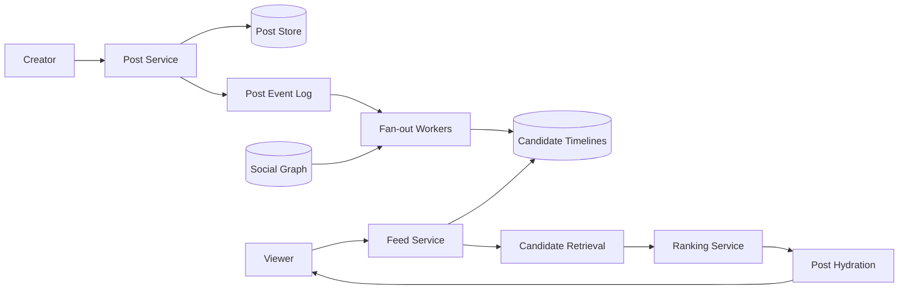
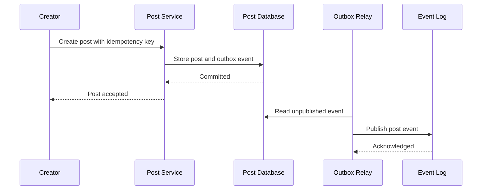
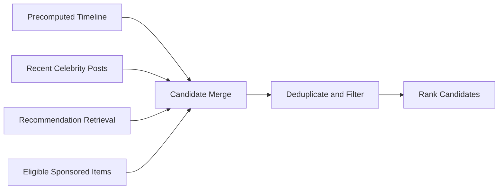

## Problem and requirements

A social news feed presents posts from followed accounts and recommended sources in a personalized order. The system must transform a large, constantly changing graph into a small ranked page within milliseconds while enforcing privacy and content policy at read time.

### Functional requirements

- Create text, image, link, and video posts
- Follow and unfollow accounts
- Return a personalized feed with cursor pagination
- Include reactions, comments, and social context
- Hide deleted, blocked, muted, or unauthorized posts
- Support both fresh following content and recommendations
- Record impressions and engagement for ranking feedback

### Non-functional requirements

- Serve feed pages in under 300 milliseconds at the 99th percentile
- Make new ordinary posts visible to followers within seconds
- Support 500 million users and very large follower graphs
- Continue serving during partial ranking or fan-out failures
- Prevent privacy changes from leaking stale content
- Avoid duplicate or unstable pages during pagination

Post creation and relationship changes require strong durability. Feed ordering may be eventually consistent and personalized differently across requests.

## Capacity estimates

Assume 500 million daily users, 20 feed requests per user per day, and 100 million new posts per day.

| Resource | Average | Peak assumption |
| --- | ---: | ---: |
| Feed reads | 116,000/second | 1.2M/second |
| Post writes | 1,160/second | 12,000/second |
| Timeline fan-out at 300 followers/post | 347,000 inserts/second | 3.5M/second |
| Feed cards at 2 KB and 20/page | 4.6 GB/second | 48 GB/second |

The follower distribution is highly skewed. Most accounts have few followers, while a small number have millions. Designing only for the average makes celebrity posts overwhelm fan-out workers and storage.

Media bytes are delivered through a separate CDN-backed media system. The feed carries compact references and presentation metadata.

## APIs and pagination

Post creation uses an idempotency key so a client timeout does not create duplicates.

```http
POST /v1/posts
Idempotency-Key: phone17-post-928
Content-Type: application/json

{
  "text": "A new system design note is live.",
  "mediaIds": ["media_42"],
  "visibility": "followers"
}
```

Feed reads use an opaque cursor rather than an offset:

```http
GET /v1/feed?limit=20&cursor=eyJzZXNzaW9uSWQiOi...
```

The cursor can encode a feed-session ID, last ranking score, tie-breaker post ID, model version, and expiration time. It is signed so clients cannot alter internal state.

Offset pagination is unstable when new posts enter the feed: items shift between pages, creating duplicates or omissions. A session-aware cursor preserves a consistent candidate snapshot for a bounded browsing window.

## High-level architecture

The write path stores posts and asynchronously distributes candidate references. The read path retrieves candidates, applies current eligibility rules, ranks them, hydrates content, and assembles a page.



The post store is the source of truth. Candidate timelines contain references, not complete copies of mutable posts. This keeps fan-out records small and lets deletion or policy changes take effect during hydration.

## Post write path

The post service authenticates the author, validates visibility, confirms uploaded media, assigns a time-sortable post ID, and commits the post plus an outbox event.



Fan-out begins only after durable acceptance. The outbox relay may publish twice, so workers deduplicate by post ID and target timeline.

Edits update the canonical post and publish a new version event. Feed candidates do not need rewriting because hydration reads the current permitted version. Deletes create a tombstone and high-priority invalidation event.

## Social graph storage

The graph needs both outgoing edges—accounts a user follows—and incoming edges—followers of an author. Fan-out reads incoming edges; candidate pull and profile pages read outgoing edges.

Partition adjacency lists by owner ID and paginate them by stable edge ID. Large accounts span many buckets. Relationship records include state, creation time, and privacy metadata.

```text
Following(user_id, bucket, followed_user_id, created_at)
Followers(author_id, bucket, follower_user_id, created_at)
```

Follow and unfollow update both directions through a durable event workflow. Temporary disagreement is tolerable if every feed item still passes an authoritative relationship and privacy check before display.

Blocks override follows. Store them in a low-latency policy service and include them in eligibility filtering even when graph replicas lag.

## Fan-out on write

For ordinary authors, workers append the new post ID and lightweight features to each follower’s candidate timeline. Feed reads become cheap because candidates are already collected.

A timeline entry might contain:

```text
viewer_id, post_id, author_id, created_at,
source="following", coarse_score, expiry
```

Partition timelines by viewer ID and order entries by insertion or coarse score. Retain only a bounded recent window; old posts remain discoverable through profile and archive paths rather than an endlessly growing inbox.

Fan-out workers batch timeline writes by destination shard. Per-author checkpoints and idempotent inserts make replay safe after failure.

The weakness is write amplification. An author with 50 million followers would create 50 million inserts for one post, delaying every other author.

## Fan-out on read and the hybrid model

Fan-out on read fetches recent posts from followed authors when the viewer opens the feed. It avoids write amplification but requires many author lookups and an expensive merge for users following thousands of accounts.

A hybrid strategy is practical:

- Fan out ordinary authors on write
- Keep celebrity and extremely high-fan-out authors out of recipient timelines
- Fetch recent celebrity posts at read time
- Merge following candidates with recommendations before ranking



The celebrity threshold depends on fan-out queue depth, follower activity, and post frequency rather than one fixed follower count. A popular but rarely posting account may still be economical to fan out.

## Candidate retrieval

Ranking can only choose from retrieved candidates. The retrieval layer gathers a few hundred or thousand items from multiple sources:

- Recent posts from followed accounts
- Posts engaged with by close connections
- Topic- or embedding-based recommendations
- Trending content within locale or community
- Previously saved or unfinished content
- Eligible sponsored content

Each source has a time and candidate budget. If one recommender is slow, the feed proceeds with other sources. Following content provides a reliable baseline that does not depend on complex models.

Apply coarse filtering and lightweight scores during retrieval to avoid sending tens of thousands of weak candidates to the main ranker.

## Ranking pipeline

Use multiple stages so expensive models evaluate only the strongest candidates.

1. **Eligibility:** privacy, block, mute, deletion, policy, region, and age checks
2. **Deduplication:** identical posts, reposts, and already viewed content
3. **Lightweight ranker:** inexpensive features reduce the pool
4. **Main ranker:** predicts outcomes such as meaningful engagement or satisfaction
5. **Re-ranking:** diversity, freshness, author limits, and product constraints

A simplified score might combine:

```text
score = P(meaningful interaction)
      + freshness_weight
      + relationship_strength
      + content_quality
      - negative_feedback_risk
```

Do not optimize only clicks or time spent. Those targets can reward sensational, repetitive, or harmful content. Ranking objectives need explicit quality, integrity, and user-control constraints.

Feature retrieval must have strict deadlines. Precompute slow features, cache stable author attributes, and supply default values when an online feature service fails.

## Feed hydration

After ranking, the feed service batch-loads post bodies, current author summaries, media references, reaction counts, and viewer-specific state.

Hydration rechecks visibility and relationship policy. A candidate generated minutes ago may no longer be legal to show because the author deleted it, made the account private, or blocked the viewer.

Use batch APIs and request-scoped data loaders to avoid one network call per card. Optional fields such as approximate reaction counts may be omitted when their services are slow; the post itself can still render.

The final response includes stable post IDs and impression tokens. The client reports an impression only when the card is actually visible, not merely returned by the server.

## Cursor stability and deduplication

A feed changes while a user scrolls. The server creates a short-lived feed session containing:

- Candidate-generation timestamp
- Seen post IDs or a compact seen filter
- Ranking model version
- Source cursors
- Experiment assignments

The opaque page cursor references this session and the last ranked position. Keeping a bounded server-side session produces more stable pagination than reconstructing the feed independently for every page.

For stateless operation, encode source cursors and a Bloom filter of seen IDs in the signed cursor, but token size grows and Bloom false positives may hide unseen items.

On refresh, start a new session so fresh posts can enter near the top. Infinite-scroll pagination keeps the older session for consistency.

## Caching

Cache canonical posts and public author summaries by immutable version. Candidate timelines cache briefly by viewer. Ranking results are harder to share because they depend on personal context and change quickly.

Avoid caching fully assembled private feed responses in shared infrastructure. If edge caching is used for public or anonymous feeds, tenant, locale, safety policy, and experiment version must be part of the cache key.

Celebrity recent-post lists and trending candidate pools cache well. Apply expiration jitter and request coalescing so a popular cache entry does not stampede its backing service.

## Freshness and late fan-out

Fan-out is asynchronous, so a newly accepted post may not immediately appear in every follower timeline. For the author and very close relationships, the read path can merge a small recent-post lookup to provide read-after-write behavior.

Monitor fan-out lag by author class and destination shard. When queues fall behind, preserve high-priority or active-follower deliveries and let dormant-user timelines catch up later—or regenerate them on demand.

Do not insert a delayed old post at the absolute top without regard to event time. The ranker uses creation time and relevance, not fan-out completion time.

## Privacy, deletion, and policy changes

Never treat precomputed timelines as authorization. They are untrusted candidate caches. Every response applies current visibility, follow approval, block, mute, regional, and policy state.

Deletion publishes urgent invalidations to post caches and timeline stores, but read-time tombstones provide the correctness boundary while cleanup propagates.

When a public account becomes private, its old candidates may exist in millions of timelines. An authoritative account-visibility version lets hydration reject entries generated under an older policy.

Privacy checks fail closed. If the policy service is unavailable, omit uncertain content rather than risk disclosure.

## Engagement and counters

Likes, reactions, comments, shares, impressions, hides, and reports enter a durable event stream. Separate consumers update:

- Approximate display counters
- User-specific reaction state
- Ranking features
- Creator analytics
- Abuse detection

Exact global counters are unnecessary on the feed path. Sharded counters aggregate asynchronously and may be slightly stale. A unique `(user_id, post_id, reaction_type)` record preserves the user’s authoritative reaction state.

Impression events include signed tokens tying the event to a served feed session. This reduces fabricated training data and distinguishes delivered cards from actually viewed cards.

## Backpressure and isolation

Fan-out, ranking, and hydration each need bounded work. Apply quotas by author, viewer, tenant, and candidate source.

When overloaded:

- Reduce candidate counts before extending latency
- Skip optional recommendation sources
- Use a simpler fallback ranker
- Serve cached following timelines
- Delay fan-out to inactive users
- Shed noncritical counter and analytics updates

Reserve resources for post creation, privacy changes, and deletion. A recommendation-model surge must not block safety-critical updates.

## Failure handling

**Post-service failure:** clients retry with the same idempotency key. No fan-out occurs until the post transaction commits.

**Fan-out backlog:** feeds merge recent author posts at read time and continue serving existing candidates. Workers recover from durable checkpoints.

**Timeline-store failure:** reconstruct a degraded feed from followed-author and recommendation indexes.

**Ranking-service timeout:** use the lightweight score or reverse-chronological following content.

**Feature-store outage:** rank with cached or default features and mark the model input as degraded.

**Hydration dependency failure:** omit optional counters or recommendations; exclude posts whose authorization cannot be confirmed.

**Regional failure:** route reads to a replicated region. New post events replay from the durable log, and feed candidates can be regenerated from canonical posts and graph state.

## Observability and quality

System health metrics include:

- Feed latency broken down by retrieval, ranking, and hydration
- Candidate count and timeout rate by source
- Fan-out queue lag and timeline insertion failures
- Empty, partial, duplicate, and authorization-filtered response rates
- Cache hit rate and storage hot partitions
- Ranking feature freshness and model-serving errors

Product quality requires controlled measurement:

- Meaningful engagement and negative feedback
- Feed diversity and repeated-author rate
- Freshness distribution
- Following-content coverage
- Session satisfaction and return rate
- Safety and privacy violation rate

Log enough ranking context to reproduce why a post was eligible and scored, while minimizing retention of sensitive user features. Model changes require offline evaluation, canarying, and online experiments with guardrail metrics.

## Trade-offs

**Fan-out on write vs. read:** write fan-out makes reads fast but amplifies celebrity posts. Read fan-out avoids copies but increases feed latency. A hybrid follows the graph’s skew.

**Chronological vs. ranked feed:** chronological order is explainable and naturally fresh. Ranking improves relevance at the cost of model dependencies, instability, and governance complexity.

**Precomputed vs. fresh candidates:** precomputation keeps latency predictable. Read-time retrieval captures recent graph and recommendation changes.

**Stable pagination vs. live updates:** a fixed session avoids duplicates while scrolling. Starting a new session surfaces fresh content but changes ordering.

**Availability vs. privacy:** feed relevance may degrade safely during dependency failures. Authorization cannot; uncertain items must be removed.

The central design treats the feed as a disposable ranked view over durable posts, graph relationships, and policy state. Candidate timelines make the common path fast, but canonical data and read-time authorization preserve correctness.
