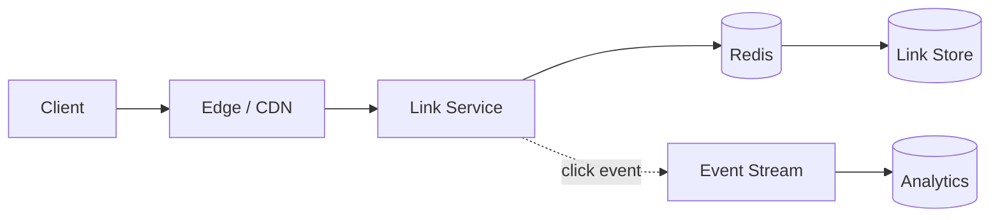

## Requirements

The service accepts a long URL and returns a unique short alias. Opening the alias redirects the visitor with low latency. Links should remain available for years and may optionally expire.

- Create and resolve short links
- Sustain a read-heavy workload
- Prevent duplicate aliases
- Collect basic click analytics

## High-level design

Clients create links through an API service. A key-generation service allocates collision-free IDs, which are encoded with Base62. Redirect requests first check an edge cache, then a distributed cache, and finally the primary link store.

## Data model

Store the short key as the partition key with the destination URL, creation time, owner, and optional expiry. The redirect path only needs a point lookup, making a wide-column or key-value store a natural fit.

| Field | Purpose |
| --- | --- |
| `short_key` | Primary lookup key |
| `destination` | Original URL |
| `created_at` | Retention and auditing |
| `expires_at` | Optional automatic expiry |

## Trade-offs

A random key is simple but requires collision checks. Preallocated numeric IDs avoid collisions but make traffic volume easier to infer. Cache invalidation matters when links can be edited, so immutable destinations are the safer default.
