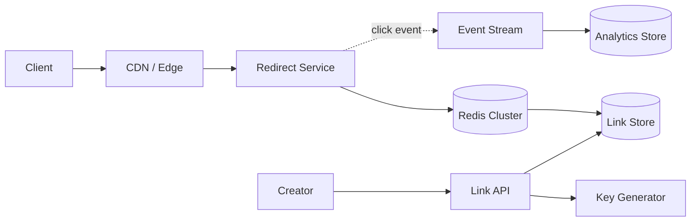
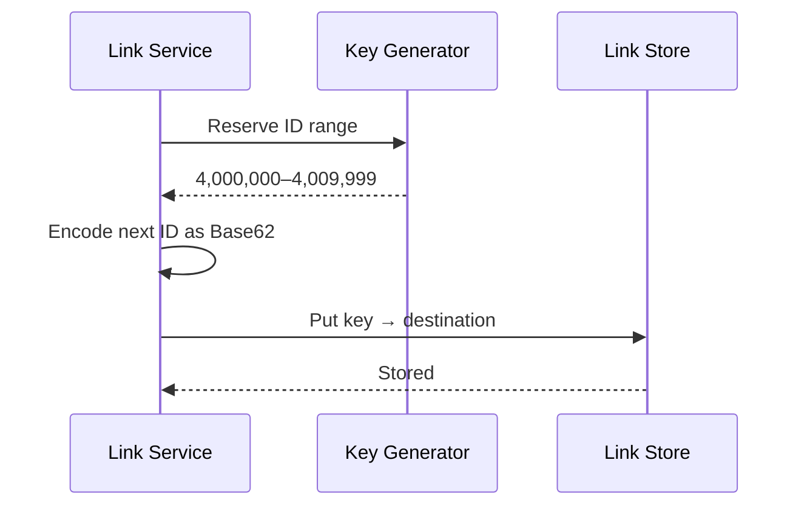

## Problem and requirements

A URL shortener maps a long URL to a compact alias and redirects visitors who open that alias. The product looks simple, but its traffic is highly asymmetric: creating a link is occasional; resolving one can happen millions of times.

### Functional requirements

- Create a short link for a valid destination URL
- Redirect a short link to its destination
- Support optional custom aliases and expiration dates
- Prevent different links from receiving the same alias
- Record click events without slowing down redirects

### Non-functional requirements

- Redirects should complete in under 100 milliseconds at the 99th percentile
- Created links must not be lost
- The redirect path should remain available during regional failures
- The system should scale horizontally and tolerate traffic spikes

Editing destinations, authentication, abuse review, and detailed analytics are useful extensions but are not required for the first version.

## Capacity estimates

Assume the system creates **100 million links per month** and serves **10 billion redirects per month**. That is a 100:1 read-to-write ratio.

| Workload | Average | Peak assumption |
| --- | ---: | ---: |
| Link creation | 39 writes/second | 400 writes/second |
| Redirects | 3,860 reads/second | 40,000 reads/second |
| New storage | ~50 GB/month | Includes metadata and replication overhead |

Seven Base62 characters provide `62⁷`, or roughly 3.5 trillion, possible aliases. This is ample room, but key generation still needs to avoid collisions and hot partitions.

## API design

The write API validates the destination, applies policy checks, and returns the complete short URL.

```http
POST /v1/links
Content-Type: application/json

{
  "url": "https://example.com/a/very/long/path",
  "customAlias": null,
  "expiresAt": null
}
```

```json
{
  "key": "aZ3kP9q",
  "shortUrl": "https://sho.rt/aZ3kP9q"
}
```

The redirect endpoint is intentionally small: `GET /{key}` returns `302 Found` with the destination in the `Location` header. A `302` is preferable while links may change; immutable links can use a cache-friendly `301` or `308`.

## High-level architecture

Separate link creation from redirection because the paths have different performance and consistency needs. The write path values correctness. The read path values latency and availability.



The edge caches popular redirects close to users. On an edge miss, the redirect service checks Redis and then the durable link store. Click events go to a stream asynchronously, so analytics cannot delay the user-facing redirect.

## Generating short keys

The key must be compact, unique, and safe inside a URL. Base62 uses lowercase letters, uppercase letters, and digits, making it a good encoding.

One robust approach is to allocate numeric ID ranges to each link-service instance. An instance consumes IDs from its local range, converts each ID to Base62, and asks for a new range before exhaustion.



Range allocation removes a network call from every link creation and guarantees uniqueness. To make aliases less predictable, the service can apply a reversible permutation before Base62 encoding. Random keys are simpler conceptually, but every collision requires another lookup and retry.

Custom aliases use a conditional insert such as “create only if this key does not exist.” This prevents two simultaneous requests from claiming the same name.

## Storage and partitioning

The primary access pattern is a point lookup by short key. A distributed key-value or wide-column database fits this workload well.

| Field | Purpose |
| --- | --- |
| `short_key` | Partition and primary lookup key |
| `destination` | Validated destination URL |
| `created_at` | Retention and auditing |
| `expires_at` | Optional automatic expiry |
| `owner_id` | Ownership and quota enforcement |
| `status` | Active, disabled, or quarantined |

Hashing the short key distributes rows evenly across partitions. Replication across availability zones protects durability. Cross-region replicas can serve reads locally, while link creation stays in a primary region or uses globally consistent conditional writes.

## Redirect and caching path

The redirect service follows a cache-aside strategy:

1. Check the CDN or edge cache.
2. Check the regional Redis cluster.
3. Read the durable link store on a miss.
4. Populate Redis with a bounded time-to-live.
5. Return the redirect and publish a click event asynchronously.

Popular links produce excellent cache hit rates. Negative results should also be cached briefly to protect the database from repeated requests for invalid keys. Add random jitter to expiration times so many keys do not expire simultaneously and create a cache stampede.

If destinations are immutable, cached values can live for hours. If editing is supported, publish an invalidation event whenever a destination changes. Immutability is operationally simpler and reduces the risk of stale or malicious redirects.

## Reliability and failure handling

The redirect path should degrade gracefully:

- If analytics is unavailable, redirect anyway and buffer or drop the click event.
- If Redis is unavailable, fall back to the link store with request coalescing and strict database limits.
- If the primary region fails, route reads to a healthy region with a replicated link store.
- If a destination is unsafe, mark the link disabled and invalidate every cache layer.

The key generator is not on the redirect path. Link-service instances should reserve enough IDs to keep creating links during a brief generator outage. The database remains the source of truth; caches may always be rebuilt.

## Abuse and security

Short links hide their destination, which makes the service attractive for phishing and malware. Creation endpoints need per-user and per-IP rate limits. New destinations should be checked against threat-intelligence lists, and suspicious links should be quarantined.

The redirect response should include conservative security headers. Preview pages can reveal the destination before redirecting, but they add latency and change the product experience. Reserved aliases such as `admin`, `api`, and `login` should never enter the general key pool.

## Bottlenecks and evolution

The first bottleneck is usually cache capacity or a small set of viral links, not average database throughput. CDN caching absorbs globally popular keys. Redis replicas and request coalescing prevent hot keys from overwhelming one node.

As the system grows:

- Add regional redirect services and replicated stores
- Split analytics into its own independently scalable pipeline
- Pre-warm caches for known campaigns
- Use per-tenant domains and quotas
- Move expired records to cheaper archival storage

## Trade-offs

**Sequential IDs vs. random keys:** sequential allocation guarantees uniqueness and is efficient, but raw sequences reveal volume. Random keys conceal volume but require collision handling.

**Strong vs. eventual consistency:** creation and custom-alias claims need strong consistency. Redirect reads can tolerate a short replication delay if the service offers read-after-write through the primary region or a temporary cache entry.

**Editable vs. immutable destinations:** editing is convenient but introduces cache invalidation and account-takeover risk. Immutable links are safer and easier to operate.

The central design choice is to keep redirects exceptionally simple: resolve one key, return one location, and move every nonessential task off the critical path.
