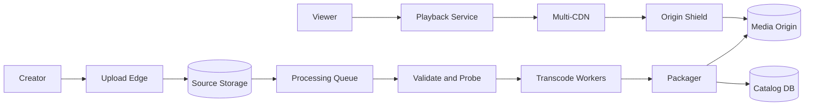
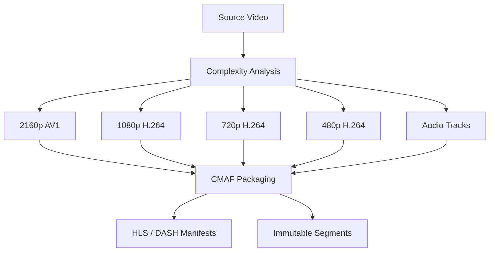
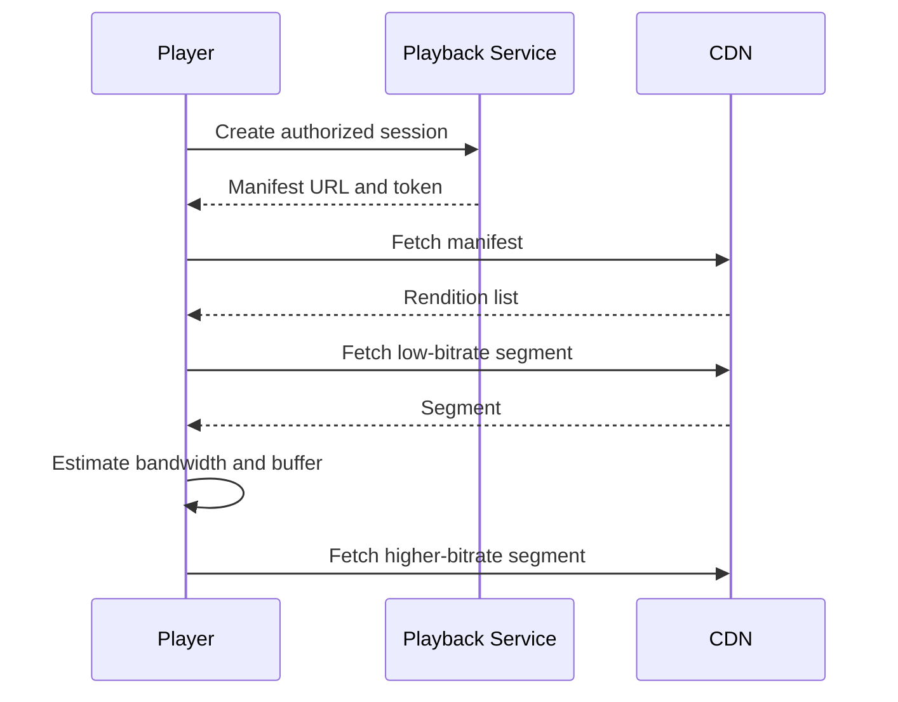
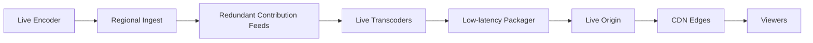

## Problem and requirements

A video streaming platform accepts source videos, transforms them into formats suitable for many devices and network conditions, and delivers them with fast startup and minimal buffering. The control plane manages catalogs, rights, and playback authorization. The media plane moves far larger volumes of encoded bytes.

### Functional requirements

- Upload and publish on-demand videos
- Generate multiple resolutions, bitrates, codecs, audio tracks, and subtitles
- Stream adaptively as network conditions change
- Resume playback across devices
- Support seeking, captions, thumbnails, and playback analytics
- Enforce geographic, subscription, and licensing restrictions
- Remove or unpublish content quickly

### Non-functional requirements

- Start playback quickly and keep rebuffering low
- Support tens of millions of simultaneous viewers
- Preserve uploaded source files and published renditions durably
- Continue playback through origin and availability-zone failures
- Scale popular content without overloading the origin
- Protect licensed content and private viewing data

Recommendations, comments, advertising auctions, and creator payments are separate systems that consume the catalog and playback events.

## Capacity estimates

Assume 100 million daily viewers consuming 30 minutes each, producing **50 million viewing hours per day**. At an average delivered bitrate of 5 Mbps, playback egress is approximately 112 PB per day.

| Resource | Average | Peak assumption |
| --- | ---: | ---: |
| Concurrent viewers | 2.1M | 20M |
| Playback egress at 5 Mbps | 10.4 Tbps | 100 Tbps |
| Playback-session requests | 1,200/second | 12,000/second |
| Segment requests at 4-second segments | 520K/second | 5M/second |

The CDN must serve nearly all media traffic. Even a 95% cache hit rate leaves 5 Tbps reaching origin during a 100 Tbps peak, so origin shielding and cache efficiency are first-class design concerns.

Uploaded source files are much larger than streamed renditions. If creators upload 100,000 hours each day at 20 Mbps, source ingress is about 900 TB per day before replication. Transcoded variants may multiply storage by three to ten times depending on the encoding ladder.

## Playback and upload APIs

Large uploads use resumable sessions rather than passing through an application server.

```http
POST /v1/videos/uploads
Content-Type: application/json

{
  "title": "Building a distributed cache",
  "size": 12884901888,
  "contentType": "video/mp4"
}
```

The response contains an upload ID, chunk size, and short-lived signed destinations. Completing the upload creates a video asset in `processing` state and starts the media pipeline.

Before playback, the client requests a session:

```http
POST /v1/videos/video_42/playback-sessions
Authorization: Bearer <token>

{
  "device": "web",
  "capabilities": ["h264", "av1", "widevine"],
  "maxResolution": "2160p"
}
```

The service checks entitlements and returns a short-lived manifest URL, DRM license information when needed, subtitle tracks, and a playback-session ID used for analytics.

## High-level architecture

The ingest pipeline operates asynchronously. The playback path is separate and optimized for low latency and cacheability.



The source asset, processing jobs, and outputs use stable identifiers. Every pipeline step is idempotent so a retry can reuse completed work rather than generating duplicate renditions.

## Ingest and validation

The creator uploads chunks directly to regional object storage. Each chunk carries a checksum and byte range. The client can query completed ranges after interruption and resume only missing data.

After upload completion, a probe worker validates the container, codecs, duration, dimensions, frame rate, audio tracks, and file integrity. It rejects unsupported or malicious inputs before expensive transcoding begins.

The original source is immutable. Edits create a new source version or a rendering recipe that references the original. Keeping the mezzanine source allows the platform to produce better codecs and resolutions later without asking the creator to upload again.

Untrusted media parsers and codecs should run in isolated sandboxes with CPU, memory, output-size, and execution-time limits. Crafted media files are a security boundary, not ordinary application input.

## Transcoding pipeline

One source becomes an **encoding ladder** of renditions. A typical ladder includes several resolutions and bitrates so players can adapt to available bandwidth and screen size.



Split long videos at keyframe-aligned boundaries so many workers can transcode chunks in parallel. Each chunk includes overlap or deterministic frame boundaries to prevent visible seams. An assembly step verifies timestamps and joins the output manifest.

Per-title encoding analyzes visual complexity and chooses bitrates that meet a quality target. Animation may need far fewer bits than sports footage at the same resolution. This reduces CDN cost without lowering perceived quality.

Job priorities distinguish newly uploaded content, popular back-catalog migrations, and reprocessing after a codec improvement. Reserve capacity for creator-facing jobs so bulk migrations do not delay publication.

## Packaging and manifests

Package encoded media into short immutable segments, commonly two to six seconds each. A manifest lists available renditions and the segment sequence for each.

HLS and MPEG-DASH differ in manifest format but can share CMAF media segments when codec and encryption choices align. Shared segments reduce duplicate storage and improve CDN utilization.

Shorter segments let the player adapt and seek more quickly, but they increase request volume and manifest overhead. Longer segments improve compression and cache efficiency but make recovery from a bandwidth drop slower.

Manifests are small and may be personalized with authorized renditions, ad markers, or signed URLs. Media segments remain identical across viewers whenever possible so CDN caches can share them.

## Adaptive bitrate playback

The player begins with a conservative rendition to minimize startup delay. It estimates throughput from recent segment downloads, monitors buffer depth, and selects the next segment’s bitrate.



An adaptive bitrate algorithm balances image quality, rebuffer risk, and quality stability. Aggressively switching upward can empty the buffer after one misleadingly fast request. Switching too slowly wastes capable networks.

The player should cap resolution to the screen, respect data-saving preferences, and avoid downloading a 4K stream for a small background player. Audio can continue at a stable bitrate when video quality falls.

## CDN and origin design

DNS or an application-level traffic director selects a CDN based on geography, cost, capacity, and real-time health. Clients retain a fallback host for mid-session failure.

Cache keys include the immutable asset and segment version, not a per-user token. Authorization can use signed cookies, edge validation, or token fields excluded from the cache key. Incorrect cache-key design can either destroy hit rate or leak private content.

An origin shield sits between CDN edges and object storage. When a new popular segment is requested simultaneously from thousands of locations, request coalescing at the shield turns many misses into one origin read.

Popular releases can be pre-positioned in regional caches. For the long tail, normal demand-based caching is cheaper. Immutable segment URLs receive long cache lifetimes; unpublishing uses an authorization denylist and CDN purge rather than waiting for expiration.

## Metadata and catalog

The catalog stores mutable video state while media files remain immutable.

| Entity | Important fields |
| --- | --- |
| Video | owner, title, visibility, processing state, current asset version |
| Asset | source reference, duration, tracks, checksums |
| Rendition | codec, resolution, bitrate, segment manifest |
| Rights policy | regions, subscription tier, start and end time |
| Subtitle track | language, format, object reference |
| Playback session | viewer, device, policy decision, start time |

Metadata updates need strong consistency for visibility and rights. Playback reads are heavily cached, but policy changes and takedowns publish invalidations with a short maximum staleness bound.

Separate creator metadata from the search and recommendation indexes. Those indexes update asynchronously and can be rebuilt from the catalog event log.

## Playback authorization and DRM

The playback service verifies authentication, subscription, rental window, age policy, region, concurrent-stream limit, and device capability before issuing a session.

Signed manifest access should expire quickly. Media URLs need enough lifetime for uninterrupted playback but should not become reusable public links. Refresh authorization during long sessions without forcing the player to restart.

For licensed content, encrypt segments with rotating content keys. A DRM license service authenticates the playback session and releases keys under device and policy restrictions. Keys, encryption metadata, and media segments use independent storage and access controls.

DRM raises the cost of copying but cannot make screen output impossible to capture. Watermarking and anomaly detection complement it for high-value releases.

## Playback state and resume

Clients periodically report the highest confidently viewed position. The service stores one state per user and video with a version or server timestamp.

Reports are idempotent and can be batched. A device may send stale progress after being offline, so blindly accepting the latest arrival can move the resume point backward. Prefer the maximum recent position unless the user explicitly restarted or completed the video.

Progress events also feed recommendations and analytics, but those consumers receive privacy-filtered event streams. The low-latency resume store should not wait for the analytics pipeline.

## Live streaming extension

Live video shares packaging and delivery infrastructure but changes the ingest path. Encoders continuously send small media fragments to regional ingest points. The platform transcodes, packages, and publishes a sliding manifest within seconds.



Keep two ingest locations and redundant encoder feeds for important events. Live segments are immutable after publication, while manifests update continuously and use short cache lifetimes.

Reducing glass-to-glass latency requires shorter segments or chunked transfer, smaller buffers, and faster failover. Each reduction also leaves less time to absorb network jitter. On-demand streaming optimizes quality and efficiency; live streaming explicitly chooses a latency target.

## Analytics and quality of experience

Players emit sampled events for startup, segment requests, bitrate switches, stalls, seek actions, errors, and completion. Events enter a durable stream and are processed outside the playback path.

Core quality metrics include:

- Time to first frame
- Rebuffer ratio and stall duration
- Average delivered bitrate and resolution
- Quality-switch frequency
- Playback failure rate
- CDN throughput, errors, and cache hit ratio
- Exit rate before playback begins

Aggregate by device, app version, network, region, CDN, codec, and content class. Overall averages can hide a broken television model or one overloaded internet provider.

Session IDs connect client experience to playback authorization and CDN request logs without placing personal identifiers in media URLs.

## Failure handling

**Upload interruption:** resume from verified chunks using the existing session.

**Transcode worker failure:** the job lease expires and another worker retries the deterministic chunk. Completed outputs are reused.

**Bad rendition:** remove it from new manifests while other renditions continue serving. Reprocess it from the source asset.

**CDN degradation:** route new sessions elsewhere and let players fail over segment hosts. Avoid switching every user simultaneously.

**Origin failure:** CDN caches continue serving hot segments while an origin replica or secondary region takes over.

**Catalog outage:** cached authorization may allow low-risk playback for a short bounded window. New purchases, policy changes, and private-content access fail safely.

**DRM outage:** cached licenses may preserve active sessions, but new protected playback cannot start. Unprotected content remains independent.

**Regional failure:** playback control moves to a healthy region and CDNs read from replicated media origins. The immutable media plane is easier to fail over than mutable session and rights state.

## Security and abuse

Validate media structures in sandboxes and scan uploads before publication. Enforce quotas on upload bytes, transcode minutes, stored renditions, and delivery traffic.

Private videos require authorization at both manifest and segment access. Prevent user-specific tokens from entering shared logs or cache keys. Use short-lived credentials and rotate signing keys.

Apply copyright and policy workflows to catalog visibility without physically deleting source evidence immediately when retention obligations apply. Emergency takedown must disable playback globally faster than ordinary metadata propagation.

Protect analytics ingestion from forged events. Client metrics are useful signals, not trusted billing records.

## Observability and operations

Track each asset from upload through every processing stage:

- Upload completion, checksum failures, and abandoned sessions
- Queue delay and transcode duration by codec and resolution
- Failed or missing segments
- Time from upload completion to publishable state
- Origin requests, shield coalescing, and CDN cache misses
- Playback authorization latency and denial reasons
- Quality-of-experience metrics by client and network
- Storage growth and orphaned rendition cleanup

Synthetic players should continuously start, seek, change quality, refresh authorization, and fail over CDNs. File availability alone does not prove that manifests, keys, and segments combine into a playable stream.

Canary new encoder versions on a small content slice. Compare visual quality, bitrate, processing cost, and device compatibility before migrating the catalog.

## Trade-offs

**Precompute vs. transcode on demand:** precomputing makes playback reliable and cacheable but spends storage and compute on videos that may never be watched. On-demand encoding saves cold-content cost but increases first-play latency.

**Segment duration:** short segments improve adaptation, seeking, and live latency. Long segments reduce request overhead and often compress better.

**One CDN vs. multi-CDN:** one provider simplifies operations and improves volume pricing. Multiple providers add routing complexity but improve capacity, regional reach, and resilience.

**Codec efficiency vs. compatibility:** newer codecs reduce bandwidth at equal quality but cost more to encode and may lack hardware support on older devices. Keep a broadly compatible fallback.

**Personalized vs. shared manifests:** personalized manifests make rights and advertising flexible, but reduce cacheability. Keep media segments shared and move only essential decisions into the manifest.

**Low latency vs. resilience:** larger player buffers hide network variation. Smaller buffers feel more live but turn brief delivery problems into visible stalls.

The central design separates durable asynchronous media processing from the latency-sensitive playback path. Encode once, publish immutable segments, cache them everywhere, and keep authorization and manifests small enough to evaluate quickly.
