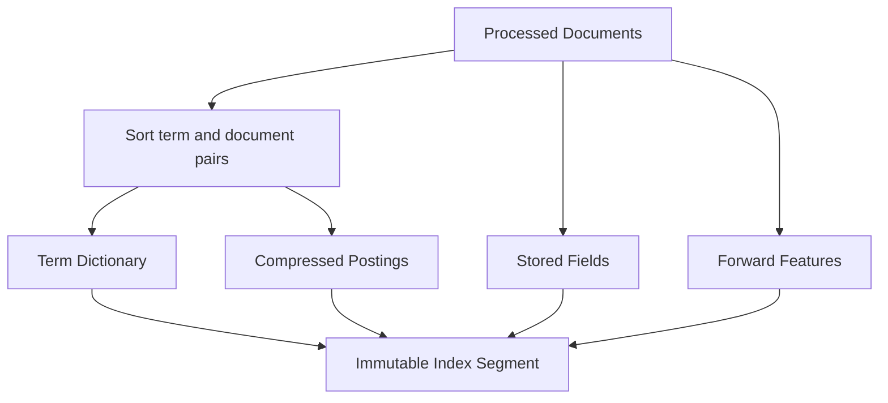
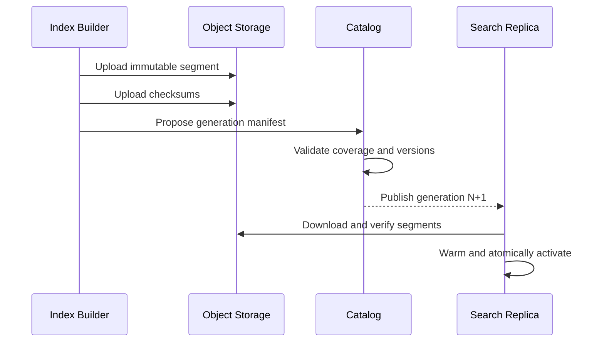
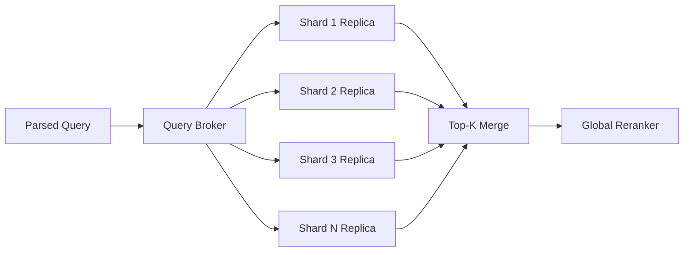

## Problem and requirements

A web search engine discovers documents, converts them into a searchable index, and returns relevant results for a query in a fraction of a second. It must balance relevance, freshness, coverage, latency, cost, and safety across a corpus too large for any one machine.

### Functional requirements

- Search documents by words, phrases, fields, and filters
- Rank the most useful results for a query
- Return titles, URLs, snippets, and selected metadata
- Support spelling correction and query rewriting
- Refresh changed pages and remove deleted or unsafe content
- Handle multiple languages and locales
- Record quality signals without blocking search

### Non-functional requirements

- Serve 100,000 queries per second at peak
- Return the first result page within 300 milliseconds at the 99th percentile
- Index 100 billion documents
- Make important updates searchable within minutes
- Remain useful during shard, model, and regional failures
- Prevent one query or tenant from consuming unbounded resources

Web crawling and autocomplete are upstream and adjacent systems. This design starts with fetched documents and user queries but explains their integration points.

## Capacity estimates

Assume 100 billion indexed documents, 100,000 peak queries per second, and an average processed document size of 20 KB after boilerplate removal.

| Resource | Estimate |
| --- | ---: |
| Processed corpus | ~2 PB |
| Inverted index at 20–40% of processed corpus | 400–800 TB |
| Peak query traffic | 100K/second |
| Daily changed or new documents at 1% | 1B/day |
| Index updates | ~11,600 documents/second average |

Replication, positional indexes, stored fields, link data, vectors, and temporary merge space multiply the physical footprint. A practical fleet uses several petabytes across serving replicas and build systems.

The query distribution has a long tail. Popular queries cache well, while a large fraction may be seen rarely or only once.

## Search API

The public API accepts text, locale, filters, safe-search policy, and an opaque page cursor.

```http
GET /v1/search?q=distributed+cache&locale=en-US&limit=10
```

```json
{
  "results": [
    {
      "title": "Distributed caching patterns",
      "url": "https://example.com/cache-patterns",
      "snippet": "...consistent hashing, invalidation, and hot keys..."
    }
  ],
  "nextCursor": "eyJxdWVyeVZlcnNpb24iOi...",
  "tookMs": 82
}
```

The cursor contains or references the query plan, index generation, last score, tie-breaker document ID, and expiration. Offset pagination becomes expensive at deep pages and unstable across index updates.

Queries have strict limits on length, operators, wildcards, time range, returned fields, and execution cost.

## High-level architecture

The indexing pipeline transforms fetched documents into immutable index segments. The serving path rewrites a query, fans it out to index shards, merges candidates, reranks them, and assembles the response.


Immutable segments allow safe publication, caching, replication, and rollback. Recent updates live in smaller fresh segments that are merged into larger base segments later.

## Document processing

The processing pipeline converts raw responses into a canonical searchable representation:

1. Validate content type and decoding
2. Parse visible text and structured metadata
3. Remove navigation, advertising, and repeated boilerplate
4. Detect language and character encoding
5. Select a canonical URL
6. Extract title, headings, anchor text, and links
7. Identify duplicates and spam signals
8. Tokenize and normalize fields by language

Keep the raw fetch reference and processor version. When tokenization or quality rules improve, documents can be reprocessed without recrawling the web.

Parsing untrusted formats occurs in sandboxes with memory, CPU, recursion, and output limits. One malformed document must not stall a pipeline worker.

## Tokenization and normalization

Text analysis depends on language and field. A simple English pipeline may lowercase, split words, normalize Unicode, and optionally stem related forms. CJK languages require segmentation; languages with rich morphology need different analyzers.

Preserve original token offsets for highlighting and snippets. Index both exact and normalized forms when exact names, identifiers, or phrases matter.

Stop-word removal saves space but can break phrase queries such as “to be or not to be.” Modern systems often retain positions while down-weighting common terms rather than removing them universally.

Analyzer versions belong in segment metadata. Mixing incompatible tokenization without query-time awareness produces silent recall errors.

## Inverted index

An inverted index maps each term to a postings list of documents containing it.

```text
"cache" -> [
  (doc_12, term_frequency=7, positions=[4, 18, 91, ...]),
  (doc_84, term_frequency=2, positions=[11, 52]),
  ...
]
```

The term dictionary maps strings to compressed postings blocks. Each posting may include document ID deltas, term frequency, field flags, and positions.



Delta-encode sorted document IDs and use variable-byte or bit-packed compression. Positions consume significant space, so keep them only for fields and terms that need phrase and proximity queries.

Stored fields hold titles, URLs, and compact text needed for response assembly. Large source content remains in separate document storage.

## Index partitioning

Two primary strategies are possible.

**Document partitioning** assigns each document to one shard. Every shard holds the full vocabulary for its document subset. A query fans out to all shards, and each returns its top candidates.

**Term partitioning** assigns terms to shards. A multi-term query contacts the shards for those terms and joins postings across the network.

Document partitioning is common because scoring stays local and each shard independently produces top results. Its cost is broad fan-out for every uncached query.

Use hundreds or thousands of logical shards, each replicated across machines and failure zones. Logical shards make movement and replica scaling independent of index construction.

Route specialized verticals—news, images, local, products—to separate indexes and blend them later rather than forcing one schema and ranking model onto every document type.

## Building and publishing segments

Index builders process a bounded document range and write an immutable segment with checksums, dictionaries, postings, stored fields, and feature columns.

A manifest lists every segment belonging to an index generation. Publication is atomic: serving nodes load and validate the new manifest, warm important structures, then switch one active-generation pointer.



Keep the previous generation for rollback. Never expose a manifest until all referenced objects are durable and readable.

## Fresh indexing

Waiting for a full daily build makes important updates stale. Use a tiered index:

- A large optimized base index built periodically
- Small incremental segments built every few minutes
- An optional in-memory or local-disk real-time segment for urgent updates

Queries search all active tiers and deduplicate by canonical document ID, keeping the newest version. Background merges combine small segments and remove superseded documents.

Urgent deletions and legal removals go into a globally replicated denylist checked before results are returned. Normal segment cleanup can happen later.

Freshness priority depends on document class. News, prices, and status pages need rapid recrawling and indexing; stable reference material can wait.

## Query understanding

Before retrieval, normalize and interpret the query:

- Detect language and locale
- Correct likely spelling errors
- Identify phrases, entities, dates, and operators
- Expand safe synonyms
- Apply user-selected filters
- Classify intent and relevant search verticals

Generate a primary interpretation and a bounded number of alternatives. Uncontrolled synonym expansion creates huge posting scans and irrelevant matches.

Spelling correction uses query logs, language models, and corpus vocabulary, but should preserve uncommon names and identifiers. Show transparent correction and allow users to search the original text.

Query understanding is deadline-aware. If a model is slow, fall back to normalized literal terms rather than delaying all search.

## Candidate retrieval

Each shard evaluates the query against local postings and returns its top `K` candidates with lightweight features.

BM25-like lexical scoring combines term rarity, frequency, and field length. Phrase and proximity matches use token positions. Static quality signals include link authority, document quality, freshness, and spam assessments.

```text
first_stage_score = lexical_relevance
                  + title_match
                  + link_quality
                  + freshness_prior
```

Use skip pointers, block-max scores, and dynamic pruning to avoid evaluating every matching document. Stop once remaining blocks cannot beat the current top candidates.

Semantic vector retrieval can provide another candidate source. An approximate nearest-neighbor index retrieves conceptually related documents, then the broker merges lexical and semantic candidates. Vector retrieval complements rather than replaces exact terms, names, and filters.

## Distributed query execution

The query broker resolves the active generation, selects one replica per logical shard, and issues parallel requests with a deadline.



Replica choice uses locality, current queue depth, latency, and generation readiness. Hedging one slow shard to another replica can improve tail latency, but hedges need a cluster-wide budget.

The broker may return a marked partial result if a noncritical shard misses the deadline. It should not silently treat an unavailable policy or deletion filter as empty.

Scatter-gather fan-out makes tail latency important: one slow shard can delay the whole query. Keep shard work bounded and maintain enough replicas for load and failure headroom.

## Ranking stages

Ranking proceeds from cheap broad scoring to expensive narrow scoring:

1. Shards retrieve a few hundred candidates each
2. The broker merges global top candidates
3. A learned reranker evaluates richer query-document features
4. A final stage applies diversity, freshness, safety, and product constraints

Useful features include lexical relevance, semantic similarity, authority, freshness, locale match, page experience, historical query-document satisfaction, and spam risk.

Ranking models must be versioned and reproducible. Log the candidate set, feature version, model version, and final adjustments for sampled queries so regressions can be investigated.

Do not optimize clicks alone. Misleading titles and sensational pages may win short-term engagement while reducing search quality. Evaluation needs satisfaction, reformulation, abandonment, trust, and safety measures.

## Snippet generation

After ranking, generate snippets only for the small final result set. Retrieve compact stored text, find windows containing query terms, score their readability and coverage, and highlight matches.

Precomputed passages reduce latency, while dynamic selection adapts better to each query. A hybrid stores semantically coherent passages and selects among them online.

Snippet text is untrusted page content. Escape it before rendering and remove scripts, hidden text, and unsafe markup. Never let a cached snippet from an older document version accompany a newer title or URL.

If snippet generation times out, return the title and a safe metadata description rather than delaying the entire page.

## Deduplication and canonicalization

The web contains mirrors, syndicated articles, printer views, tracking URLs, and copied pages. Exact content hashes identify byte-equivalent documents. Locality-sensitive fingerprints identify near duplicates after boilerplate removal.

Cluster duplicates and choose one representative using canonical declarations, authority, freshness, locale, and accessibility. Other copies remain indexed for availability and query-specific reasons but are suppressed from the same result page.

Canonicalization is a ranking signal, not blind trust. A malicious page should not be able to declare an unrelated authoritative site as canonical and replace it.

## Link analysis

The crawl graph provides authority and discovery signals. A PageRank-like computation distributes importance through links, with normalization and spam resistance.

Compute global link features offline over large graph snapshots, then incrementally update local freshness signals. Link scores change slowly enough to avoid request-time graph traversal.

Detect link farms, paid-link patterns, hacked-page links, and sitewide template links. Raw inbound-link count is easy to manipulate and should not directly determine rank.

Anchor text supplies descriptive terms for pages that contain little text, but it is also an abuse surface and needs source-quality weighting.

## Caching

Cache normalized query results by locale, safe-search setting, index generation, and other ranking dimensions. Popular head queries achieve high hit rates.

Cache at several layers:

- Edge cache for public, nonpersonalized queries
- Frontend result cache
- Query-plan and rewrite cache
- Shard postings and block cache
- Feature and document cache

Personalized results should not enter shared caches. Cache global candidates and rerank privately when personalization is enabled.

Historical index generations naturally invalidate through versioned keys. Fresh overlays and rapidly changing queries use shorter TTLs.

## Pagination

The cursor records the index generation and last result boundary. Keeping one generation across pages avoids duplicates caused by a rebuild between requests.

Deep pagination is expensive because every shard must produce at least as many candidates as the requested depth. Set practical limits and encourage query refinement.

Use score plus a stable document ID as a tie-breaker. Floating-point score serialization needs a deterministic representation across services and versions.

If the cursor’s generation has been retired, restart the search and clearly indicate that results may have changed rather than attempting to combine incompatible orderings.

## Safety, spam, and removals

Apply policy at multiple stages:

- Crawl and ingestion filters
- Document-level quality and malware classification
- Query intent classification
- Candidate filtering
- Final safe-search and legal-policy enforcement

Critical removal lists are small, replicated, and checked on every response. Do not rely only on asynchronous index deletion.

Spam systems analyze content, links, hosting patterns, redirects, behavior, and adversarial query targeting. Models and rules should support appeal, audit, and rapid rollback.

Search results can reveal sensitive or legally restricted information. Region, age, user policy, and removal jurisdiction are part of the final eligibility decision.

## Multi-language and regional serving

Build language-aware fields and analyzers. A document may contain multiple languages; index field-level language where practical.

Regional serving clusters hold the common global index plus locale-specific segments. Queries prefer local replicas for latency, while rare-language or specialized vertical shards may be remote.

Ranking uses locale, not merely IP geography. User-selected language and query script often provide stronger intent signals.

Regional policy overlays filter or annotate results without creating entirely separate copies of the global corpus.

## Failure handling

**Search-replica failure:** the broker chooses another replica for the same logical shard.

**Slow shard:** a bounded hedge may race another replica. If neither meets the deadline, return a marked partial result when policy allows.

**Query-understanding failure:** search normalized literal terms with the baseline ranker.

**Reranker failure:** return first-stage retrieval order with required policy filters.

**Snippet-service failure:** return titles, URLs, and safe stored descriptions.

**Fresh-index failure:** continue serving the last valid base generation and urgent denylist. Freshness degrades, but search remains available.

**Bad index generation:** canary query suites and live metrics stop rollout; replicas atomically return to the prior manifest.

**Regional failure:** global routing shifts queries to a replicated region with enough spare capacity.

## Observability and quality evaluation

System metrics include:

- End-to-end latency broken down by rewrite, retrieval, reranking, and snippets
- Shard fan-out, timeout, hedge, and partial-result rates
- Cache hit rates by layer
- Index generation age and fresh-segment lag
- Query cost, postings scanned, and candidates scored
- Replica CPU, memory, disk, and queue depth
- Empty-result and spelling-correction rates

Quality evaluation uses:

- Human relevance judgments on versioned query sets
- Successful clicks and long-click signals
- Reformulation and abandonment
- Freshness for time-sensitive queries
- Diversity and duplicate rate
- Spam, safety, and removal leakage
- A/B experiments with guardrails

Synthetic canaries search known documents, newly indexed pages, deleted pages, phrases, filters, and rare languages in every region.

## Security and privacy

Search queries can reveal health, identity, location, and personal intent. Encrypt transport, minimize raw query retention, restrict access, and aggregate analytics where possible.

Do not place personalized queries or results in shared cache keys or logs. Redact tokens, secrets, email addresses, and other sensitive patterns from operational telemetry.

Sandbox document parsing and snippet generation. Validate query syntax and bound regex, wildcard, vector, and aggregation work to prevent computational denial of service.

Administrative removals, ranking overrides, and index publications require strong authorization and immutable audits.

## Trade-offs

**Document vs. term partitioning:** document partitioning keeps scoring local but fans every query across shards. Term partitioning narrows routing but requires distributed joins.

**Freshness vs. index efficiency:** small frequent segments publish quickly but increase query fan-out and duplicate work. Large merged segments serve efficiently but take longer to build.

**Lexical vs. semantic retrieval:** lexical search is exact, explainable, and efficient. Semantic retrieval improves conceptual recall but costs more and may miss precise constraints.

**Static vs. learned ranking:** static formulas are predictable and debuggable. learned models capture complex relevance but require training data, feature serving, monitoring, and governance.

**Complete vs. partial results:** waiting for every shard improves coverage but hurts tail latency and availability. Marked partial results may be preferable for broad web search, but never for mandatory safety filters.

**Personalization vs. privacy and caching:** personalization may improve relevance while reducing shared-cache efficiency and increasing sensitivity of stored signals.

The central design does expensive work before the query arrives: crawl, normalize, deduplicate, analyze, and compile immutable indexes. At request time, bounded parallel retrieval and staged ranking turn those prepared structures into a fast, policy-safe result page.
