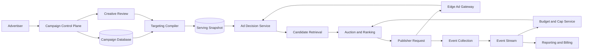
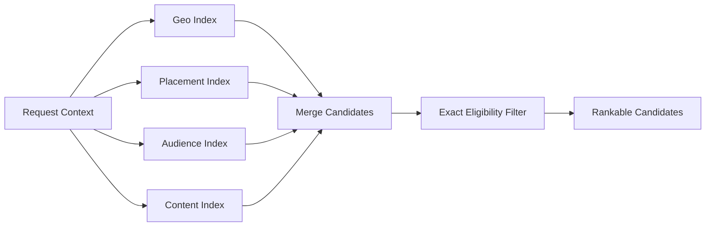
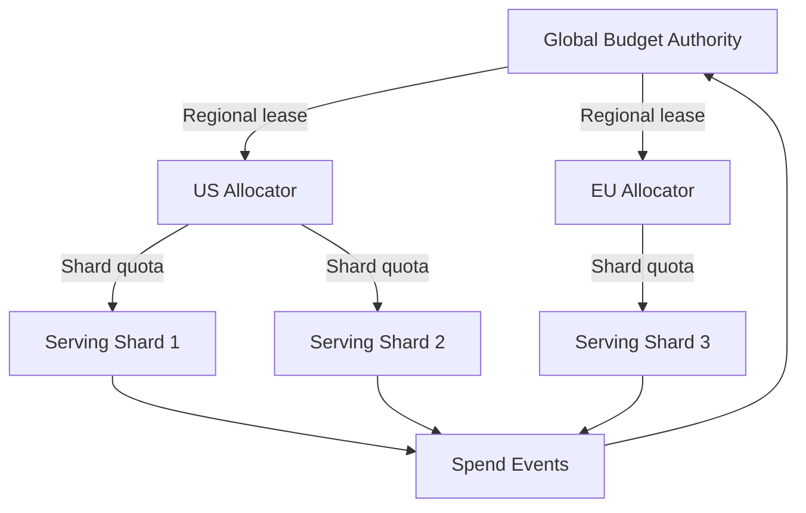
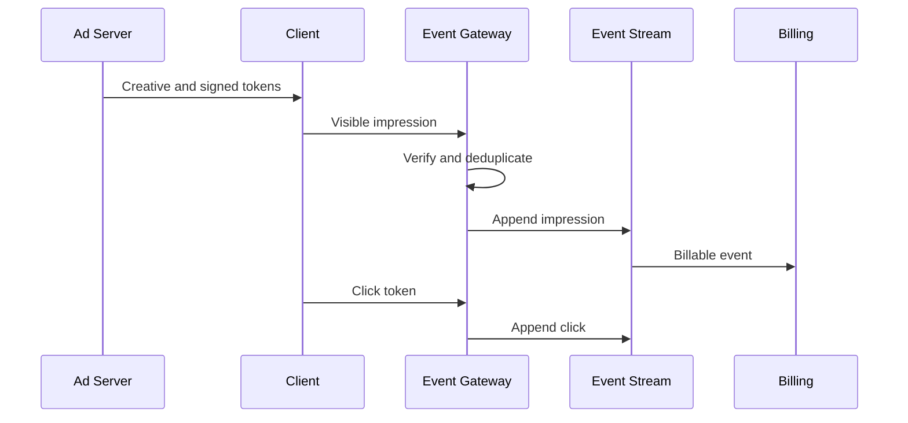

## Problem and requirements

An ad serving system chooses the best eligible advertisement for a page, feed, video, or search result. It must make the decision in tens of milliseconds while respecting targeting, user privacy, campaign budgets, creative policy, and marketplace rules.

The difficult part is not simply ranking ads. The system must coordinate a fast approximate serving path with financially correct accounting. It must avoid exhausting a campaign budget during a traffic spike, cap repeated exposure across devices, measure outcomes despite delayed events, and remain useful when personalization signals are unavailable.

This design covers a first-party marketplace in which advertisers create campaigns and the platform selects ads. Real-time bidding with external exchanges can be added as another candidate source with an even stricter timeout.

### Functional requirements

- Let advertisers create campaigns, creatives, targeting rules, bids, and budgets
- Return the highest-value eligible ad for a placement
- Enforce start dates, end dates, policy decisions, and inventory constraints
- Pace spending across the campaign lifetime
- Apply per-user frequency caps
- Record impressions, clicks, conversions, and billable events
- Attribute conversions to eligible interactions
- Provide campaign reporting and billing data
- Detect invalid traffic and support auditing

### Non-functional requirements

- Serve up to five million ad requests per second
- Complete the ad decision within 100 milliseconds at the 99th percentile
- Keep serving during partial dependency failures
- Prevent material budget overspend
- Deduplicate retries and repeated client events
- Protect user identity and consent choices
- Produce reproducible billing and campaign reports

The system optimizes long-term marketplace value, not only the highest immediate bid. Relevance, predicted outcomes, user experience, advertiser quality, and pacing all influence the decision.

## Capacity estimates

Assume two billion daily users, 100 eligible ad opportunities per user per day, and a three-times peak over the daily average.

| Resource | Average | Peak assumption |
| --- | ---: | ---: |
| Ad requests | 2.3M/second | 5M/second |
| Candidate evaluations | Billions/second | Depends on retrieval fan-out |
| Impression events | Hundreds of billions/day | Bursty by region |
| Click and conversion events | Billions/day | Delayed and duplicated |
| Active campaigns | Tens of millions | Hundreds of millions of creatives |

The response payload is small. Candidate retrieval, model inference, and distributed constraint checks dominate serving cost.

## API contract

The publisher requests an ad for a specific placement and supplies only permitted context.

```http
POST /v1/ad-decisions
Authorization: Bearer <publisher-token>
Content-Type: application/json

{
  "placementId": "home_feed_card",
  "requestId": "req_01K6CP2A",
  "context": {
    "country": "US",
    "language": "en",
    "device": "mobile",
    "consentMode": "personalized"
  }
}
```

```json
{
  "decisionId": "ad_01K6CP4M",
  "creative": {
    "id": "cr_1842",
    "renderUrl": "https://ads.example/render/cr_1842"
  },
  "impressionToken": "signed-opaque-token",
  "clickUrl": "https://click.example/t/signed-token",
  "expiresAt": "2026-09-30T18:04:05Z"
}
```

The decision ID links the selected creative, candidate set, auction inputs, model versions, and experiment assignment. Prices and user features remain server-side.

The client reports an impression only when the creative meets a defined visibility threshold. Returning an ad is not itself a billable impression.

## High-level architecture

The control plane accepts campaign changes and builds immutable serving snapshots. The data plane makes decisions without querying advertiser-facing transactional tables.



Campaign updates are validated, compiled, and distributed as versioned snapshots. Serving nodes atomically switch to a complete snapshot, avoiding partially applied targeting or policy changes.

Emergency campaign pauses use a small, rapidly distributed denylist instead of waiting for a full snapshot rebuild.

## Campaign model

The core hierarchy is:

- **Advertiser:** billing identity and account policy
- **Campaign:** objective, total budget, schedule, and status
- **Ad group:** targeting, bid strategy, pacing, and frequency cap
- **Creative:** rendered content, destination, format, and review status

Campaign writes use optimistic concurrency so two operators cannot silently overwrite each other. Material changes create a new version, preserving the exact configuration used for every decision.

Creatives pass malware scanning, destination validation, format checks, and policy review before becoming eligible. Review results and policy taxonomy versions are auditable.

## Candidate retrieval

Scanning every campaign per request is impossible. The retrieval layer maintains inverted indexes from coarse targeting dimensions to campaign IDs.

Useful index keys include placement, country, language, device class, content category, and broad audience segment. A request intersects or unions the relevant posting lists and produces a few hundred candidates.



Coarse retrieval may over-select, but it must not exclude eligible high-value campaigns. Exact filtering then checks the full targeting expression, campaign state, schedule, consent mode, creative compatibility, and policy rules.

Cache popular posting lists at serving nodes. Partition unusually large lists by stable campaign hash to prevent one broad audience from creating hot shards.

## Auction and ranking

For each eligible candidate, estimate the probability of the advertiser's desired outcome, such as a click or conversion. Convert different bid types into a common expected value.

For a cost-per-click campaign:

```text
expected value = bid per click × predicted click probability
```

A production score can also include predicted conversion value, creative quality, user-experience cost, pacing multiplier, and marketplace adjustments.


The pricing rule must be explicit and versioned. A first-price auction charges the winner's bid-derived price. A second-price-style auction charges enough to beat the next-best eligible score, with floors and quality adjustments.

Prediction models must be calibrated: a score of 0.02 should correspond to roughly a two-percent outcome rate for the relevant slice. Poor calibration distorts both ranking and pricing.

## Budget reservation and enforcement

Event streams update spend after impressions or clicks, but propagation delay allows thousands of servers to overspend a nearly exhausted campaign.

Use hierarchical budget allocation:

1. A global budget authority owns the durable remaining amount
2. It leases bounded spend tokens to regional allocators
3. Regional allocators lease smaller quotas to serving shards
4. A serving shard selects a campaign only while local quota remains



The maximum overspend is bounded by outstanding leases. As a campaign approaches its limit, shrink lease sizes and refresh them more often. Unused leases expire and return to the pool.

Keep serving counters separate from the financial billing ledger. Counters make fast approximate decisions; finalized, deduplicated events determine invoices.

## Pacing

A campaign with a $24,000 daily budget should not spend everything during the first hour unless the advertiser requests accelerated delivery.

The pacing controller compares actual cumulative spend with a target curve and periodically adjusts a multiplier or participation probability. The target curve can account for expected traffic by hour, weekday, region, and inventory quality.

If spend is behind target, the campaign enters more auctions or bids more aggressively within configured limits. If ahead, it is throttled. Smooth changes to avoid oscillation caused by delayed feedback.

New campaigns begin conservatively until the system learns their win rate and traffic supply. The controller also reserves capacity for high-value periods rather than treating all opportunities equally.

## Frequency caps

Frequency caps limit how often a user sees a campaign or creative within a time window. A strongly consistent global counter per request is too slow and creates a hot dependency.

For logged-in users, store compact counters keyed by user and campaign, partitioned by user ID. Cache recent counters near serving and merge updates asynchronously. Local conservative increments reduce overserving during replication lag.

For anonymous users, use a consent-aware first-party identifier or session-level cap. When durable identity is unavailable, fall back to contextual serving and placement-level repetition controls.

Approximate enforcement is often acceptable, but bound the error and monitor cap violations. Stricter contractual caps require reservation techniques similar to budget tokens.

## Impression, click, and conversion collection

The system issues signed tokens for impressions and clicks. Tokens include the decision ID, creative, campaign, timestamp, placement, and nonce without exposing sensitive auction details.

The event gateway verifies the signature, validates time bounds, assigns an event ID, and appends to a durable stream. Consumers process at least once and deduplicate before billing or model training.



Separate raw events from finalized events. Late fraud decisions, refunds, and reconciliation may invalidate a raw event before billing closes.

## Attribution

Attribution associates a conversion with one or more prior ad interactions. Store a bounded interaction history by privacy-safe user or session identifier.

A simple last-click policy selects the most recent eligible click within a configured window. View-through, multi-touch, and incrementality models are more complex and must be explicitly defined per campaign.

Conversions arrive late and may be reported by both browser and server. Deduplicate using advertiser event ID plus advertiser scope. Record the attribution policy version and all considered evidence so results can be reproduced.

Consent revocation and retention limits affect which interaction history may be used. Contextual reporting should remain functional without cross-site or long-lived identifiers.

## Fraud and invalid traffic

Invalid traffic includes bots, click farms, accidental clicks, repeated events, publisher manipulation, and advertiser conversion fraud.

Controls operate at several stages:

- Request-rate and device-integrity checks before serving
- Signed, expiring event tokens
- Velocity and behavioral rules in the streaming path
- Graph and anomaly models in offline analysis
- Delayed billing finalization for suspicious traffic
- Publisher and advertiser risk limits

Do not place a heavy fraud model directly on the critical path unless its latency and failure behavior are bounded. Fast rules can block obvious abuse; deeper analysis can quarantine revenue before settlement.

Fraud labels are delayed and imperfect. Keep model training data versioned so invalidated traffic can be removed from future datasets.

## Reporting and billing

Serving dashboards favor freshness and can use streaming aggregates. Invoices favor correctness and use finalized, deduplicated events.

Stream processors aggregate by advertiser, campaign, creative, placement, region, and time bucket. Store recent aggregates in a low-latency analytics database and compact older data into columnar storage.

Billing closes a period only after the lateness window, fraud review, and reconciliation rules complete. Every invoice line traces back to immutable billable events and the pricing rule used for each decision.

Advertiser reports should distinguish estimated recent metrics from finalized metrics. Small privacy-sensitive groups may be suppressed or noise-protected.

## Privacy and security

Consent is a serving input, not an asynchronous afterthought. The request declares the permitted mode, and candidate retrieval selects only campaigns and features allowed in that mode.

Apply these controls:

- Minimize user data in decision logs and event payloads
- Separate identity mapping from ad-serving identifiers
- Encrypt data in transit and at rest
- Restrict feature access by purpose and region
- Honor deletion and retention requirements
- Audit campaign and targeting changes
- Prevent creatives from executing untrusted code
- Scan destinations and block unsafe redirects

Sensitive targeting categories require additional restrictions or may be prohibited. Policy enforcement must fail closed when its state is unknown.

## Failure handling

### Candidate service timeout

Use candidates from completed retrieval sources. If none respond, return a contextual house ad or no-fill response instead of exceeding the page latency budget.

### Prediction service failure

Fall back to cached lightweight scores or a deterministic bid-and-quality ranking. Track degraded decisions separately.

### Budget service unavailable

Spend only from unexpired local quota. Stop a campaign when its lease is exhausted; never invent additional budget during an outage.

### Stale campaign snapshot

Continue briefly with the last known good snapshot while applying the emergency pause denylist. Reject snapshots that fail signatures, schema validation, or completeness checks.

### Event pipeline lag

Serving continues within conservative quota, but reduce lease sizes as spend uncertainty grows. Buffer events durably and shed nonessential analytics before losing billable events.

### Regional outage

Route requests to another region and let it obtain its own bounded campaign leases. Do not transfer ambiguous outstanding quota until leases expire or their usage is reconciled.

## Observability

Measure the entire decision funnel:

- Request rate, fill rate, latency, and error rate
- Candidates retrieved, filtered, scored, and timed out
- Model latency, calibration, and fallback rate
- Budget utilization, overspend, and lease waste
- Pacing error and campaign delivery health
- Frequency-cap violation estimates
- Impression, click, conversion, and invalid-traffic rates
- Event lag, deduplication, and billing reconciliation differences

Slice metrics by region, placement, campaign type, consent mode, model version, and snapshot version. Marketplace-wide averages can hide severe failures for a small advertiser group.

Retain a sampled decision trace containing candidate rejection reasons and score components. Full logging at millions of requests per second is expensive and may create privacy risk, so use controlled sampling plus complete financial event logs.

## Key tradeoffs

### Latency vs auction depth

More candidates and richer models may improve value but reduce page performance. Enforce per-stage deadlines and prove incremental lift before adding cost.

### Precise counters vs availability

Globally consistent checks simplify reasoning but cannot support the latency and scale of every ad request. Bounded leases provide local speed while limiting financial error.

### Fresh updates vs stable serving

Per-request reads from control-plane databases are fresh but fragile. Versioned snapshots are fast and consistent; emergency overlays handle the few updates that cannot wait.

### Personalization vs privacy

Personalization can improve relevance, but contextual selection is a first-class path, not merely a degraded fallback. The system must provide useful ads under restricted consent.

### Real-time reporting vs final billing

Streaming reports help advertisers react quickly, while financial totals require delayed validation. Presenting both with clear labels avoids turning provisional estimates into accounting promises.

The core design principle is to keep ad selection fast and local while bounding its financial decisions with durable, auditable control systems.
