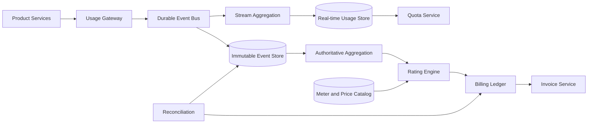
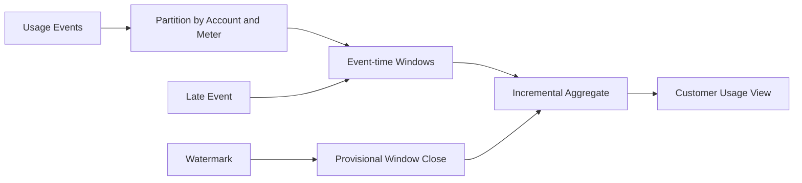
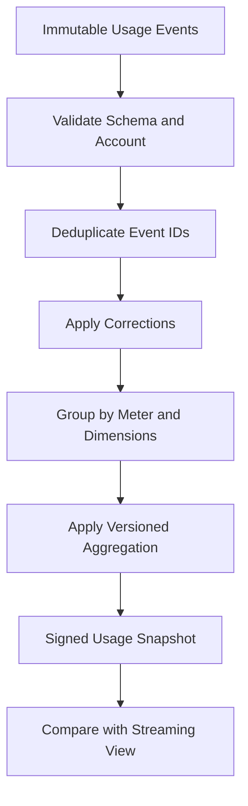
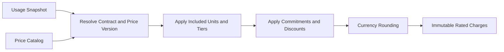
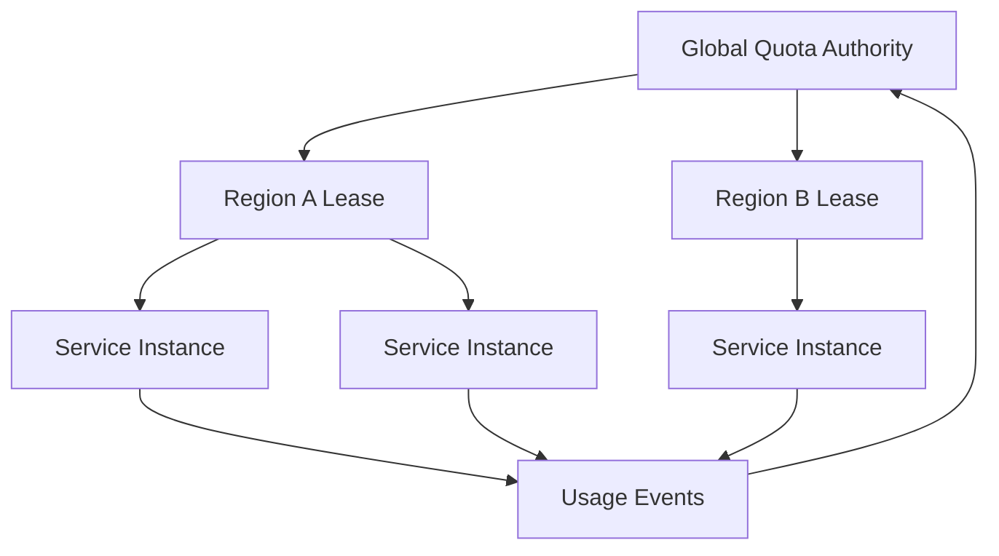
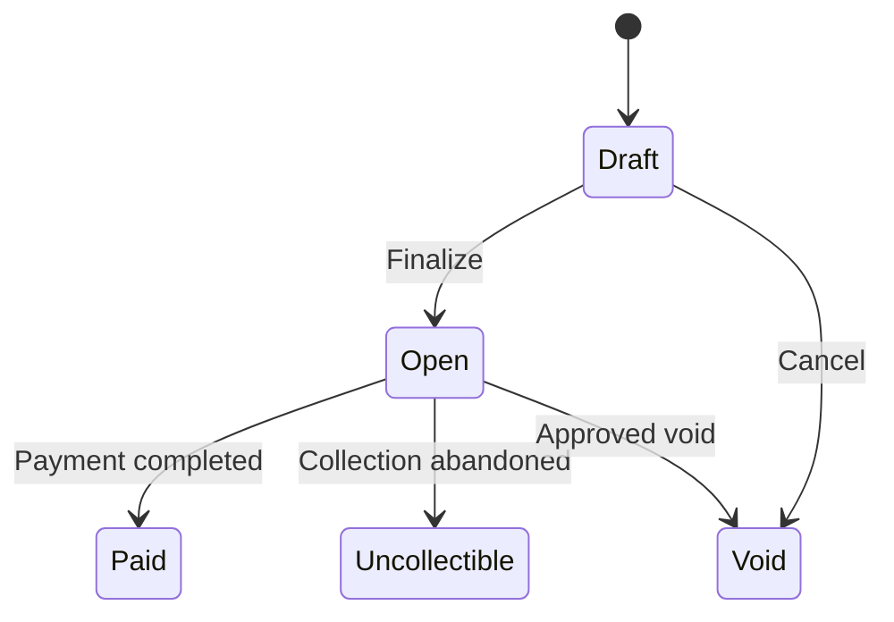
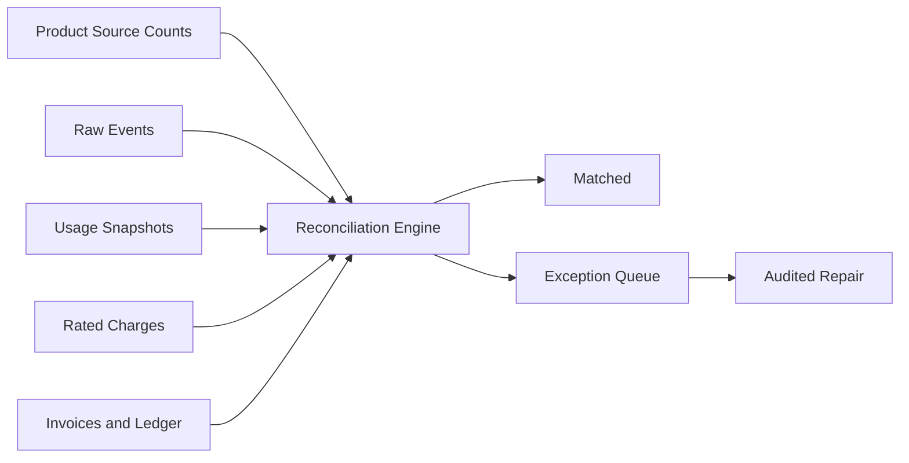

## Problem and requirements

An API metering and billing system measures how customers consume a product and converts that usage into limits, reports, and charges. Examples include API requests, compute seconds, stored gigabytes, tokens processed, active seats, or messages delivered.

The hard part is preserving financial correctness while accepting a massive, imperfect event stream. Events can arrive late, duplicated, out of order, or with corrected attributes. Pricing may include tiers, commitments, credits, and contract-specific rules. Customers expect near-real-time usage dashboards, but invoices must be reproducible and exact.

### Functional requirements

- Define meters and their aggregation behavior
- Accept usage events from trusted product services
- Deduplicate retries and reject malformed events
- Show near-real-time usage and quota state
- Enforce hard and soft limits
- Rate usage using versioned price plans
- Apply tiers, commitments, credits, and discounts
- Generate invoices with traceable line items
- Handle corrections and late-arriving usage
- Reconcile source events, aggregates, and financial totals

### Non-functional requirements

- Sustain five million usage events per second
- Never silently lose accepted billable usage
- Avoid double charging duplicated events
- Keep metering off the critical request path where possible
- Make invoice calculations deterministic and replayable
- Isolate tenant data and pricing contracts
- Support multi-region ingestion and regional data policies
- Preserve immutable audit history

The system does not promise network-level exactly-once delivery. It provides effectively-once billing effects through stable event identities, immutable records, idempotent aggregation, and reconciliation.

## Capacity estimates

Assume one billion active resources, five million peak usage events per second, and one million customers billed monthly.

| Resource | Average | Peak assumption |
| --- | ---: | ---: |
| Usage ingestion | 1M events/second | 5M events/second |
| Raw events | Tens of TB/day | Depends on payload size |
| Real-time aggregate updates | Millions/second | Partitioned by account and meter |
| Invoice generation | 1M/month | 100K/hour near period close |
| Audit retention | Multiple years | Contract and regulation dependent |

Raw events dominate write volume. Aggregates, prices, and invoices are much smaller but require stronger correctness guarantees.

## Meter model

A meter defines what is measured and how events become a quantity.

```json
{
  "key": "llm_output_tokens",
  "unit": "token",
  "aggregation": "sum",
  "valueField": "outputTokens",
  "dimensions": ["model", "region"],
  "allowedLateness": "72h"
}
```

Common aggregation types include:

- **Count:** number of valid events
- **Sum:** total units in a numeric field
- **Maximum:** peak concurrent resources or capacity
- **Latest:** last observed seat or resource count
- **Distinct:** unique active users or devices in a period
- **Time weighted:** capacity multiplied by duration

Meter definitions are versioned. Changing aggregation semantics creates a new version with an activation time; it never rewrites the meaning of already billed usage.

Dimensions enable breakdowns but create cardinality. Only explicitly registered, bounded dimensions participate in billing. Arbitrary event attributes can remain available for debugging without becoming invoice axes.

## Ingestion API

Product services emit events after the measured operation becomes durable.

```http
POST /v1/usage-events:batch
Authorization: Bearer <service-token>
Content-Type: application/json

{
  "events": [
    {
      "id": "evt_01K6H82A",
      "accountId": "acct_482",
      "meter": "llm_output_tokens",
      "timestamp": "2026-10-03T15:21:08Z",
      "value": 1842,
      "dimensions": { "model": "model-a", "region": "us-central" },
      "source": { "requestId": "req_91" }
    }
  ]
}
```

The service authenticates the producer, derives its tenant scope, validates the meter schema, and durably appends accepted events. The response reports individual failures without requiring the entire batch to retry.

Never trust a client-supplied customer or price. Only authorized product services emit billable usage, and the server resolves the applicable account and contract.

## High-level architecture

The system separates durable collection, fast usage views, financial rating, and invoice finalization.



Real-time aggregates optimize freshness and quota decisions. Batch aggregates from immutable events become the authoritative input to financial rating. Comparing the two paths detects drift.

## Event identity and deduplication

Producers assign a stable event ID before the first send and reuse it for every retry. The gateway scopes IDs by producer or account and stores a compact deduplication record.

An event ID collision with identical content returns success. The same ID with different content returns a conflict and triggers an operational signal.

Deduplication occurs at multiple layers:

- Gateway deduplication reduces repeated traffic
- Stream processors use idempotent state updates or processed-ID windows
- Batch aggregation removes duplicates from the immutable dataset
- Billing ledger enforces a unique charge key

Online deduplication windows can expire, but the authoritative batch job deduplicates the complete billing period. Stable source references make corrections and investigations possible.

## Event-time processing

Billing groups usage by when the customer consumed the product, not when the pipeline received the event. Therefore, processing follows event time with watermarks.



The watermark estimates when most events for a window have arrived. Results before the allowed-lateness deadline are provisional. Late events update the current-period dashboard and authoritative aggregate.

Events arriving after invoice finalization become adjustments according to policy: a supplemental charge, a credit, or a line item on the next invoice. They are never silently discarded.

## Stream aggregation

Partition events by account and meter so updates for a billing key are processed in order. Stateful workers maintain counters for the active period and checkpoint them to durable storage.

For additive meters, workers apply event deltas. Maximum and latest meters retain the winning value and timestamp. Distinct meters may use an approximate sketch for dashboards but require an approved exact or contractually defined algorithm for billing.

The real-time usage store holds materialized views by account, meter, period, and dimension. Updates carry a monotonically increasing source offset, making replay idempotent.

Hot accounts can exceed a single partition. Shard additive meters by a secondary event hash and merge partial aggregates. Non-additive meters require specialized mergeable structures or dedicated partitions.

## Authoritative aggregation

Before rating, a batch job reads the immutable event store for the billing period and rebuilds aggregates from source data.



The output is an immutable, versioned usage snapshot with source partitions, input counts, checksums, meter versions, and job version. Rerunning with identical inputs and code produces the same snapshot.

Do not rate directly from mutable dashboard counters. A replay bug or operational correction must not change a finalized invoice without an explicit financial adjustment.

## Pricing catalog

A price plan contains versioned, effective-dated rules. Examples include:

- Flat platform fee
- Per-unit price
- Graduated tiers
- Volume pricing
- Included quantity
- Minimum commitment
- Prepaid credit drawdown
- Per-dimension prices, such as model or region
- Contract discount

```text
First 1M requests       included
Next 9M requests        $0.80 per million
Above 10M requests      $0.55 per million
```

Store money as integer minor units or fixed-precision decimals with an explicit currency and rounding policy. Never use binary floating point.

Plans are immutable after activation. Corrections create a new version or a documented adjustment. The exact price-plan version is attached to every rated line item.

## Rating engine

Rating converts a usage snapshot into monetary charges.



For graduated pricing, split quantity across tier boundaries. For volume pricing, apply the selected tier price to the entire quantity. These similar-looking models produce different bills and must be named clearly.

The rating engine is a deterministic function of usage snapshot, account contract, price catalog version, tax context, and engine version. Store all inputs and output explanations.

Use a unique key such as account, period, usage-snapshot version, and charge definition to make rating idempotent. Reruns return the existing charge set unless an operator explicitly creates a superseding version.

## Quota enforcement

Quotas protect the service and help customers control cost. A quota can be a requests-per-second limit, a monthly included amount, a prepaid balance, or a hard spending cap.

Synchronous per-request calls to a central metering service are too slow and fragile. Use hierarchical leases for hard high-throughput limits:

1. The global quota authority owns the remaining allowance
2. It leases bounded tokens to regional allocators
3. Regions lease smaller blocks to service instances
4. Instances consume locally and report usage asynchronously



Outstanding leases bound possible overuse. Shrink leases as the limit approaches. Soft limits use cached usage and notifications rather than rejecting requests.

Quota counters are operational controls, not billing truth. The authoritative event and rating paths determine charges.

## Credits and balances

Credits can represent prepaid funds, promotional value, or service compensation. Model them in an append-only balance ledger rather than a mutable `creditsRemaining` field.

Each grant has an amount, currency or unit, effective time, expiration, priority, and permitted products. Consumption creates ledger entries linked to rated charges. Reversals create compensating entries.

Concurrency matters when several rating jobs consume the same credit pool. Use serializable transactions or partition ownership to prevent the balance from going negative unless the contract explicitly permits it.

Money credits and usage-unit grants are different instruments and should not be mixed implicitly.

## Invoice generation

At period close, the invoice service gathers finalized rated charges, fixed fees, credits, taxes, prior adjustments, and payments.

An invoice state machine includes draft, open, paid, void, and uncollectible. Finalizing a draft assigns its legal number, freezes line items, and posts balanced entries to the financial ledger.



Invoice line items include meter, period, quantity, dimensions, tier calculation, unit price, discounts, tax, and references to the usage and pricing versions.

A finalized invoice is immutable. Corrections produce a credit note, debit note, or next-period adjustment rather than editing history.

## Customer usage and cost reporting

Customers need a current view before the invoice arrives. The dashboard reads streaming aggregates and estimates cost with the active pricing plan.

Label recent values as provisional. They can change because of late events, corrections, fraud review, or contract resolution. Finalized invoice amounts come from the authoritative rating path.

Expose both quantity and cost explanations. A customer should be able to answer:

- Which meter produced the charge?
- What time range and dimensions were included?
- Which tiers and discounts applied?
- How much usage was included or credited?
- Which values are estimated versus finalized?

Paginate high-cardinality breakdowns and enforce the same authorization rules as the underlying account.

## Corrections and reversals

Never mutate a previously accepted usage event. A correction event references the original event and supplies a reversal or replacement.

Before invoice close, aggregation folds the correction into a new usage snapshot. After close, rating calculates the monetary difference and produces an adjustment.

Administrative correction tools require a reason, source evidence, scoped authorization, and approval above risk thresholds. Every action appears in the audit log.

Bulk repairs run through the normal event and rating pipelines. Direct database patches destroy reproducibility and should be prohibited.

## Reconciliation

Reconciliation compares the system at each boundary:

- Producer operation counts versus accepted usage events
- Event-bus offsets versus immutable event-store partitions
- Raw events versus streaming and batch aggregates
- Usage snapshots versus rated charges
- Rated charges versus invoice lines and ledger entries



Use counts, sums, partition checksums, and sampled event traces. Classify exceptions by missing data, duplication, wrong account, aggregation difference, pricing mismatch, or timing gap.

Automated repair is safe only when deterministic. Ambiguous financial differences go to an operations queue with all supporting evidence.

## Multi-region design

Ingest events in the nearest permitted region. Assign every account a billing home region that owns authoritative aggregation, rating, and invoice state.

Regional ingestion writes immutable partitions and replicates metadata or data to the billing home according to residency policy. Events carry globally unique IDs, so retries through another region remain deduplicable.

Avoid active-active invoice writers. One logical owner per account and billing period makes finalization, credit consumption, and corrections easier to serialize.

If the home region is unavailable, ingestion continues and financial processing pauses. Billing freshness is less important than conflicting financial writes.

## Security and privacy

Usage events may contain customer identifiers and commercially sensitive activity. Collect only fields necessary for metering, debugging, or approved breakdowns.

Controls include:

- Service-to-service authentication for producers
- Tenant scope derived from trusted credentials
- Encryption in transit and at rest
- Field allowlists and payload-size limits
- Separate roles for pricing, credits, and invoice operations
- Approval workflows for contract and financial changes
- Tamper-evident audit records
- Regional retention and deletion policies

Never accept raw secrets, request bodies, or unrelated personal data in metering dimensions. Hashing an identifier does not automatically make it non-sensitive.

Financial records may require longer retention than raw event attributes. Separate datasets so privacy deletion can remove unnecessary details while preserving legally required accounting evidence.

## Failure handling

### Metering endpoint unavailable

Product services buffer bounded batches locally or write through a regional durable side channel. They use stable event IDs when retrying. Whether product requests fail depends on the commercial contract and risk of unmetered usage.

### Event pipeline backlog

Continue durable collection, scale consumers, and show dashboard freshness. Quota systems use conservative estimates or leases rather than assuming delayed usage is zero.

### Duplicate producer events

Deduplicate by stable event ID. Conflicting payloads for one ID are quarantined and alerted.

### Bad pricing release

Canary the new version against shadow accounts and compare expected charges. Roll back before finalization. If already finalized, issue explicit adjustments.

### Aggregation code defect

Preserve immutable events and versioned jobs. Deploy the corrected code, produce a superseding snapshot, calculate the delta, and audit the change.

### Invoice worker crash

Resume from durable state. Unique charge and invoice keys make each phase idempotent, preventing duplicate lines or invoice numbers.

## Observability

Track:

- Accepted, rejected, duplicated, and late events
- Ingestion and aggregation lag by region and meter
- Streaming versus batch aggregate differences
- Hot accounts and partition skew
- Quota lease utilization and bounded overage
- Rating duration, failures, and reruns
- Unpriced usage and missing contracts
- Invoice finalization backlog
- Reconciliation exception count and financial value
- Credit balance and ledger invariant violations

Synthetic customers emit known quantities through every region. The system verifies expected aggregates, rated charges, and invoice drafts end to end.

Operational dashboards distinguish data freshness from financial correctness. A green API latency chart does not mean billing is healthy if reconciliation is behind.

## Key tradeoffs

### Real-time estimates vs finalized truth

Streaming counters give useful feedback quickly but can drift during retries and late arrivals. Immutable-event recomputation gives slower, authoritative financial results. The system deliberately supports both.

### Synchronous metering vs product availability

Synchronous checks give immediate quota precision but couple product requests to billing infrastructure. Asynchronous usage plus bounded quota leases keeps the product available while limiting exposure.

### Flexible dimensions vs cardinality

Arbitrary dimensions make analysis powerful but create uncontrolled state and pricing ambiguity. Registered, typed dimensions keep meters predictable and auditable.

### Mutable corrections vs append-only adjustments

Editing history makes the current total look simple but destroys traceability. Corrections and superseding versions preserve an explanation of every financial change.

### Global writers vs account ownership

Active-active processing improves local write availability but complicates credit balances and finalization. Regional ingestion with one authoritative billing owner per account provides a safer boundary.

The central principle is to capture usage durably and cheaply, calculate provisional views quickly, and reserve financial authority for deterministic, replayable, reconciled workflows.
