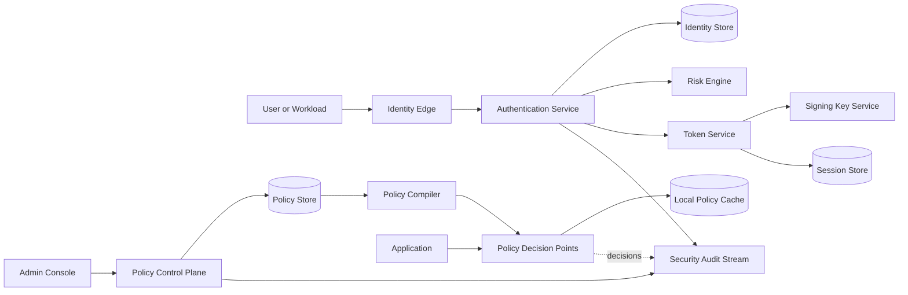
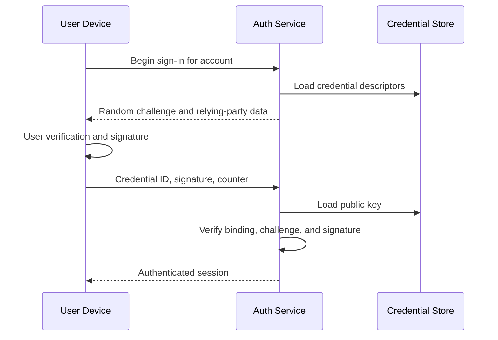
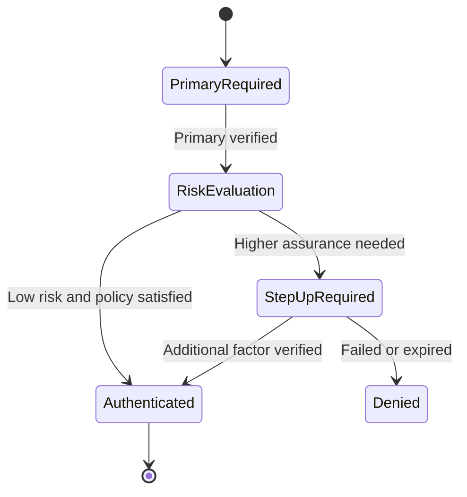
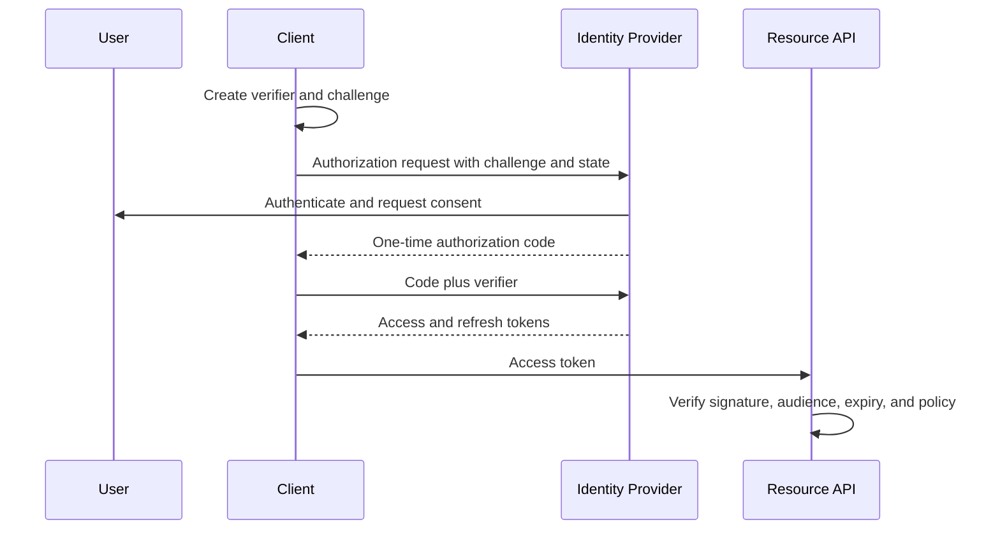
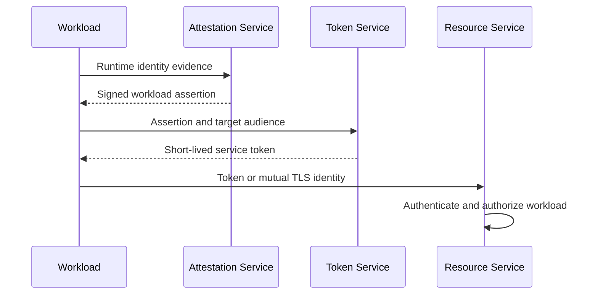
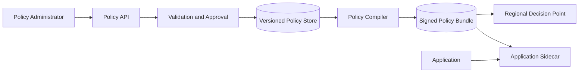
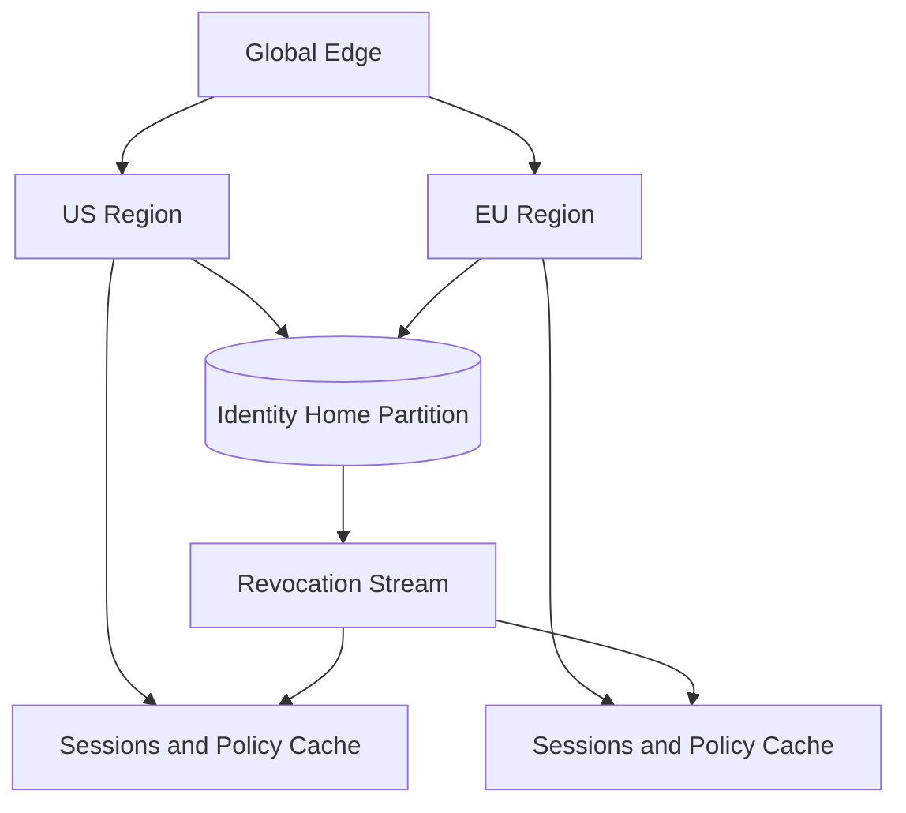

## Problem and requirements

An identity and access management system answers two questions: **who is making this request**, and **what are they allowed to do**? It manages identities, credentials, sessions, service accounts, roles, policies, and security events for many applications.

The system sits on a critical path. An outage can lock every user out, while an incorrect allow decision can expose sensitive data. The design therefore separates high-assurance identity workflows from a highly available authorization path with bounded, carefully invalidated caches.

### Functional requirements

- Register and recover user accounts
- Authenticate with passwords, passkeys, enterprise federation, and MFA
- Issue, refresh, revoke, and inspect sessions
- Support standards-based authorization flows for applications
- Authenticate workloads and service accounts
- Manage organizations, groups, roles, and policies
- Evaluate resource-level authorization decisions
- Record security-sensitive actions and decisions
- Detect risky sign-ins and require stronger verification
- Support tenant-specific identity providers and policies

### Non-functional requirements

- Support 500 million identities and two million authorization checks per second
- Keep local authorization checks below five milliseconds at the 99th percentile
- Remain available across regional failures
- Revoke high-risk access within seconds
- Prevent credentials and signing keys from appearing in logs
- Isolate tenant data and policy
- Provide tamper-evident audit history
- Resist replay, credential stuffing, enumeration, and token theft

The system provides identity and policy primitives. Product services still own business invariants—for example, whether an order can be refunded after fulfillment.

## Capacity estimates

Assume 500 million identities, 100 million daily active users, and 20 protected service requests per active user per day.

| Resource | Average | Peak assumption |
| --- | ---: | ---: |
| Interactive sign-ins | 1,200/second | 100,000/second |
| Token refreshes | 50,000/second | 300,000/second |
| Authorization checks | 23,000/second | 2M/second |
| Active sessions | Hundreds of millions | Multiple devices per user |
| Audit events | Billions/day | Long retention |

Authorization volume is far higher than login volume. Password hashing is intentionally expensive, while token verification and cached policy evaluation must be cheap.

## Identity model

Keep core concepts distinct:

- **Identity:** a person, workload, device, or external subject
- **Credential:** a password verifier, passkey public key, certificate, or secret
- **Authenticator:** a registered factor used to prove identity
- **Principal:** the identity acting in a request
- **Organization:** a tenant or administrative boundary
- **Membership:** a principal's relationship to an organization
- **Group and role:** reusable collections of permissions
- **Policy:** rules deciding actions on resources
- **Session:** a bounded authenticated login state
- **Client:** an application allowed to request tokens

One person may link several login methods without creating duplicate product identities. Linking requires fresh proof of control over both sides; matching an email address alone is unsafe.

Public identifiers are random and non-sequential. Usernames and email addresses are mutable attributes, not database keys.

## High-level architecture

Separate identity administration, authentication, token issuance, and authorization evaluation.



The identity edge handles protocol validation, abuse controls, and regional routing. Credential verification runs in isolated services. Signing keys are available only to the token service, preferably through managed cryptographic hardware.

## Registration and account recovery

Registration validates identifiers, applies abuse controls, and creates an unverified identity before sending a short-lived verification challenge. Responses should not reveal whether an email or phone number already exists.

Recovery is often the weakest authentication path. It should:

- Use single-use, short-lived challenges
- Rate-limit by account, device, network, and destination
- Require stronger proof for privileged accounts
- Revoke existing sessions after a credential reset when policy requires it
- Notify the account through an independent channel
- Add a delay or human review for high-risk changes

Support recovery codes and multiple authenticators so loss of one device does not force a weaker fallback.

Administrative recovery requires scoped privileges, explicit reason, step-up authentication, and complete audit evidence. Support staff should never see or set a user's password.

## Password and passkey authentication

Passwords are processed over TLS and converted into slow, salted password verifiers using a memory-hard algorithm. Store algorithm and cost parameters with each verifier so they can be upgraded after a successful login.

Never log passwords, one-time codes, recovery tokens, or raw authorization headers. Screen passwords against known-compromised values and rate-limit failed attempts without creating a trivial account-lockout attack.

Passkeys use asymmetric credentials. The server stores a public key and challenge state; the authenticator signs a challenge bound to the relying party. This resists credential phishing and eliminates reusable shared secrets at the server.



Challenges are single use, expire quickly, and are bound to the intended flow and browser transaction.

## Multi-factor and step-up authentication

MFA combines independent factor types. Prefer phishing-resistant passkeys or hardware security keys for privileged users. Authenticator apps are a useful fallback; SMS is weaker and should not be the strongest option for sensitive access.

An authentication result records an assurance level, methods used, and authentication time. Applications can require a fresh stronger result for high-risk actions such as changing payout details or exporting secrets.



MFA enrollment and factor removal require recent authentication. Removing the last strong factor may trigger a cooling-off period and out-of-band notification.

## Risk-based authentication

The risk engine evaluates sign-in context such as device continuity, impossible travel, network reputation, credential failures, user history, and requested privilege.

It returns allow, deny, or step-up—not a final product authorization decision. Models and rules are versioned, and their inputs are minimized to what security policy permits.

Run fast rules synchronously and deeper anomaly analysis asynchronously. A risk service outage follows an explicit policy: privileged access may fail closed, while low-risk consumer access may require MFA or use a conservative fallback.

Attackers adapt to visible thresholds. Combine per-account, per-network, per-device, and global velocity controls rather than relying on a single counter.

## Sessions

After authentication, the system creates a server-side session with:

- Random session ID
- Identity and tenant context
- Authentication methods and assurance
- Creation, last-use, idle-expiry, and absolute-expiry times
- Device and risk metadata
- Revocation state and security version

The browser receives only an opaque, high-entropy cookie with secure, HTTP-only, and appropriate same-site attributes. Regenerate the session identifier after authentication or privilege changes to prevent fixation.

Sensitive actions defend against cross-site request forgery with same-site cookies plus an explicit anti-forgery mechanism where needed.

Session state enables immediate revocation but adds a datastore read. Cache short-lived session status at regional edges while pushing revocation events with high priority.

## Tokens and authorization flows

Applications use short-lived access tokens with audience, issuer, subject, expiration, scope, tenant, and a unique token ID. Refresh tokens are longer-lived, opaque credentials stored only in protected clients.

For browser and mobile clients, use an authorization-code flow with proof that the client redeeming the code initiated the request.



State and nonce values bind responses to the initiating browser transaction. Redirect destinations must be pre-registered and matched exactly.

Access tokens are brief so leaked tokens expire quickly. Refresh tokens rotate on every use; reuse of an older token signals theft and revokes the token family.

## Token format tradeoff

Self-contained signed tokens can be verified locally without calling the identity system. They scale well but cannot be instantly changed after issuance.

Opaque tokens require introspection or a shared session cache. They support central revocation and minimal disclosure but add a network dependency.

A common hybrid uses short-lived signed access tokens plus stateful, rotating refresh tokens. High-risk APIs can additionally check a revocation or security-version cache.

Tokens contain only stable claims needed by the target API. Do not place broad user profiles or sensitive attributes in bearer tokens; every recipient and log interceptor could see them.

## Signing keys and rotation

Private signing keys remain in a dedicated key service or hardware-backed module. Application services receive only public verification keys through a signed, cacheable key set.


Every token contains a key identifier. Publish a new public key before using its private counterpart, overlap verification through the maximum token lifetime, and remove it only after all legitimate tokens expire.

Emergency rotation may revoke a compromised key immediately and force reauthentication. This availability cost is appropriate when authenticity can no longer be trusted.

## Workload identity

Services should not share static API keys. A workload identity is issued from trusted runtime evidence such as an orchestrator identity, cloud instance attestation, or mutually authenticated certificate.

The workload exchanges that evidence for a short-lived, audience-bound credential. Rotation is automatic and frequent. Policy refers to stable service identities rather than IP addresses.



Bind credentials to the intended audience and, where supported, to a client key so theft alone is insufficient for reuse.

## Authorization model

Authentication claims identity; authorization evaluates a request tuple:

```text
principal + action + resource + context → allow or deny
```

Use several policy styles where appropriate:

- **Role-based access control:** permissions grouped into roles
- **Attribute-based access control:** conditions on principal, resource, and request
- **Relationship-based access control:** graph relations such as owner, editor, or member
- **Explicit constraints:** tenant boundary, data region, time, network, or assurance level

Default deny. An allow decision must come from an applicable policy, and explicit safety constraints can override broad roles.

Product services send stable resource attributes or references. They must not let a caller assert trusted facts such as resource owner or tenant.

## Policy control and evaluation planes

Administrators edit human-readable policy in a strongly controlled control plane. A compiler validates types, references, cycles, complexity, and unsafe grants, then produces immutable decision bundles.



Decision points atomically load complete bundles and continue using the last valid version during a control-plane outage. Security-critical revocations travel through a small prioritized deny overlay while a full bundle is rebuilt.

Policy changes include owner, reason, ticket, approvers, effective time, and previous version. Reverting creates a new version rather than deleting history.

## Resource relationships

Relationship-based checks answer questions such as whether a user can edit a document through team membership.

Represent relationships as tuples:

```text
document:42#editor@group:engineering
group:engineering#member@user:17
```

The authorization service traverses a bounded graph using indexed tuples. Cache subproblems and precompute common closures, but cap depth and breadth to prevent pathological policies.

Writes receive a consistency token. A caller that just granted access can include that token to ensure the following check observes at least that version, providing read-your-writes without forcing every global check to use the latest replica.

## Authorization caching and revocation

Caching reduces latency but risks serving stale allows. Cache keys include principal, action, resource, relevant context hash, policy version, and identity security version.

Use short expirations for allow decisions and potentially longer ones for denies, depending on product expectations. Push invalidations for membership removal, account disablement, credential compromise, and emergency policy changes.

Do not cache when policy depends on rapidly changing resource state unless that state version is part of the key.

For extremely sensitive actions, query a strongly consistent decision point or require a fresh security version. Ordinary reads can accept bounded staleness to remain available.

## Multi-tenancy and delegated administration

Every identity, group, role, policy, client, and audit event belongs to an explicit tenant boundary. Tenant scope comes from the authenticated session and routing context, not a freely supplied request field.

Enterprise tenants may configure their own identity provider, domain rules, session duration, MFA policy, and delegated administrators.

Delegation follows least privilege. A group administrator can manage membership for assigned groups without changing authentication policy. A billing administrator need not access audit exports or application data.

Prevent a tenant administrator from granting permissions they do not possess. Role assignment checks both the requested role and the administrator's grant authority.

## Enterprise federation

Enterprise federation accepts signed assertions from a configured external identity provider. Configuration pins expected issuer, audience, endpoints, algorithms, and trusted keys.

Validate signatures, timestamps, audience, nonce, and response binding. Do not select a tenant solely from an unverified email-domain claim.

Just-in-time provisioning can create membership after a valid assertion. Larger customers may synchronize users and groups through a separate provisioning API. Deprovisioning events receive priority because they remove access.

External group names are mapped through tenant configuration rather than becoming unrestricted internal roles.

## Audit system

Security audit events include:

- Authentication attempts and factor changes
- Session creation, refresh, and revocation
- Account recovery and identifier changes
- Role, group, policy, and client modifications
- Privileged authorization decisions
- Key lifecycle operations
- Administrative data access and exports

Events contain actor, target, tenant, action, result, reason, request ID, source, and configuration version. Sensitive credentials and full tokens are excluded.

Write events to an append-only stream and immutable retention store. Hash chaining or signed checkpoints makes undetected modification harder. Access to audit data is itself audited.

## Data consistency and regional design

Partition identity data by a stable identity or tenant home. Credential and policy writes use strongly consistent storage in the owning partition.

Replicate read models, public keys, session status, and policy bundles to regional edges. Authentication can route writes to the home region, while token verification and most authorization checks remain local.



During a home-region failure, existing short-lived sessions and cached policy can continue according to risk policy. New registration, recovery, factor changes, and privileged grants may pause rather than accept conflicting writes.

## Threat controls

### Credential stuffing

Use breached-password screening, multi-dimensional rate limits, device and network signals, and MFA. Avoid permanent account lockouts that attackers can weaponize.

### Account enumeration

Return similar public responses and timing for existing and nonexistent accounts. Send recovery messages only through private channels.

### Session theft

Use secure cookies, short idle limits, token rotation, device-aware risk checks, and rapid session revocation. Reauthentication protects sensitive changes.

### Token replay

Use short expirations, audience restriction, unique IDs, and proof-of-possession mechanisms where risk justifies them. Refresh-token reuse revokes the family.

### Privilege escalation

Validate tenant boundaries independently, default deny, require approval for powerful roles, and regularly review effective access.

### Key compromise

Keep private keys isolated, rotate regularly, monitor signing operations, and maintain an emergency revoke-and-reauthenticate procedure.

## Failure handling

### Credential store unavailable

Do not bypass authentication. Existing valid sessions may continue, but new sign-ins and recovery pause or fail over to a consistent replica.

### Token service unavailable

Resource services continue verifying unexpired signed tokens. Clients retry refresh with bounded backoff; never extend expiration locally.

### Policy control plane unavailable

Decision points use the last known good signed bundle. Policy editing pauses while evaluation remains available.

### Authorization decision point unavailable

Applications with local policy bundles continue evaluating. Sensitive operations without a safe local decision fail closed; public or explicitly non-sensitive paths may use a documented fallback.

### Revocation stream delayed

Alert on propagation age, shorten cache lifetimes, and require online checks for high-risk operations until the stream recovers.

### Bad policy release

Compiler validation, simulation, canaries, blast-radius analysis, and atomic rollback reduce impact. Emergency deny rules take priority over normal allows.

## Observability

Track platform and security signals separately:

- Sign-in success, failure, and challenge rates
- Password-hash latency and saturation
- MFA enrollment, recovery, and downgrade events
- Token issuance, refresh reuse, and verification failures
- Session count, age, and revocation propagation
- Authorization latency, cache hit rate, and deny reasons
- Policy compilation and rollout version by region
- Federation failures by tenant and provider
- Risk decisions and detected attack velocity
- Audit-stream lag and integrity verification

Metrics must avoid high-cardinality user identifiers. Security investigations use access-controlled audit events rather than labels in shared monitoring systems.

Synthetic identities continuously test registration, sign-in, MFA, refresh rotation, revocation, federation, and authorization from every region.

## Key tradeoffs

### Self-contained vs opaque tokens

Signed tokens scale and survive identity-service outages but remain valid until expiry. Opaque tokens centralize control but add latency and availability coupling. Short-lived signed access tokens with stateful refresh tokens balance both.

### Central vs local authorization

Central decisions use the freshest relationships and simplify governance. Local compiled policies provide much lower latency and better resilience. Versioned bundles plus targeted revocation handle most workloads.

### Availability vs immediate revocation

Cached access remains available during partitions but may briefly preserve a removed permission. Short lifetimes, security versions, push invalidation, and stricter paths for high-risk operations bound the exposure.

### Rich policy vs explainability

Arbitrary policy code is expressive but difficult to analyze and secure. A typed, bounded language supports validation, caching, simulation, and clear decision explanations.

### User convenience vs assurance

Long sessions and weak recovery reduce friction but expand attack windows. Risk-based step-up applies stronger proof when the requested action warrants it.

The central principle is to make identity changes strongly controlled, authentication resistant to replay and recovery abuse, and authorization fast enough to enforce on every request without losing revocation visibility.
