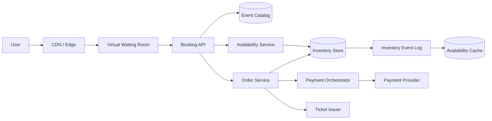
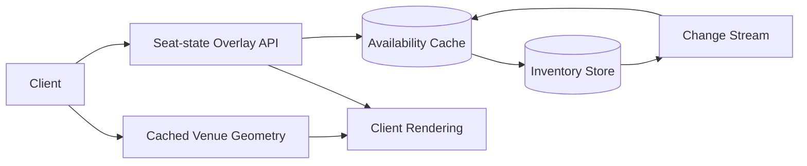
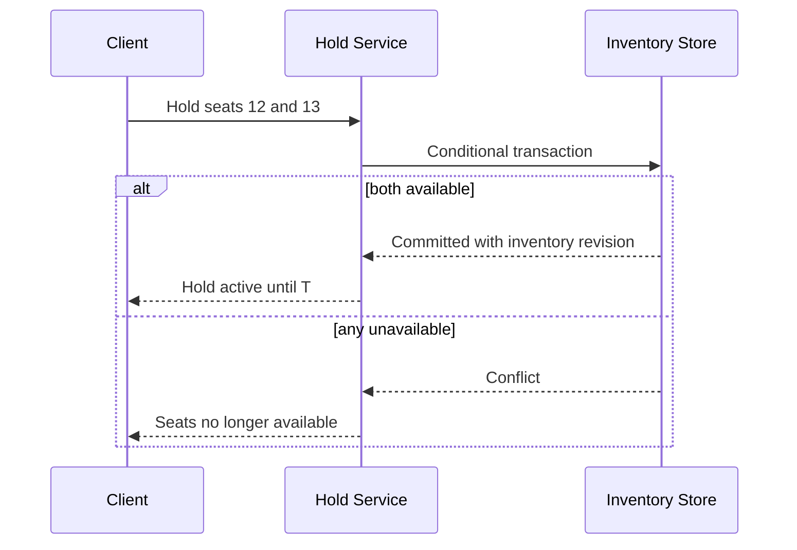
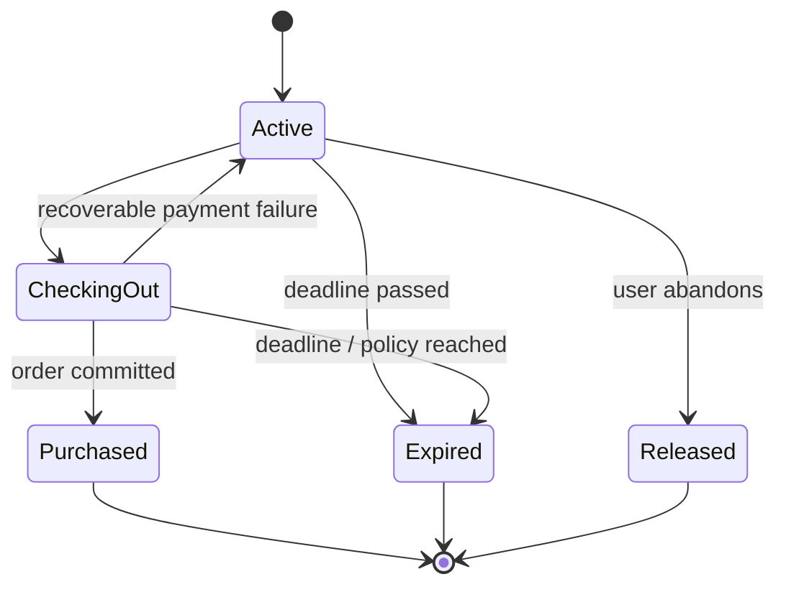
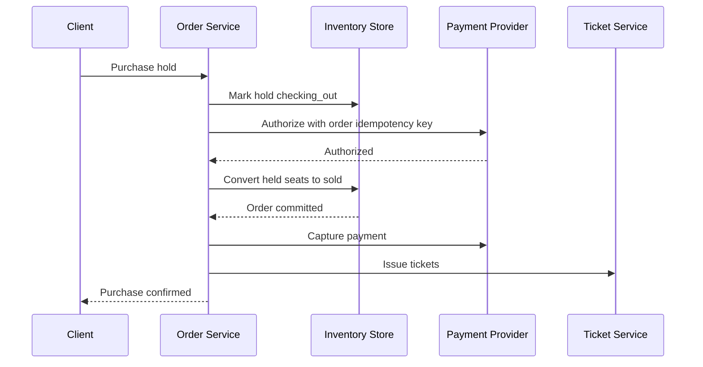
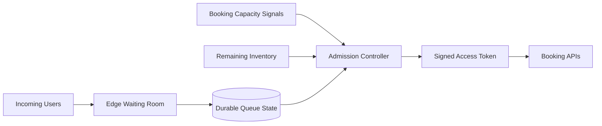

## Problem and requirements

An online ticketing system publishes events, displays seat availability, temporarily holds inventory during checkout, accepts payment, and issues tickets. Demand is unusually bursty: millions of users may arrive at the same instant for a small fixed inventory.

The core invariant is strict: one seat can belong to at most one completed order. Availability displays may be slightly stale, but reservation and purchase state cannot oversell.

### Functional requirements

- Browse events, dates, venues, prices, and seat maps
- Search for available seats or request best available
- Hold selected seats for a short checkout window
- Purchase held seats
- Release expired or abandoned holds
- Issue verifiable digital tickets
- Support cancellation, refund, and ticket transfer policies
- Handle general-admission inventory as well as assigned seats

### Non-functional requirements

- Prevent overselling under concurrent requests
- Survive traffic spikes several orders of magnitude above normal
- Preserve accepted orders through failures
- Keep ordinary availability reads fast
- Make hold expiration predictable and recoverable
- Isolate one popular event from the rest of the platform
- Maintain a complete audit trail for inventory and payment decisions

Event discovery recommendations, resale marketplaces, venue access hardware, and dynamic pricing models are adjacent systems.

## Capacity estimates

Assume a major on-sale attracts 10 million waiting users, 500,000 concurrent active buyers, and 100,000 successful purchases per minute across the platform.

| Resource | Normal | Major on-sale |
| --- | ---: | ---: |
| Browse traffic | 50K requests/second | 1M requests/second |
| Seat-map reads | 10K/second | 500K/second |
| Hold attempts | 1K/second | 100K/second |
| Successful purchases | 500/minute | 100K/minute |

Most on-sale traffic cannot result in a purchase because inventory is limited. Admission control must reject or queue excess demand before it reaches the inventory database.

Seat-map responses can be large, but event metadata and static venue geometry cache well. Only the changing seat-state overlay needs frequent refresh.

## APIs and idempotency

The client requests a hold after selecting seats.

```http
POST /v1/events/event_42/holds
Idempotency-Key: session81-hold-4
Content-Type: application/json

{
  "seatIds": ["section-A-row-4-seat-12", "section-A-row-4-seat-13"]
}
```

```json
{
  "holdId": "hold_01K5R2M9",
  "status": "active",
  "expiresAt": "2026-09-25T18:12:00Z",
  "price": { "amount": 24800, "currency": "USD" }
}
```

Checkout references the hold and uses a separate idempotency key:

```http
POST /v1/orders
Idempotency-Key: session81-order-1

{
  "holdId": "hold_01K5R2M9",
  "paymentMethodId": "pm_82"
}
```

Retries return the original result. The server, not the browser clock, determines whether a hold is still valid.

## High-level architecture

The read path serves catalogs and seat views through caches. The transactional path owns inventory, holds, orders, and payment orchestration.



Inventory is partitioned by event or performance. One event’s seats and holds live in one ownership domain so atomic reservation does not span unrelated shards.

Static venue layouts, images, terms, and event details remain outside the transactional database and can be cached globally.

## Event and inventory model

Separate the reusable venue map from event-specific inventory.

| Entity | Important fields |
| --- | --- |
| Venue | sections, rows, seat geometry, accessibility metadata |
| Event | venue, start time, sale windows, status |
| Inventory item | event, seat or pool, state, price tier, version |
| Hold | owner session, items, expiry, price snapshot, state |
| Order | customer, hold, totals, payment state, status |
| Ticket | order, inventory item, credential version, transfer state |

Assigned seating has one inventory item per seat. General admission uses quantity pools with an available count and reservation ledger.

Price is snapshotted on the hold. Later pricing updates do not silently change an active checkout, though taxes or fees may have an explicitly disclosed recalculation policy.

## Seat-map reads

A seat map combines immutable geometry with a changing availability overlay.



The overlay can be eventually consistent. A green seat is an invitation to attempt a hold, not a guarantee. The hold transaction is the authority.

Represent seat state compactly using bitmaps or arrays keyed by stable seat index. Incremental change streams update clients viewing the event, but full polling remains a recovery path.

Never cache user-specific hold ownership in a shared response. The client merges its private active holds over the public availability layer.

## Atomic seat holds

Creating a hold must atomically transition every requested seat from `available` to `held` and create the hold record. If any seat is unavailable, either reject the complete selection or return an explicit partial-offer flow.

For a small set of seats in one event partition, use one serializable transaction or conditional batch write:

```text
FOR each requested seat:
  REQUIRE state == available
  SET state = held,
      hold_id = H,
      hold_until = T
CREATE hold H with state = active
COMMIT
```



Optimistic concurrency works well when contention is moderate. For extreme contention on one section, route hold commands through a single partition leader that serializes decisions and batches storage writes.

Distributed locks are unnecessary when the inventory store already supports conditional transactions. A lock plus an unguarded database update adds failure modes without improving the invariant.

## General-admission inventory

For a pool of interchangeable tickets, atomically decrement available quantity only when enough units remain.

```text
UPDATE inventory_pool
SET held = held + requested,
    version = version + 1
WHERE available - held - sold >= requested
```

One extremely popular pool becomes a hot row. Shard capacity into escrow buckets assigned to booking workers. Each worker sells only from its local allocation and requests more units from a coordinator when low.

Escrow preserves the global limit because the sum of worker allocations never exceeds inventory. Reclaim abandoned allocations when worker leases expire, using fencing epochs to reject stale workers.

Keep a small reserve unallocated for accessibility, support, or failure recovery according to business policy.

## Hold expiration

Holds have a server-assigned deadline. The system must release them even if the browser closes or a worker crashes.

Store expiry in both the hold record and seat rows. A timer service schedules cleanup, but correctness does not depend on the timer firing exactly on time.

Any new hold transaction may treat `held` inventory with `hold_until < authoritative_now` as reclaimable, provided it atomically verifies and replaces the old hold ID. A background sweeper later marks the hold expired and repairs caches.



Extending a hold is a policy decision and must be bounded. Unlimited refresh allows bots to monopolize inventory without purchasing.

## Checkout saga

Inventory and external payment cannot share one database transaction. Checkout uses a saga with durable states and idempotent steps.

One possible order is:

1. Verify hold ownership and remaining time
2. Transition hold to `checking_out`
3. Authorize payment using the order ID as idempotency key
4. Atomically convert held inventory to sold and create the order
5. Capture payment if authorization and capture are separate
6. Issue tickets and receipt



If authorization succeeds but the inventory commit fails, void the authorization. If the commit succeeds but capture times out, the order remains in a payment-pending state and reconciliation determines the outcome.

Never release sold inventory solely because a payment response was lost. Durable order state and provider idempotency decide recovery.

## Payment reconciliation

Payment-provider timeouts are ambiguous. The provider may have processed the request even when the platform received no response.

Use stable order IDs as provider idempotency keys. Consume signed provider webhooks, poll uncertain transactions, and reconcile settlement reports against the internal order ledger.

The internal ledger records authorization, capture, refund, fees, and adjustments as immutable entries. The order view derives its payment state from those entries.

A customer-visible confirmation is issued only after the inventory order is committed. Payment and ticket delivery may continue asynchronously if the checkout response is interrupted.

## Ticket issuance

A ticket credential references the ticket, event, seat, owner, and credential version. It should be unguessable and cryptographically verifiable by venue scanners.

Static barcodes are easy to screenshot and duplicate. Rotating visual codes or signed short-lived tokens reduce casual copying while scanners retain an offline validation path for connectivity failures.

At venue entry, only one scan may redeem a ticket. Online scanners perform an atomic `unused → redeemed` transition. Offline scanners use signed validity plus locally synchronized revocation and redemption sets, accepting a documented duplicate-entry risk during partition.

Transfers revoke the prior credential version and issue a new one. The seat remains sold; only its admission credential and owner change.

## Virtual waiting room

During popular on-sales, demand greatly exceeds useful booking capacity. A virtual waiting room protects inventory, identity, and payment systems.

Before the sale, clients receive randomized queue positions rather than rewarding refresh timing. After admission begins, the waiting-room service releases signed, short-lived access tokens at a rate matched to downstream capacity and remaining inventory.



Tokens bind to an account or device where appropriate, carry event scope and expiry, and cannot be reused indefinitely. Booking APIs verify them locally.

Queue estimates are approximate. Communicate ranges rather than false precision. Preserve position through brief reconnects using a durable queue ID.

## Bot and abuse controls

Attackers create many accounts, automate seat selection, hoard holds, and resell tickets. Layer controls rather than trusting one challenge:

- Account and payment-instrument reputation
- Per-account, device, network, and event limits
- Behavioral automation signals
- Waiting-room admission tokens
- Hold and purchase quantity limits
- Selective human verification
- Transfer and resale policy enforcement

Do not let bot checks hold inventory while they run for a long time. Perform most risk assessment before hold acquisition or within a strict checkout budget.

Security decisions require appeal and accessibility paths. Aggressive automation detection can block legitimate users on shared networks or assistive technology.

## Partitioning and event isolation

Partition inventory by event performance because transactions normally touch seats in one performance. Large events may split by section, but cross-section seat selections then require a higher-level transaction or all-or-nothing reservation coordinator.

Place high-demand events in dedicated cells with independent inventory databases, queues, caches, and worker pools. One stadium on-sale should not delay a small theater event.

Catalog and account services can remain shared. Event cells publish normalized order and inventory events to global analytics and support systems.

Moving an active event between cells is risky. Assign the cell before sale and keep ownership stable through the high-demand window.

## Availability updates and caches

Inventory transactions publish events through an outbox. Consumers update seat-map caches, counters, search availability, and client streams.

Cache lag may show a sold seat as available. This produces a failed hold attempt but not an oversell. Showing an available seat as unavailable temporarily reduces sales but remains safe.

Include an inventory revision in overlay responses. Clients can apply incremental changes only when revisions are contiguous; otherwise they reload the full overlay.

Summary counters such as “12 seats left” are advisory. The hold transaction remains authoritative.

## Cancellations, refunds, and returns

Cancellation policy determines whether sold inventory returns to sale. A refund workflow does not automatically release the seat until policy and payment state allow it.

Use a state machine such as:

```text
sold → cancellation_pending → cancelled → available
                           ↘ refund_failed
```

Reissuing inventory uses a new inventory revision and ticket credential version. Old tickets remain revoked even if the same seat is sold again.

Refunds use idempotent provider operations and reconciliation. Partial refunds, fees, and taxes are immutable ledger adjustments, not overwrites of the original charge.

## Failure handling

**Seat-map cache failure:** read from another cache replica or the inventory store with strict limits. Holds remain correct.

**Hold-service failure:** clients retry with the same idempotency key. Conditional inventory transactions return the original hold or a conflict.

**Expiry-worker failure:** transactions reclaim expired seats lazily; sweepers catch up later.

**Payment-provider failure:** preserve hold or order state according to a bounded checkout policy and reconcile ambiguous operations asynchronously.

**Ticket-service failure:** the sold order remains durable. Ticket issuance retries from the order event log.

**Event-cell overload:** waiting-room admission slows before transactional latency collapses.

**Availability-zone failure:** synchronous replicas in another zone continue serving one event’s inventory.

**Regional failure:** failover only to a replica with the latest committed inventory epoch. Two writable regions must never sell the same seats independently.

## Observability and operations

Monitor the buyer funnel and inventory invariant:

- Waiting-room arrivals, admits, wait time, and token failures
- Seat-map latency and cache revision lag
- Hold attempts, conflicts, expirations, and checkout conversion
- Inventory by available, held, sold, and inconsistent state
- Order-state age and saga retries
- Payment authorization, capture, refund, and reconciliation gaps
- Ticket issuance and entry-redemption failures
- Bot decisions and challenge completion

Continuously audit that each assigned seat has at most one active hold or completed order and that inventory totals balance:

```text
capacity = available + held + sold + reserved + unavailable
```

Synthetic buyers enter queues, hold seats, allow them to expire, purchase, retry after timeouts, transfer tickets, and validate entry in every event cell.

Administrative inventory changes require dual authorization for sensitive events and create immutable audit records.

## Security and privacy

Encrypt personal, payment-reference, and ticket data. Tokenize payment instruments through a specialized provider rather than storing raw card details.

Protect checkout against session theft and cross-site request forgery. Bind waiting-room and hold tokens to the correct event and identity context.

Avoid exposing buyer identity through seat maps, ticket URLs, or public order identifiers. Access to venue manifests and attendee data is tightly scoped and audited.

Ticket signing keys require rotation, hardware-backed protection, and an offline venue recovery process. Revocation must reach scanners before doors open.

## Trade-offs

**Pessimistic locking vs. optimistic conditional writes:** locks reduce conflicts but tie up connections and fail badly across long checkouts. Short atomic conditional holds keep user think time outside database locks.

**Accurate availability vs. fast reads:** strongly consistent seat maps are expensive and still change immediately afterward. Eventually consistent maps plus authoritative holds scale better.

**One event partition vs. section shards:** one partition makes multi-seat transactions simple. Section shards increase throughput but complicate cross-section reservations.

**Long vs. short holds:** long holds improve checkout completion but reduce available inventory and enable hoarding. Short holds increase user pressure and payment-expiry races.

**Active-active regions vs. inventory safety:** independent regional writes maximize availability but risk overselling. One fenced owner per event provides a cleaner invariant.

**Immediate payment capture vs. authorize then capture:** immediate capture is simpler but harder to compensate if inventory commit fails. Authorization separates the steps but adds lifecycle and reconciliation complexity.

The central design keeps user think time out of locks and places one short atomic boundary around scarce inventory. Everything else—maps, queues, payment, tickets, and analytics—may be asynchronous, but a seat moves from available to held to sold through one authoritative state machine.
