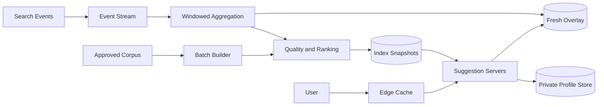
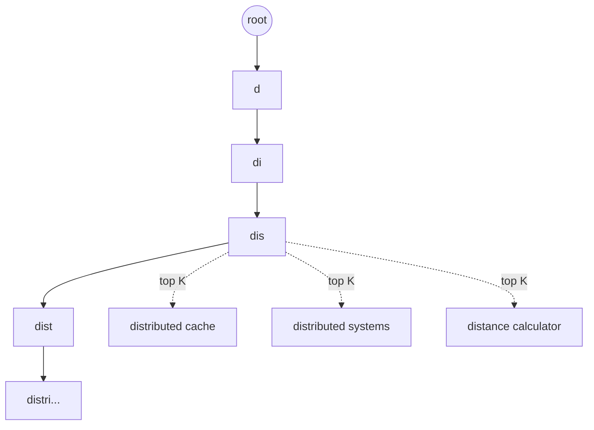

## Problem and requirements

Search autocomplete predicts useful queries while a person is still typing. The interface feels small, but every keystroke may trigger a request, latency is immediately visible, and weak suggestions can expose private or unsafe content.

### Functional requirements

- Return the top suggestions for a text prefix
- Rank suggestions by popularity, quality, freshness, and context
- Support spelling mistakes and minor variations
- Optionally personalize results for signed-in users
- update suggestions from recent search activity
- Remove blocked, unsafe, or legally restricted suggestions quickly

### Non-functional requirements

- Respond within 50 milliseconds at the 99th percentile
- Sustain roughly two million requests per second at peak
- Remain available during node and regional failures
- Avoid leaking one user’s private searches to another user
- Produce stable results rather than reshuffling on every keystroke

Executing the final search and ranking its documents are separate problems. This system returns query suggestions, not search results.

## Capacity estimates

Assume 200 million daily active users, 10 search sessions per user, and five autocomplete requests per session. That produces **10 billion requests per day**, or approximately 116,000 requests per second on average. Global peaks can reach 15–20 times the average, so design for **two million requests per second**.

| Resource | Estimate |
| --- | ---: |
| Peak lookups | 2M/second |
| Unique suggestions | 100M |
| Average suggestion record | 200 bytes |
| Base index size | ~20 GB |
| Replicated serving footprint | Hundreds of GB across regions |

Responses are small, often below 2 KB. Compute, memory bandwidth, and request overhead matter more than network throughput. A 90% edge-cache hit rate reduces origin traffic from two million to 200,000 requests per second.

## API design

The client waits for a short debounce interval after a keystroke, cancels obsolete requests, and sends the normalized prefix plus limited context.

```http
GET /v1/suggestions?q=distributed+ca&locale=en-US&limit=8
```

```json
{
  "suggestions": [
    { "text": "distributed cache", "type": "query" },
    { "text": "distributed caching strategies", "type": "query" },
    { "text": "distributed cache consistency", "type": "query" }
  ],
  "version": "2026-09-10T18:00:00Z"
}
```

The server caps prefix length and result count. Requests below a minimum prefix length may return curated trends rather than global prefix matches, because one-character prefixes have huge candidate sets and weak intent.

The API should not include raw user identity in shared cache keys. Personal results are added in a separate stage after retrieving globally safe candidates.

## High-level architecture

The system has two paths. The offline and streaming pipelines build suggestion data. The serving path reads immutable index snapshots and a small real-time overlay.



Suggestion servers keep the active index in memory. New snapshots are built outside the serving fleet, validated, and loaded atomically. This prevents partial updates from exposing inconsistent indexes.

## Normalization

Normalize both indexed queries and incoming prefixes using the same versioned pipeline:

- Unicode normalization
- Locale-aware lowercasing
- Whitespace collapse
- Standard punctuation handling
- Script and language detection
- Optional diacritic folding for lookup

Preserve the preferred display form separately. A normalized key such as `cafe` may retrieve “café near me,” but the user should see correctly formatted text.

Normalization rules are locale-dependent. Turkish casing, CJK token boundaries, and transliterated text cannot be handled safely by one English-centric pipeline. The index should be partitioned by locale or language model.

## Prefix index

A trie naturally maps a prefix to all terms beneath it, but storing every full candidate list at every node consumes too much memory. Instead, each node stores only its top `K` suggestion IDs.



Lookup is proportional to prefix length, followed by reading a small top-list. Path compression combines single-child chains into radix-tree edges, reducing node count and pointer overhead.

A weighted finite-state transducer is more compact for very large static dictionaries and supports prefix enumeration efficiently. It is harder to update in place, which fits the snapshot model: build a new immutable structure and swap versions.

The suggestion text and metadata live in a separate packed table. Trie nodes reference integer IDs rather than repeating strings.

## Ranking suggestions

Raw frequency is a useful signal but a poor final ranker. It favors old, broad queries and makes manipulation easy. A practical score combines:

```text
score = popularity
      × freshness_decay
      × quality_score
      × locale_match
      × prefix_match
      + trend_boost
```

Popularity can use a logarithm so a dominant query does not suppress every alternative. Exponential time decay lets newer behavior matter without allowing a brief spike to rewrite the entire index.

Quality signals include successful result clicks, reformulation rate, query abandonment, spelling confidence, and policy classification. Ranking models should be constrained so unsafe content cannot gain visibility solely through engagement.

Stability matters. Apply score thresholds or hysteresis before changing the order of nearly tied suggestions; otherwise the list flickers between keystrokes and deployments.

## Data collection and aggregation

Completed searches generate events containing the normalized query, locale, timestamp, and privacy-safe quality signals. A stream processor aggregates counts in hourly and daily windows.


Bot traffic, repeated identical searches, and anomalous sources are removed before counting. Differential privacy or minimum cohort thresholds can reduce the chance of rare user queries becoming identifiable suggestions.

Only queries crossing a minimum number of distinct, trusted users should enter the global corpus. Sensitive patterns—emails, phone numbers, account IDs, addresses, and secrets—must be filtered before storage as well as before publication.

## Freshness and index updates

Rebuilding the full index every few minutes is expensive. Use two layers:

1. A compact immutable base index generated periodically from stable signals
2. A small in-memory overlay containing approved trending or newly added suggestions

The serving layer fetches candidates from both and merges them by score. Overlay entries have aggressive expiry so yesterday’s temporary trend does not become permanent.

Build snapshots with a unique version, checksum every shard, and run quality tests before publishing. Servers download the new version in the background, warm its pages, then switch one pointer atomically. Keep the prior version for instant rollback.

Emergency removals bypass the normal build cycle. A globally distributed blocklist is checked at serving time and pushed to every region within seconds.

## Sharding and replication

Partition the index by locale and then by a stable hash or prefix range. Prefix-range sharding keeps neighboring prefixes together and supports efficient traversal, but popular initial letters can create uneven traffic. Hashing balances storage while making a prefix search touch many shards unless the complete top-list for that prefix is precomputed.

A hybrid works well: route by locale and the first few normalized characters, then split hot ranges into subshards. Very common prefixes such as `a` or `s` use dedicated replicated shards.

Each shard has replicas across availability zones. Because snapshots are immutable, any replica can serve a request without coordination. A regional fleet keeps a complete local copy so normal lookups do not cross wide-area networks.

## Caching

Prefix traffic is highly skewed. The same short prefixes appear constantly, making them excellent CDN and in-process cache candidates.

Cache keys include normalized prefix, locale, device class when necessary, safe-search policy, and index version. Versioned keys eliminate complex invalidation when a new snapshot becomes active.

Use longer TTLs for the stable base index and shorter TTLs for responses containing trending candidates. Add expiration jitter to prevent synchronized misses. Empty results should be cached briefly to protect serving nodes from repeated invalid or adversarial prefixes.

Personalized responses must be private and should not enter shared CDN caches. Cache the global candidate set, then rerank or merge private candidates closer to the application.

## Typo tolerance

Autocomplete should tolerate small errors without making every lookup expensive. Common approaches include:

- A deletion dictionary mapping likely misspellings to known terms
- Trie traversal that permits a bounded edit distance
- Character n-gram retrieval followed by reranking
- Keyboard-layout and phonetic confusion models

Enable fuzzy matching only after exact-prefix candidates are insufficient. Limit edit distance based on prefix length; one error in a three-character prefix is ambiguous, while one error in a ten-character prefix is useful.

Compute expensive typo candidates offline for frequent prefixes. Online fuzzy expansion needs strict time and candidate budgets so adversarial input cannot consume disproportionate CPU.

## Personalization

Personalization may use the user’s recent searches, followed entities, location, or product context. Keep private history in a separate store keyed by user ID and encrypted with appropriate retention controls.

The serving flow is:

1. Retrieve globally approved prefix candidates
2. Retrieve the user’s matching private history
3. Filter both sets through current policy
4. Merge and rerank within a small latency budget

Private suggestions must never become global training events without aggregation and privacy processing. Users need a way to delete history and disable personalization.

If the profile store is slow or unavailable, return global suggestions. Personalization should improve relevance, not become a dependency for availability.

## Abuse and safety

Attackers may coordinate searches to force offensive, defamatory, or promotional phrases into suggestions. Defenses include:

- Counting distinct trusted users instead of raw request volume
- Rate limits by account, device, network, and prefix
- Anomaly detection for sudden coordinated growth
- Minimum age and quality thresholds
- Automated classifiers plus human review for sensitive trends
- A low-latency global removal list

Suggestions have a larger reputational surface than ordinary search results because the product appears to recommend the phrase. The publication threshold should therefore be more conservative than the indexing threshold.

## Failure handling

**Serving-node failure:** load balancers route to another replica. No leader election is needed for immutable snapshots.

**Index shard unavailable:** return cached results, query a replica, or omit that shard within a strict deadline. A partial response is better than a slow search box.

**Overlay failure:** serve stable base-index suggestions without trends.

**Profile-store failure:** skip personalization and return global results.

**Bad snapshot:** health checks compare coverage, unsafe-content rates, empty-result rates, and score distributions before rollout. Canary a new version, then roll back atomically if metrics regress.

**Regional failure:** route users to another region. Every serving region holds a complete replicated index, so failover does not depend on rebuilding state.

## Observability and quality

Infrastructure metrics include latency by prefix length, cache hit rate, requests per shard, timeout rate, memory use, snapshot age, and overlay size.

Product quality needs separate measurement:

- Suggestion acceptance rate
- Characters saved before selection
- Search success after selection
- Reformulation and abandonment rate
- Empty-result rate by locale
- Unsafe suggestion exposure
- Ranking stability across releases

Run offline relevance tests on a versioned evaluation set and online experiments on a small traffic slice. Engagement alone is not sufficient; a sensational suggestion may attract clicks while reducing trust.

## Trade-offs

**Trie vs. finite-state transducer:** tries are easier to understand and update. FSTs compress static corpora better but favor immutable rebuilds.

**Freshness vs. safety:** streaming updates surface trends quickly but leave less time for aggregation, abuse detection, and review.

**Global relevance vs. personalization:** global results cache extremely well and are easier to audit. Personalization improves intent matching but adds latency, privacy obligations, and failure modes.

**Exact prefix vs. fuzzy matching:** exact lookup is predictable and fast. Typo tolerance improves recall but expands computation and can produce surprising suggestions.

**Centralized vs. regional serving:** one index location simplifies publication, but network latency ruins the typing experience. Replicated regional serving makes deployment and policy propagation more complex but is necessary at global scale.

The key architectural choice is to move expensive work out of the request path. Normalize, aggregate, rank, filter, and compile suggestions ahead of time so serving a keystroke becomes a bounded in-memory lookup.
